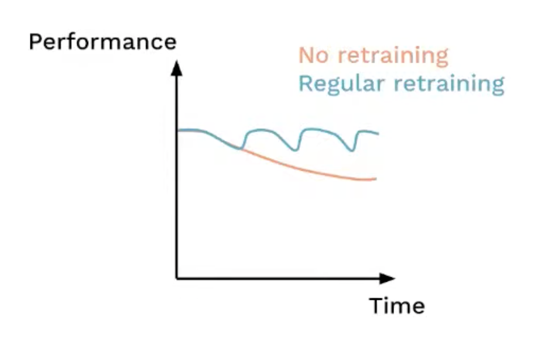
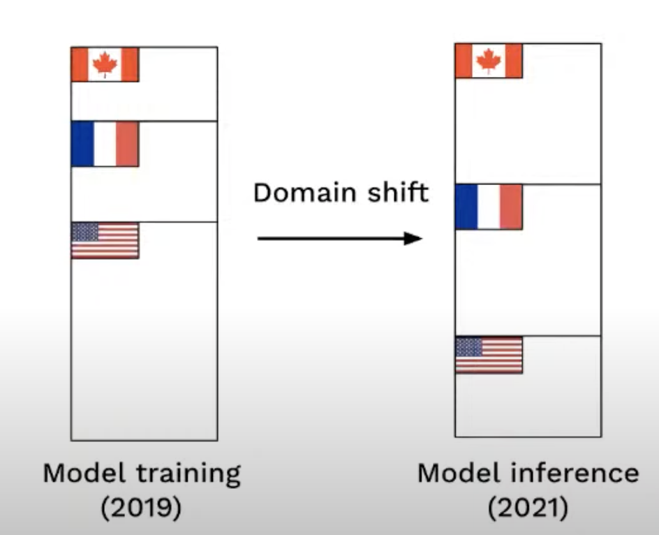
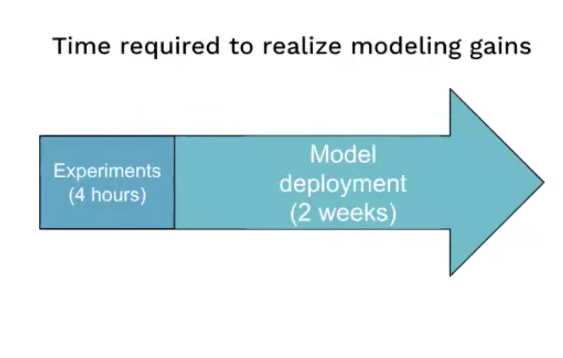
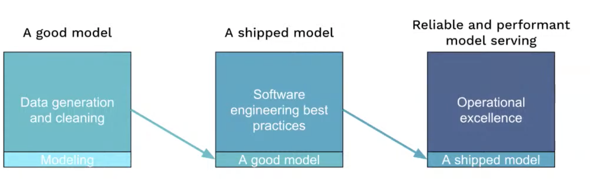
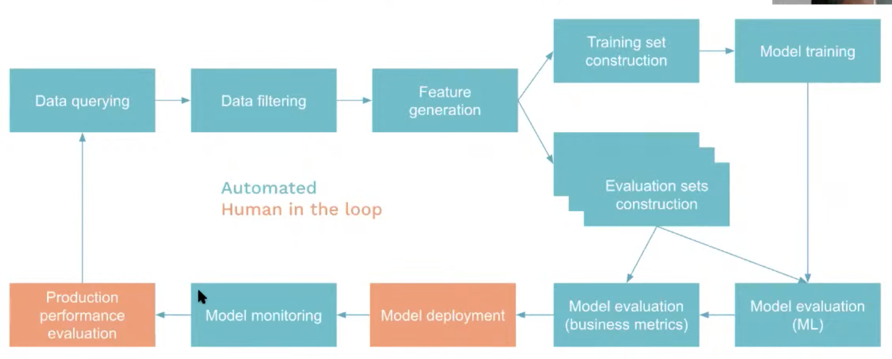

# 15. Accelerating model deployment velocity, Emmanuel Ameisen, Stripe

[https://www.youtube.com/watch?v=tClDQk7DqlY&ab_channel=Tecton](https://www.youtube.com/watch?v=tClDQk7DqlY&ab_channel=Tecton)

- Speeding up the art of ML model deployment
1. The value of redeployed models
    - Modelling and eng part to ship it ⇒ what happens when we have new features, or drift, etc
    - Any model that you train today will be obsolete tomorrow. By how much will it be obsolete?
    
    
    
    - Domain shift
    
    
    
    - Bottleneck when it comes to production
    
    
    
2. Skill set for regular ML deployments
    - Need to be 10x DS?
        
        
        
        - very operational work to bring value
    
3. Improving model release processes
    - automate the majority of the pipeline
        
        
        
    - another trick to de-risk the pipeline is to leverage shadow mode
        - deploy our prod model and also shadow, to observe how it behaves in production
    - Schedule it
        
        
        
    
    ⇒ [Stripe radar technical guide](https://stripe.com/en-fr/guides/primer-on-machine-learning-for-fraud-protection#next-steps)