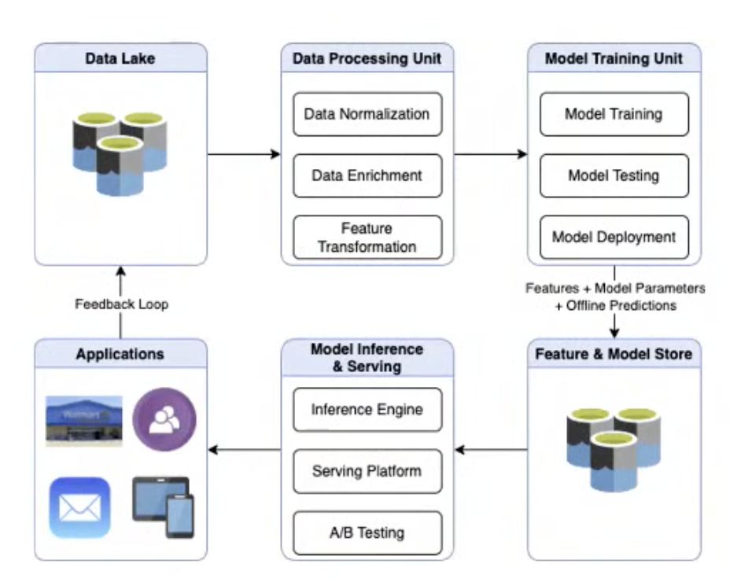
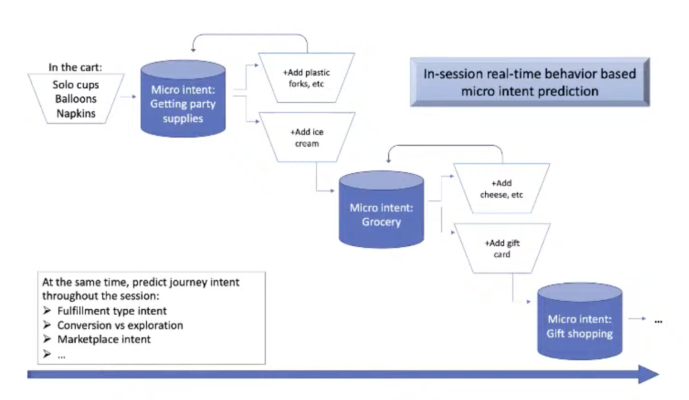
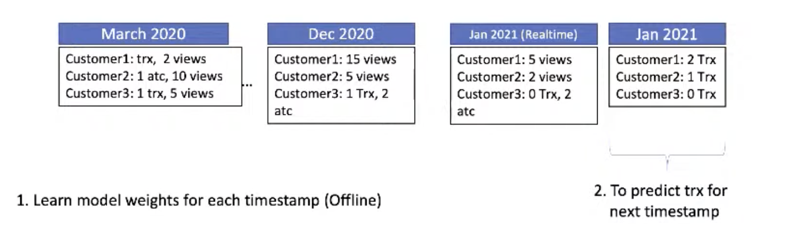
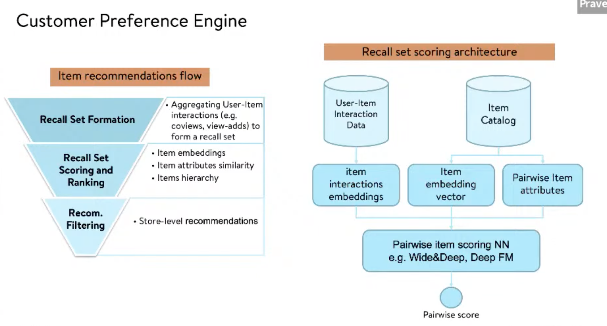
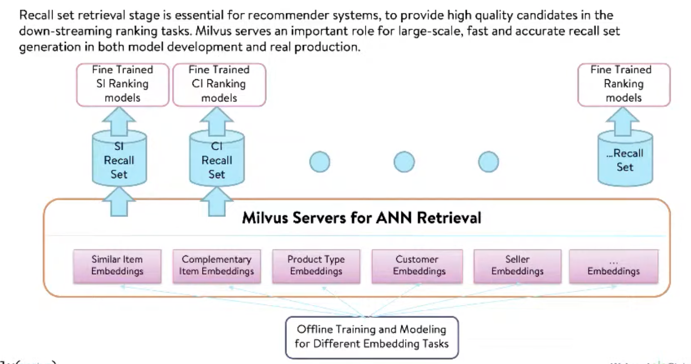
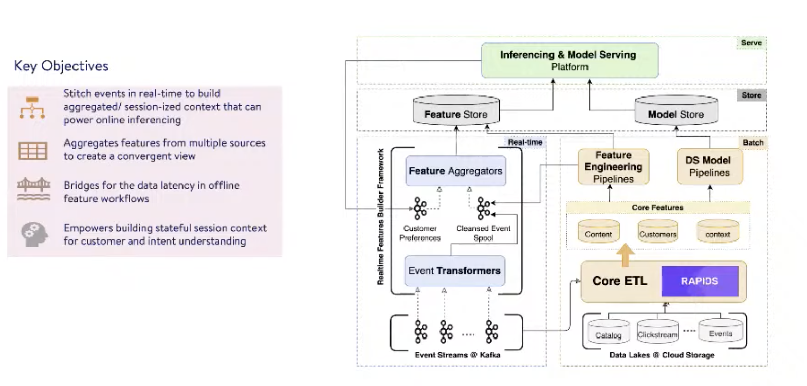
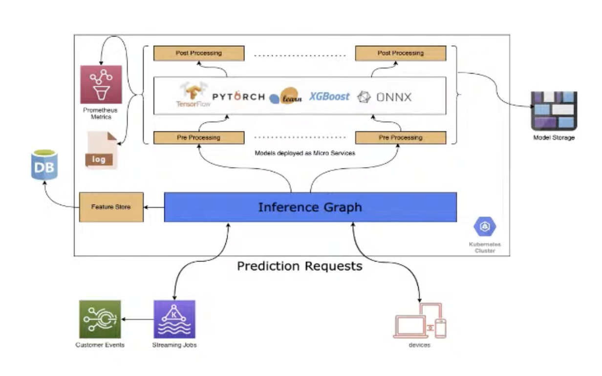

# 29. Intelligent Customer Preference Engine with Real-time ML systems, Manoj & Praveen, Walmart Lab

[https://www.youtube.com/watch?v=WPKWRXU0bOQ&ab_channel=Tecton](https://www.youtube.com/watch?v=WPKWRXU0bOQ&ab_channel=Tecton)

- Customers are increasingly omnichannel
    
    We need to understand behaviour across the whole channels
    
    Personalization plays a key role throughout the customer journey, and also after the purchase in case of recommendation 
    
    Dozen of recommenders in play in the background, to make baskets very quickly. Adding each item can be time-consuming, so personalisation is right from the home page.
    
    Product discovery is another recommender use case.
    
    Aside from product impressions, we also prioritize non-product impressions like banners, to show that we’re to help find items they’re looking for.
    
- 2 types of recommendations: baskets and checkout/last-call (candies, batteries etc).
    
    For last-call, we don’t want customers going back to the discovery again, but go ahead and checkout
    
- Flywheel
    
    
    

- 1:1 micro intent: for a given time, for a given customer
    
    ex of micro intent: Party supplies, then ice cream, then gift cards
    
    detecting micro-intent with the inference engine
    
    
    

- Features
    
    
    
    Variable time windows for online predictions
    

- Ranking using some context
    
    If a user already has an iPhone and search for AirPods, we’ll propose Apple ones first.
    
- Recommender flow
    
    
    
    
    

- Feature and model store
    
    Model store allows to A/B test and to iterate quickly on different models 
    
    
    
- Online inferencing platform
    
    Multi-model, DS can bring their framework and model on it and spin up a microservice easily
    
    Can tie different models together in an ensemble fashion
    
    Inference graph is very high-level: expose human-readable API to our clients. Most of the time, embedding and transformations are only understandable by the fews who built the model. Given a feature, it can bundle features together using the feature store.
    
    Post-processing is a filtering mechanism of the recall set, response to the client
    
    Real-time platform is both async and real-time for different use-cases.
    
    
    
- Q&A
    - Does the feature store contain pre-computed features for online input? Or differents need to speed up inference.
        
        Yes precomputed. Feature store has many purposes: saving compute costs, storing final and intermediate features for reusability purposes.