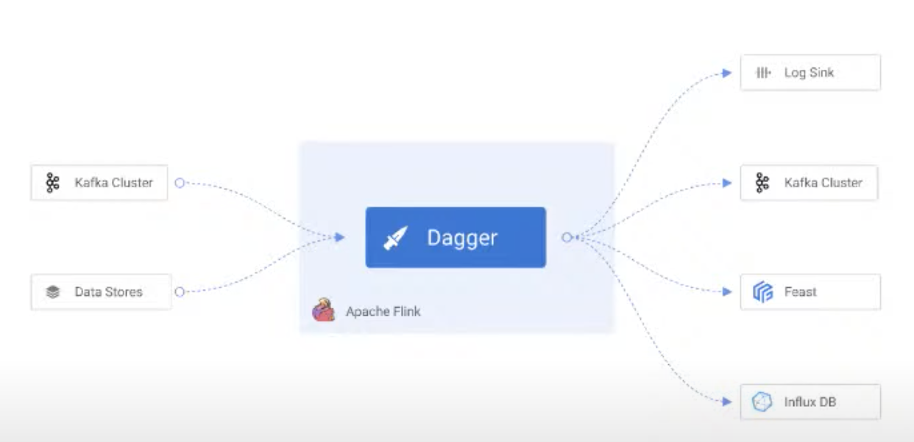
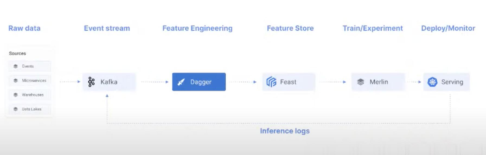
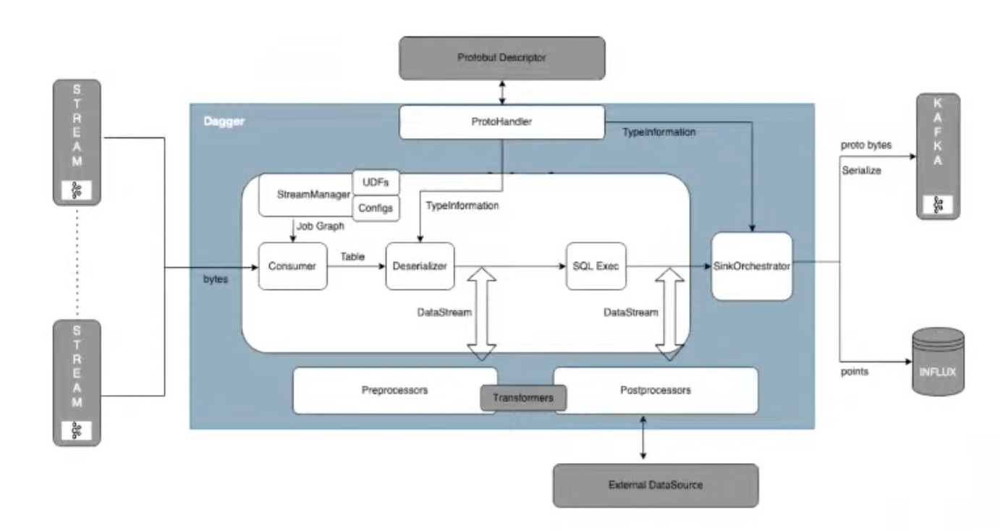
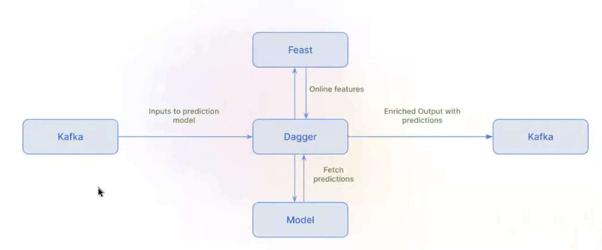
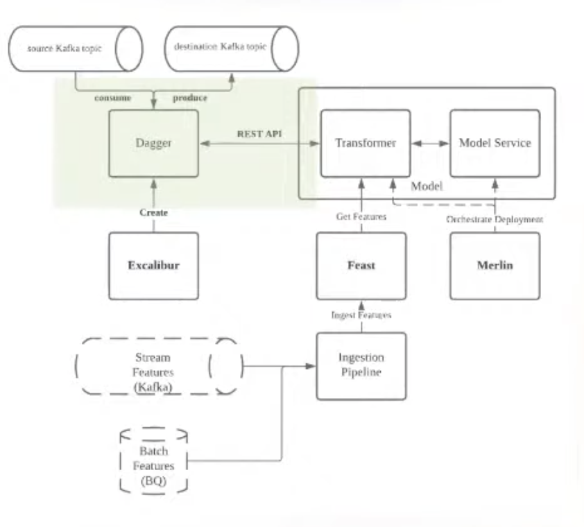
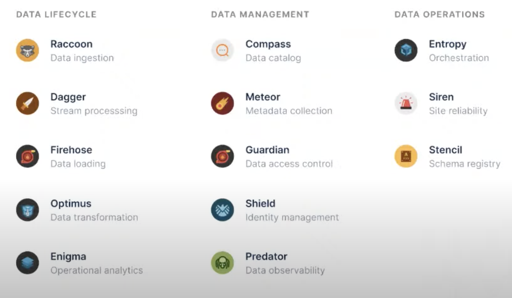

# 21. Feature engineering at scale with Dagger and Feast, Ravi Suhag, Gojek

[https://www.youtube.com/watch?v=9B9qqqJVm4M&t=48s&ab_channel=Tecton](https://www.youtube.com/watch?v=9B9qqqJVm4M&t=48s&ab_channel=Tecton)

👉 [Slides](https://www.dropbox.com/s/n6s7wdl3qcnoddo/ApplyConf-2022.pdf?dl=0)

- Feature engineering: transforming raw data into high-quality model inputs and feature vector
    
    Put it in a features store
    
- Better features provide better flexibility for modelling and simpler models. also better models
- Challenges of features engineering
    - Inconsistency between training and serving
        
        Especially in real-time, you want the same transformation to happen as with batches transformation
        
    - DS don’t want to manage data pipelines, focus more on modelling
    - Scaling data infra
        
        Hard for DS to manage Flink, Spark and Kubes cluster
        
    - Real-time features need skilled data eng, to write more optimized jobs
- Goals
    - Unify processing in real-time and batch. The logic needs to be the same. Self-service platform
    - Elastic infra, every time a DS adds a job, the infra can scale up
    - Standard and reusable transformations, a standard way to define that
    - No extra skills required from DS to create real-time features
- Dagger is our solution, on top of Flink for stateful processing of data
    
    
    

- Pipeline with dagger and feast
    
    
    

- Dagger architecture
    
    
    
- Features:
    - SQL first: query, writing and templating queries
    - Flexible, various ways to extend it using UDFs processor/post-processor
    - Stream enrichment from DB sources or API to bring context data for real-time processing

- Self-service:
    - DS shouldn’t be managing data pipelines
    - only specify their query and get the job running, and monitor it, have alerts, some templates
- Managing with GitOps
    - Can specify deployment and version control with yaml
- SQL first
    - Not turning complete, thus it will always complete, even if it fails, so won’t mobilize all the compute power in a data center
- UDFs
    
    User define function can be used in SQL (like geohash)
    
    ```sql
    SELECT
    	data_location.longitude AS long
    	data_location.latitude AS lat
    	**GeoHash**(
    		**data_location.longitude,
    		data_location.latitude,
    		6
    	) AS geohashPickup,**
    	TUMBLE_END(rowtime, INTERVAL '60' SECOND) AS window_timestamp
    FROM
    	data_stream
    GROUP BY
    	TUMBLE(rowtime, INTERVAL '60' SECOND),
    	data_location.longitude,
    	data_location.latitude
    ```
    
- Data masking
    
    encryption on sensitive data, hashing
    
    ```sql
    SELECT
    	event_timestamp,
    	test_data
    FROM
    	data_stream
    ******* Post processor config: ******
    {
    	"internal_source": [{
    		"output_field": "*",
    		"value": "*",
    		"type": "sql"}],
    	"transformers": [{
    		"Transformation_class": "io.cdpf.dagger.functions.transformer",
    		**"transformation_arguments": {
    			"maskColumns": ["test_data.data1"]**
    	}}]
    		
    }
    ```
    
- Hybrid data sources
    
    Managing logic in 2 places are an issue, if you’re doing real-time streaming and batch processing with static and historical data
    
    Dagger allow to use data simultaneously from different sources
    
    ```yaml
    [{
    	"INPUT_SCHEMA_TABLE": "booking_log_stream",
    	...
    	"SOURCE_DETAILS": [
    		{"SOURCE_TYPE": "BOUNDED", "SOURCE_NAME": "PARQUET_SOURCE"},
    		{"SOURCE_TYPE": "UNBOUNDED", "SOURCE_NAME": "KAFLA_SOURCE"}
    ]
    }]
    ```
    
    In this logic, you can backfill historical data using streaming source, and join data across multiple streams
    
- Stream enrichment
    
    Use external data source (service endpoint, object stores, cache) to enrich real-time event and add context
    
    ```yaml
    [{"internal_source": [{
    	"output_field": "booking_log",
    	"type": "sql",
    	"value": "*"
      }]},
     **{"external_source": {
    		"es": [{
    			"host": "127.0.0.1",
    			"port": "9200",**
    			"endpoint_pattern": "/customers/customer/%s",
    			"endpoint_variables": "customer_id",
    			"stream_timeout": "5000",
    			"output_mapping": {
    				"customer_profile": {"path": "$._source"}
    			}
    	}]
     }]
    ```
    

- Stream inference
    
    
    
    Attach prediction to the same input event, in the streaming infra
    
    In details
    
    
    
    - Ex: attach pricing prediction, for multiple consumers
    - All these predictions log are now in the warehouse, which every one can now use
    - Streaming are very self-service from a DS point of view

- Dagger adoption at Gojek
    - 300+ dagger jobs for feature engineering
    - 50+ data scientists creating dagger jobs
    - 10TB+ data processed every day
    
- Dagger is part of data ops foundation, with an experience first approach
    
    Dagger open source from 1 year
    



- Q&A
    - How feature eng can be viewed regarding autoML solutions?
        
        Not tackling this issue right now, but it can be explored
        
    - Dagger vs Spark?
        
        Dagger under the hood uses Fling, in batch mode
        
        Dagger adds an abstraction layer for data scientists, allow them to have a more use friendly experience
        
    - When ML Platform proposes new things, always some friction during user adoption. How did you approach 300 DS with dagger?
        
        Let make sure DS don’t need to learn new framework
        
        Don’t need to manage anything else
        
        Onboarding process for DS to play around with their feature is shorter