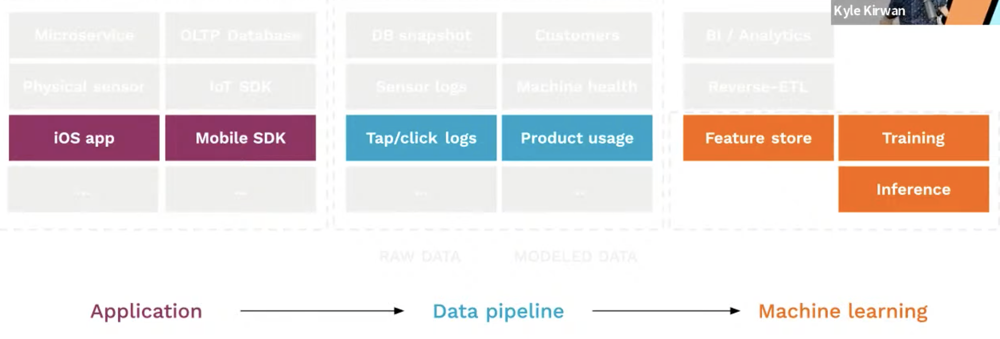
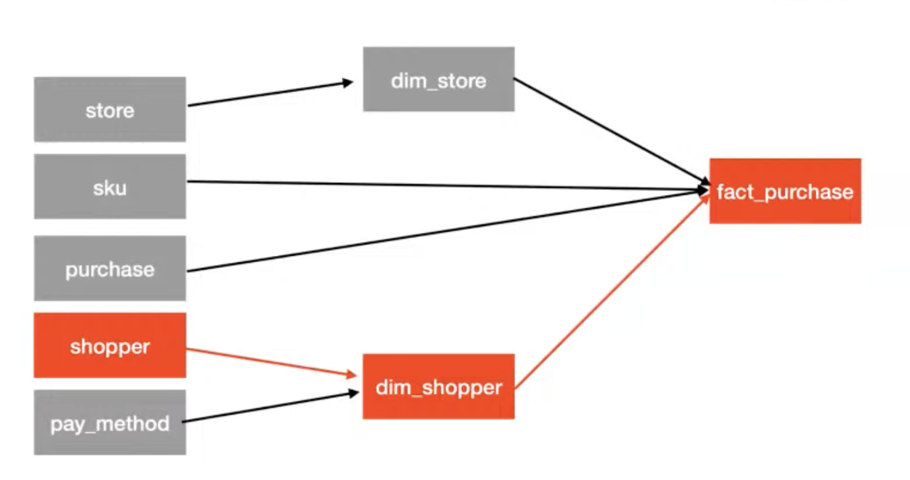

# 22. Data observability for ML team, Kyle Kirwan, Bigeye

[https://www.youtube.com/watch?v=GKpflt3fvKw&ab_channel=Tecton](https://www.youtube.com/watch?v=GKpflt3fvKw&ab_channel=Tecton)

- What is data observability?
    
    
    
    - It’s the ability to understand what’s going on with the data all along the pipeline, the data content itself, the dataset we’re working with
    - If we have an issue with click logs, the inference will break, data obs is about discovering this issue
- How does it work? 3 ways to understand what’s going on
    1. metadata
        
        query logs, info schema ⇒ understand in our schema: did we mess with some columns that break our pipeline?
        
        can also be a problem with freshness, did we miss an update?
        
    2. metrics
        
        detecting duplicate data, format, null values, outliers, change in distributions
        
    3. lineage
        
        map of dependency between transformations
        
        
        
    
- Why should ML team care?
    
    Can use data obs to catch problems in our pipeline before breaking things
    
    ex: car self-driving company, retrain their model (pretty expensive) and some metrics plummeted. Turns out that 10k images didn’t have any bounding box labels from a third party. Data obs allow identifying that
    
- 3 categories to get started
    1. Vendor: Bigeye
    2. Open source: great_expectations
    3. Build your own