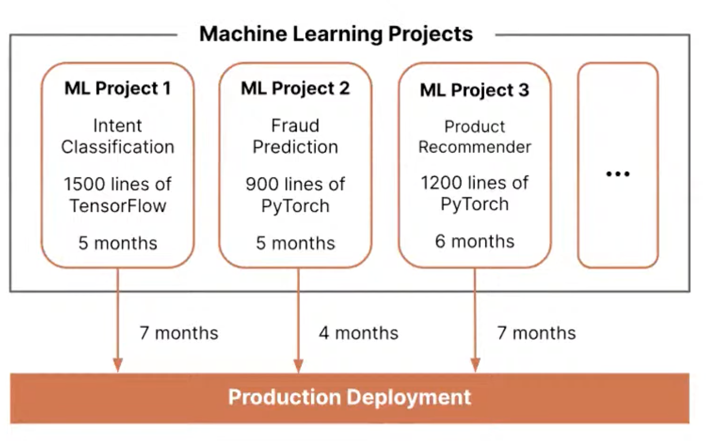
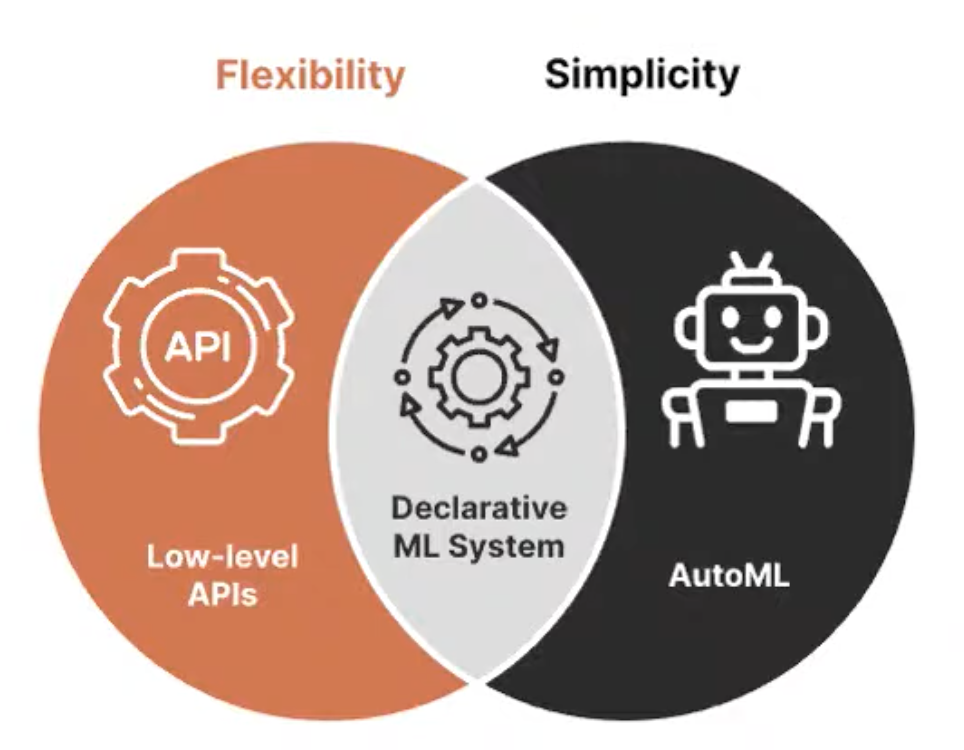
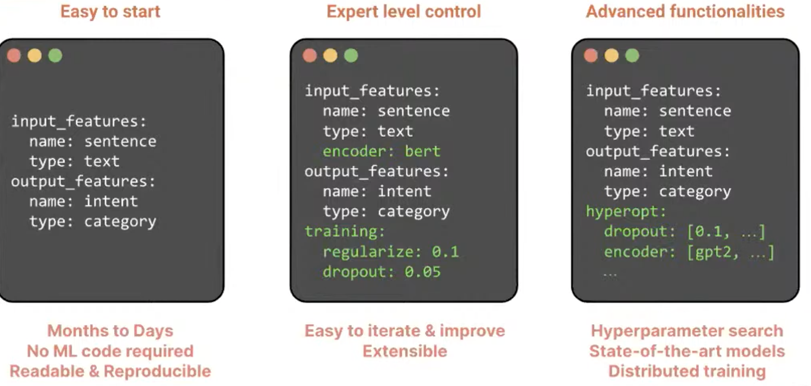
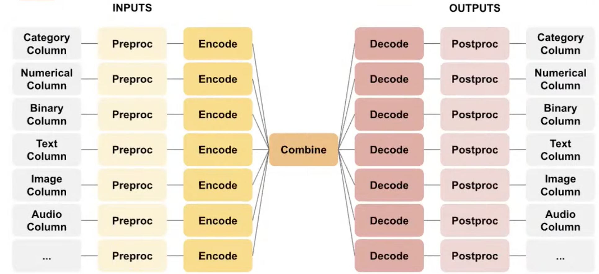
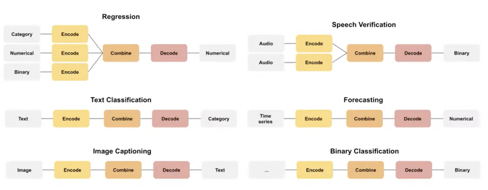
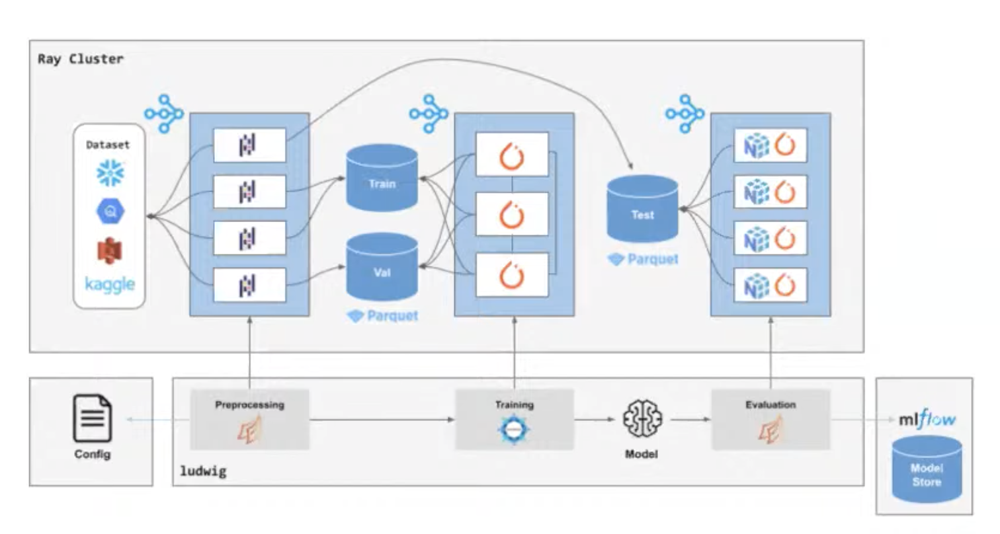
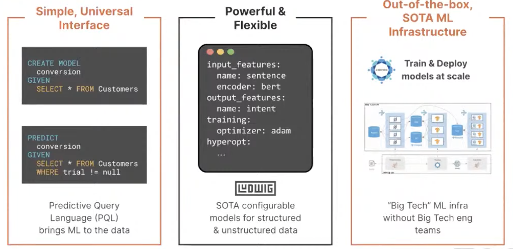
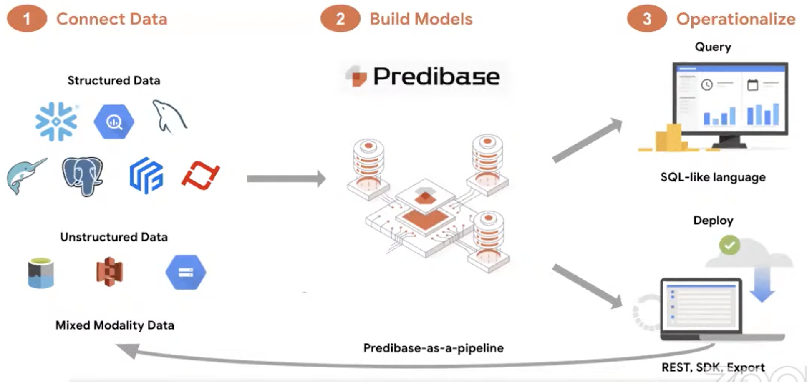

# 14. Declarative ML Systems and Ludwig, Pierre Molino & Travis Addair, Predibase

[https://www.youtube.com/watch?v=74hqlj5k4Zg&ab_channel=Tecton](https://www.youtube.com/watch?v=74hqlj5k4Zg&ab_channel=Tecton)

- Organizations take inefficient ML approach
    
    
    
    - Each project takes too long to bring value
    - Bespoke solution are hard to maintain and bring tech debt
    - Organization can’t hire enough ML engineers

- Introducing declarative ML system
    
    
    
    - higher abstraction, ease of use
    - open the door to non experts for ML
    - Pioneer project with Ludwig (Uber) and Overton (Apple)

- How does Ludwig works? a configuration system with yaml
    
    
    
- End to end deep learning architecture

- Task flexibility

- How to scale this concept and work with bigger amount of data?
    - Scalable backend over Ray
    - Doesn’t require you to provision heavy weighted infra, like a spark cluster, everything on the same layer

- Predibase on top of Ludwig:
    - Take a look of the end-to-end problem of data flow in ML model to put it in production
    - Both batch and real-time production
    - Low code
    
    
    

- Workflow
    
    
    
    ⇒ Check their paper about declarative ML