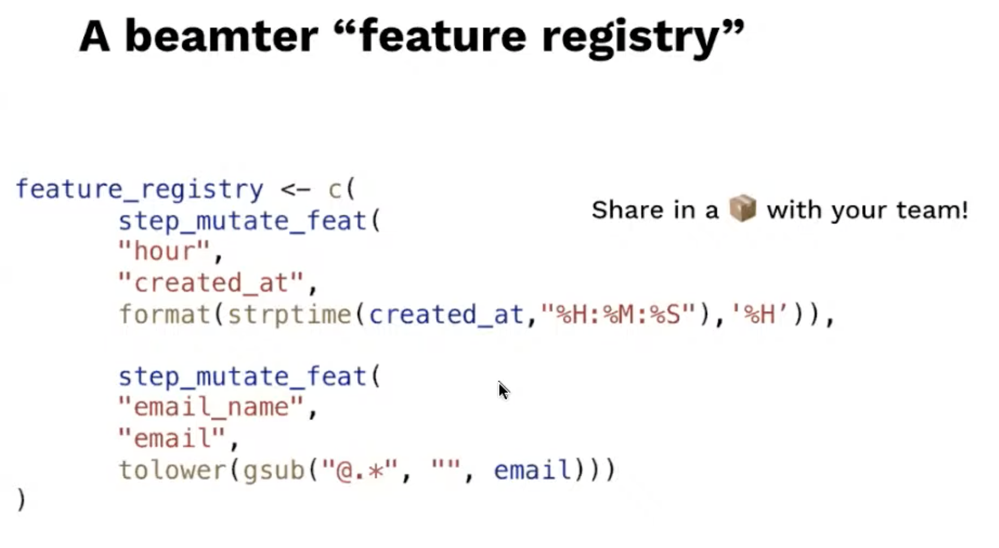
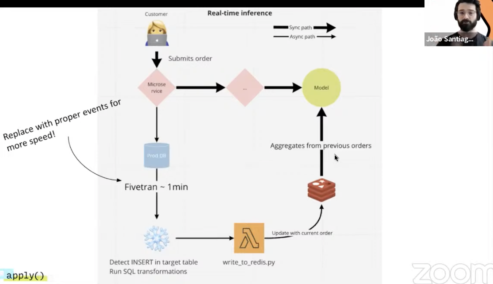
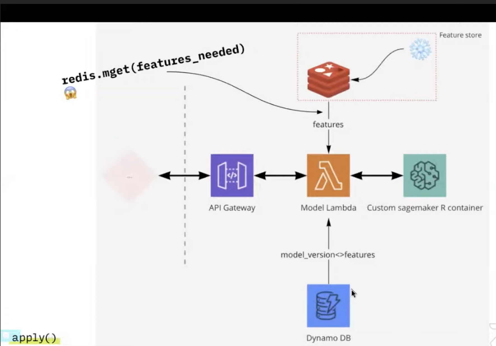

# 5. DIY minimal feature store, João Santiago, Billie

[https://www.youtube.com/watch?v=q4bZ0ixdUKk&ab_channel=Tecton](https://www.youtube.com/watch?v=q4bZ0ixdUKk&ab_channel=Tecton)

- Requirements
    - Easily maintainable
    - Same feature implementation during training and inference
    - Use past data in real-time models
    - Implement a feature once
    

- Beamter drawbacks
    - Cool but no real-time data caching
    - Sync versions between project
- Use Snowflake streams and tasks, define features as SQL function
    - No kafka, no spark, no new things to learn
    
    
    
    - Fivetran delays here are a bottleneck, will be replaced with some events using Kafka

- In summary, you can build features store with 3 components: Snowflake, Lambdas and Redis

Going further in the discussion: [unlocking our data with a feature store](https://medium.com/billie-finanzratgeber/unlocking-our-data-with-a-feature-store-402ade0743b)