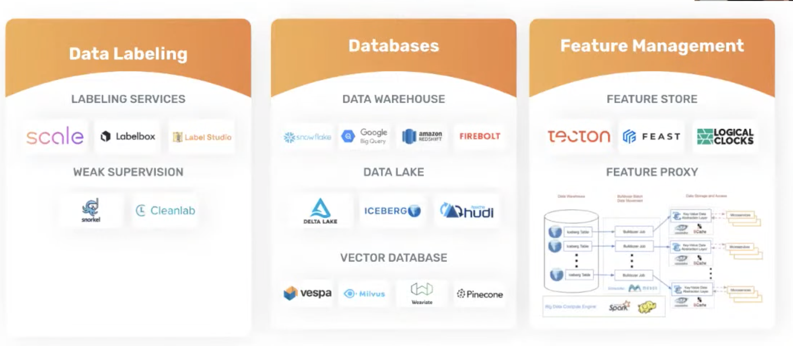

# 11. How to draw an owl and build effective ML stacks, Sarah Catanzaro, Amplify

[https://www.youtube.com/watch?v=wbExGrRBDvI&ab_channel=Tecton](https://www.youtube.com/watch?v=wbExGrRBDvI&ab_channel=Tecton)

👉 [Slides](https://www.dropbox.com/s/udjel16g65pmqas/apply())

- We need a common language to describe the key elements of the ML stacks and workflows
- 3 layers
    
    
    
    - Data management
        
        
        
    - Model and deployment
        
        
        
    - Model operations
        
        