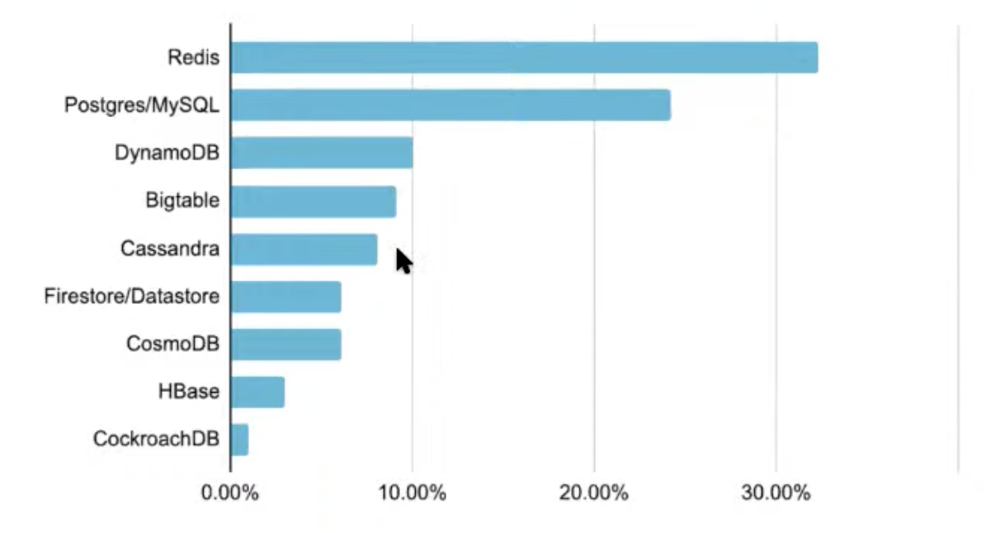
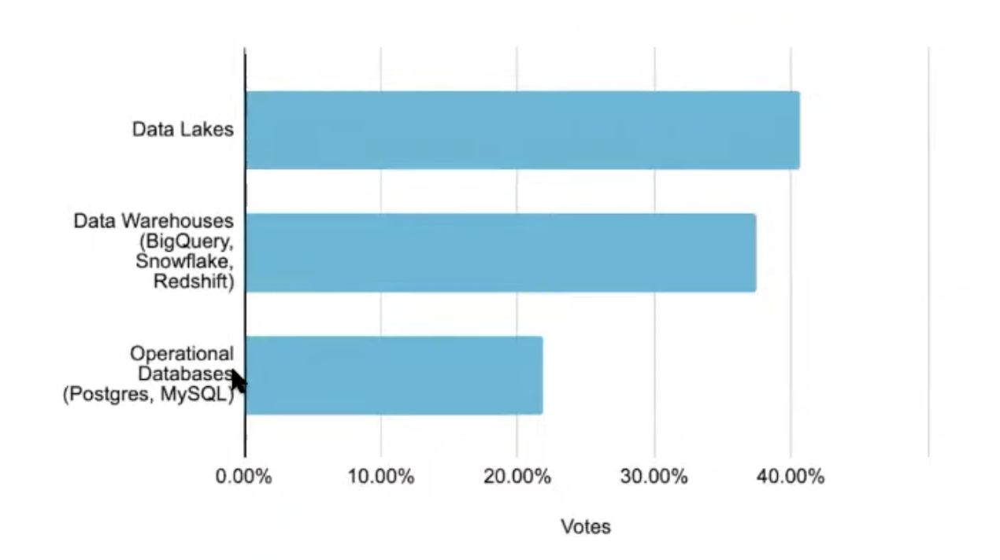
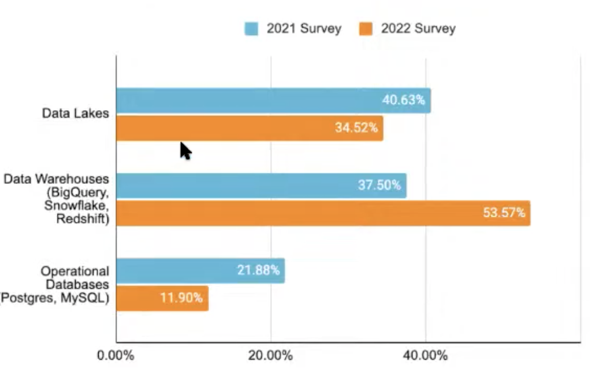
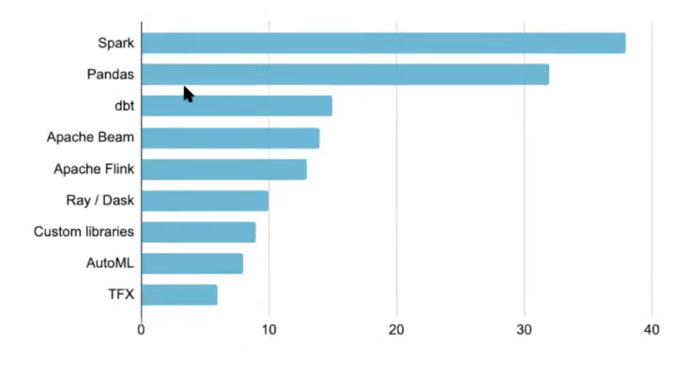
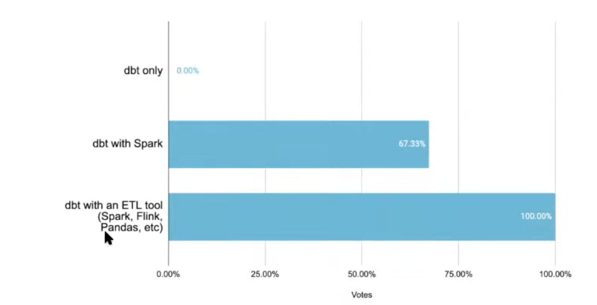
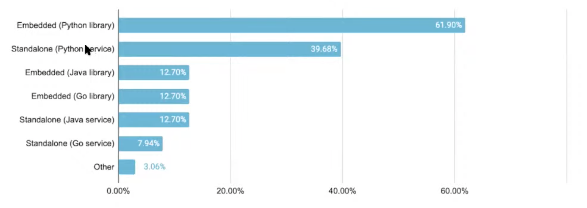

# 25. Lessons learned from working on Feast, Willem Pienaar, Tecton

[https://www.youtube.com/watch?v=o787CSFKaXU&ab_channel=Tecton](https://www.youtube.com/watch?v=o787CSFKaXU&ab_channel=Tecton)

- A lot has happened last year with Feast
    
    high-quality contributions:
    
    - high-performances feature serving
    - data quality and monitoring
    - feast UI
- Which technology do you use for online feature store?
    
    
    
    Why Postgres/MySQL? Simplicity?
    
- Which technology for your offline feature store
    
    
    
    Operational DBs present again, it is curious
    
- Are operational DBs necessary for ML?
    
    
    
    Operational DBs are shrinking, analytic stacks are increasingly being used for production ML
    
- Is everyone using the modern data stack for production ML? What tools do you use for data transformation
    
    
    
    Spark and pandas dominate, but these are not modern stack
    
    Good representation of dbt with data warehouse
    
- Is dbt enough to do ML?
    
    
    
    dbt user always use another tool to transform data, important but not sufficient
    
    Modern data stack is not yet enough for production ML, doesn't address yet:
    
    - Streaming, still the domain of Spark and Fling
    - On demand feature engineer, on the fly
- How do you implement Feast for online feature retrieval
    
    
    
    Surprising because python is slower than Java or Go, because understanding is easier
    
    Users want to use Feast as a library, as opposed to deploying a new service
    
    Even with a service, users still prefer Python, usability is the main argument
    
- Why are teams adopting python in prod?
    - Team are optimizing for delivery over performance
    - Python is just writing another language (C/C++, Rust)
    - Python ML ecosystem is vast and growing rapidly