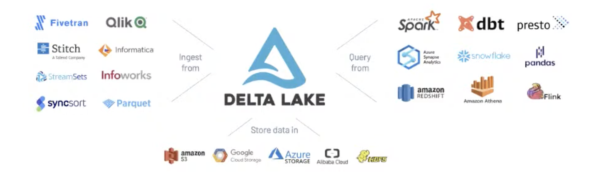
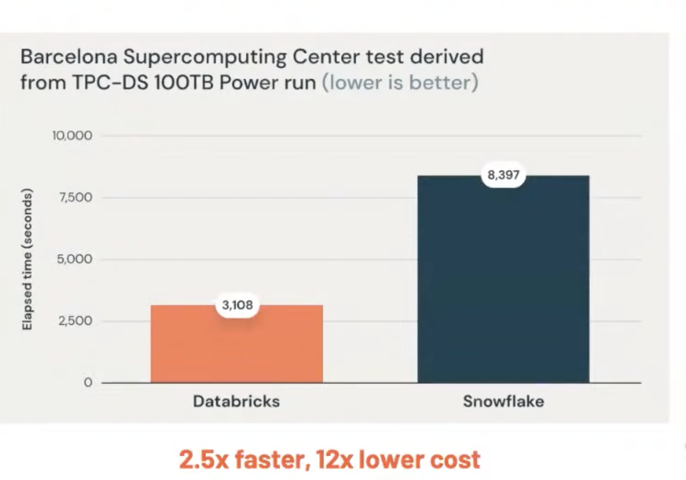

# 2. Lakehouse: a new kind of platform, Matei Zaharia, Databricks

[https://www.youtube.com/watch?v=6j0MazSTLHg&ab_channel=Tecton](https://www.youtube.com/watch?v=6j0MazSTLHg&ab_channel=Tecton)

👉 [Slides](https://www.dropbox.com/s/qozme367r73a4ma/apply-lakehouse.pdf?dl=0)

Historically, Data warehouses weren’t designed for data science, high cost for huge datasets.

2010: datalakes: non tabular data, store all raw data with a single method. Open data format like Parquet accessible directly by DS
    
Problem with 2 tier architecture: cheap to store all data but complex
- Data reliability suffers from multiple storage systems, different ETL jobs
- Timeliness suffers from extra steps before data can be used in warehouses
- High cost from parallelisation and duplication
    

Key technology enabling lakehouse:
#### 1. metadata for data lakes
- track which files are part of table version to offer feature management (query files from a table)
- versions of files using delta lakes, to avoid crashing jobs when updating data
- all version of tables, you can time travel and stream changes
    

    
#### 2. Lakehouse engine designs: performant SQL
    
4 optimisation tricks:

1. auxiliary data structure (statistiques, always consistant)
    
    For each parquet files, statistics like min, max year, uuid.
    When you read your snapshot of the table, you also read the statistics by using them during SQL query filtering
    
2. caching
3. vectorisation (Databricks photon, using the Parquet format)

New query engines like databricks use these techniques

    
#### 3. Declarative I/O format for ML
- ML using Warehouse is painful because ML tools don’t query in SQL format, add new jobs for ETL
- ML over Lakehouse can use Parquet, and spark can do query optimisation
    
MLflow can also help with the ML lifecycle and data version tracking
        
Conclusion: Lakehouse combines the best of DWs and lakes

### Q&A
- Data quality?
    1. Automatic test and table versioning
    2. End to end sanity checks on tables
- Snowpark vs Databricks?
    Snowpark is a proprietary APIs to run java and python workflows, can’t use existing Spark methods, Databricks support open-source API (PyTorch, Keras, XGBoost distributed)
    
- Data mesh vs Data architecture platform: different teams can manage storage, easier to have a decentralised ownership of data