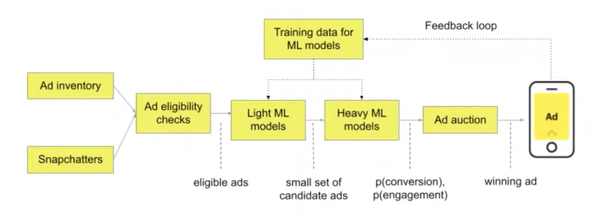
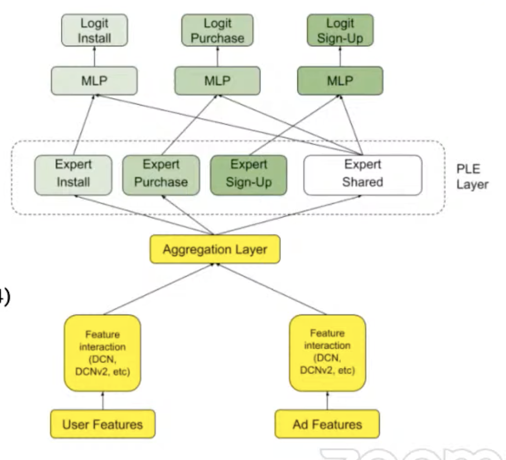
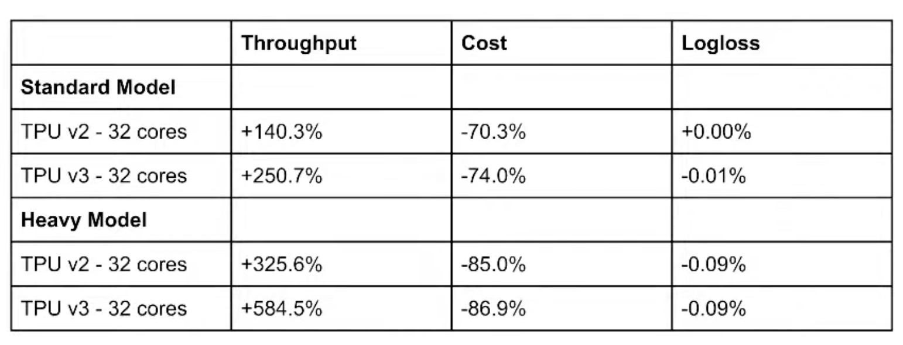
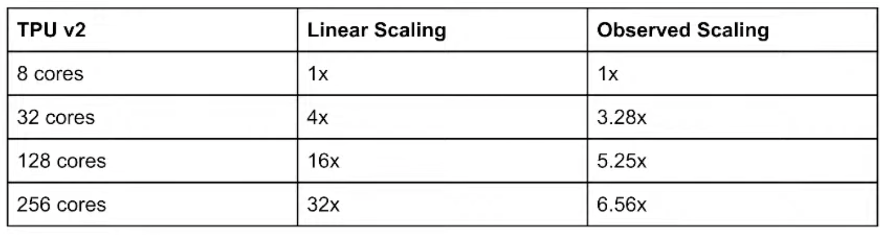

# 31. Training large scale recommendation models with TPU, Aymeric Damien, Snap

[https://www.youtube.com/watch?v=iBfNfJHr9mE&ab_channel=Tecton](https://www.youtube.com/watch?v=iBfNfJHr9mE&ab_channel=Tecton)

- Snap’s ad ranking environment
    
    
    
    Check if users engaged with ads or not, and generate labels based on that
    
    Rankers pretty straightforward 
    
    More details: [https://eng.snap.com/machine-learning-snap-ad-ranking](https://eng.snap.com/machine-learning-snap-ad-ranking)
    
- Challenges
    
    Thousand of features
    
    Architecture: DCN, PLE
    
    Hardware: training CPU + TPUv3, inference CPU or CPU + GPU (Nvidia T4)
    
    
    
    See: [https://eng.snap.com/applying_gpu_to_snap](https://eng.snap.com/applying_gpu_to_snap)
    
- Challenges of RecSys
    - Lot of categorical features: very large embeddings, so lookups are pretty memory intensive
    - Embedders have been little investigated by scholars, because of a lack of dataset, not as much focus as CV or NLP
    - Specialized hardware has focused on matrix operation but RecSys have specific unaddressed use cases: fast embeddings lookup, large memory, high memory bandwidth

- TPU integration and benchmark
    - Google developed ASICS for DL, 4 generations (v5 in 2022)
    - Why for RecSys? Large memory, high bandwidth. Good embedding TPU API, fast and efficient lookups. Support sharding, embedding tables can be shared in different devices.
    - BF16 matmul acceleration under the hood, unlike GPU where you need to specify type precisely.
    - Tensorflow compatible pipelines
    
- Integration
    - Refactor some TF code base (TPUEstimator, TPU distribute strategy), I/O pipeline optimization for high throughput
    - Challenges: not as straightforward as using GPU. Optimizing GPU is easier. Some ops are not supported, need parameter tuning and some async & scaling issues for large amounts of cores
    
- Benchmarks: TPU over GPU
    
    
    
    currently working on benchmarking Nvidia's recent HugeCTR TF plugin, up to 7.8x speed up with their embedding optimisation compared to vanilla Tensorflow 
    
- TPU scaling issues
    
    
    
    Synchronous training and computer vision in mind (batch of same size) but not true for RecSys. Each embedding has different and many more lookups, and more computation, slowing down the whole pipeline 
    

- A ton of new exciting ML hardware coming, leverage the graphic core to speed up matmul and improvement of memory, so good for RecSys.
    - Google TPU v5
    - Intel  SapphireRapid
    - Nvidia H100
    - Habana Gaudi2