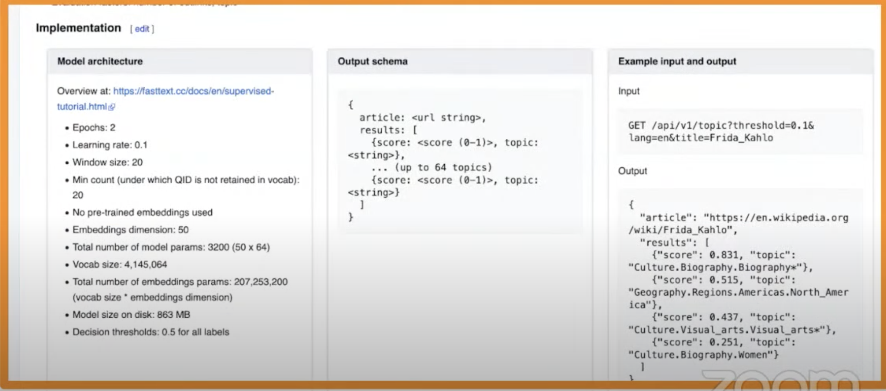
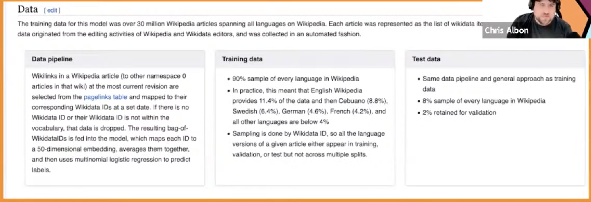

# 34. Making model cards, Chris Albon, Wikimedia

[https://www.youtube.com/watch?v=t4GMq7MC7Js&ab_channel=Tecton](https://www.youtube.com/watch?v=t4GMq7MC7Js&ab_channel=Tecton)

- 150 models in prod, language translation, topic detection
- Governed by the community and open funded by users, so pretty careful where money is spent on
- Widely transparent: all code is public, ML team internal chat is public, tickets are public
    
    No black boxes, no secret sauce, have participation in it. We need a way for users to read and understand the models
    
- Model cards are a single source of truth for an ML model
    
    public-facing, discuss motivation, training, its aim, how to get the code, the data etc
    
    important for transparency
    
- Spent a lot of time speaking to the community, researchers, what do they looking for in a tool like this
    
    If people on french Wikipedia don’t want to use a tool, they can turn it off.
    
- POC was pretty straightforward
    - Language agnostic topic detection
    - Talk about how the model should be used, all the story behind this. The least technical part of the discussion at the intro.
    
- One model card
    
    
    

- Data card
    
    