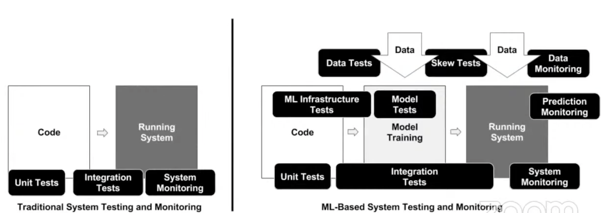
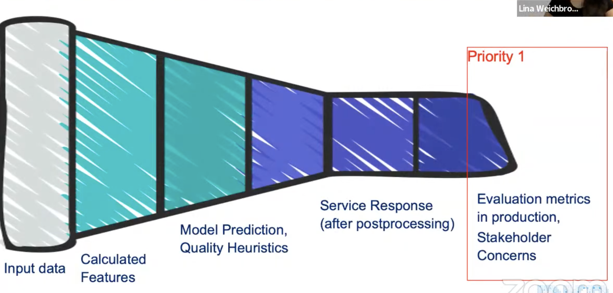

# 24. Learning from monitoring more than 30 ML use-cases, Lina Weichbrodt,

[https://www.youtube.com/watch?v=Ki0es3bLsG8&ab_channel=Tecton](https://www.youtube.com/watch?v=Ki0es3bLsG8&ab_channel=Tecton)

- Software monitoring basics
    
    Detect errors asap and prioritize the severity 
    
    4 signals to watch:
    
    1. latency
    2. traffic
    3. errors
    4. saturation
    
    Focus on symptoms for end-users
    
- Higher complexity in ML systems than in traditional ones
    
    
    

- Monitoring motivation: silent failures can have a huge commercial impact
    - Unit changes
    - Data loss when calling an external client
    - Aggressive post-processing filters applied, seasonality drift made data scarcer

- Symptoms-based monitoring: focusing on output first
    
    
    
    - Priority 1
        
        DS asked “can I monitor evaluation metric in prod?” it depends on the target feedback loop latency.
        
        Focus on what stakeholders want to avoid
        
        ML app needs trust: need to reassure business and product stakeholders
        
    - Priority 2
        
        A lot of ML monitoring is done with evaluation metrics
        
        Evaluation metrics are often not available in real-time (Recall, FBeta score, etc)
        
        Monitoring metrics focus on detecting problems, not on evaluating data quality and are easier to implement than evaluation metrics
        
        Measure response distribution and use simple stats tests (heuristics), or KS sample test, D1 distance, stability index
        
    - Priority 3
        
        Useful to understand how input change
        
- Do I need an MLOps observability tool?
    - focus on monitoring and explainability with Aporia or Superwise
    - monitoring as part of a full-featured tool like Seldon or Sagemaker
    - add loggings to inference, display them on dashboard and create alerts
    - you often don’t need a new tool