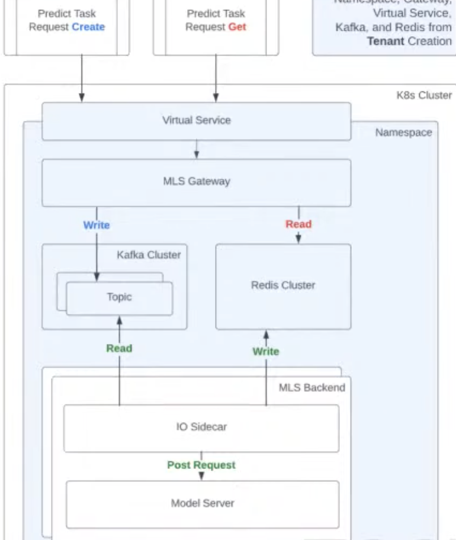
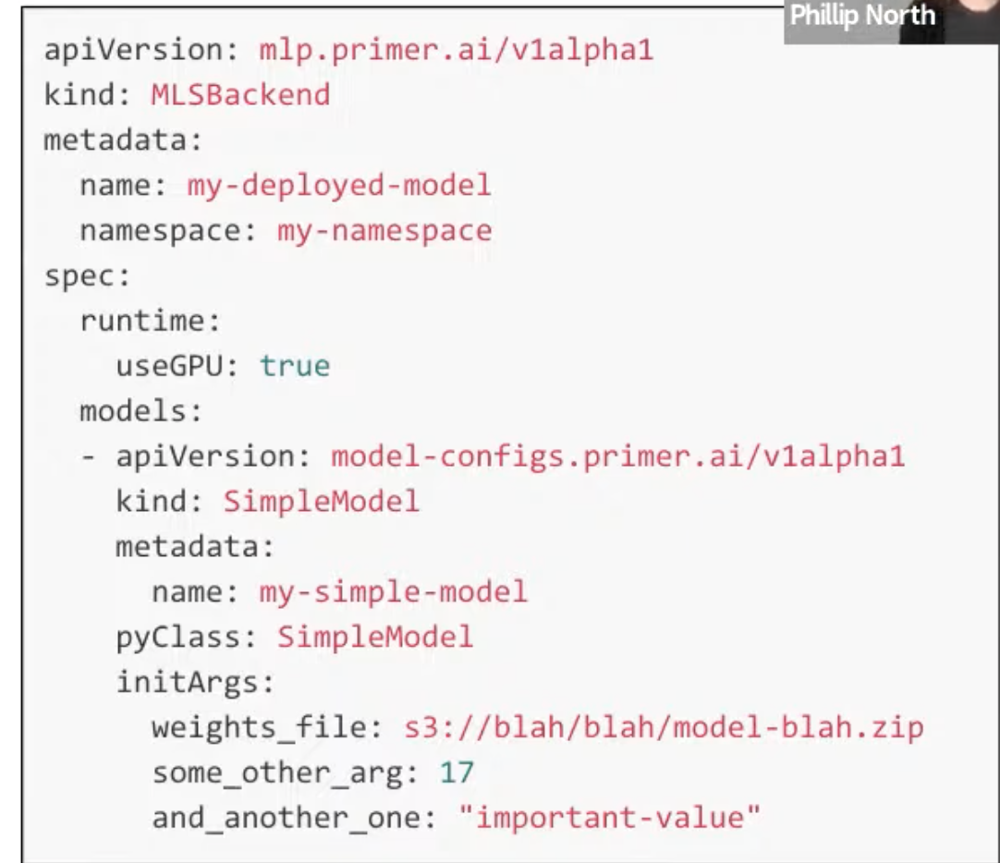

# 32. Streamlining NLP model creation and inference, Cary & Phillip, Primer.ai

[https://www.youtube.com/watch?v=jBN_PTKcOmE&ab_channel=Tecton](https://www.youtube.com/watch?v=jBN_PTKcOmE&ab_channel=Tecton)

- What does Primer do?
    - Aggregation tool helping analysts get data within the global news
    - Real-time stream from social media, watch events that are developing quickly
    - Custom entity extraction on top of news, a bespoke case of workflow and create a NLP solution for it
    
- Challenges for NLP company
    - Mostly ingesting streaming data: fast, high reliability, autoscale, cost-effective (GPU), flexible enough to support any model framework for DS.
    - No simple way to solve all requirements, a complex solution. Complexity can become overwhelming and a lot of tooling
    
    
    
    - Training at scale issue: cross-validation, large scale validation, integration with serving solution, a lot of complexity
    
- Goal: a single API to access hardware for DS not to worry about the infra (access to batches, streaming etc)
    
    A DS trained and dev a model, how to embed that into the pipeline? Doesn’t provision all the underlying pieces like Kafka or Redis
    

- Kubernetes custom resources
    - can deploy training/serving resources alongside everything else
    - declarative by design, extend API natively to new resources type
    - hides ephemeral and intermediate resources in k8s from users, lower technical barrier to get into prod NLP

- Deploying the model
    
    
    
    - Authors simply state what they want instead of how to do it
    
- Easy training
    - AutoML declarative solution with k8s, users just specify the data and check that it conforms to model type, they can get on to training
    - Internally handle cross-validation, hyper-parameters tuning
    - Output includes a summary of performances from cross-validation and config file for serving

- One pro of being declarative is to deploy in generic env