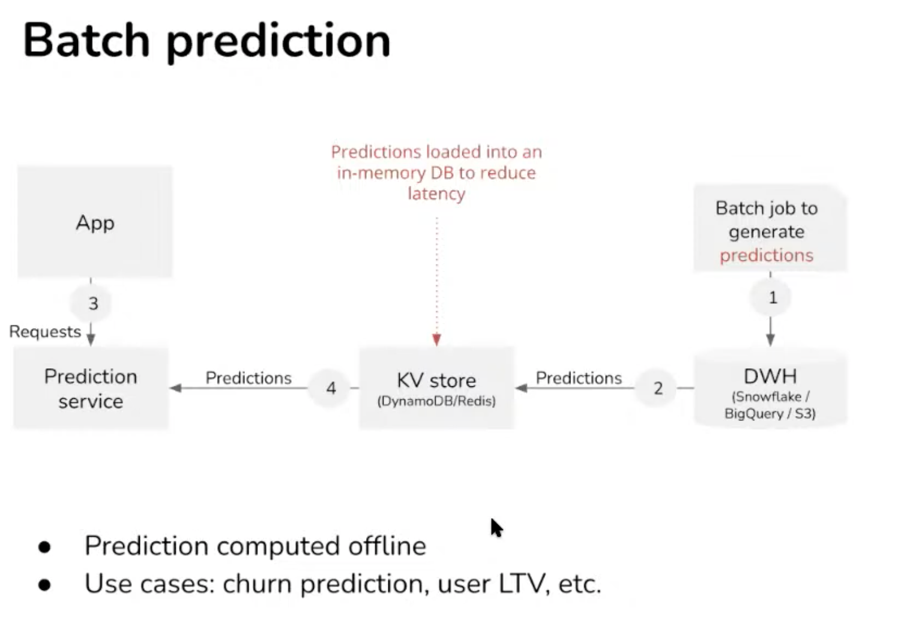
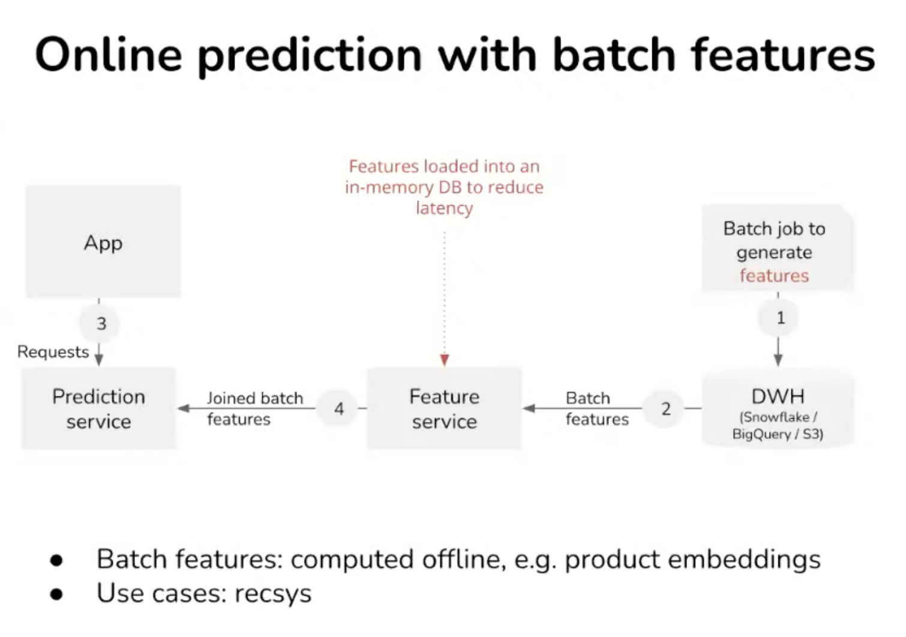
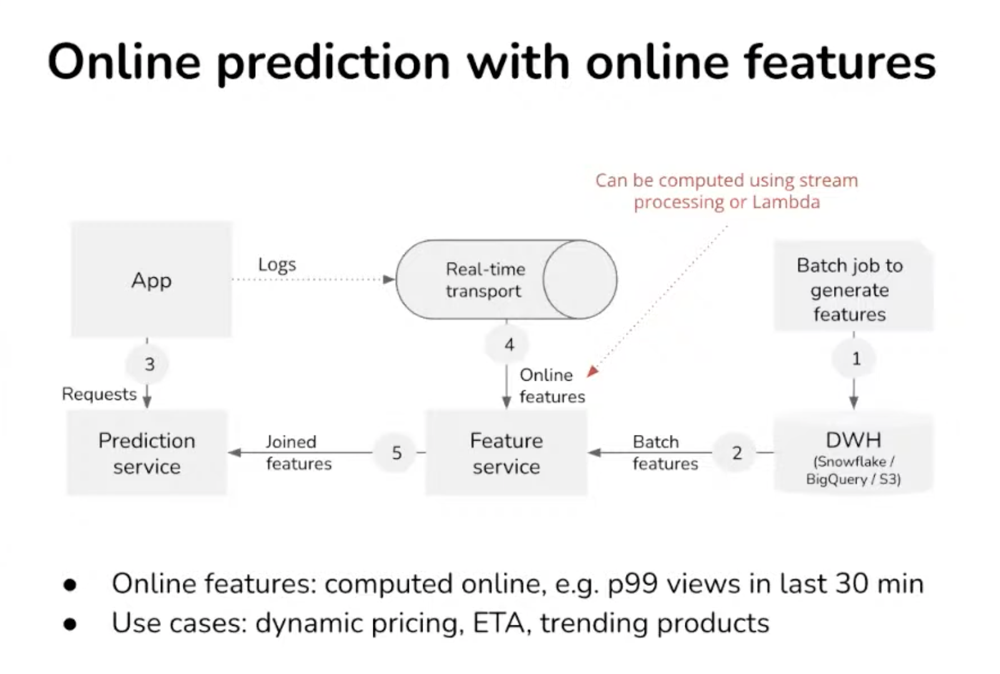
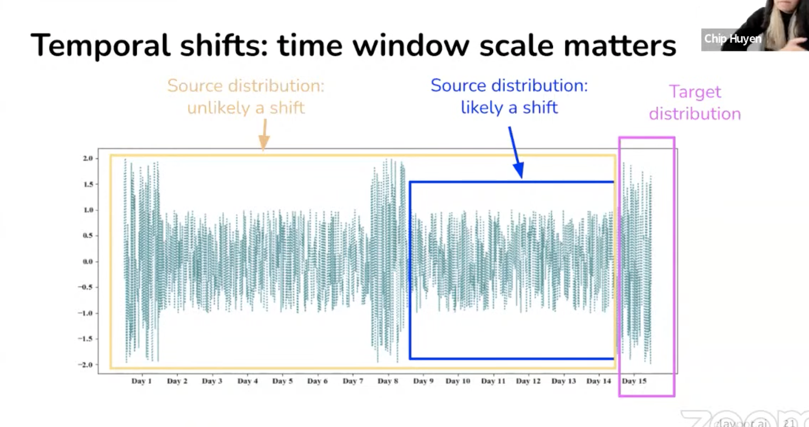

# 3. ML for online prediction, Chip Huyen, Claypot AI

[https://www.youtube.com/watch?v=P5uBWGqzogs&ab_channel=Tecton](https://www.youtube.com/watch?v=P5uBWGqzogs&ab_channel=Tecton)

👉 [Slides](https://www.dropbox.com/s/5eee8lb72fn9msk/apply_realtime_ml_30mins.pdf?dl=0)

### 1. Online prediction
    
Batch prediction compute periodically vs online prediction compute on demand.

Batch is not adaptive, before request arrive. Ok for recommender system, but it is costly. A prediction for all possible request out there.

Online prediction issue is latency, need a high throughput.

- Databricks has spark streaming
- Feature service (or feature store) must
    1. Connect to different to different data sources and streaming sources (Kafka). 
    2. Feature catalog: it also needs to store feature definition. It can either be in SQL or Df. 
    3. Next requirement is feature computation, vectorisation. Databricks come from a batch computation approach, not adapted for real-time
    4. Serving consistency Reuse the computation for later prediction or retrained the model. Feature is more like a datamart. Ensure the consistency of the feature during prediction. Hard to achieve consistency for features computed outside of the feature store.
    5. Monitoring: online feature must be tested and don’t break into pipelines
    
### 2. Monitoring

What to monitor? Business metrics. F1 accuracy, CTR. Bottleneck by label availability. Companies try to collect as much feedback as possible (with user feedback, a proxy for labels). Clicks are not a strong signal, purchases are but much sparser.
    
Prediction and features are monitored instead: shifts in distribution decrease business metrics.
How to determine it that 2 distributions are different? (train vs production, or yesterday vs today, source vs target)
1. Compare statistics → distribution dependent, inconclusive
2. Using sample testing (K-S or MMD) → generally don’t work with high dim

Not all shifts are equal
- slow and steady vs fast
- spatial shift vs temporal shift
    - spatial = desktop vs mobile phone shift
    - temporal = behaviour has changed

- Choosing the right window is hard
- Can merge shorter time window (hourly) into a bigger one (daily)
- Auto detect using **RCA** with various windows size
- Monitoring predictions
    - Low dimensional, easy to do simple hypothesis test on
    - Change in prediction dist means change in input dist (can also be due by new model rollout progressively)
- Monitoring features
    - Sanity checks with precomputed statistics (min, max, avg)
    - But costly and slow
    - Alert fatigue (most expectation violation are benign)
    - Update needed overtime
        
### 3. Continual learning

### Q&A
Feature store for small teams?
- Simple feature: lambda computation
- Complex features: no feature store, integration heavy
    
Scaling serving with the number of model serving? And how to monitor drift?
    
→ Embeddings? prebuild, pretrained models?

→ Are you deploying these models separately or a single containers?

B2B companies have a separate model for each customer, requires managing features and training