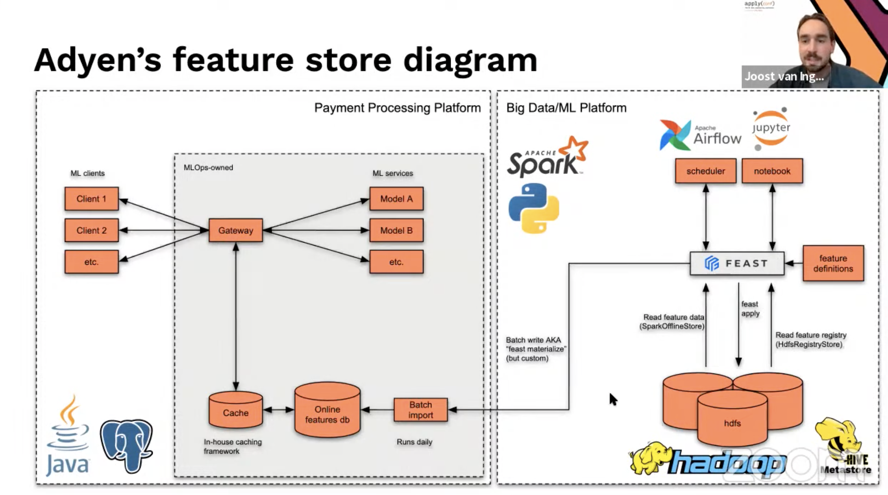

# 7. Extending Open Source feature Store, Joost & Thijs, Adyen

[https://www.youtube.com/watch?v=Yidl2VmrgVs&ab_channel=Tecton](https://www.youtube.com/watch?v=Yidl2VmrgVs&ab_channel=Tecton)

- Use cases
    - Fraud classification
    - Predict best time to retry a failed payment
    - Detect illegal activity on the platform

- Open source feast-spark-offline-store and move it into the feast project
    
    
    
    - Very custom solution

- In house build package, in early versions Spark was supported but it became incompatible, hence the library.
    - Offline features are mainly aggregations over day ranges
    - A lot of internal ETL pipelines use PySpark
    - `SparkOfflineStore` as the interface to query existing feature tables, following BigQuery and Redshift template

