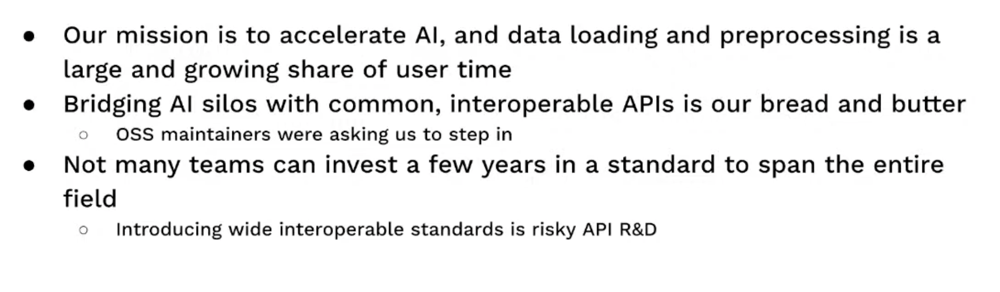
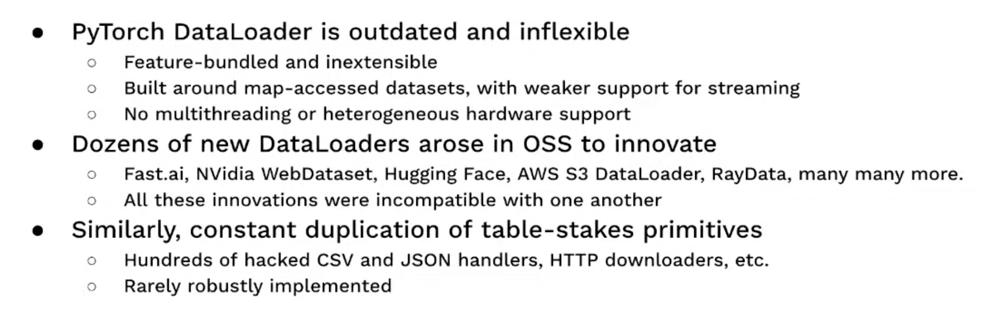
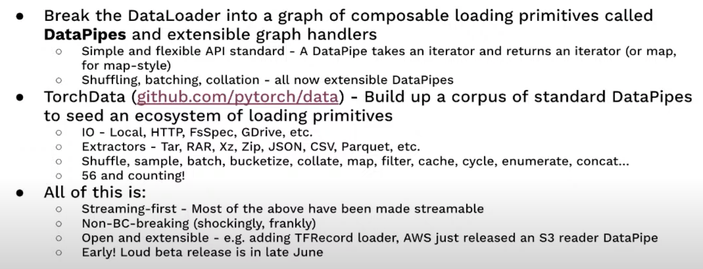
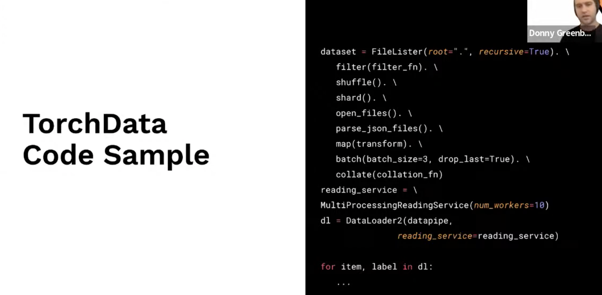
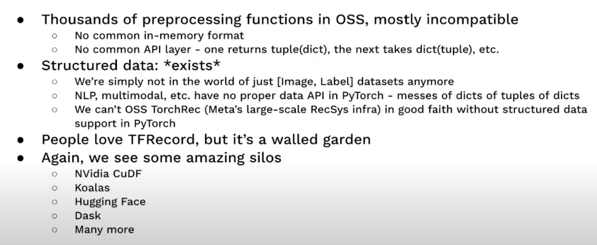
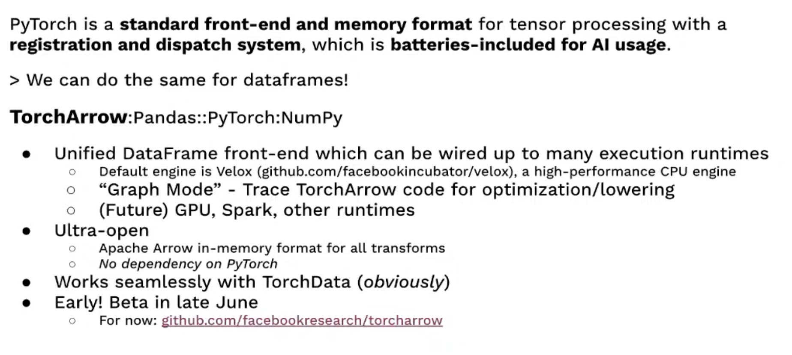
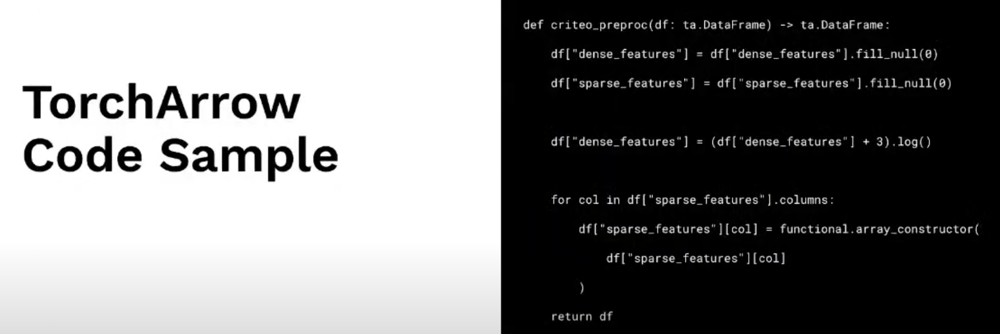

# 18. PyTorch’s next generation of data tooling, Donny Greenberg, PyTorch at Meta

[https://www.youtube.com/watch?v=pAoV9rls1IY&ab_channel=Tecton](https://www.youtube.com/watch?v=pAoV9rls1IY&ab_channel=Tecton)

- Should we have data APIs at PyTorch?
    
    
    
- Problems in OSS AI data loading
    
    
    
- Introducing Extensible Loading Standard
    
    
    
    
    
- Data processing
    
    
    
- Introducing Extensible Processing Standard
    
    
    

