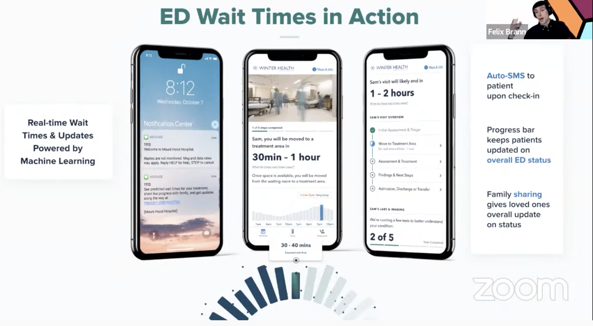
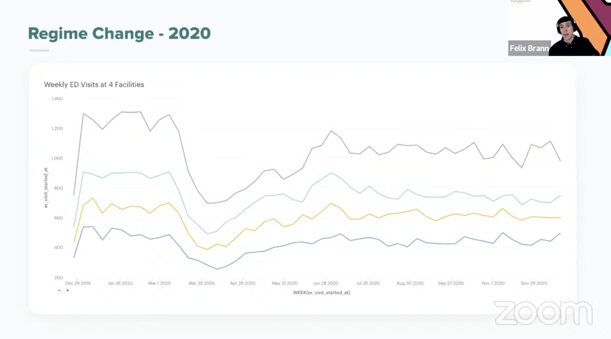
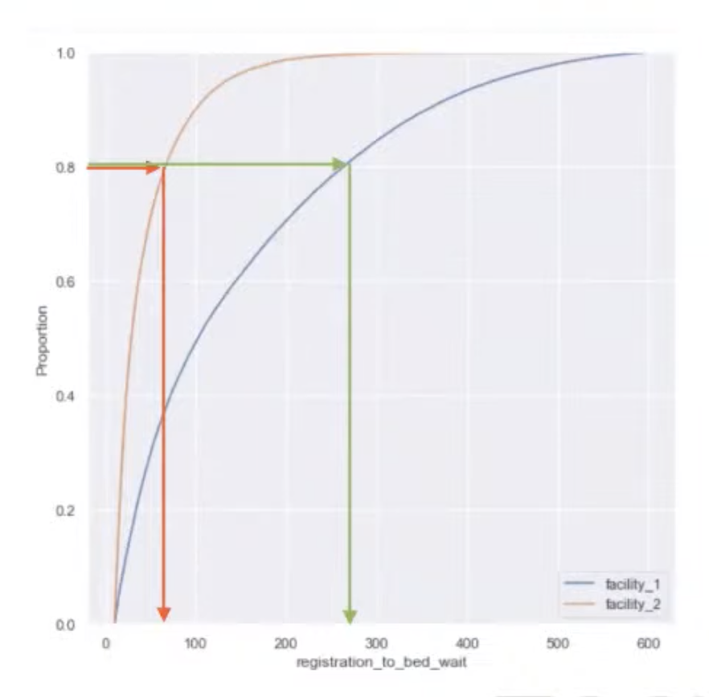
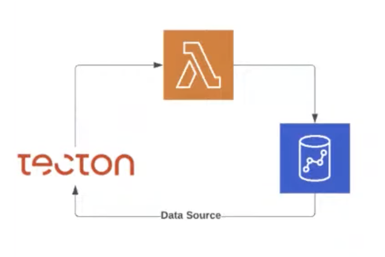

# 6. Enabling rapid model deployment in healthcare, Felix Brann, Vital

[https://www.youtube.com/watch?v=HWD42AHrgZk&ab_channel=Tecton](https://www.youtube.com/watch?v=HWD42AHrgZk&ab_channel=Tecton)

- Motivating exemple: Wait time for patients.
    - No info except grabbing a nurse or a doctor
    - ML to help inform patients during their stay

- Cold start problem: scarce data
    - Hospital expect accurate ML results from day one
    - No history when opening a new facility
    - Emergency departments varies a lot
    - Data regime change (think Covid)
        
        
        

- Solution: a facility-agnostic model, predicting the wait percentile
    - Model use raw feature and aggregated features at the facility level
    - Instead of predicting in minutes, we predict in percentile of the historical wait CDF, of a given facility (see below that it can varies a lot for same percentile)
        
        
        

- Implementing using Tecton
    - Feature service for all feature to normalize, indexed using a `facility_id`
    - Lambda periodically extract tecton features into Redshift
    - Redshift is the data source

