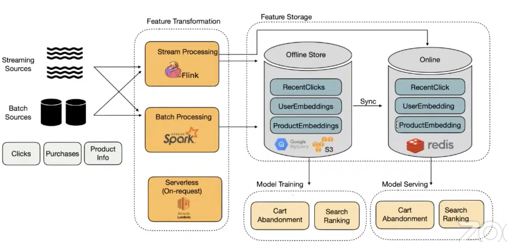
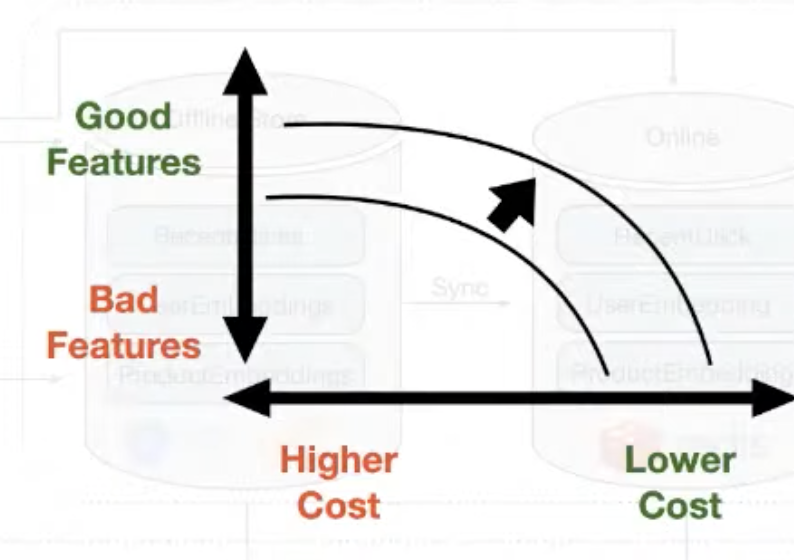
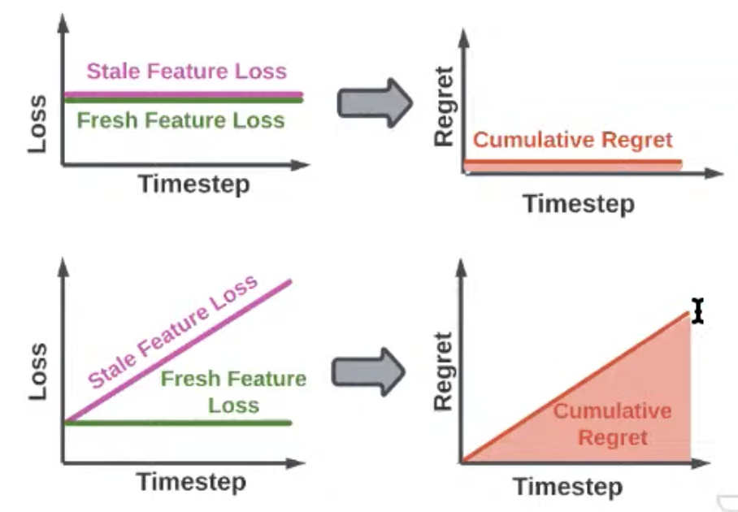
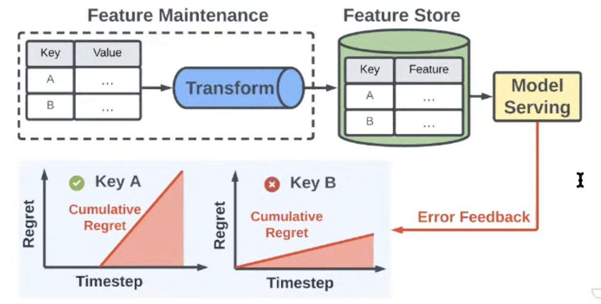

# 33. Real-time, accuracy and lineage-aware featurization, Sarah Wooders, Sky (ralf)

[https://www.youtube.com/watch?v=c4mTAMkq0N8&ab_channel=Tecton](https://www.youtube.com/watch?v=c4mTAMkq0N8&ab_channel=Tecton)

👉 [Slides](https://www.dropbox.com/s/vilsu93nnxius1q/ralf_apply.pdf?dl=0)

- Feature store quick review
    
    
    

- This talk is specifically about feature maintenance and how to keep features refreshed
- How often to update data transformation? Infrequent batch vs streaming system in real-time?
    
    Unclear where to land for different apps
    
    - A lot of features are not that important, might never be queried, power-law distribution on feature query. A waste of resources to keep them up-to-date

- Consider first the cost of feature maintenance and then how much quality (tradeoff)
    
    Improve the tradeoff by being smart about priorization
    
    
    

- What is data quality?
    
    Ratio of actual feature performance over the optimal/ideal features
    
    Define feature-store regret = prediction error with actual feature - ideal feature
    

- If able to measure the accuracy of models, able to approximate the regret:
    
    Can determine which feature leads to less regret
    
    Less important to update vs more important by tracking the cumulative regret overtime
    
    
    
- For every feature-pair we track regret and take the key with the highest regret and update
    
    
    
- Higher accuracy for the same cost using this regret scheduling, different feature updates by timesteps, improving our tradeoff
    
    Freshness ≠ accuracy, they are correlated but not equal so it is another reason to look at model error for feature quality
    

- “ralf” is a declarative dataframe API for defining features, with fine-grained control over managing feature updates, built for ML operation (python/ray)
    - treat features as static dataframe
    - increment in real-time with upcoming event
    - easy integration with existing ML system