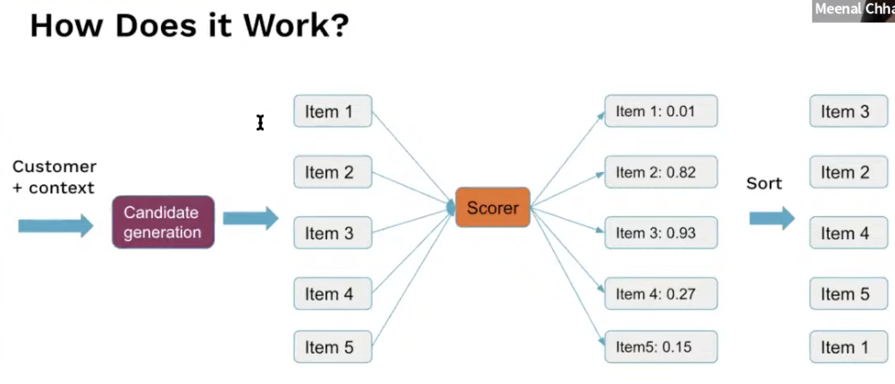
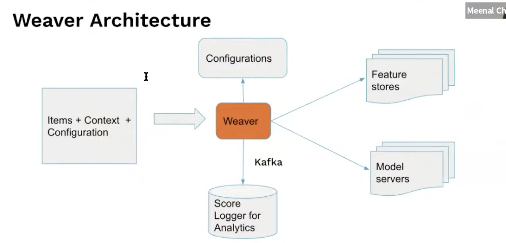
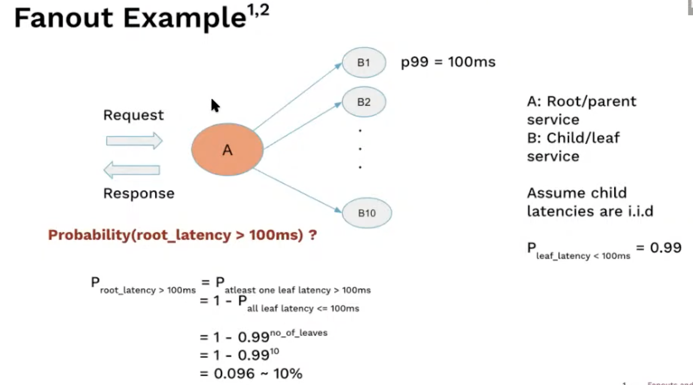
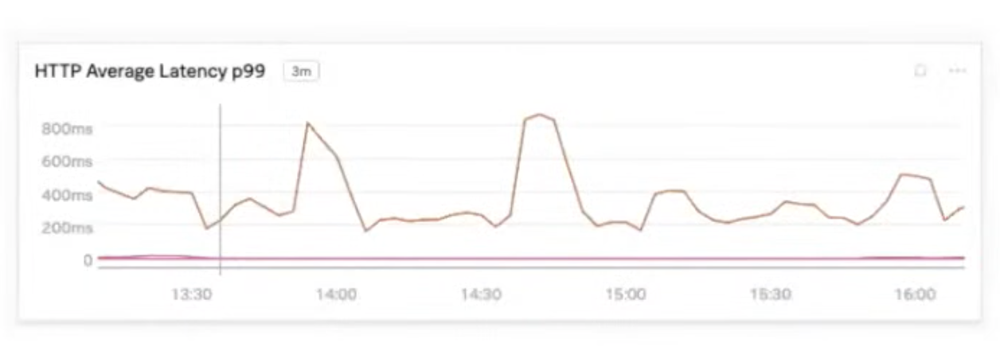
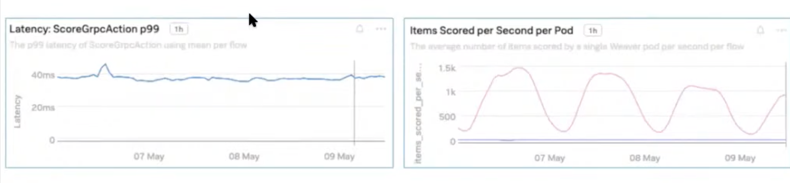
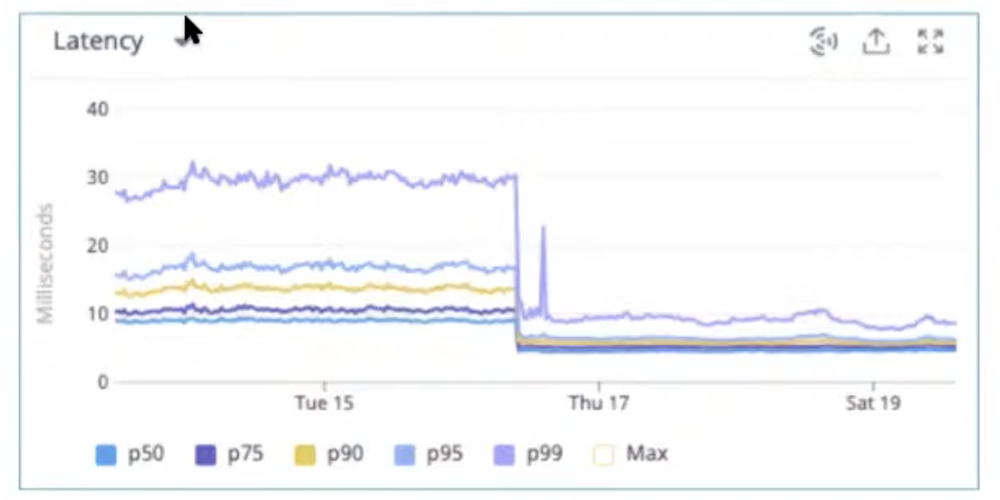

# 20. Cash App’s real-time ranking ML system, Meenal & Austin, Block Inc.

[https://www.youtube.com/watch?v=8KsPtzj1wa8&ab_channel=Tecton](https://www.youtube.com/watch?v=8KsPtzj1wa8&ab_channel=Tecton)

- Cash App is an easy way to send and save money
- Use-cases
    - Use-case
    - Rewards ranking
    - Support article ranking
- Infra
    
    
    
    - The intention is to take customer context during the sort phase, to make it more specific
- We are going to focus on ranking
- Requirements
    - Each event leads to n item being scored: show relevant reward when the user clicks on the ad
    - Customer-facing: fast and reliable, target is scoring 50 items < 100ms
    - Configurable system to support multi use-cases
    - Basic ML system features
        - A/B test support
        - Shadow mode to test in prod background
        - Logging metrics and results
- Options to work on a solution:
    1. A library: business logic is embedded in the use-case itself
        
        pro: reduce latency
        
        cons: tricky for management
        
    2. Side-car: business logic run in a container along with the product service
        
        same pros and cons
        
    3. Standalone Service (Weaver) that the product service makes a call to
        
        pro:
        
        - easier to bootstrap
        - easy to manage
        - easy to onboard
        
        cons
        
        - availability
        - latency
        
- Architecture
    
    
    
    - Multiple feature stores and model servers, depending on the use-case several are accessible to the user
    - Also caching metadata for making quick requests in an online environment

- Challenges
    - Feature store service latency
        
        impacted by the backend (is it DynamoDB, Cache)
        
    - Model serving
        
        impacted by the network and model evaluation cost
        
    - Fanout problem
        
        parallel calls lead to a higher proba of more latency
        
        
        

- Testing and optimizations
    - Quick and dirty solution: slow and unstable
        
        We couldn’t scale, need to adapt all podes
        
    
    
    
    - Later on, achieved stability
    
    
    
- Latency was optimized
    1. Hardening the network path
        
        Latency had spikes without obvious causes, turn out that the bottleneck was the egress gateway traffic flow
        
        Just avoided this bottleneck to bring latency down to 200ms
        
        ⇒ You want to understand to whole network path
        
    2. Serving from disk vs memory
        
        Switching from DynamoDB to Redis (feature store support both), avg latency drop from 10ms to 5ms
        
        Ready critical when doing fane-out
        
        
        
    3. Hedging request: reduce the impact of tail latency
        
        Idea:
        
        1. send a request
        2. if no response after a delay, send it again
        3. return the response that completes first while cancelling the other
        
        If the system is overloaded, you might have unexpected bottlenecks
        
        - Impact: 1% hedging request bring down the p99 by 20%
        - The issue with edging: latency can spiral out of control. a safety mechanism is needed to avoid these loops.
    4. Warming up the connection pool
        
        The initial traffic needs to first connect, helpful to improve the stability of the latency
        
    5. Concurrency tuning
        
        Tricky to find but is key to maximising performances
        
        Are you doing mostly I/O or CPU? (multi-threading vs multi-processing)
        
        Here, removing threadpool reduced CPU usage by 5% and p99 latency by 5ms
        
    6. Further enhancements
        - More efficient data structures
            
            Less data to transmit and process, avoid duplication of keys or values
            
        - Produce good enough results quickly as opposed to best results slowly
            
            Use a timeout to drop scores that are too slow
            

- Q&A
    - Did you replace DynamoDB with Redis or was it another layer?
        
        Replaced. We’re also thinking about having a caching layer
        
    - Request hedging: how do you determine the timeout?
        
        We monitor the latency of requests in the system so that we can chart an histogram. 
        
        Chose the delay with the distribution.
        
    - Redis vs DynamoDB operational cost (Redis is not hosted)?
        
        Yes, it required some additional investment