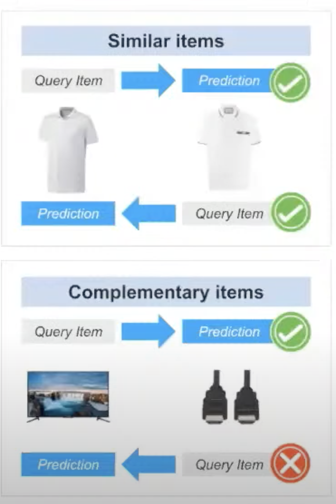
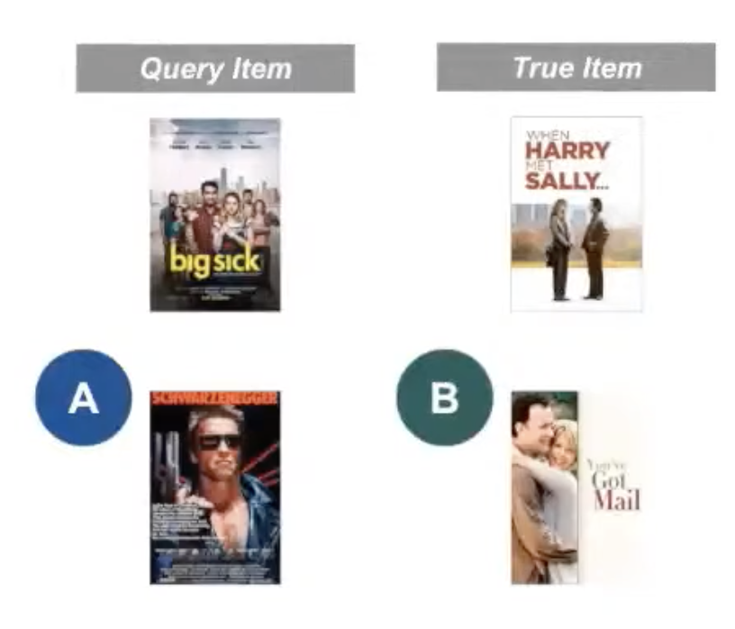
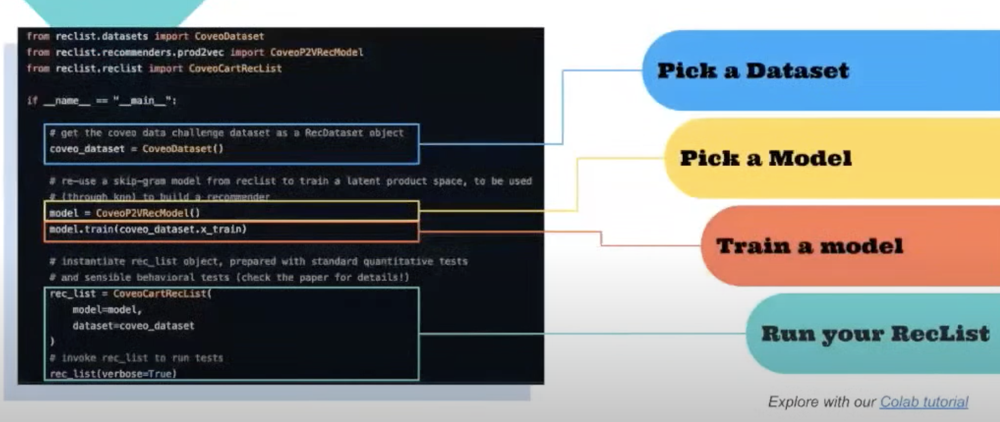

# 26. Evaluating RecSys in production, Federico, Tooso

[https://www.youtube.com/watch?v=FfJKFbgdSSo](https://www.youtube.com/watch?v=FfJKFbgdSSo)

- Issue:
    
    RecSys are vital for the user, but classic evaluation metrics are not enough
    
    Guessing when a recommendation is not relevant is tricky
    
    
    
- RecSys fails silently, with dramatic consequences
    
    and pseudo-feedback is tricky
    
- Do your test capture these issues? Is there a way to evaluate RecSys?
- Introducing behavioural testing
    1. Doesn’t focus on a single metrics
        - Inherent properties of uses cases, enforce input/output pairs
        - Similar items are symmetric
        - Complementary items are asymmetric
        
        
        
    2. Quantify mistakes
        
        
        
        “Terminator” is a much worse mistake than “Got Mail” as a recommendation
        
    3. Slice the data
        
        Imbalanced datapoint (power log distribution), good aggregate measure (like MRR) even if low represented data are worse
        
    
- Solution: RecList is a behavioural test at scale
    
    Main abstractions
    
    - `RecDataset`: wraps dataset
    - `RecModel`: wrap predictions from models, allowing “black box” testing of APIs
    - `RecList`: declarative style, made of `RecTest`s
    
    ```python
    from reclist.metrics.standard_metrics import statistics
    
    class MyRecList(RecList):
    	
    	@rec_test(test_type="stats")
    	def basic_stats(self):
    		return statistics(
    			self._x_train,
    			self._y_train,
    			self._x_test,
    			self._y_test,
    			self._y_preds)
    ```
    
    - Lot of pre-made behavioural tests to use
    
    
    
    - Can be use for research with a new model
    - and also for prod system, using CI/CD (check if behavioral symmetry is verified)
    
- Q&A
    - End game with reclist? a company?
        
        Keep it open-source, make it useful for research and also for production tool
        
    - Is it for recommender system only?
        
        Based mainly on rec for now 
        
    

Behavioral testing of recommender systems with RecList

[https://arxiv.org/pdf/2111.09963.pdf](https://arxiv.org/pdf/2111.09963.pdf)