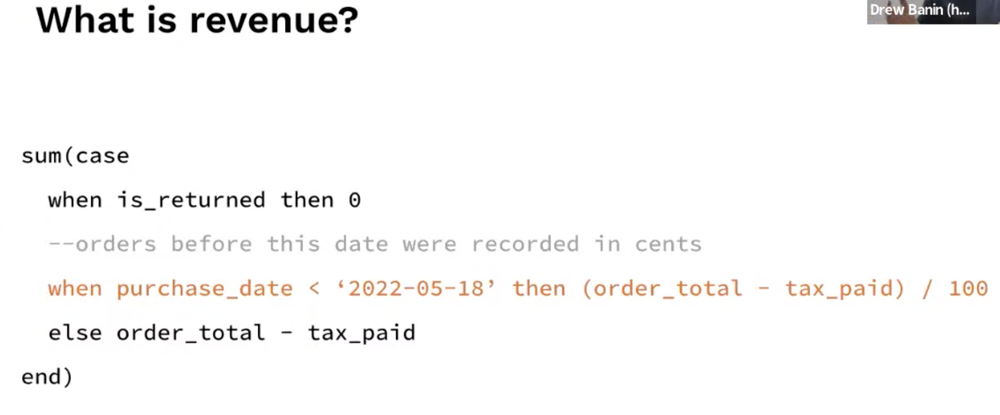
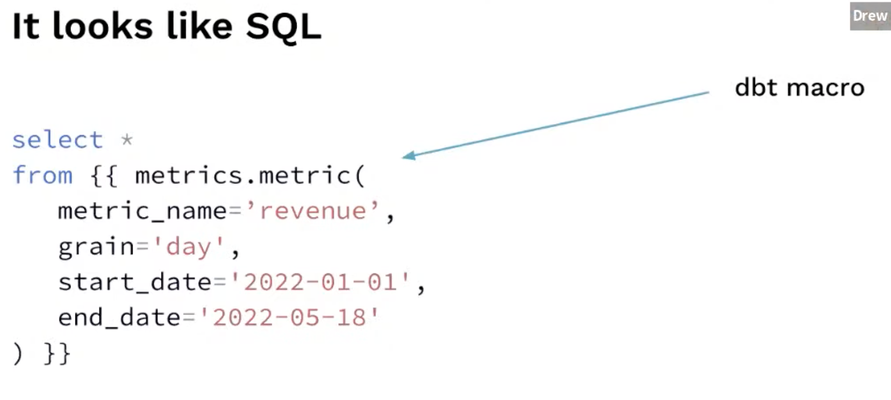
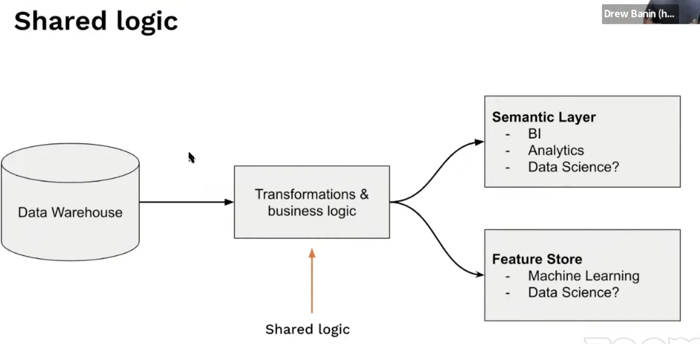

# 16. Semantic Layers & Feature stores, Drew Banin, dbt Labs

- Semantic layers are *in*
    - Main idea: define your dataset and metrics, map out their relationships, translate semantic query into SQL
    - Example metrics: revenue per country, churn rate …
- One example
    
    
    
    - in dbt:
    
    
    
- Precision & consistency
    - Many people, many teams but only one way to define revenue
    - Avoid repeating work or copy-paste, and inconsistency can arise

- Bridging the gap
    - Standardisation: feature store for ML training and serving
    - Semantic layers: feature store in the BI world, output for analytics
    - Doing it once and correctly
    
    
    
    - get reuse and consistency