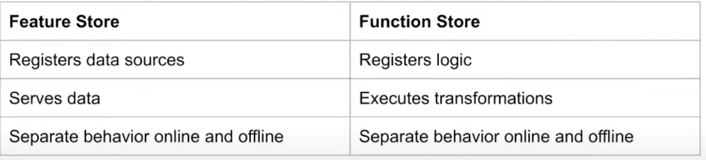

# 8. Compass: Composable & Scalable Signal Engineering, Justin Young, Abnormal Security

[https://www.youtube.com/watch?v=nyaZm04qWl8](https://www.youtube.com/watch?v=nyaZm04qWl8)

👉 [Slides](https://www.dropbox.com/s/2wvn0k07uyt7o2j/Compass)

- Use case: stop all email attacks
    - Need high recall
    - High precision
    - Rapid iteration cycle, because attackers update their techniques
- Mantra: move fast and **don’t** break things
- How to build an ML platform?
    - Prevent entanglement
    - Prevent online / offline skew
- Entanglement
    - “Changing anything changes everything”
        
        Hard to hard signal and basically impossible to remove ones, with an effect anywhere later on.
        
    - Function composition: f(x) = h(x, g(x))
        
        Function composition are the primary responsibility of ML pipeline
        
    - Unconstrained function composition is the root of entanglement
        
        Total dependencies grow square with the total of signals
        
        So we need constrained function composition instead
        
    
    
    
    
    
    - How does the signal dag work in production?
    
    ```python
    @compass.single_output_transformation("variable_len")
    def extract_len(input_variable: str) -> int:
    	return len(input_variable)
    ```
    
    - Key features of dag:
        - Data structure append-only
        - Easy to understand the pipeline: list dependencies and viz
        - Validate properties of the pipeline: no cycle, unused branch, every signal produced exactly by one transformation
        - Platformize pipeline: propagate errors downstream, parallel execution of parallel Dags
    
- How to execute this offline/online at scale?
    - Most of the time offline and online transformation will use the same transformations
    
    
    

- Key takeaway: make sure your ML pipeline implements both a feature store and a function store!
    
    
    
    The system should be function centric