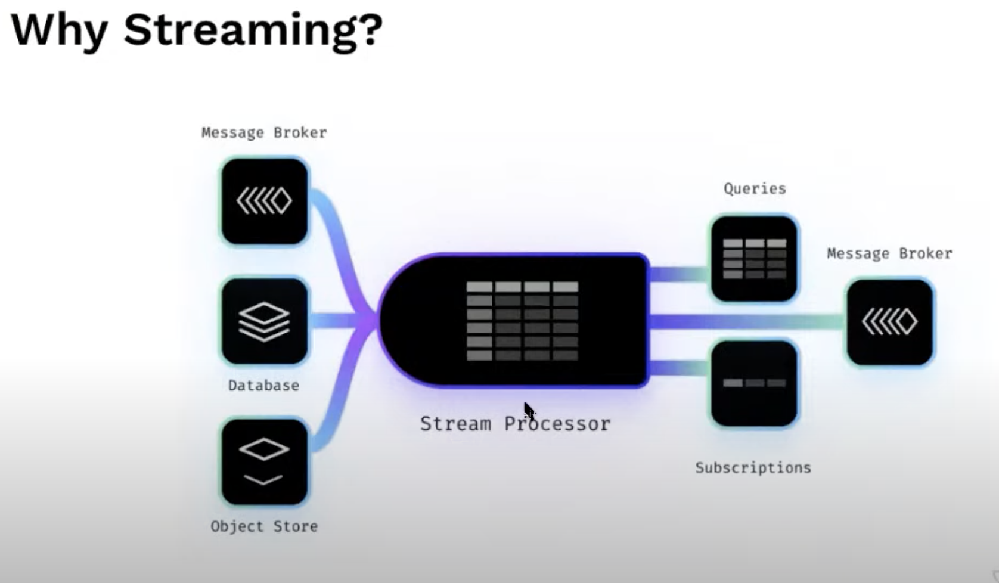
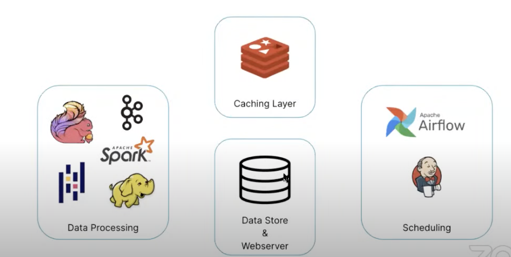
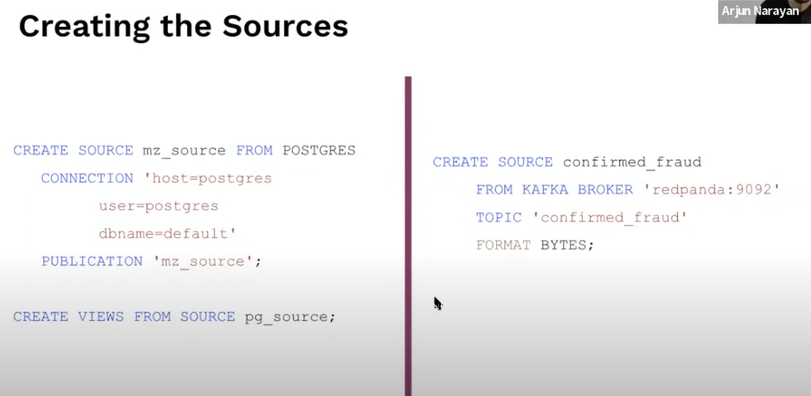
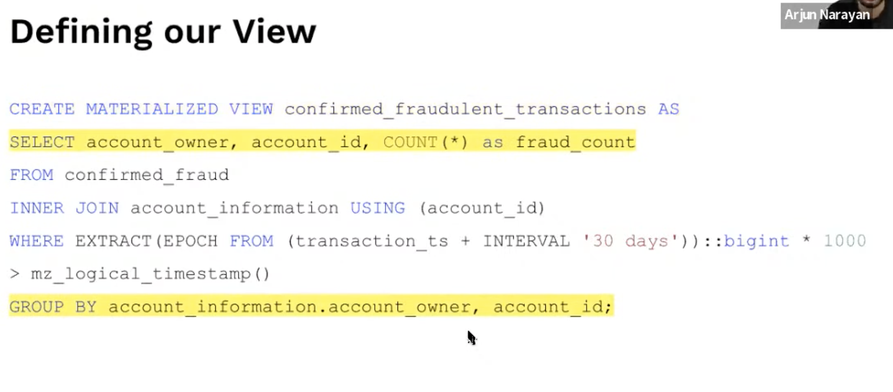
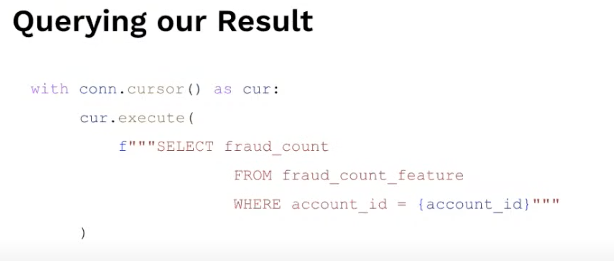

# 9. Streaming is an implementation detail, Arjun Narayan, Materialize

[https://www.youtube.com/watch?v=iR-iN2Mqi0A&ab_channel=Tecton](https://www.youtube.com/watch?v=iR-iN2Mqi0A&ab_channel=Tecton)

👉 [Slides](https://www.dropbox.com/s/0a5g3rtr4smt6mc/Materialize)

- Streaming is taking action on data points as they appear, without waiting for batch processing
- But this isn’t just about going fast, it enables an entire range of product
    
    
    

- Let’s build a feature store!
    - Credit card fraud: approve or deny the transaction in real-time
    - One account owner per account, with multiple accounts
    - Hypothesis: one a fraud is committed on an account, it will likely happen again
    - Feature store objective: given an account ID, the feature store will return the number of verified fraudulent transactions against an account owner in the last 30 days, if too high the transaction is denied

- What does it look like?

- Some data processing in real-time, coupled with batch processing using schedulers
- A layer of caching to process rescheduling

⇒ This is a lot of infrastructures: we’ve built an entire database

- Why stream processor is insufficient?
    - High engineering expense
    - Slow query: needs cache
    - Missing primitive: joins have to be implemented manually and the state must be managed

- Streaming should be a feature
    - Streaming is more like a B tree, but developers don’t think about them every day.
    - Materialize is a database powered by a stream processor, looks and feels like a regular database
    
- Materialize
    - Yields incremental results, you create queries upfront and it runs it as data arrive
    - Keep data in memory for fast indexing
    - Query and tail to fetch from the app
    
- A Feature store with a streaming DB?
    - No scheduling
    - Materialize update SQL views
    - No need for a separated caching layer

- simply write SQL, without worrying about streaming

