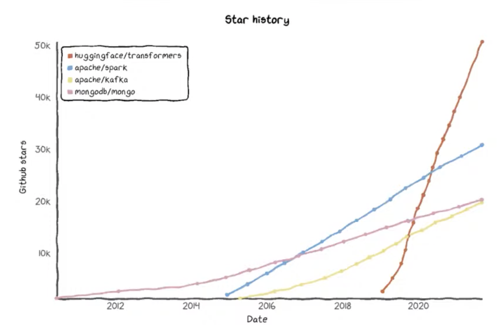

# 30. Are transformers becoming the most impactful tech of the decade? Clément Delangue, Hugging Face

[https://www.youtube.com/watch?v=tWaXLomb-zw&ab_channel=Tecton](https://www.youtube.com/watch?v=tWaXLomb-zw&ab_channel=Tecton)

- Think about Google usage: results from natural language search are much better
    
    Auto completes on phone and emails are more and more accurate and useful
    
    Auto-translate super useful
    
    Moderation for offensive content
    
    Copilot feature on Github to go faster 
    
    even Uber ETA 
    
    ⇒ All powered by transformers and transfer learning architecture
    

- How did that happen?
    
    2017: Attention is all you need, new architectures for ML
    
    2018: BERT, change the way to do ML.
    
- Why did that happen?
    
    Compute power (affordable and available TPU and GPU) + large and open datasets + transfer learning (ability to fine-tune on smaller datasets)
    
    Transformers started to beat SOTA for every NLP task. Within a short period of time 69% → 88% accuracy (2019), humans are lower than 88% accuracy.
    
- Amazing adoption of hugging face transformers
    
    
    

- Multiplication of models, being used by so many companies
    
    Now hugging face vision is to become the github of ML
    
    1000+ ML model shared on the platform, 10k companies using us
    
    More and more companies start with ML or transformers in mind
    
- It is time to act on ethical AI
    
    The most popular transformer model BERT is extremely biased when it comes to inference jobs per gender
    
    It is the right time to vest heavily on AI ethics
    
    Model cards for model reporting: a way to communicate about the biases of model
    
    When practitioners use models the right way. Ex: hiring mustn’t be handled or filtered using BERT, because we know that it will be biased.
    

- Another initiative: the data measurement tool
    
    Analyse datasets and try to find limitations and biases, to make sure it is understood and to manage properly, to mitigate those biases.
    

- We can make ML and transformers the most positive technology of the decade