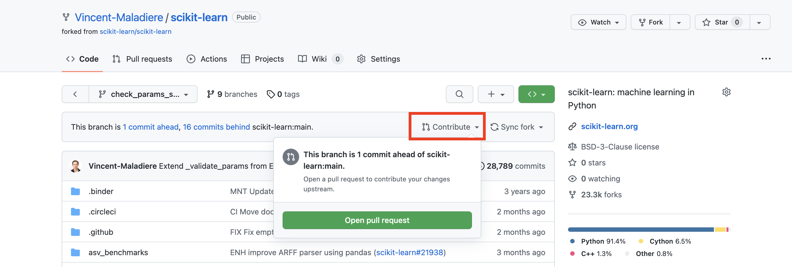
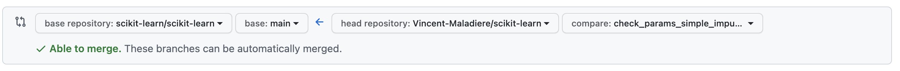

# Contrib cheatsheet

Based on: [https://scikit-learn.org/stable/developers/contributing.html#pull-request-checklist](https://scikit-learn.org/stable/developers/contributing.html#pull-request-checklist)

### 1. Dev in a new branch

When you have identify an issue to work on:

- Pull the latest change from upstream
    
    ```bash
    git pull upstream main
    ```
    
- Create a new branch
    
    ```bash
    git checkout -b your_branch
    ```
    
- Code!
- Add tests

### 2. Testing

- Add [non-regressive tests](https://en.wikipedia.org/wiki/Regression_testing)
- Run pytest on changed files
    - Test a single module: `pytest sklearn/tests/test_common.py -v -k LogisticRegression`
    - Display variable on error: `pytest -l`
    - Run pdb shell on error: `pytest --pdb`
    - Run ipdb shell on error: `pytest --pdbcls=IPython.terminal.debugger:TerminalPdb --capture no`
    - Doesn’t capture print: `pytest -s`
- Check unittest coverage (at least 80%)
    
    ```bash
    pip install pytest pytest-cov
    pytest --cov sklearn path/to/tests_for_package
    ```
    
- Run static typing analysis with `mypy sklearn`
    - Using `# type: ignore` annotation can be a workaround for a few cases
- Auto-format code: `black .`
- Make sure the code is flake8 compatible: `git diff upstream/main -u -- "*.py" | flake8 --diff`
- Profiling
    
    [https://scikit-learn.org/stable/developers/performance.html#performance-howto](https://scikit-learn.org/stable/developers/performance.html#performance-howto)


### 3. Make sure the code is commented and well documented.

- Add tutorial and relevant material
- Build the doc locally and check its correctness
    ```
    cd doc
    make html
    ```


### 4. Once your tests are successful

- Commit
    
    ```bash
    git add my_file
    git commit -m "my new commit"
    ```
    
    This will run pre-commit on flake8, black and mypy.
    
- Push your new branch on your forked repo
    
    ```bash
    git push -u origin my_branch
    ```
    
- Finally, create a pull request from your fork to the original repo
    
    Choose your branch and click on *Contribute*
    
    
    
    This will prompt the following
    
    
    
    Click on *Create Pull Request*
    

### 5. Document your pull request

#### Title

Choose a prefix for the title:
- `MAINT` and `MNT`: general project maintenance, e.g. private code edits that doesn’t impact users
- `FEA`: new feature
- `EHN` and `ENH`: improving an existing feature
- `FIX`: fixture
- `DOC`: documentation
- `CI`: continuous integration
- `TST`: tests
- `POC`: proof of concept
- `PERF`: `EHN` of performance

Sometimes `<FIX “PR_NAME”>` is enough, but `<FIX #PR_NUMBER>` is never a good title


#### Body

- Add links to the related issue, e.g. closing #1234
- Explain what your PR introduces
- The PR should substantiate the change: through benchmark of performance or example of usage
- Take part in maintenance and support
    
