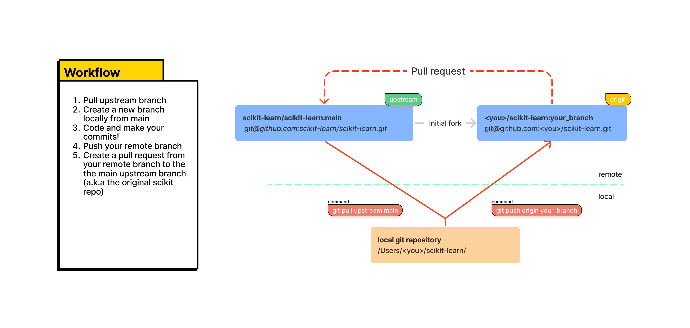
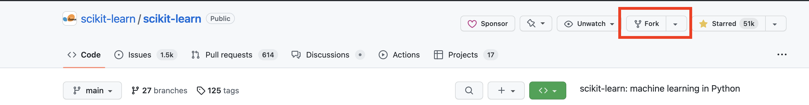
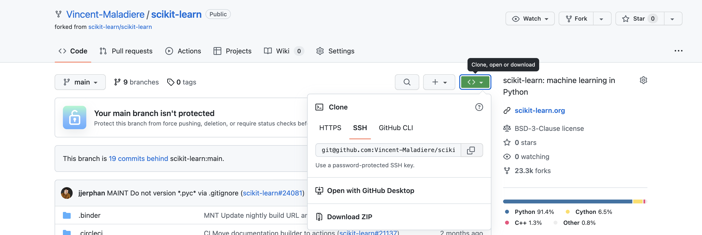

# Setup

Based on: [How to contribute](https://scikit-learn.org/stable/developers/contributing.html#how-to-contribute)

The major difference between tech companies and open source that in open source you don’t work on the main repository directly.

- *why?*
    
    Projects like scikit-learn have hundreds of pull request monthly and an equal number of branches from many different contributors. If people were directly developing on scikit-learn, it will end up with an intractable number of branches on the main repo, and we don’t want that.
    

Instead, you must develop your branches on your local fork, before submitting your pull request (PR) from your fork to the main branch of the original repo:



Let’s setup your local working environment.

1. Fork the original repository
    
    
    
2. Clone the project on your local machine
    
    
    
    On your terminal:
    
    ```bash
    git clone <Your Project URL>
    ```
    
3. Add the original scikit-learn upstream
    
    ```bash
    git remote add upstream git@github.com:scikit-learn/scikit-learn.git
    ```
    
    Check that `git remote -v` display the following:
    
    ```bash
    origin  git@github.com:YourLogin/scikit-learn.git (fetch)
    origin  git@github.com:YourLogin/scikit-learn.git (push)
    upstream        git@github.com:scikit-learn/scikit-learn.git (fetch)
    upstream        git@github.com:scikit-learn/scikit-learn.git (push)
    ```
    
    It will allow you to pull the latest change from the original repo, while pushing your commits to your fork.
    
4. [Install mamba from forge](https://github.com/conda-forge/miniforge#mambaforge)
    
    Mamba is a fast front-end from conda.
    
    Conda is useful because it links all dependencies to the same backend, whereas *pip* setup adhoc backends for each library.
    
5. Install mamba compilers
    
    ```bash
    mamba install compilers
    ```
    
6. Create and activate a mamba environment
    
    ```bash
    mamba create -n sk
    mamba activate sk
    ```
    
7. Install scikit dependencies
    
    ```bash
    mamba install cython scipy numpy joblib
    ```
    
8. Install test dependencies
    
    ```bash
    mamba install pytest pytest-cov flake8 mypy numpydoc black==22.3.0
    ```
    
9. Install pre-commit
    
    ```bash
    pip install pre-commit
    pre-commit install
    ```
    
10. Build and install sklearn locally
    
    ```bash
    pip install --no-build-isolation -e . -v 
    ```
    
    When developing Cython files, you need to recompile them by running this command before testing
    
11. Check your installation
    
    ```bash
    python -c "import sklearn; sklearn.show_versions()"
    ```

If the command is successful, go to the next tutorial to start contributing!