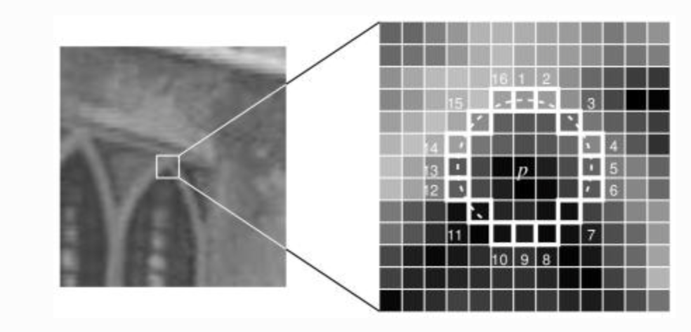
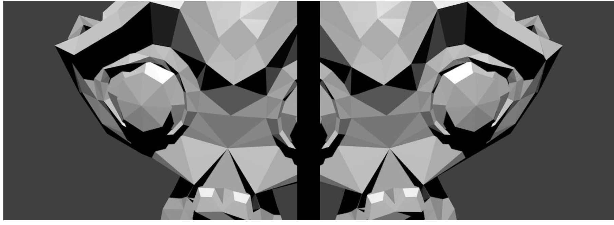
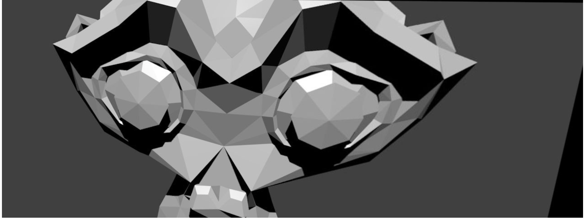

# 2D Features framework

[https://docs.opencv.org/3.4/d9/d97/tutorial_table_of_content_features2d.html](https://docs.opencv.org/3.4/d9/d97/tutorial_table_of_content_features2d.html)

Feature detection and description are the basis for image recognition and detection. They are especially useful for simple tasks, when there is too few data to train a deep learning model or too little compute power.

## Features detector

### Harris Corner Detector

[https://opencv24-python-tutorials.readthedocs.io/en/latest/py_tutorials/py_feature2d/py_features_harris/py_features_harris.html](https://opencv24-python-tutorials.readthedocs.io/en/latest/py_tutorials/py_feature2d/py_features_harris/py_features_harris.html)

- A feature should be uniquely recognizable, and can be edges, corners (aka interest points) blob (aka regions of interest)
- high variations in image gradient can be use to detect corners
- We look for variation of
    
    $S(u,v)=\sum_x\sum_yw(x,y)[I(x+u,y+v)-I(x,y)]^2$
    
    Using Taylor decomposition, with $I_x,I_y$ partial derivative 
    
    $S(u,v)\approx\sum_x\sum_yw(x,y)[I(x,y)+uI_x+vI_y-I(x,y)]^2\\$
    
    $=\sum_x\sum_yw(x,y)(u^2I_x^2+v^2I_y^2+2uvI_xI_y)\\$
    
    $=[u,v]\Big(\sum_{x,y} w(x,y)\begin{bmatrix}I^2_x &I_xI_y \\ I_xI_y & I_y^2\end{bmatrix}
    \Big)\begin{bmatrix} u \\ v\end{bmatrix}$
    
    $=[u,v]M\begin{bmatrix}u \\ v\end{bmatrix}$
    
- We look at the score $R=det(M)-kTr(M)=\lambda_1\lambda_2-k(\lambda_1+\lambda_2)$
    
    with $\lambda_1,\lambda_2$ eigenvalues of M
    
- A window with a high $R$ is considered a corner
    - If $\lambda _{1}\approx 0$ and $\lambda _{2}$ has some large positive value, then an edge is found.
    - If $\lambda _{1}$ and $\lambda _{2}$ have large positive values, then a corner is found.
- Exact computation of the eigenvalues is computationally expensive, since it requires the computation of a [square root](https://en.wikipedia.org/wiki/Square_root), hence the $R$ equation
    
    
    
    ```python
    dst = cv2.cornerHarris(gray, blockSize=2, apertureSize=3, k=0.04)
    
    dst_norm = np.empty(dst.shape, dtype=np.float32)
    cv.normalize(dst, dst_norm, alpha=0, beta=255, norm_type=cv.NORM_MINMAX)
    dst_norm_scaled = cv.convertScaleAbs(dst_norm)
    
    # Drawing a circle around corners
    for i in range(dst_norm.shape[0]):
        for j in range(dst_norm.shape[1]):
            if int(dst_norm[i,j]) > thresh:
                cv.circle(dst_norm_scaled, (j,i), 5, (0), 2)
    
    # or
    #result is dilated for marking the corners, not important
    dst = cv2.dilate(dst,None)
    
    # Threshold for an optimal value, it may vary depending on the image.
    img[dst>0.01*dst.max()]=[0,0,255]
    ```
    
    
    

### Shi-Tomasi

- Propose instead the score $R=min(\lambda_1,\lambda_2)$
    
    
    
    ```arduino
    corners = cv2.goodFeaturesToTrack(
    	src_gray,
    	maxCorners,
    	qualityLevel=0.01,
    	minDistance=10,
    	None,
      blockSize=3,
    	gradientSize=3,
    	useHarrisDetector=False,
    	k=0.04
    )
    
    corners = np.int0(corners)
    for i in corners:
        x,y = i.ravel()
        cv2.circle(img,(x,y),3,255,-1)
    ```
    
    
    
- This function is more appropriate for tracking

### Corner with SubPixel Accuracy

[https://opencv24-python-tutorials.readthedocs.io/en/latest/py_tutorials/py_feature2d/py_features_harris/py_features_harris.html#corner-with-subpixel-accuracy](https://opencv24-python-tutorials.readthedocs.io/en/latest/py_tutorials/py_feature2d/py_features_harris/py_features_harris.html#corner-with-subpixel-accuracy)

- Find the corners with maximum accuracy

```python
dst = cv2.cornerHarris(gray,2,3,0.04)
dst = cv2.dilate(dst,None)
ret, dst = cv2.threshold(dst,0.01*dst.max(),255,0)
dst = np.uint8(dst)

# find centroids
ret, labels, stats, centroids = cv2.connectedComponentsWithStats(dst)

# define the criteria to stop and refine the corners
criteria = (cv2.TERM_CRITERIA_EPS + cv2.TERM_CRITERIA_MAX_ITER, 100, 0.001)
corners = cv2.cornerSubPix(gray,np.float32(centroids),(5,5),(-1,-1),criteria)

# Now draw them
res = np.hstack((centroids,corners))
res = np.int0(res)
img[res[:,1],res[:,0]]=[0,0,255]
img[res[:,3],res[:,2]] = [0,255,0]
```

1. Find the Harris Corners
2. Pass the centroids of these corners (There may be a bunch of pixels at a corner, we take their centroid) to refine them. 
3. Harris corners are marked in red pixels and refined corners are marked in green pixels. For this function, we have to define the criteria when to stop the iteration. We stop it after a specified number of iteration or a certain accuracy is achieved, whichever occurs first. 
4. We also need to define the size of neighbourhood it would search for corners.


### Scale Invariance Feature Transform: (SIFT)

[https://opencv24-python-tutorials.readthedocs.io/en/latest/py_tutorials/py_feature2d/py_sift_intro/py_sift_intro.html#introduction-to-sift-scale-invariant-feature-transform](https://opencv24-python-tutorials.readthedocs.io/en/latest/py_tutorials/py_feature2d/py_sift_intro/py_sift_intro.html#introduction-to-sift-scale-invariant-feature-transform)

- Harris and Shi-Tomasi corner detectors are rotation invariant(an edge remains an edge) but not scale invariant (zooming on an edge so that you can't detect it)
    
    
    
- SIFT extract keypoints and compute its descriptor
1. **Scale-space Extrema Detection**
    - To detect larger corner we need larger windows
    - Laplacian of Gaussian (LoG) acts as a blob detector which detects blobs in various sizes, $\sigma$  acts as a scaling parameter (large $\sigma$ to detect large corner)
    - We can find local maxima across the scale and space, to find potential keypoints at $(x, y)$ at scale $\sigma$
    - But costly in compute, so use an approximation: Difference of Gaussians (DoG), consists in computing difference between two Gaussian blur with different $\sigma$
        
        
        
    - We compare at given pixel it to its 8 neighbours, along with previous and next scale. If its an local extrema, $(x, y,\sigma)$ is a potential keypoint
        
        
        
2. **Keypoint Localization**
    - Need to remove both low contrast keypoints and edge keypoints so that only strong interests keypoints remain
    - Taylor series expansion of scale space to get more accurate location of extrema
        
        $D(x)=D+x \frac{\partial D}{\partial x} +\frac{x^2}{2}\frac{\partial^2D}{\partial ^2x}$
        
    - If the intensity of the extrema is below a **contrastThreshold,** the keypoint is discarded as low-contrast
    - DoG has higher response for edges even if the candidate keypoint is not robust to small amounts of noise.
        - So similarly to Harris detection we compute the ratio between eigenvalues of hessian matrix.
        - For poorly defined peaks in the DoG function, the [principal curvature](https://en.wikipedia.org/wiki/Principal_curvature) across the edge would be much larger than the principal curvature along it
        - $\bold{H}=\begin{bmatrix} D_{xx} & D_{xy} \\ D_{xy} & D_{yy} \end{bmatrix}$ and we reject $\frac{Tr(H)^2}{Det(H)}>r_{th}=10$
3. **Orientation Assignment**
    - Assign an orientation to each keypoint to achieve image rotation invariance, and improve stability of matching
    - An orientation histogram with 36 beans covering 360 degree is computed, weighted by gradient magnitude and gaussian circular windows with a scale of 1.5 the scale of keypoint
        
        $m(x,y)=\sqrt{(L(x+1,y)-L(x-1,y))^2+(L(x,y+1)-L(x,y-1))^2}$
        
        ${\displaystyle \theta \left(x,y\right)=\mathrm {atan2} \left(L\left(x,y+1\right)-L\left(x,y-1\right),L\left(x+1,y\right)-L\left(x-1,y\right)\right)}$
        
    - We consider all peak above 80% of the histogram to compute orientation
        
        
        
4. **Keypoint Descriptor**
    - Our goal is now to compute a descriptor for the local image region about each keypoint that is highly distinctive and invariant as possible to variations such as changes in viewpoint and illumination.
    - We split a 16x16 neighborhood into 16 sub-blocks of 4x4 size
        
        
        
    - Create 8 bin orientation histogram for each sub-block, that's a 128 bin descriptor vector in total
        
        
        
    - This vector is then normalized to unit length in order to enhance invariance to affine changes in illumination.
    
- Implementation
    
    ```python
    sift = cv2.SIFT()
    kp = sift.detect(gray, None)
    
    img = cv2.drawKeypoints(
    		gray,
    		kp,
    		flags=cv2.DRAW_MATCHES_FLAGS_DRAW_RICH_KEYPOINTS
    )
    ```
    
    
    
    or compute `keypoints, descriptor`  directly
    
    ```python
    sift = cv2.SIFT()
    kp, des = sift.detectAndCompute(gray,None)
    ```
    

- **Keypoints matching**
    - Keypoints between two images are matched by identifying their nearest neighbours
    - In some case, the second-closest match is very near to the first (due to noise)
    - We eliminate first/second ratio higher than 0.8, it eliminates 90% of false positive and only 5% of true positive

### Speed-Up Robust Feature (SURF)

[https://docs.opencv.org/3.4/d7/d66/tutorial_feature_detection.html](https://docs.opencv.org/3.4/d7/d66/tutorial_feature_detection.html)

[https://opencv24-python-tutorials.readthedocs.io/en/latest/py_tutorials/py_feature2d/py_surf_intro/py_surf_intro.html#surf](https://opencv24-python-tutorials.readthedocs.io/en/latest/py_tutorials/py_feature2d/py_surf_intro/py_surf_intro.html#surf)

[https://medium.com/data-breach/introduction-to-surf-speeded-up-robust-features-c7396d6e7c4e](https://medium.com/data-breach/introduction-to-surf-speeded-up-robust-features-c7396d6e7c4e)

- Composed of feature extraction + feature description
- SIFT but faster
    1. Feature extraction
        - Instead of computing Laplacian of Gaussian (LoG) using Difference of Gaussian (DoG) we approximate using box filter
        - We smooth the image and take gaussian second order derivative, and this is approximated via boxes below:
            
            
            
        - Instead of computing the determinant of the Hessian Matrix
            
            $H(\bold{x},\sigma)=\begin{bmatrix} L_{xx}(\bold{x},\sigma) & L_{xy}(\bold{x},\sigma) \\ L_{xy}(\bold{x},\sigma) & L_{yy}(\bold{x},\sigma) \end{bmatrix}$
            
        - We multiply the image through the box approximation, yielding the following determinant
            
            $Det(H_{approx})=D_{xx}D_{yy}-(wD_{xy}^2)$, with $w=0.9$
            
        - Scale-space are represented as pyramids, and instead of reducing the image size, we increase the filter size
            
            
            
    2. For feature description, SURF uses Wavelet responses in horizontal and vertical direction (again, use of integral images makes things easier)
        - Orientation assignment
            - by computing Haar Wavelet on x and y direction in a scale dependant circular radius neighborhood of 6s of the detected keypoint
            - Iteratively compute the sum of vertical and horizontal wavelet response in the area, and change area orientation by $+ \pi/3$
            - This orientation with the largest sum is our main one for the feature descriptor
            
            
            
        - Descriptor components
            - Create window of size 20s centered around keypoint using its orientation
            - Split into 16 regions of size 5s each, and compute Haar wavelet in x (**dx)** and y **(dy)**, filter size of 2s. Responses are weighted by Gaussian centered at keypoint.
            - Build our size 64 vector by computing the 4 components for each region (vs size 128 for SIFT, hence its speed)
            
            
            
- SURF is good at handling images with blurring and rotation, but not good at handling viewpoint change and illumination change.
    
    ```python
    # Create SURF object. You can specify params here or later.
    # Here I set Hessian Threshold to 400
    surf = cv2.SURF(400)
    
    # Find keypoints and descriptors directly
    kp, des = surf.detectAndCompute(img, None)
    
    # len(kp) gives 1199 points, too much to show in a picture.
    # We reduce it to some 50 to draw it on an image.
    # While matching, we may need all those features, but not now.
    # So we increase the Hessian Threshold.
    
    # We set it to some 50000. Remember, it is just for representing in picture.
    # In actual cases, it is better to have a value 300-500
    surf.hessianThreshold = 50000
    
    # Again compute keypoints and check its number.
    kp, des = surf.detectAndCompute(img, None)
    
    # print(len(kp)) gives 47
    img2 = cv2.drawKeypoints(img, kp, None, (255, 0, 0), 4)
    
    plt.imshow(img2)
    ```
    
    
    
    ```python
    surf.upright = True
    ```
    
    
    
    setting upright True is even faster
    
    ```python
    # Find size of descriptor
    >>> print(surf.descriptorSize())
    64
    
    # That means flag, "extended" is False.
    >>> surf.extended
     False
    
    # So we make it to True to get 128-dim descriptors.
    >>> surf.extended = True
    >>> kp, des = surf.detectAndCompute(img,None)
    >>> print(surf.descriptorSize())
    128
    >>> print(des.shape)
    (47, 128)
    ```
    

### Features from Accelerated Segment Test (FAST)

[https://opencv24-python-tutorials.readthedocs.io/en/latest/py_tutorials/py_feature2d/py_fast/py_fast.html](https://opencv24-python-tutorials.readthedocs.io/en/latest/py_tutorials/py_feature2d/py_fast/py_fast.html)

- Previous feature detector aren't fast enough for real-time computation, like for SLAM (Simultaneous Localization and Mapping) mobile robot which have limited computational resources
- Method
    1. Choose a pixel p, whose intensity is $I_p$
    2. Select a threshold value $t$
    3. Take a circle of 16 pixels around p
        
        
        
    4. p is a corner if there exists a set of $n$ contiguous point whose intensity are below $I_p-t$ or above $I_p+t$. Let's choose $n=12$
    5. High speed test by looking only at pixels $1$ and $9$, then $5$ and $13$, then full segment criterion (in order to eliminate candidate and process faster)
- Shortfalls
    - Does reject as many candidates for $n<12$
    - Efficiency of the pixels choice depends on distribution of corner appearance and questions ordering
    - Results of high speed test are thrown away
    - Multiple features are detected adjacent to each other
- Machine learning (shortfall 1-3)
    1. Select a set of images for training
    2. Run FAST algorithm on every images to find feature points
    3. For every feature point, store the 16 pixels surrounding as a vector. It gives a vector $\bold{P}$ for all images
    4. Each pixel x can be in either state
        
        
        
    5. Select x to split the vector into $P_d,P_s$ and $P_b$
    6. Define a new boolean variable $K_p$, True if $p$ is a corner, False otherwise
    7. Use a ID3 algorithm (decision tree classifier) to find the next pixel number (among 16) until the entropy is 0
- Non maximal suppression (shortfall 4)
    1. Compute $V_p=\sum_{i=1}^{16} |p-p_i|$ for all detected feature points
    2. Consider 2 adjacent keypoints, keep the one with the highest $V$

- Still shortfalls
    - Not robust to high level of noise
    - Dependent on a threshold

- Implementation
    
    ```python
    # Initiate FAST object with default values
    fast = cv2.FastFeatureDetector_create()
    
    # find and draw the keypoints
    kp = fast.detect(img, None)
    img2 = cv2.drawKeypoints(img, kp, color=(255, 0, 0))
    
    # Print all default params
    print "Threshold: ", fast.getInt('threshold')
    print "nonmaxSuppression: ", fast.getBool('nonmaxSuppression')
    print "neighborhood: ", fast.getInt('type')
    print "Total Keypoints with nonmaxSuppression: ", len(kp)
    
    cv2.imwrite('fast_true.png', img2)
    ```
    
    
    
    With and without non max suppression
    

## Features descriptor

### Binary Robust Independent Elementary Features (BRIEF)

[https://opencv24-python-tutorials.readthedocs.io/en/latest/py_tutorials/py_feature2d/py_brief/py_brief.html](https://opencv24-python-tutorials.readthedocs.io/en/latest/py_tutorials/py_feature2d/py_brief/py_brief.html)

[https://medium.com/data-breach/introduction-to-brief-binary-robust-independent-elementary-features-436f4a31a0e6](https://medium.com/data-breach/introduction-to-brief-binary-robust-independent-elementary-features-436f4a31a0e6)

- Advantages
    - Small number of intensity difference tests to represent an image (low memory consumption)
    - Bulding and matching is faster
    - Higher recognition rates (but not rotational invariant)
- Feature descriptors encode detected keypoints, by converting patch of the pixel neighborhood into binary feature vectors (128–512 bits)
- As it focus on the pixel level, BRIEF is super noise sensitive, so Gaussian smoothing is needed
- We need to define a set of $n$ pairs within the patch of each keypoint, using of of the below sampling geometries
    
    
    

- Our BRIF descriptor is $f_{n_d}(p)=\sum_{1\le i\le n_d} 2^{i-1} \tau (p,x_i,y_i)$
    
    with $\tau(p,x_i,y_i)=\begin{cases} 1 \;if \;p(x_i)<p(y_i)\\0 \;o.w.\end{cases}$ and $p$ the pixel intensity
    
    
    
- Implementation
    
    ```python
    training_image = cv2.cvtColor(image1, cv2.COLOR_BGR2RGB)
    
    # Convert the training image to gray scale
    training_gray = cv2.cvtColor(training_image, cv2.COLOR_RGB2GRAY)
    
    # Create test image by adding Scale Invariance and Rotational Invariance
    test_image = cv2.pyrDown(training_image)
    test_image = cv2.pyrDown(test_image)
    num_rows, num_cols = test_image.shape[:2]
    
    rotation_matrix = cv2.getRotationMatrix2D((num_cols/2, num_rows/2), 30, 1)
    test_image = cv2.warpAffine(test_image, rotation_matrix, (num_cols, num_rows))
    
    test_gray = cv2.cvtColor(test_image, cv2.COLOR_RGB2GRAY)
    
    fast = cv2.FastFeatureDetector_create() 
    brief = cv2.xfeatures2d.BriefDescriptorExtractor_create()
    
    train_keypoints = fast.detect(training_gray, None)
    test_keypoints = fast.detect(test_gray, None)
    
    train_keypoints, train_descriptor = brief.compute(training_gray, train_keypoints)
    test_keypoints, test_descriptor = brief.compute(test_gray, test_keypoints)
    
    keypoints_without_size = np.copy(training_image)
    keypoints_with_size = np.copy(training_image)
    
    cv2.drawKeypoints(training_image, train_keypoints, keypoints_without_size, color = (0, 255, 0))
    
    cv2.drawKeypoints(training_image, train_keypoints, keypoints_with_size, flags = cv2.DRAW_MATCHES_FLAGS_DRAW_RICH_KEYPOINTS)
    ```
    
    
    
    ```python
    # Create a Brute Force Matcher object.
    bf = cv2.BFMatcher(cv2.NORM_HAMMING, crossCheck = True)
    
    # Perform the matching between the BRIEF descriptors of the training image and the test image
    matches = bf.match(train_descriptor, test_descriptor)
    
    # The matches with shorter distance are the ones we want.
    matches = sorted(matches, key = lambda x : x.distance)
    
    result = cv2.drawMatches(training_image, train_keypoints, test_gray, test_keypoints, matches, test_gray, flags = 2)
    ```
    
    
    

### Oriented FAST and rotated BRIEF (ORB)

[https://medium.com/data-breach/introduction-to-orb-oriented-fast-and-rotated-brief-4220e8ec40cf](https://medium.com/data-breach/introduction-to-orb-oriented-fast-and-rotated-brief-4220e8ec40cf)

[https://docs.opencv.org/3.4/dc/d16/tutorial_akaze_tracking.html](https://docs.opencv.org/3.4/dc/d16/tutorial_akaze_tracking.html)

[https://opencv24-python-tutorials.readthedocs.io/en/latest/py_tutorials/py_feature2d/py_orb/py_orb.html#orb](https://opencv24-python-tutorials.readthedocs.io/en/latest/py_tutorials/py_feature2d/py_orb/py_orb.html#orb)

- Beyond FAST
    - Given a pixel p in an array fast compares the brightness of p to surrounding 16 pixels that are in a small circle around p.
    - Pixels in the circle is then sorted into three classes (lighter than p, darker than p or similar to p). If more than 8 pixels are darker or brighter than p than it is selected as a keypoint
    - However, FAST features do not have an orientation component and multiscale features
    - ORB is partial scale invariant, by detecting keypoints at each level of the multiscale image pyramid
        
        
        
    - We oriente keypoints by considering O (center of the corner) and C (centroid of the corner)
    
    
    
    - Moments of the patch: $\sum_{x,y}x^py^qI(x,y)$
    - Centroid: $C=(\frac{m_{10}}{m_{00}},\frac{m_{01}}{m_{00}})$, and orientation $\theta=atan2(m_{01},m_{10})$
    - We can rotate patch to a canonical orientation to get descriptor, achieving rotational invariance
    
- Beyond BRIEF
    - Brief takes all keypoints found by the FAST algorithm and convert it into a binary feature vector so that together they can represent an object
    - Here we choose 128 pairs from a keypoint by sampling a Gaussian distribution around it, and then sampling the second pixel around the first pixel with a Gaussian distribution of scale $\sigma/2$
        
        
        
    - However BRIEF is not invariant to rotation, so we use Rotation-aware BRIEF (rBRIEF), so ORB propose a method to steer BRIEF according to keypoints orientation
    - For $n$ binary test at $(x_i,y_i)$ the set of points is $S=\begin{bmatrix} x_1 & ... &x_n
    \\ y_1 &...&y_n \end{bmatrix}$
    - Using the patch orientation $\theta$, the rotation matrix is $R_{\theta}=\begin{bmatrix}cos(\theta) &-sin(\theta) \\sin(\theta) & cos(\theta)\end{bmatrix}$
    - $S_{\theta}=R_{\theta}S$
    - ORB discretize the angle to increments of (12 degrees), and construct a lookup table of precomputed BRIEF patterns
    - Greedy search among all possible binary tests to find the ones that have both high variance and means close to 0.5, as well as being uncorrelated. The result is called **rBRIEF**.
    
    ```bash
    # Initiate STAR detector
    orb = cv2.ORB()
    
    # find the keypoints with ORB
    kp = orb.detect(img,None)
    
    # compute the descriptors with ORB
    kp, des = orb.compute(img, kp)
    
    # draw only keypoints location,not size and orientation
    img2 = cv2.drawKeypoints(img,kp,color=(0,255,0), flags=0)
    plt.imshow(img2),plt.show()
    ```
    
    
    

## Feature Matcher

[https://docs.opencv.org/3.4/d5/d6f/tutorial_feature_flann_matcher.html](https://docs.opencv.org/3.4/d5/d6f/tutorial_feature_flann_matcher.html)

[https://opencv24-python-tutorials.readthedocs.io/en/latest/py_tutorials/py_feature2d/py_matcher/py_matcher.html#matcher](https://opencv24-python-tutorials.readthedocs.io/en/latest/py_tutorials/py_feature2d/py_matcher/py_matcher.html#matcher)

- Classical feature descriptors (SIFT, SURF) are usually compared and matched using the Euclidean distance (or L2-norm).
    - Since SIFT and SURF descriptors represent the histogram of oriented gradient (of the Haar wavelet response for SURF) in a neighborhood, alternatives of the Euclidean distance are histogram-based metrics ( χ2, Earth Mover’s Distance (EMD), ...).
- Binary descriptors (ORB, BRIEF, BRISK) are matched using the [Hamming distance](https://en.wikipedia.org/wiki/Hamming_distance). This distance is equivalent to count the number of different elements for binary strings (population count after applying a XOR operation):
    
    
    
- To filter the matches, use a distance ratio test to try to eliminate false matches.
    - The distance ratio between the two nearest matches of a considered keypoint is computed and it is a good match when this value is below a threshold.
    - This ratio allows helping to discriminate between ambiguous matches (distance ratio between the two nearest neighbors is close to one) and well discriminated matches.
    
    
    

### Brute force

- **`cv2.BFMatcher()`** takes 2 args
    1. `normType`: use `cv2.NORM_L2` for SIFT or SURF and use `cv2.NORM_HAMMING` for binary string descriptor (BRIEF, BRISK, ORB)
    2. `crosscheck` False by default. If True, matcher ensure that 2 features in 2 different sets match each other. Consistent results, and good alternative to ratio test.
- Then we can either
    1. **`matcher.match()`** : best match
    2. **`matcher.knnMatch()`**: k best matches

```bash
orb = cv2.ORB()

# find the keypoints and descriptors with ORB
kp1, des1 = orb.detectAndCompute(img1, None)
kp2, des2 = orb.detectAndCompute(img2, None)

 # create BFMatcher object
bf = cv2.BFMatcher(cv2.NORM_HAMMING, crossCheck=True)

# Match descriptors.
matches = bf.match(des1,des2)

# Sort them in the order of their distance.
matches = sorted(matches, key=lambda x:x.distance)

# Draw first 10 matches.
img3 = cv2.drawMatches(img1,kp1,img2,kp2,matches[:10], flags=2)

plt.imshow(img3)
plt.show()
```


### Fast Library for Approximate Nearest Neighbors (FLANN)

2 parameters

1. IndexParams
    1. For SIFT, SURF:
        
        ```python
            index_params = dict(
                algorithm=FLANN_INDEX_KDTREE,
                trees=5,
        )
        ```
        
    2. For ORB: 
        
        ```python
        index_params= dict(
                algorithm=FLANN_INDEX_LSH,
            table_number=6, # 12
            key_size=12,     # 20
            multi_probe_level=1  # 2
        )
        ```
        
2. SearchParams: specifies the number of times the trees in the index should be recursively traversed.
    
    ```python
    search_params = dict(checks=100)
    ```
    
- Implementation
    
    ```python
    sift = cv2.SIFT()
    
    # find the keypoints and descriptors with SIFT
    kp1, des1 = sift.detectAndCompute(img1,None)
    kp2, des2 = sift.detectAndCompute(img2,None)
    
    # FLANN parameters
    FLANN_INDEX_KDTREE = 0
    index_params = dict(algorithm = FLANN_INDEX_KDTREE, trees = 5)
    search_params = dict(checks=50)   # or pass empty dictionary
    
    flann = cv2.FlannBasedMatcher(index_params,search_params)
    
    matches = flann.knnMatch(des1,des2,k=2)
    
    # Need to draw only good matches, so create a mask
    matchesMask = [[0,0] for i in xrange(len(matches))]
    
    # ratio test as per Lowe's paper
    for i,(m,n) in enumerate(matches):
        if m.distance < 0.7*n.distance:
            matchesMask[i]=[1,0]
    
    draw_params = dict(matchColor = (0,255,0),
                        singlePointColor = (255,0,0),
                        matchesMask = matchesMask,
                        flags = 0)
    
    img3 = cv2.drawMatchesKnn(img1,kp1,img2,kp2,matches,None,**draw_params)
    
    plt.imshow(img3,)
    plt.show()
    ```
    
    
        

## Homography

[https://opencv24-python-tutorials.readthedocs.io/en/latest/py_tutorials/py_feature2d/py_feature_homography/py_feature_homography.html#feature-homography](https://opencv24-python-tutorials.readthedocs.io/en/latest/py_tutorials/py_feature2d/py_feature_homography/py_feature_homography.html#feature-homography)

[https://docs.opencv.org/3.4/d9/dab/tutorial_homography.html](https://docs.opencv.org/3.4/d9/dab/tutorial_homography.html)

 

- If enough matches are found, we extract the locations of matched keypoints in both the images.
- They are passed to `findHomography` to find the perpective transformation.
- Once we get this 3x3 transformation matrix `M`, we use `perspectiveTransform` to transform the corners of queryImage to corresponding points in trainImage.

```python
import numpy as np
import cv2
from matplotlib import pyplot as plt

MIN_MATCH_COUNT = 10

img1 = cv2.imread('box.png',0)          # queryImage
img2 = cv2.imread('box_in_scene.png',0) # trainImage

# Initiate SIFT detector
sift = cv2.SIFT()

# find the keypoints and descriptors with SIFT
kp1, des1 = sift.detectAndCompute(img1,None)
kp2, des2 = sift.detectAndCompute(img2,None)

FLANN_INDEX_KDTREE = 0
index_params = dict(algorithm = FLANN_INDEX_KDTREE, trees = 5)
search_params = dict(checks = 50)

flann = cv2.FlannBasedMatcher(index_params, search_params)

matches = flann.knnMatch(des1,des2,k=2)

# store all the good matches as per Lowe's ratio test.
good = []
for m,n in matches:
    if m.distance < 0.7*n.distance:
        good.append(m)

if len(good)>MIN_MATCH_COUNT:
    src_pts = np.float32([ kp1[m.queryIdx].pt for m in good ]).reshape(-1,1,2)
    dst_pts = np.float32([ kp2[m.trainIdx].pt for m in good ]).reshape(-1,1,2)

    M, mask = cv2.findHomography(src_pts, dst_pts, cv2.RANSAC,5.0)
    matchesMask = mask.ravel().tolist()

    h,w = img1.shape
    pts = np.float32([ [0,0],[0,h-1],[w-1,h-1],[w-1,0] ]).reshape(-1,1,2)
    dst = cv2.perspectiveTransform(pts,M)

    img2 = cv2.polylines(img2,[np.int32(dst)],True,255,3, cv2.LINE_AA)

else:
    print "Not enough matches are found - %d/%d" % (len(good),MIN_MATCH_COUNT)
    matchesMask = None

draw_params = dict(matchColor = (0,255,0), # draw matches in green color
                   singlePointColor = None,
                   matchesMask = matchesMask, # draw only inliers
                   flags = 2)

img3 = cv2.drawMatches(img1,kp1,img2,kp2,good,None,**draw_params)

plt.imshow(img3, 'gray'),plt.show()
```


### Perspective correction
    
```python
ret1, corners1 = cv.findChessboardCorners(img1, patternSize)
ret2, corners2 = cv.findChessboardCorners(img2, patternSize)

H, _ = cv.findHomography(corners1, corners2)
print(H)

img1_warp = cv.warpPerspective(img1, H, (img1.shape[1], img1.shape[0]))
```


    

### Panorama stitching

- The homography transformation applies only for planar structure.
- But in the case of a rotating camera (pure rotation around the camera axis of projection, no translation), an arbitrary world can be considered
- The homography can then be computed using the rotation transformation and the camera intrinsic parameters
        




```python
R1 = c1Mo[0:3, 0:3]
R2 = c2Mo[0:3, 0:3]

R2 = R2.transpose()
R_2to1 = np.dot(R1,R2)

H = cameraMatrix.dot(R_2to1).dot(np.linalg.inv(cameraMatrix))
H = H / H[2][2]

img_stitch = cv.warpPerspective(img2, H, (img2.shape[1]*2, img2.shape[0]))
img_stitch[0:img1.shape[0], 0:img1.shape[1]] = img1
```

