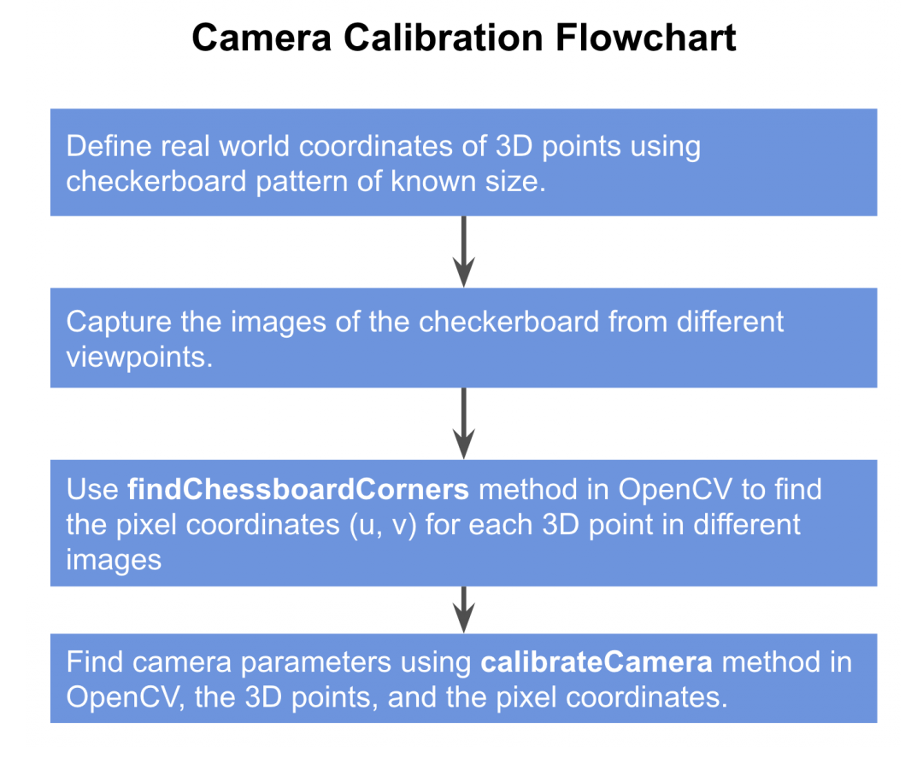
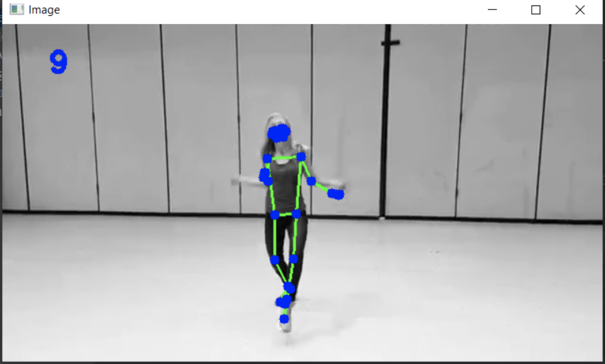

# Camera calibration and 3D Reconstruction

[https://docs.opencv.org/4.5.0/d6/d55/tutorial_table_of_content_calib3d.html](https://docs.opencv.org/4.5.0/d6/d55/tutorial_table_of_content_calib3d.html)

Camera calibration allows you to use two cameras to perform depth estimation through epipolar geometry. Its implementation and practical usage is still quite hacky, so you might prefer using a builtin stereo camera directly instead of a DIY version.

Also, OpenCV has its takes on Pose estimation, but its usage is also quite tedious.

Understanding theory is the main goal of this section.

## Camera calibration

### Theory


[https://docs.opencv.org/3.4.15/dc/dbb/tutorial_py_calibration.html](https://docs.opencv.org/3.4.15/dc/dbb/tutorial_py_calibration.html)

Calibrate both cameras once, and store calibration parameters for depth estimation. If the geometry between cameras change, you need to perform calibration again.

2 kinds of parameters:
1. internal: focal length, optical center, radial distortion coefficients of the lens
2. external: orientation (rotation + translation) of camera wrt some world coordinates system


Coordinates linked by
    
$\begin{bmatrix} X_c \\ Y_c \\ Z_c \end{bmatrix}=R\begin{bmatrix} X_w \\ Y_w \\ Z_w \end{bmatrix}+t$
    
this can also be expressed as
    
$\begin{bmatrix} X_c \\ Y_c \\ Z_c\end{bmatrix} = [R|t] \begin{bmatrix} X_w \\ Y_w \\ Z_w \\ 1\end{bmatrix}$
    
The 3×1 translation vector is appended as a column at the end of the 3×3 rotation matrix to obtain a 3×4 matrix called the **Extrinsic Matrix**.
    

**Homogeneous coordinates**
    
In homogenous coordinate $(X,Y,Z,W)$ is the same as the point $(X/W,Y/W,Z/W)$ in cartesian coordinates

It allow us to represent infinite quantities using finite numbers, when $W=0$
    


Projection of a P point:
    
$u=X_c\frac{f}{Z_c} \\
v=Y_c\frac{f}{Z_c}$
    
- However, pixels in image sensor may not be square, so we distinguish $f_x$ and $f_y$ (usually the same though)
- Optical center may not match the center of the image coordinate system, $c_x, c_y$
- $\gamma$ is the skew between axis (usually 0)

**The intrinsic matrix K** is

$\begin{bmatrix} u' \\v'\\w'\end{bmatrix} = \begin{bmatrix} f_x & \gamma &c_x \\ 0 & f_y  & c_y \\ 0 & 0 & 1 \end{bmatrix}
\begin{bmatrix} X_c \\ Y_c \\ Z_c \end{bmatrix}$

$u' = \frac{u}{w'} \\ v' = \frac{v}{w'}$

Goal of camera calibration: find **R**, **t** and **K**

$\begin{bmatrix} u' \\ v' \\ w' \end{bmatrix}= K.R|t \begin{bmatrix} X_w \\ Y_w \\ Z_w \\ 1\end{bmatrix}$


### Calibration process
    

    
**Step 1: define real world coords**
    


The world coordinates is attached to the checkerboard. Since all the corner lie on a plan, we can arbitrarily choose $Z_w=0$ for each point

Since corners are equally spaced, the $(X_w,Y_w)$ of each point can be found easily from the chosen origin.
    
**Step 2: capture multiple images of the checkerboard from different viewpoints**
    

    
**Step 3: Find 2D coordinates of checkerboard**
    
We now have multiple images of the checkerboard. We also know the 3D location of points on the checkerboard in the world coordinates.
    
3.a. Find checkerboard corners
    
```python
#retval, corners = cv2.findChessboardCorners(image, patternSize, flags)
ret, corners = cv2.findChessboardCorners(
    gray,
    (6, 9),
    cv2.CALIB_CB_ADAPTIVE_THRESH + cv2.CALIB_CB_FAST_CHECK + cv2.CALIB_CB_NORMALIZE_IMAGE
)
```
    
3.b. Refine checkerboard corners
    
Takes in the original image, and the location of corners, and looks for the best corner location inside a small neighborhood of the original location.

The algorithm is iterative in nature and therefore we need to specify the termination criteria

```python
#cv2.cornerSubPix(image, corners, winSize, zeroZone, criteria)
criteria = (cv2.TERM_CRITERIA_EPS + cv2.TERM_CRITERIA_MAX_ITER, 30, 0.001)
corners2 = cv2.cornerSubPix(gray, corners, (11, 11), (-1, -1), criteria)
```
    


    

**Step 4: Calibrate camera**
    
```python
objp = np.zeros((1, CHECKERBOARD[0] * CHECKERBOARD[1], 3), np.float32)
objp[0,:,:2] = np.mgrid[0:CHECKERBOARD[0], 0:CHECKERBOARD[1]].T.reshape(-1, 2)
objectPoints = [objp]

imagePoints = [corners2]

retval, cameraMatrix, distCoeffs, rvecs, tvecs = cv2.calibrateCamera(
    objectPoints, imagePoints, gray.shape[::-1], None, None)
)
```

What `calibrateCamera` performs:

- Computes the linear intrinsic parameters and considers the non-linear ones to zero.
- Estimates the initial camera pose (extrinsics) in function of the approximated intrinsics. This is done using `cv::solvePnP(...)`.
- Performs the Levenberg-Marquardt optimization algorithm to minimize the re-projection error between the detected 2D image points and 2D projections of the 3D object points. This is done using `cv::projectPoints(...)`.


**Step 5: Undistortion**
    
    
<details><summary>Motivation</summary>

- Radial factor
    
    For an undistorted pixel point at (x,y) coordinates, its position on the distorted image will be (x_distorted, y_distorted)
    
    The presence of the radial distortion manifests in form of the "barrel" or "fish-eye" effect.
    
    $x_{distorted}=x(1+k_1r^2+k_2r^4+k_3r^6)$
    
    $y_{distorted}=y(1+k_1r^2+k_2r^4+k_3r^6)$
    

- Tangent factor
    
    Tangential distortion occurs because the image taking lenses are not perfectly parallel to the imaging plane
    
    $x_{distorted}=x+[2p_1xy+p_2(r^2+2x^2)]$
    
    $y_{distorted}=y+[p_1(r^2+2y^2)+2p_2xy]$
    
- $distortion\_coefficients=(k_1,k_2,p_1,p_2,k_3)$
- Now for the unit conversion we use the following formula:
    
    
    
    $f_x,f_y$ are camera focal lengths and $c_x,c_y$ are the optical centers expressed in pixels coordinates
    

- Undistort


        
</details>

    
`getOptimalNewCameraMatrix` to refine the intrinsic matrix based on a scaling parameter 0 < alpha < 1
- If alpha = 0, it effectively increases the focal length to have a rectangular undistorted image where all pixels correspond to a pixel in the original. You lose data from the periphery, but you don't have any padded pixels without valid data
- If alpha = 1, all source pixels are undistorted, which can lead to a non-rectangular image region - visible in the black pincushioning. Because the image has to be rectangular in memory, the gaps are padded with black pixels


alpha = 0 (left) and alpha = 1 (right)
        
    
Two ways of undistort:

1. [cv.undistort](https://docs.opencv.org/3.4.15/da/d54/group__imgproc__transform.html#ga69f2545a8b62a6b0fc2ee060dc30559d)
    
```python
newcameramtx, roi = cv2.getOptimalNewCameraMatrix(mtx, dist, (w, h), 1, (w, h))
image = cv2.undistort(image, mtx, dist, None, newcameramtx)

x, y, w, h = roi
image = image[y:y + h, x:x + w]
```
    
2. [cv.initUndistortRectifyMap](https://docs.opencv.org/3.4.15/da/d54/group__imgproc__transform.html#ga7dfb72c9cf9780a347fbe3d1c47e5d5a) and [cv.remap](https://docs.opencv.org/3.4.15/da/d54/group__imgproc__transform.html#gab75ef31ce5cdfb5c44b6da5f3b908ea4)
            

```python
newcameramtx, roi = cv2.getOptimalNewCameraMatrix(mtx, dist, (w, h), 1, (w, h))
mapx, mapy = cv2.initUndistortRectifyMap(mtx, dist, None, newcameramtx, dim, 5)
image = cv2.remap(image, mapx, mapy, cv2.INTER_LINEAR)

x, y, w, h = roi
image = image[y:y + h, x:x + w]
```
            

**Step 6. Check: Re-projection Error**
    
```python
mean_error = 0
for i in range(len(objpoints)):
    imgpoints2, _ = cv.projectPoints(objpoints[i], rvecs[i], tvecs[i], mtx, dist)
    error = cv.norm(imgpoints[i], imgpoints2, cv.NORM_L2)/len(imgpoints2)
    mean_error += error
print( "total error: {}".format(mean_error/len(objpoints)) )
```
    
<details><summary>full script</summary>
    
```python
import cv2
from tqdm import tqdm
import numpy as np

def main():

    # Set the path to the images captured by the left and right cameras
    pathL = "./data/checkerStereoL/"
    pathR = "./data/checkerStereoR/"

    # Termination criteria for refining the detected corners
    criteria = (cv2.TERM_CRITERIA_EPS + cv2.TERM_CRITERIA_MAX_ITER, 30, 0.001)
    objp = np.zeros((9 * 6, 3), np.float32)
    objp[:, :2] = np.mgrid[0:9, 0:6].T.reshape(-1, 2)

    img_ptsL = []
    img_ptsR = []
    obj_pts = []

    for i in tqdm(range(1, 11)):
        imgL = cv2.imread(pathL + "img%d.png" % i)
        imgR = cv2.imread(pathR + "img%d.png" % i)
        imgL_gray = cv2.imread(pathL + "img%d.png" % i, 0)
        imgR_gray = cv2.imread(pathR + "img%d.png" % i, 0)

        outputL = imgL.copy()
        outputR = imgR.copy()

        retR, cornersR = cv2.findChessboardCorners(outputR, (9, 6), None)
        retL, cornersL = cv2.findChessboardCorners(outputL, (9, 6), None)

        if retR and retL:
            obj_pts.append(objp)

            cv2.cornerSubPix(imgR_gray, cornersR, (11, 11), (-1, -1), criteria)
            cv2.cornerSubPix(imgL_gray, cornersL, (11, 11), (-1, -1), criteria)

            cv2.drawChessboardCorners(outputR, (9, 6), cornersR, retR)
            cv2.drawChessboardCorners(outputL, (9, 6), cornersL, retL)

            cv2.imshow("cornersR", outputR)
            cv2.imshow("cornersL", outputL)
            cv2.waitKey(0)

            img_ptsL.append(cornersL)
            img_ptsR.append(cornersR)

    ### Calibrating left camera ###
    retL, mtxL, distL, rvecsL, tvecsL = cv2.calibrateCamera(
        obj_pts, img_ptsL, imgL_gray.shape[::-1], None, None
    )
    hL, wL = imgL_gray.shape[:2]
    new_mtxL, roiL = cv2.getOptimalNewCameraMatrix(mtxL, distL, (wL, hL), 1, (wL, hL))

    ### Calibrating right camera ###
    retR, mtxR, distR, rvecsR, tvecsR = cv2.calibrateCamera(
        obj_pts, img_ptsR, imgR_gray.shape[::-1], None, None
    )
    hR, wR = imgR_gray.shape[:2]
    new_mtxR, roiR = cv2.getOptimalNewCameraMatrix(mtxR, distR, (wR, hR), 1, (wR, hR))

    ### Stereo Calibrate ###
    flags = 0
    flags |= cv2.CALIB_FIX_INTRINSIC
    criteria_stereo = (cv2.TERM_CRITERIA_EPS + cv2.TERM_CRITERIA_MAX_ITER, 30, 0.001)
    # This step is performed to transformation between the two cameras and calculate Essential and Fundamenatl matrix
    retS, new_mtxL, distL, new_mtxR, distR, Rot, Trns, Emat, Fmat = cv2.stereoCalibrate(
        obj_pts,
        img_ptsL,
        img_ptsR,
        new_mtxL,
        distL,
        new_mtxR,
        distR,
        imgL_gray.shape[::-1],
        criteria_stereo,
        flags,
    )

    ### Stereo Rectify ###
    rectify_scale = 1
    rect_l, rect_r, proj_mat_l, proj_mat_r, Q, roiL, roiR = cv2.stereoRectify(
        new_mtxL,
        distL,
        new_mtxR,
        distR,
        imgL_gray.shape[::-1],
        Rot,
        Trns,
        rectify_scale,
        (0, 0),
    )

    ### Undistord rectified stereo image ###
    Left_Stereo_Map = cv2.initUndistortRectifyMap(
        new_mtxL, distL, rect_l, proj_mat_l, imgL_gray.shape[::-1], cv2.CV_16SC2
    )
    Right_Stereo_Map = cv2.initUndistortRectifyMap(
        new_mtxR, distR, rect_r, proj_mat_r, imgR_gray.shape[::-1], cv2.CV_16SC2
    )

    print("Saving parameters ......")
    cv_file = cv2.FileStorage("data/improved_params2.xml", cv2.FILE_STORAGE_WRITE)
    cv_file.write("Left_Stereo_Map_x", Left_Stereo_Map[0])
    cv_file.write("Left_Stereo_Map_y", Left_Stereo_Map[1])
    cv_file.write("Right_Stereo_Map_x", Right_Stereo_Map[0])
    cv_file.write("Right_Stereo_Map_y", Right_Stereo_Map[1])
    cv_file.write("Q", Q)
    cv_file.release()

if __name__ == "__main__":
    main()%
```
    
</details>


## Focus on Perspective n Points (used by calibrateCamera)

[https://learnopencv.com/head-pose-estimation-using-opencv-and-dlib/](https://learnopencv.com/head-pose-estimation-using-opencv-and-dlib/)

- The goal of Perspective-n-Point is to find the pose of an object when
    1. we have a calibrated camera
    2. we know the locations of n 3D points on the object and the corresponding 2D projections in the image
    
    
    

- Estimating the pose is finding 6 degrees of freedom (3 for translation + 3 for rotation)
    
    
    
- We need
    1. **2D coordinates of a few points**
        
        Dlib’s [facial landmark detector](https://learnopencv.com/facial-landmark-detection/) provides us with many points to choose from
        
    2. **3D locations of the same points**
        - You just need the 3D locations of a few points in some arbitrary reference frame (called **World Coordinates)**
            1. Tip of the nose : ( 0.0, 0.0, 0.0)
            2. Chin : ( 0.0, -330.0, -65.0)
        
- *Direct Linear Transform* is used to solve extrinsic matrix, and can be used anytime when the equation is almost linear but is off by an unknown scale.
- However, DLT solution does not minimize the correct objective function. Ideally, we want to minimize the **reprojection error.**
- When the pose estimate is incorrect, we can calculate a **re-projection error** measure — the sum of squared distances between the projected 3D points and 2D facial feature points.
- [Levenberg-Marquardt](https://en.wikipedia.org/wiki/Levenberg%E2%80%93Marquardt_algorithm) optimization allows to iteratively change the values of $R$ and $t$ so that the reprojection error decreases. LM is often used for non linear least square problems.

- [**cv::solvePnPRansac**](https://docs.opencv.org/4.5.0/d9/d0c/group__calib3d.html#ga50620f0e26e02caa2e9adc07b5fbf24e) instead of [**cv::solvePnP**](https://docs.opencv.org/4.5.0/d9/d0c/group__calib3d.html#ga549c2075fac14829ff4a58bc931c033d) because after the matching not all the found correspondences are correct (outliers)
    - Ransac is an outlier detection method that fits linear models to several random samplings of the data and returning the model that has the best fit to a subset of the data.
        1. Select a random subset of the data
        2. A model is fitted to the set of hypothetical inliers
        3. All other data are then tested against the fitted model.
        4. The estimated model is reasonably good if sufficiently many points have been classified as part of the consensus set
        5. Repeat
    
    
    

- full script
    
    ```cpp
    #!/usr/bin/env python
    
    import cv2
    import numpy as np
    
    # Read Image
    im = cv2.imread("headPose.jpg");
    size = im.shape
    
    #2D image points. If you change the image, you need to change vector
    image_points = np.array([
                                (359, 391),     # Nose tip
                                (399, 561),     # Chin
                                (337, 297),     # Left eye left corner
                                (513, 301),     # Right eye right corne
                                (345, 465),     # Left Mouth corner
                                (453, 469)      # Right mouth corner
                            ], dtype="double")
    
    # 3D model points.
    model_points = np.array([
                                (0.0, 0.0, 0.0),             # Nose tip
                                (0.0, -330.0, -65.0),        # Chin
                                (-225.0, 170.0, -135.0),     # Left eye left corner
                                (225.0, 170.0, -135.0),      # Right eye right corne
                                (-150.0, -150.0, -125.0),    # Left Mouth corner
                                (150.0, -150.0, -125.0)      # Right mouth corner
    
                            ])
    
    # Camera internals
    
    focal_length = size[1]
    center = (size[1]/2, size[0]/2)
    camera_matrix = np.array(
                             [[focal_length, 0, center[0]],
                             [0, focal_length, center[1]],
                             [0, 0, 1]], dtype = "double"
                             )
    
    print "Camera Matrix :\n {0}".format(camera_matrix)
    
    dist_coeffs = np.zeros((4,1)) # Assuming no lens distortion
    (success, rotation_vector, translation_vector) = cv2.solvePnP(model_points, image_points, camera_matrix, dist_coeffs, flags=cv2.CV_ITERATIVE)
    
    print "Rotation Vector:\n {0}".format(rotation_vector)
    print "Translation Vector:\n {0}".format(translation_vector)
    
    # Project a 3D point (0, 0, 1000.0) onto the image plane.
    # We use this to draw a line sticking out of the nose
    
    (nose_end_point2D, jacobian) = cv2.projectPoints(np.array([(0.0, 0.0, 1000.0)]), rotation_vector, translation_vector, camera_matrix, dist_coeffs)
    
    for p in image_points:
        cv2.circle(im, (int(p[0]), int(p[1])), 3, (0,0,255), -1)
    
    p1 = ( int(image_points[0][0]), int(image_points[0][1]))
    p2 = ( int(nose_end_point2D[0][0][0]), int(nose_end_point2D[0][0][1]))
    
    cv2.line(im, p1, p2, (255,0,0), 2)
    
    # Display image
    cv2.imshow("Output", im)
    cv2.waitKey(0)
    ```
    


## Epipolar Geometry

[https://docs.opencv.org/3.4.15/da/de9/tutorial_py_epipolar_geometry.html](https://docs.opencv.org/3.4.15/da/de9/tutorial_py_epipolar_geometry.html)

[https://learnopencv.com/introduction-to-epipolar-geometry-and-stereo-vision/](https://learnopencv.com/introduction-to-epipolar-geometry-and-stereo-vision/)

[https://web.stanford.edu/class/cs231a/course_notes/03-epipolar-geometry.pdf](https://web.stanford.edu/class/cs231a/course_notes/03-epipolar-geometry.pdf)


- The projection of the different points on OX form a line on right plane (line l′). We call it **epiline** corresponding to the point
- Similarly all points will have its corresponding epilines in the other image. The plane XOO′ is called **Epipolar Plane**.
- O and O′ are the camera centers. Projection of right camera O′ is seen on the left image at the point, e. It is called the **epipole**
- All the epilines pass through its epipole. So to find the location of epipole, we can find many epilines and find their intersection point.
- So in this session, we focus on finding epipolar lines and epipoles


- But to find epipolar lines, we need two more ingredients, **Fundamental Matrix (F)** and **Essential Matrix (E)**.
- Essential Matrix contains the information about translation and rotation, which describe the location of the second camera relative to the first in global coordinates
- Fundamental Matrix contains the same information as Essential Matrix in addition to the information about the intrinsics of both cameras so that we can relate the two cameras in pixel coordinates
- Fundamental Matrix F, maps a point in one image to a line (epiline) in the other image
- If we are using rectified images and normalize the point by dividing by the focal lengths, F=E
- A minimum of 8 such points are required to find the fundamental matrix (while using 8-point algorithm). More points are preferred and use RANSAC to get a more robust result.

- full script
    
    ```python
    # find the keypoints and descriptors with SIFT
    sift = cv.SIFT_create()
    kp1, des1 = sift.detectAndCompute(img1, None)
    kp2, des2 = sift.detectAndCompute(img2, None)
    
    # FLANN parameters
    FLANN_INDEX_KDTREE = 1
    index_params = dict(algorithm=FLANN_INDEX_KDTREE, trees=5)
    search_params = dict(checks=50)
    flann = cv.FlannBasedMatcher(index_params,search_params)
    matches = flann.knnMatch(des1 , des2, k=2)
    
    pts1 = []
    pts2 = []
    # ratio test as per Lowe's paper
    for i,(m,n) in enumerate(matches):
        if m.distance < 0.8*n.distance:
            pts2.append(kp2[m.trainIdx].pt)
            pts1.append(kp1[m.queryIdx].pt)
    
    # Now we have the list of best matches from both the images.
    # Let's find the Fundamental Matrix.
    pts1 = np.int32(pts1)
    pts2 = np.int32(pts2)
    F, mask = cv.findFundamentalMat(pts1, pts2, cv.FM_LMEDS)
    # We select only inlier points
    pts1 = pts1[mask.ravel()==1]
    pts2 = pts2[mask.ravel()==1]
    
    # Find epilines corresponding to points in right image (second image) and
    # drawing its lines on left image
    lines1 = cv.computeCorrespondEpilines(pts2.reshape(-1,1,2), 2, F)
    lines1 = lines1.reshape(-1,3)
    img5, _ = drawlines(img1, img2, lines1, pts1, pts2)
    
    # Find epilines corresponding to points in left image (first image) and
    # drawing its lines on right image
    lines2 = cv.computeCorrespondEpilines(pts1.reshape(-1,1,2), 1, F)
    lines2 = lines2.reshape(-1,3)
    img3, _ = drawlines(img2, img1, lines2, pts2, pts1)
    ```
    


You can see in the left image that all epilines are converging at a point outside the image at right side. That meeting point is the epipole.

For better results, images with good resolution and many non-planar points should be used.

[https://answers.opencv.org/question/18125/epilines-not-correct/](https://answers.opencv.org/question/18125/epilines-not-correct/)

- The problem with this particular scene is that almost all matched points lie on the same plane in 3d space. This is a known degenerate case for fundamental matrix estimation. Take a look [these slides](https://www.dropbox.com/s/gpx63bam1i5frdz/geometry-for-computer-vision-lecture-5.pdf?dl=0](https://www.dropbox.com/s/gpx63bam1i5frdz/geometry-for-computer-vision-lecture-5.pdf) for explanation. I tried to increase 2nd nearest neighbor threshold in this code from 0.7 to 0.8:
- In general fundamental matrix estimation is very sensitive to quality of matches and number of outliers, since opencv uses 8-point algorithm for model estimation. Try to work with higher resolution images with rich textures and non-planar scenes.

[https://answers.opencv.org/question/17912/location-of-epipole/](https://answers.opencv.org/question/17912/location-of-epipole/)


[https://learnopencv.com/introduction-to-epipolar-geometry-and-stereo-vision/](https://learnopencv.com/introduction-to-epipolar-geometry-and-stereo-vision/)

- **equivalent** vectors, which are related by just a scaling constant, form a class of **homogeneous vectors**
- The set of all equivalent classes, represented by (a,b,c) forms the **projective space.**
- We use the homogeneous representation of homogeneous coordinates to define elements like points, lines, planes, etc., in projective space.
- We use the rules of **projective geometry** to perform any transformations on these elements in the projective space.


- Camera calibration gives us the projection matrix $P_1$ for $C_1$ and $P_2$ for $C_2$
- We define the $[C_1,x_1,X)$ ray as $X(k)=P_1^{-1}x_1+kC_1$, where $P^{-1}$ is the pseudo inverse of $P$
- $k$ is a scaling parameter as we do not know the actual distance C1 → X
- Need to find epipolar line $L_2$ to reduce the search space for a pixel in $i_2$ corresponding to pixel $x_1$ in $i_1$
- Hence to calculate $L_2$, we first find two points on ray $R_1$, and project them in image $i_2$ using $P_2$

- Let's use $C_1$ and $P_1^{-1}x_1\;(k=0)$: it yields $P_2C_1$ (the epipole $e_2$) and $P_2P_1^{-1}x_1$
- In projective geometry, a line can be define with the cross product of two points
    
    $L_2=e_2P_2P_1^{-1}x_1=Fx_1$ with $F$ fundamental matrix
    
- In projective geometry, if a point x lies on a line L:
    
    $x^TL=0$ 
    
    Thus, as $x_2$ lies on epiline
    
    $x_2^TFx_1=0$
    
- This is a necessary condition for the two points x1 and x2 to be corresponding points, and it is also a form of epipolar constraint

- Let's use the F matrix to find epilines:
    1. We use feature matching methods like ORB or SIFT to find matching points to solve the above equation for F.
    2. `findFundamentalMat()` ******provides implementations of 7-Point Algorithm, 8-Point Algorithm, RANSAC algorithm, and LMedS Algorithm, to calculate F using matched feature points.
    

## Depthmap

[https://docs.opencv.org/4.5.4/dd/d53/tutorial_py_depthmap.html](https://docs.opencv.org/4.5.4/dd/d53/tutorial_py_depthmap.html)

[https://learnopencv.com/making-a-low-cost-stereo-camera-using-opencv/#performing-stereo-calibration-with-fixed-intrinsic-parameters](https://learnopencv.com/making-a-low-cost-stereo-camera-using-opencv/#performing-stereo-calibration-with-fixed-intrinsic-parameters)

- We simplify the dense matching problem even more with stereo disparity
    
    
    
    - All the epipolar lines have to be parallel and have the same vertical coordinate left and right
    - We still have to perform triangulation for each point. We use **stereo disparity.**
    


- $disparity= x' – x = Bf/Z$, where $B$ is the baseline, $f$ the focal length
- `StereoSGBM`
    
    
    ```python
    # Setting parameters for StereoSGBM algorithm
    
    # the offset from the x-position of the left pixel at which to begin searching.
    minDisparity = 0
    
    # How many pixels to slide the window over.
    # The larger it is, the larger the range of visible depths, 
    # but more computation is required.
    numDisparities = 64
    
    blockSize = 8
    disp12MaxDiff = 1
    
    # speckle_size is the number of pixels below which a disparity blob
    # is dismissed as "speckle." 
    # speckle_range controls how close in value disparities must be 
    # to be considered part of the same blob.
    speckleWindowSize = 10
    speckleRange = 8
    
    # filters out areas that don't have enough texture for reliable matching
    # texture_threshold = ?
    
    # Another post-filtering step. 
    # If the best matching disparity is not sufficiently better than 
    # every other disparity in the search range, the pixel is filtered out.
    # You can try tweaking this if texture_threshold and the speckle filtering
    # are still letting through spurious matches.
    uniquenessRatio = 10
    
    # Creating an object of StereoSGBM algorithm
    stereo = cv2.StereoSGBM_create(
    		minDisparity=minDisparity,
        numDisparities=numDisparities,
        blockSize=blockSize,
        disp12MaxDiff=disp12MaxDiff,
        uniquenessRatio=uniquenessRatio,
        speckleWindowSize=speckleWindowSize,
        speckleRange=speckleRange,
    )
    
    # Calculating disparith using the StereoSGBM algorithm
    disp = stereo.compute(imgL, imgR).astype(np.float32)
    disp = cv2.normalize(disp, 0, 255, cv2.NORM_MINMAX)
    ```
    
    
    
- full script, create mesh 3D
    
    ```python
    import numpy as np
    import cv2 as cv
    
    ply_header = '''ply
    format ascii 1.0
    element vertex %(vert_num)d
    property float x
    property float y
    property float z
    property uchar red
    property uchar green
    property uchar blue
    end_header
    '''
    
    def write_ply(fn, verts, colors):
        verts = verts.reshape(-1, 3)
        colors = colors.reshape(-1, 3)
        verts = np.hstack([verts, colors])
        with open(fn, 'wb') as f:
            f.write((ply_header % dict(vert_num=len(verts))).encode('utf-8'))
            np.savetxt(f, verts, fmt='%f %f %f %d %d %d ')
    
    def main():
        print('loading images...')
        imgL = cv.pyrDown(cv.imread('aloeL.jpeg'))  # downscale images for faster processing
        imgR = cv.pyrDown(cv.imread('aloeR.jpeg'))
    
        # disparity range is tuned for 'aloe' image pair
        window_size = 3
        min_disp = 16
        num_disp = 112-min_disp
        stereo = cv.StereoSGBM_create(minDisparity = min_disp,
            numDisparities = num_disp,
            blockSize = 16,
            P1 = 8*3*window_size**2,
            P2 = 32*3*window_size**2,
            disp12MaxDiff = 1,
            uniquenessRatio = 10,
            speckleWindowSize = 100,
            speckleRange = 32
        )
    
        print('computing disparity...')
        disp = stereo.compute(imgL, imgR).astype(np.float32) / 16.0
    
        print('generating 3d point cloud...',)
        h, w = imgL.shape[:2]
        f = 0.8*w                          # guess for focal length
        Q = np.float32([[1, 0, 0, -0.5*w],
                        [0,-1, 0,  0.5*h], # turn points 180 deg around x-axis,
                        [0, 0, 0,     -f], # so that y-axis looks up
                        [0, 0, 1,      0]])
        points = cv.reprojectImageTo3D(disp, Q)
        colors = cv.cvtColor(imgL, cv.COLOR_BGR2RGB)
        mask = disp > disp.min()
        out_points = points[mask]
        out_colors = colors[mask]
        out_fn = 'out.ply'
        write_ply(out_fn, out_points, out_colors)
        print('%s saved' % out_fn)
    
        cv.imshow('left', imgL)
        cv.imshow('disparity', (disp-min_disp)/num_disp)
        cv.waitKey()
    
        print('Done')
    
    if __name__ == '__main__':
        print(__doc__)
        main()
        cv.destroyAllWindows()
    ```
    

### Q&A

[http://wiki.ros.org/stereo_image_proc/Tutorials/ChoosingGoodStereoParameters](http://wiki.ros.org/stereo_image_proc/Tutorials/ChoosingGoodStereoParameters)

[https://stackoverflow.com/questions/42737732/how-to-change-the-attributes-of-cv2-stereobm-create-for-depth-map-in-opencv-pyth](https://stackoverflow.com/questions/42737732/how-to-change-the-attributes-of-cv2-stereobm-create-for-depth-map-in-opencv-pyth)

### Full API Documentation

[https://docs.opencv.org/2.4/modules/calib3d/doc/camera_calibration_and_3d_reconstruction.html](https://docs.opencv.org/2.4/modules/calib3d/doc/camera_calibration_and_3d_reconstruction.html)

### Consistent video depth estimation

[https://www.youtube.com/watch?v=5Tia2oblJAg&ab_channel=JohannesKopf](https://www.youtube.com/watch?v=5Tia2oblJAg&ab_channel=JohannesKopf)

## Pose Estimation using OpenCV

[https://docs.opencv.org/4.5.0/dc/d2c/tutorial_real_time_pose.html](https://docs.opencv.org/4.5.0/dc/d2c/tutorial_real_time_pose.html)

### 1. **Model registration**

Output

- Create your own textured 3D model

Inputs

- The application needs an input image of the object to be registered and its 3D mesh.
- We have also to provide the intrinsic parameters of the camera with which the input image was taken.

Algo

- Starts up extracting the ORB features and descriptors from the input image
- Uses the mesh along with the [Möller–Trumbore intersection algorithm](http://http//en.wikipedia.org/wiki/M%C3%B6ller%E2%80%93Trumbore_intersection_algorithm/) to compute the 3D coordinates of the found features.
- Finally, the 3D points and the descriptors are stored in different lists in a file with YAML format which each row is a different point

### 2. **Model detection**

Inputs

- 3D textured model in YAML file

Algo

1. Detect and extract ORB features and descriptors from the scene
2. Matching between the scene descriptors and the model descriptor using [**cv::FlannBasedMatcher**](https://docs.opencv.org/4.5.0/dc/de2/classcv_1_1FlannBasedMatcher.html) and [**cv::flann::GenericIndex**](https://docs.opencv.org/4.5.0/db/d18/classcv_1_1flann_1_1GenericIndex.html)
    - match using *two Nearest Neighbour* the extracted descriptors with the given model descriptors
    - After the matches filtering we have to subtract the 2D and 3D correspondences from the found scene keypoints and our 3D model using the obtained *DMatches* vector
3. Compute `R` and `t` using [**cv::solvePnPRansac**](https://docs.opencv.org/4.5.0/d9/d0c/group__calib3d.html#ga50620f0e26e02caa2e9adc07b5fbf24e)
    - PnP algorithm in order to estimate the camera pose
    - [**cv::solvePnPRansac**](https://docs.opencv.org/4.5.0/d9/d0c/group__calib3d.html#ga50620f0e26e02caa2e9adc07b5fbf24e) instead of [**cv::solvePnP**](https://docs.opencv.org/4.5.0/d9/d0c/group__calib3d.html#ga549c2075fac14829ff4a58bc931c033d) because after the matching not all the found correspondences are correct (outliers)
    - Ransac is an outlier detection method that fits linear models to several random samplings of the data and returning the model that has the best fit to a subset of the data.
        1. Select a random subset of the data
        2. A model is fitted to the set of hypothetical inliers
        3. All other data are then tested against the fitted model.
        4. The estimated model is reasonably good if sufficiently many points have been classified as part of the consensus set
        5. Repeat
    
    
    
    [https://docs.opencv.org/4.5.0/dc/d2c/tutorial_real_time_pose.html](https://docs.opencv.org/4.5.0/dc/d2c/tutorial_real_time_pose.html)
    
4. Finally, a KalmanFilter is applied in order to reject bad poses.

## Pose estimation using Caffe

- Load Caffe pose estimation module
    
    ```python
    protoFile = "pose/mpi/pose_deploy_linevec_faster_4_stages.prototxt"
    weightsFile = "pose/mpi/pose_iter_160000.caffemodel"
    
    net = cv2.dnn.readNetFromCaffe(protoFile, weightsFile)
    ```
    

- Load input img into the model by converting into blob
    
    ```python
    inpBlob = cv2.dnn.blobFromImage(
    	frame, 1.0 / 255, (inWidth, inHeight), (0, 0, 0), swapRB=False, crop=False
    )
    net.setInput(inpBlob)
    ```
    

- Make prediction and parse keypoint
    
    ```python
    matrix_output = net.forward()
    ```
    
    1. The first dimension is the image ID (in case forward on multiple images)
    2. The second dimension indicates the index of a keypoint. 18 keypoint confidence Maps + 1 background + 19*2 Part Affinity Maps
    3. The third dimension is the height of the output map.
    4. The fourth dimension is the width of the output map.

```python
H = out.shape[2]
W = out.shape[3]

# Empty list to store the detected keypoints
points = []
for i in range(output.shape[1]):

    # confidence map of corresponding body's part.
    probMap = output[0, i, :, :]

    # Find global maxima of the probMap.
    minVal, prob, minLoc, point = cv2.minMaxLoc(probMap)

    # Scale the point to fit on the original image
    x = (frameWidth * point[0]) / W
    y = (frameHeight * point[1]) / H

    if prob > threshold:
        cv2.circle(frame, (int(x), int(y)), 15, (0, 255, 255), thickness=-1, lineType=cv.FILLED)
        cv2.putText(frame, "{}".format(i), (int(x), int(y)), cv2.FONT_HERSHEY_SIMPLEX, 1.4, (0, 0, 255), 3, lineType=cv2.LINE_AA)
        points.append((int(x), int(y)))
    else:
				points.append(None)

```


## Pose estimation using MediaPipe

```python
import mediapipe as mp

from mediapipe.solutions.pose import Pose
from mediapipe.solutions.drawing_utils import draw_landmarks

pose = Pose()
cap = cv2.VideoCapture('a.mp4')

pTime = 0

while True:
	success, img = cap.read()
	h, w, c = img.shape

	imgRGB = cv2.cvtColor(img, cv2.COLOR_BGR2RGB)
	results = pose.process(imgRGB)
	print(results.pose_landmarks)

	if results.pose_landmarks:
		draw_landmarks(img, results.pose_landmarks, mpPose.POSE_CONNECTIONS)
		
		for idx, lm in enumerate(results.pose_landmarks.landmark):
			print(idx, lm)

			cx, cy = int(lm.x*w), int(lm.y*h)
			cv2.circle(img, (cx, cy), 5, (255,0,0), cv2.FILLED)

			cTime = time.time()
			fps = 1/(cTime-pTime)
			pTime = cTime

			cv2.putText(img, str(int(fps)), (50,50), cv2.FONT_HERSHEY_SIMPLEX,1,(255,0,0), 3)
			cv2.imshow("Image", img)
```

