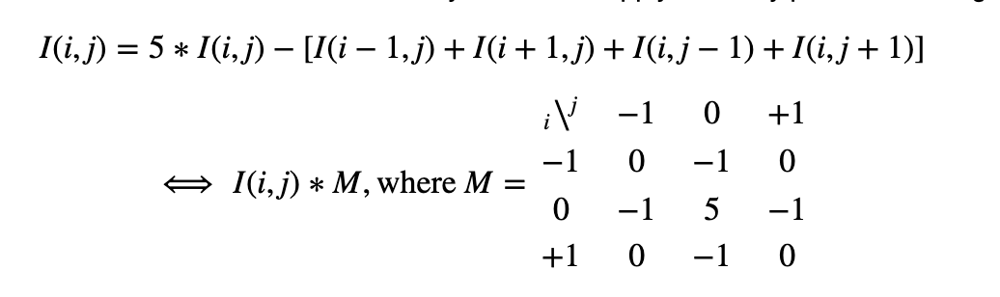
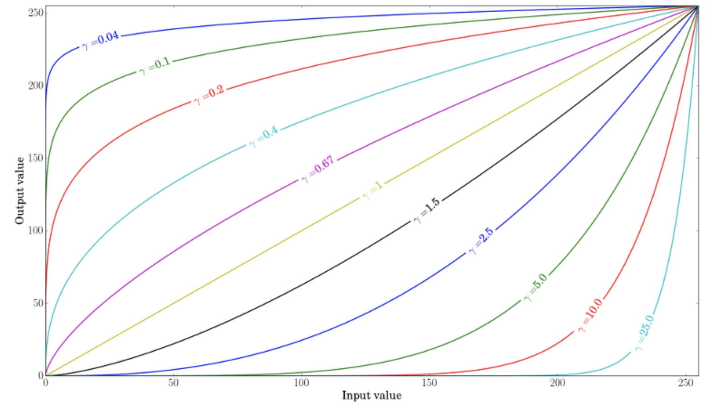
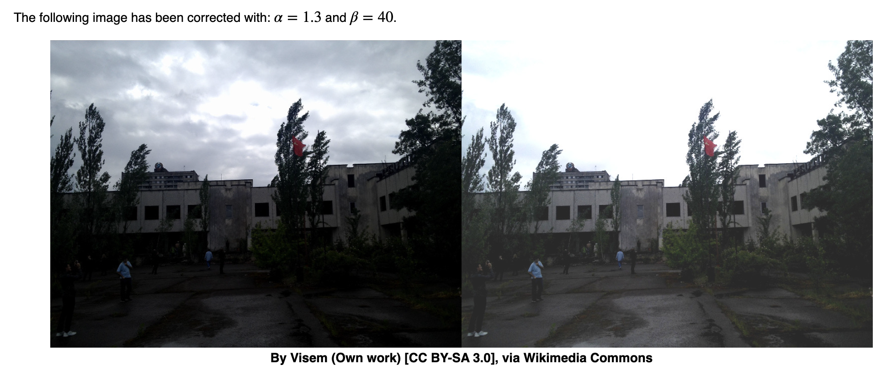
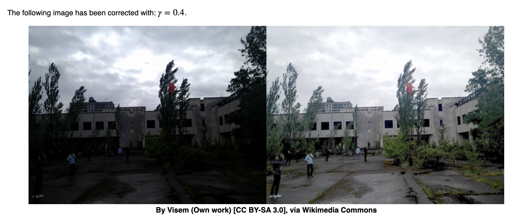
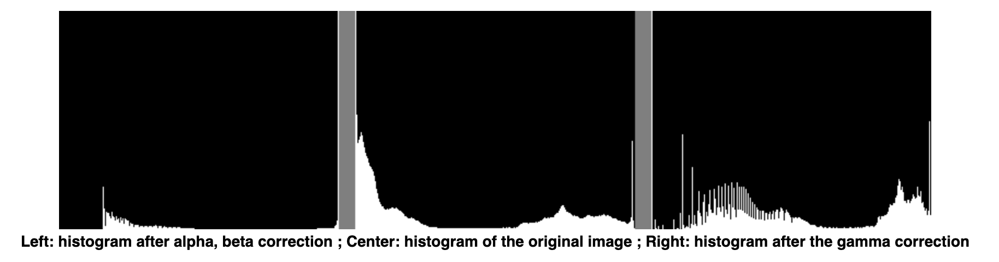

# Core module

This section details some of the key behind-the-scene concepts, that make OpenCV implementation possible.

**Mat object**

- Output image allocation for OpenCV functions is automatic (unless specified otherwise).
- You do not need to think about memory management with OpenCV's C++ interface.
- The assignment operator and the copy constructor only copies the header.
- The underlying matrix of an image may be copied using the [**cv::Mat::clone()**](https://docs.opencv.org/4.5.0/d3/d63/classcv_1_1Mat.html#adff2ea98da45eae0833e73582dd4a660) and [**cv::Mat::copyTo()**](https://docs.opencv.org/4.5.0/d3/d63/classcv_1_1Mat.html#a33fd5d125b4c302b0c9aa86980791a77) functions.

**Color systems**

- RGB is the most common as our eyes use something similar, however keep in mind that OpenCV standard display system composes colors using the BGR color space (red and blue channels are swapped places).
- The HSV and HLS decompose colors into their hue, saturation and value/luminance components, which is a more natural way for us to describe colors. You might, for example, dismiss the last component, making your algorithm less sensible to the light conditions of the input image.
- YCrCb is used by the popular JPEG image format.
- CIE L*a*b* is a perceptually uniform color space, which comes in handy if you need to measure the *distance* of a given color to another color.

**Mat mask operation**



- Fast method
    
    ```python
    dst1 = cv.filter2D(src, -1, kernel)
    ```
    

**I/O**

- Choose channel upon reading
    
    ```python
    img = cv.imread(filename, cv.IMREAD_GRAYSCALE)
    ```
    

**Blending 2 images**

- linear blend operator: $g(x)=(1−α)f_0(x)+αf_1(x)$
- By varying α from 0→1 this operator can be used to perform a temporal cross-dissolve between two images or videos

```python
dst = cv.addWeighted(src1, alpha, src2, beta, 0.0)
```

**Brightness and contrast adjustments**

- $g(i,j)=α⋅f(i,j)+β$
- Increasing β (bias) increases the brightness, increasing α increases saturation (gain)
- Gamma transformation: $O=(\frac{I}{255})^γ×255$



- When γ<1, the original dark regions will be brighter and the histogram will be shifted to the right whereas it will be the opposite with γ>1.







**Discrete Fourier Transform**

- $F(k,l)=∑_{i=0}^{N−1}∑_{j=0}^{N−1}f(i,j)e^{−i2π(ki/N+lj/N)}$
- $e^{ix}=cos(x)+isin(x)$
- Displaying this is possible either via a real image and a complex image or via a magnitude and a phase image.
- However, throughout the image processing algorithms only the magnitude image is interesting as this contains all the information we need about the images geometric structure
- $M=\sqrt{Re(DFT(I))^2+Im(DFT(I))^2}$