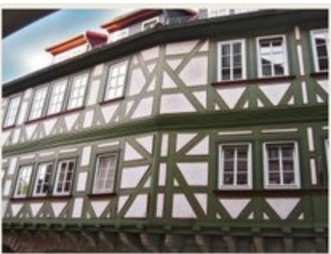
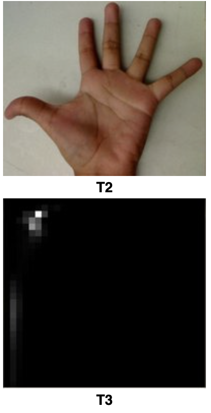
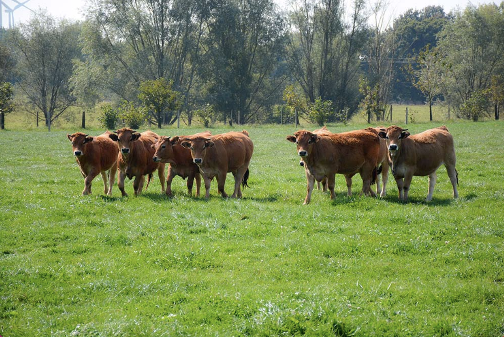
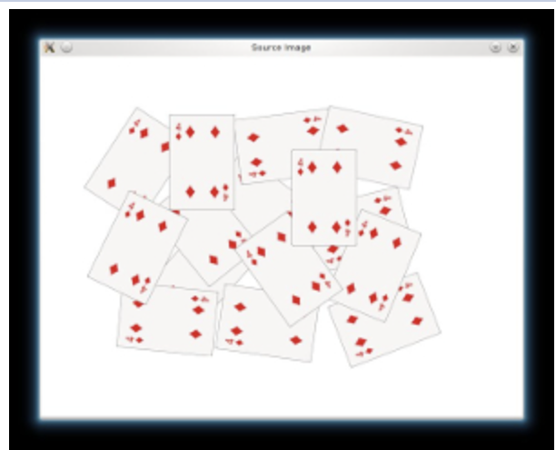
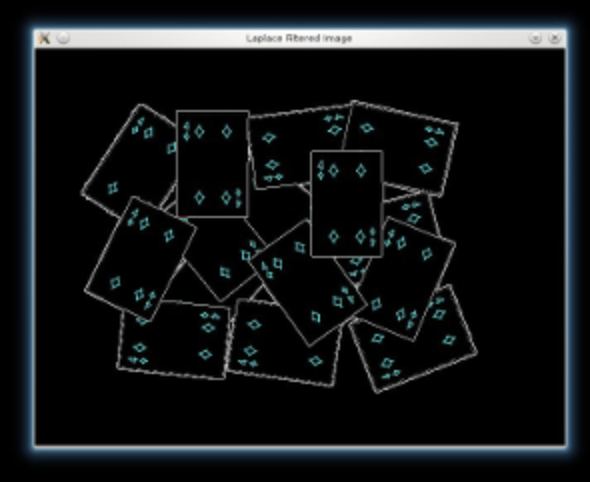

# Image processing

### Reading, viewing and saving

```python
import cv2 as cv

# read img
img = cv.imread("path_to_file")

# display img
cv.imshow("windows_name", img)
cv.waitKey(0) # wait infinitely until any key is pressed

# save img
cv.imwrite("filename.jpg", img)
```

### Eroding & Dilating


original


dilated


eroded

- dilatation: **$𝚍𝚜𝚝(x,y)=max_{(x′,y′):𝚎𝚕𝚎𝚖𝚎𝚗𝚝(x′,y′)≠0}𝚜𝚛𝚌(x+x′,y+y′)$**
- erosion: $𝚍𝚜𝚝(x,y)=min_{(x′,y′):𝚎𝚕𝚎𝚖𝚎𝚗𝚝(x′,y′)≠0}𝚜𝚛𝚌(x+x′,y+y′)$
    
    ```python
    element = cv.getStructuringElement(erosion_type, (2*erosion_size+1, 2*erosion_size+1), (erosion_size, erosion_size))
    erosion_dst = cv.erode(src, element)
    ```
    
    parameters of `getStructuringElement`:
    
    - shape: `cv.MORPH_RECT` , `cv.MORPH_CROSS`, `cv.MORPH_ELLIPSE`
    - ksize: size of the structuring element
    - anchor position within the element (default is center), only used for the cross shape
    

**Morphology transformation**

- **Opening**
Useful for removing small objects (it is assumed that the objects are bright on a dark foreground)
 $dst=open(src,element)=dilate(erode(src,element))$
    
    
    
- **Closing**
Useful to remove small holes (dark regions).
    
    $dst=close(src,element)=erode(dilate(src,element))$
    
    
    
- **Morphological gradiant**
It is useful for finding the outline of an object as can be seen below
    
    $dst=morph\,grad(src,element)=dilate(src,element)−erode(src,element)$
    
    
    
- **Blackhat
$dst=blackhat(src,element)=close(src,element)−src$**


- **Tophat**
    
    $dst=tophat(src,element)=src−open(src,element)$
    

### Hit or miss

- The Hit-or-Miss transformation is useful to find patterns in binary images.
- In particular, it finds those pixels whose neighbourhood matches the shape of a first structuring element B1 while not matching the shape of a second structuring element B2 at the same time
    1. Erode image A with structuring element B1
    2. Erode the complement of image A ( Ac) with structuring element B2
    3. AND results from step 1 and step 2.
    
    
    
    
    
    ```python
    kernel = np.array((
            [0, 1, 0],
            [1, -1, 1],
            [0, 1, 0]), dtype="int")
    output_image = cv.morphologyEx(input_image, cv.MORPH_HITMISS, kernel)
    ```
    

### Extracting h or v lines

- Opening images with h or v vectors
    
    ```python
    horizontalStructure = cv.getStructuringElement(cv.MORPH_RECT, (horizontal_size, 1))
    ```
    
    ```python
    verticalStructure = cv.getStructuringElement(cv.MORPH_RECT, (1, verticalsize))
    ```
    


### Image pyramids

- **Gaussian pyramid:** Used to downsample images
- **Laplacian pyramid:** Used to reconstruct an upsampled image from an image lower in the pyramid (with less resolution)


- To produce layer (i+1) in the Gaussian pyramid, we do the following:
    1. Convolve Gi with a Gaussian kernel
    
    
    
    1. Remove every even-numbered row and column.
- How to upsample the image instead?
    - First, upsize the image to twice the original in each dimension, with the new even rows and
    - Perform a convolution with the same kernel shown above (multiplied by 4) to approximate the values of the "missing pixels"

```python
src = cv.pyrUp(src, dstsize=(2 * cols, 2 * rows))
src = cv.pyrDown(src, dstsize=(cols // 2, rows // 2))
```

### Basic Thresholding Operations

- The simplest segmentation method
    
    $\begin{cases} 𝚖𝚊𝚡𝚅𝚊𝚕\;if\; 𝚜𝚛𝚌(x,y)>𝚝𝚑𝚛𝚎𝚜𝚑 \\ 0 \; o.w.\end{cases}$
    
```python
_, dst = cv.threshold(src_gray, threshold_value, max_binary_value, threshold_type )
```
    

### Thresholding operations using InRange

- Hue channel models the color type, it is very useful in image processing tasks that need to segment objects based on its color
- Variation of the saturation goes from unsaturated to represent shades of gray and fully saturated
- Value channel describes the brightness or the intensity of the color.
- HSV is useful since colors in the RGB colorspace are coded using the three channels, so it is more difficult to segment an object in the image based on its color.

```python
frame_HSV = cv.cvtColor(frame, cv.COLOR_BGR2HSV)
frame_threshold = cv.inRange(frame_HSV, (low_H, low_S, low_V), (high_H, high_S, high_V))
```


- Script to test in range with camera
    
    ```python
    from __future__ import print_function
    import cv2 as cv
    import argparse
    
    max_value = 255
    max_value_H = 360//2
    low_H = 0
    low_S = 0
    low_V = 0
    high_H = max_value_H
    high_S = max_value
    high_V = max_value
    window_capture_name = 'Video Capture'
    window_detection_name = 'Object Detection'
    low_H_name = 'Low H'
    low_S_name = 'Low S'
    low_V_name = 'Low V'
    high_H_name = 'High H'
    high_S_name = 'High S'
    high_V_name = 'High V'
    
    def on_low_H_thresh_trackbar(val):
        global low_H
        global high_H
        low_H = val
        print("low_h: ", val)
        low_H = min(high_H-1, low_H)
        cv.setTrackbarPos(low_H_name, window_detection_name, low_H)
    
    def on_high_H_thresh_trackbar(val):
        global low_H
        global high_H
        high_H = val
        print("high_h: ", val)
        high_H = max(high_H, low_H+1)
        cv.setTrackbarPos(high_H_name, window_detection_name, high_H)
    
    def on_low_S_thresh_trackbar(val):
        global low_S
        global high_S
        low_S = val
        print("low_S: ", val)
        low_S = min(high_S-1, low_S)
        cv.setTrackbarPos(low_S_name, window_detection_name, low_S)
    
    def on_high_S_thresh_trackbar(val):
        global low_S
        global high_S
        high_S = val
        print("high_S: ", val)
        high_S = max(high_S, low_S+1)
        cv.setTrackbarPos(high_S_name, window_detection_name, high_S)
    
    def on_low_V_thresh_trackbar(val):
        global low_V
        global high_V
        low_V = val
        print("low_V: ", val)
        low_V = min(high_V-1, low_V)
        cv.setTrackbarPos(low_V_name, window_detection_name, low_V)
    
    def on_high_V_thresh_trackbar(val):
        global low_V
        global high_V
        high_V = val
        print("high_V: ", val)
        high_V = max(high_V, low_V+1)
        cv.setTrackbarPos(high_V_name, window_detection_name, high_V)
    
    def main():
    		parser = argparse.ArgumentParser(description='Code for Thresholding Operations using inRange tutorial.')
    		parser.add_argument('--camera_id', help='Camera divide number.', default=0, type=int)
    		args = parser.parse_args()
    		
    		cap = cv.VideoCapture(args.camera)
    		
    		#cv.namedWindow(window_capture_name)
    		cv.namedWindow(window_detection_name)
    		cv.createTrackbar(low_H_name, window_detection_name , low_H, max_value_H, on_low_H_thresh_trackbar)
    		cv.createTrackbar(high_H_name, window_detection_name , high_H, max_value_H, on_high_H_thresh_trackbar)
    		cv.createTrackbar(low_S_name, window_detection_name , low_S, max_value, on_low_S_thresh_trackbar)
    		cv.createTrackbar(high_S_name, window_detection_name , high_S, max_value, on_high_S_thresh_trackbar)
    		cv.createTrackbar(low_V_name, window_detection_name , low_V, max_value, on_low_V_thresh_trackbar)
    		cv.createTrackbar(high_V_name, window_detection_name , high_V, max_value, on_high_V_thresh_trackbar)
    		
    		idx = 0
    		while True:
    		
    		    ret, frame = cap.read()
    		    if not ret:
    						break
            frame_HSV = cv.cvtColor(frame, cv.COLOR_BGR2HSV)
            frame_threshold = cv.inRange(frame_HSV, (low_H, low_S, low_V), (high_H, high_S, high_V))
            cv.imshow(window_capture_name, frame)
            cv.imshow(window_detection_name, frame_threshold)
    	
    		    key = cv.waitKey(30)
    		    if key == ord('q') or key == 27:
    		        break
    		
    
    if __name__ == "__main"__:
    		main()
    ```
    

### Sobel derivatives

- One of the most important convolutions is the computation of derivatives in an image (or an approximation to them)
- A method to detect edges in an image can be performed by locating pixel locations where the gradient is higher than its neighbors (or to generalize, higher than a threshold).
- The Sobel Operator combines Gaussian smoothing and differentiation.
    1. We calcul 2 derivatives
    a. Horizontal changes
        
        
        
        b. Vertical changes
        
        
        
    2. At each point of the image we calculate an approximation of the gradient in that point by combining both results above:
    $G=\sqrt{G^2_x+G^2_y}$
- When the size of the kernel is 3, the Sobel kernel shown above may produce noticeable inaccuracies (after all, Sobel is only an approximation of the derivative). OpenCV addresses this inaccuracy for kernels of size 3 by using the Scharr() function.


```python
grad_x = cv.Sobel(gray, ddepth, 1, 0, ksize=3, scale=scale, delta=delta, borderType=cv.BORDER_DEFAULT)
# Gradient-Y
# grad_y = cv.Scharr(gray,ddepth,0,1)

grad_y = cv.Sobel(gray, ddepth, 0, 1, ksize=3, scale=scale, delta=delta, borderType=cv.BORDER_DEFAULT)
  
abs_grad_x = cv.convertScaleAbs(grad_x)
abs_grad_y = cv.convertScaleAbs(grad_y)

grad = cv.addWeighted(abs_grad_x, 0.5, abs_grad_y, 0.5, 0)
```

### Laplace Operator

**Sobel** 


- Getting the first derivative of the intensity, we observed that an edge is characterized by a maximum


- You can observe that the second derivative is zero!
- So, we can also use this criterion to attempt to detect edges in an image. However, note that zeros will not only appear in edges (they can actually appear in other meaningless locations); this can be solved by applying filtering where needed.
    
$Laplace(f)=\frac{∂^2f}{∂^2x}+\frac{∂^2f}{∂^2y}$

```python
dst = cv.Laplacian(src_gray, ddepth, ksize=kernel_size)
```
    


- Trees and the silhouette of the cow are approximately well defined (except in areas in which the intensity are very similar, i.e. around the cow's head).
- The roof of the house behind the trees (right side) is notoriously marked. This is due to the fact that the contrast is higher in that region.

### Canny Edge Detector

- **Low error rate:** Meaning a good detection of only existent edges.
- **Good localization:** The distance between edge pixels detected and real edge pixels have to be minimized.
- **Minimal response:** Only one detector response per edge.
- Steps
    1. Filter out any noise. The Gaussian filter is used for this purpose
    2. Find the intensity gradient of the image. For this, we follow a procedure analogous to Sobel:
        1. Apply a pair of convolution masks (in x and y directions)
        2. Find the gradient strength and direction
            
            $\theta=arctan(\frac{G_y}{G_x})$
            
            The direction is rounded to one of four possible angles (namely 0, 45, 90 or 135)
            
    3. Non-maximum suppression is applied. This removes pixels that are not considered to be part of an edge. Hence, only thin lines (candidate edges) will remain.
    4. Hysteresis: The final step. Canny does use two thresholds (upper and lower):
        1. If a pixel gradient is higher than the upper threshold, the pixel is accepted as an edge
        2. If a pixel gradient value is below the lower threshold, then it is rejected.
        3. If the pixel gradient is between the two thresholds, then it will be accepted only if it is connected to a pixel that is above the upper threshold.
        
        Recommended upper:lower ratio between 2:1 and 3:1
        
    




```python
img_edges = cv.Canny(img, threshold1=100, threshold2=200)
```

### Hough Line Transform

- The Hough Line Transform is a transform used to detect straight lines.
- To apply the Transform, first an edge detection pre-processing is desirable.
- Line equation can be written as: $y=(−\frac{cosθ}{sinθ})x+(\frac{r}{sinθ})$


- Arranging the terms: $r_θ=x⋅cosθ+y⋅sinθ$
- If for a given (x0, y0) we plot the family of lines that goes through it, we get a sinusoid.
- If the curves of two different points intersect in the polar plane, that means that both points belong to a same line.
- It means that in general, a line can be *detected* by finding the number of intersections between curves.


- This is what the Hough Line Transform does.
- It keeps track of the intersection between curves of every point in the image.
- If the number of intersections is above some *threshold*, then it declares it as a line with the parameters (θ,rθ) of the intersection point.
- **The Standard Hough Transform** output a vector of couples (θ,rθ)
- **The Probabilistic Hough Line Transform** output the extremes of the detected lines (x0,y0,x1,y1)

```python
dst = cv.Canny(src, 50, 200)
lines = cv.HoughLines(dst, 1, np.pi / 180, 150)

# Draw the lines
if lines is not None:
    for i in range(0, len(lines)):
        rho = lines[i][0][0]
        theta = lines[i][0][1]
        a = math.cos(theta)
        b = math.sin(theta)
        x0 = a * rho
        y0 = b * rho
        pt1 = (int(x0 + 1000*(-b)), int(y0 + 1000*(a)))
        pt2 = (int(x0 - 1000*(-b)), int(y0 - 1000*(a)))
        cv.line(cdst, pt1, pt2, (0,0,255), 3, cv.LINE_AA)
```

`cv.HoughLines` parameters:

- `src`: output of edge detector
- `rho`: resolution of the parameter r, in pixels (default is 1)
- `theta`: resolution of the parameter theta, in degrees (default is 1)
- `threshold`: the minimum number of intersections to detect a line

```python
linesP = cv.HoughLinesP(dst, 1, np.pi / 180, 50, None, 50, 10)
# Draw the lines
if linesP is not None:
    for i in range(0, len(linesP)):
        l = linesP[i][0]
        cv.line(cdstP, (l[0], l[1]), (l[2], l[3]), (0,0,255), 3, cv.LINE_AA)
```

`cv.HoughLinesP` parameters:

- same parameters than houghlines, plus:
- `minLineLength`: The minimum number of points that can form a line. Lines with less than this number of points are disregarded.
- `maxLineGap`: The maximum gap between two points to be considered in the same line.


Standard Line Transform


Probabilistic Line Transform

- The `threshold`, `minLineLength` and `maxLineGap` often need to be tuned with a visual feedback to the image, this is exactly what the script below does. Try it!
    
    ```python
    import cv2
    import argparse
    import numpy as np
    
    NAME_WINDOW = "hough_line"
    
    global min_threshold
    min_threshold = 0
    
    global min_line_length
    min_line_length = 0
    
    global max_line_gap
    max_line_gap = 20
    
    def main():
    
        parser = argparse.ArgumentParser(description="Code for Hough Line")
        parser.add_argument("--camera", help="Camera ID", default=0, type=int)
        parser.add_argument("--input", help="Input video", default="", type=str)
        args = parser.parse_args()
    
        if args.input:
            cam = cv2.VideoCapture(args.input)
        else:
            cam = cv2.VideoCapture(args.camera)
    
        cv2.namedWindow(NAME_WINDOW)
        cv2.createTrackbar("min_threshold", NAME_WINDOW, min_threshold, 500, on_threshold_change)
        cv2.createTrackbar("min_line_length", NAME_WINDOW, min_line_length, 500, on_min_line_length_change)
        cv2.createTrackbar("max_line_gap", NAME_WINDOW, max_line_gap, 500, on_max_line_gap_change)
    
        while cam.isOpened():
    
            ret, img = cam.read()
            if ret:
                edges = preprocess(img)
                lines = cv2.HoughLinesP(
                    edges,
                    1,
                    np.pi/360,
                    min_threshold,
                    np.array([]),
                    min_line_length,
                    max_line_gap,
                )
                show_lines(img, lines)
            else:
                print('no video')
                cam.set(cv2.CAP_PROP_POS_FRAMES, 0)
    
            if cv2.waitKey(1) & 0xFF == ord('q'):
                break
    
        cam.release()
        cv2.destroyAllWindows()
    
    def preprocess(img):
    
        gray = cv2.cvtColor(img, cv2.COLOR_BGR2GRAY)
        edges = cv2.Canny(gray, 50, 150, apertureSize=3)
    
        return edges
    
    def show_lines(img, lines):
    
        if lines is None:
            cv2.imshow(NAME_WINDOW, img)
        else:
            for line in lines:
                x1, y1, x2, y2 = line[0]
                cv2.line(img, (x1, y1), (x2, y2), (0, 0, 255), 2)
    
            cv2.imshow(NAME_WINDOW, img)
    
    def on_threshold_change(val):
        global min_threshold
        min_threshold = val
        cv2.setTrackbarPos("min_threshold", NAME_WINDOW, val)
    
    def on_min_line_length_change(val):
        global min_line_length
        min_line_length = val
        cv2.setTrackbarPos("min_line_length", NAME_WINDOW, val)
    
    def on_max_line_gap_change(val):
        global max_line_gap
        max_line_gap = val
        cv2.setTrackbarPos("max_line_gap", NAME_WINDOW, val)
    
    if __name__ == "__main__":
        main()
    ```
    

### Hough Circle Transform

- In the circle case, we need three parameters to define a circle
    
    $C:(x_{center}, y_{center}, r)$
    
    
    

```python
circles = cv.HoughCircles(gray, cv.HOUGH_GRADIENT, 1, rows / 8,
                               param1=100, param2=30,
                               minRadius=1, maxRadius=30)
```

### Remapping

- To accomplish the mapping process, it might be necessary to do some interpolation for non-integer pixel locations, since there will not always be a one-to-one-pixel correspondence between source and destination images.
    
    ```python
    map_x = np.zeros((src.shape[0], src.shape[1]), dtype=np.float32)
    map_y = np.zeros((src.shape[0], src.shape[1]), dtype=np.float32)
    
    for i in range(map_x.shape[0]):
        map_x[i,:] = [map_x.shape[1]-x for x in range(map_x.shape[1])]
    for j in range(map_y.shape[1]):
        map_y[:,j] = list(range(map_y.shape[0]))
    
    dst = cv.remap(src, map_x, map_y, cv.INTER_LINEAR)
    ```
    


### Affine transformation

- Used for:
    1. Rotations (linear transformation)
    2. Translations (vector addition)
    
    1. Scale operations (linear transformation)


- $X=[x, y]^T$
- $T=A⋅[x,y]^T+B \;or \\T=M⋅[x,y,1]^T$

- 2 ways to express an affine relation
    1. We have X and T, so we need to find M
    2. We have X and M, and it's easy to get T.
        - We find M with the Affine transformation of 3 points.
        - Then we apply this relation to all the pixels in Image.
    
    
    

```python
# Warping

srcTri = np.array( [[0, 0], [src.shape[1] - 1, 0], [0, src.shape[0] - 1]] ).astype(np.float32)
dstTri = np.array( [[0, src.shape[1]*0.33], [src.shape[1]*0.85, src.shape[0]*0.25], [src.shape[1]*0.15, src.shape[0]*0.7]] ).astype(np.float32)

warp_mat = cv.getAffineTransform(srcTri, dstTri)
warp_dst = cv.warpAffine(src, warp_mat, (src.shape[1], src.shape[0]))

# Rotating the image after Warp

center = (warp_dst.shape[1]//2, warp_dst.shape[0]//2)
angle = -50
scale = 0.6

rot_mat = cv.getRotationMatrix2D( center, angle, scale )
warp_rotate_dst = cv.warpAffine(warp_dst, rot_mat, (warp_dst.shape[1], warp_dst.shape[0]))
```


### Histogram Equalization

- Image Histogram = intensity distribution
- Histogram Equalization improves the contrast in an image, in order to stretch out the intensity range


- Equalization implies mapping one distribution (the given histogram) to its cumulative distribution (more details needed)

```python
src = cv.cvtColor(src, cv.COLOR_BGR2GRAY)
dst = cv.equalizeHist(src)
```

### Histogram Calculation

```python
bgr_planes = cv.split(src)

b_hist = cv.calcHist(bgr_planes, [0], None, [histSize], histRange, accumulate=accumulate)
g_hist = cv.calcHist(bgr_planes, [1], None, [histSize], histRange, accumulate=accumulate)
r_hist = cv.calcHist(bgr_planes, [2], None, [histSize], histRange, accumulate=accumulate)
```


### Histogram Comparison

- use 4 different metrics to express how well two histograms match with each other.
    1. Correlation
        
        $d(H_1,H_2)=\frac{\sum_I(H_1(I)-\bar{H_1})(H_2(I)-\bar{H_2})}{\sqrt{\sum_I(H_1(I)-\bar{H}_1)^2\sum_J(H_2(J)-\bar{H}_2)^2}}$
        
    2. Chi Square
        
        $d(H_1,H_2)=\sum_I\frac{(H_1(I)-H_2(I))^2}{H_1(I)}$
        
    3. Intersection
        
        $d(H_1,H_2)=\sum_Imin(H_1(I),H_2(I))$
        
    4. Bhattacharyya distance
        
        $d(H_1,H_2)=\sqrt{1-\frac{1}{\sqrt{N^2\bar{H_1}\bar{H_2}}}\sum_I\sqrt{H_1(I)H_2(I))}}$
        

- Method
    1. Convert the images to HSV format
    2. Calculate the H-S histogram for all the images and normalize them in order to compare them.
    3. Compare the histogram of the base image with respect to the 2 test histograms
    
    ```python
    hsv_base = cv.cvtColor(src_base, cv.COLOR_BGR2HSV)
    hsv_test = cv.cvtColor(src_test, cv.COLOR_BGR2HSV)
    
    h_ranges = [0, 180]
    s_ranges = [0, 256]
    ranges = h_ranges + s_ranges # concat lists
    
    hist_base = cv.calcHist([hsv_base], channels, None, histSize, ranges, accumulate=False)
    cv.normalize(hist_base, hist_base, alpha=0, beta=1, norm_type=cv.NORM_MINMAX)
    
    base_test = cv.compareHist(hist_base, hist_test, compare_method=1)
    ```
    

### Back projection

- Calculate the histogram model of a feature and then use it to find this feature in an image
- If you have a histogram of flesh color (say, a Hue-Saturation histogram ), then you can use it to find flesh color areas in an image:
- After applying some mask to capture the skin area in T0 image, we computed the H-S histogram.
- We also computed the entire H-S histogram for T2.




- Method
    1. For each pixel of the test image, find the correspondent bin location for that pixel (hi,j,si,j)
    2. Lookup the model histogram in the correspondent bin and get the value
    3. Store this bin value in a new image (BackProjection)
    4. The values stored in BackProjection represent the probability that a pixel in Test Image belongs to a skin area, based on the model histogram that we use

```python
hist = cv.calcHist([hue], [0], None, [histSize], ranges, accumulate=False)
cv.normalize(hist, hist, alpha=0, beta=255, norm_type=cv.NORM_MINMAX)

backproj = cv.calcBackProject([hue], [0], hist, ranges, scale=1)
```


### Template matching

- match method
    
    0: SQDIFF
    
    $R(x,y)=∑_{x′,y′}(T(x′,y′)−I(x+x′,y+y′))^2$
    
    1: SQDIFF NORMED
    
    $R(x,y)=\frac{SQDIFF(x,y)}{\sqrt{∑_{x′,y′}T(x′,y′)^2⋅∑_{x′,y′}I(x+x′,y+y′)^2}}$
    
    2: TM CCORR
    
    $R(x,y)=∑_{x′,y′}(T(x′,y′)⋅I(x+x′,y+y′))$
    
    3: TM CCORR NORMED
    
    $R(x,y)=\frac{TM CCORR}{\sqrt{∑_{x′,y′}T(x′,y′)^2⋅∑_{x′,y′}I(x+x′,y+y′)^2}}$
    
    4: TM COEFF
    
    5: TM COEFF NORMED
    

```python
result = cv.matchTemplate(img, templ, match_method)
```


- Possible use case: fix templates, like stop signs ?

### Finding contours of your image

- The most important practical difference is that findContours gives connected contours, while Canny just gives edges, which are lines that may or may not be connected to each other.
- To choose, I suggest that you try both on your sample application and see which gives better results.

```python
# Detect edges using Canny
canny_output = cv.Canny(src_gray, threshold, threshold * 2)
# Find contours
contours, hierarchy = cv.findContours(canny_output, cv.RETR_TREE, cv.CHAIN_APPROX_SIMPLE)
# Draw contours
drawing = np.zeros((canny_output.shape[0], canny_output.shape[1], 3), dtype=np.uint8)
for i in range(len(contours)):
    color = (rng.randint(0,256), rng.randint(0,256), rng.randint(0,256))
    cv.drawContours(drawing, contours, i, color, 2, cv.LINE_8, hierarchy, 0)
```

[https://medium.com/analytics-vidhya/contours-and-convex-hull-in-opencv-python-d7503f6651bc](https://medium.com/analytics-vidhya/contours-and-convex-hull-in-opencv-python-d7503f6651bc)

- 2nd argument is **contour retrieval mode**: a shape(or a contour) may be present inside another shape(or contour).
The retrieval mode argument decides if want the output of the contours list in a hierarchical(parent-child) manner or we simply want them as a list(having no hierarchy, *cv2.RETR_LIST*).
- 3rd argument is **contour approximation**, it specifies how many points should be stored so that the contour shape is preserved and can be redrawn (cv2.CHAIN_APPROX_NONE store all the points)
- Operations on contours include **moments** (extract important contour’s physical properties like the center of mass of the object, area of the object)
    
    ```python
    centroidXCoordinate = int(moment['m10'] / moment['m00'])
    centroidYCoordinate = int(moment['m01'] / moment['m00'])
    ```
    

### Convex Hull

- Minimum boundary that completely wrap a contour


```python
canny_output = cv.Canny(src_gray, threshold, threshold * 2)

# Find contours
contours, _ = cv.findContours(canny_output, cv.RETR_TREE, cv.CHAIN_APPROX_SIMPLE)

# Find the convex hull object for each contour
hull_list = []
for contour in contours:
    hull = cv.convexHull(contour)
    hull_list.append(hull)
```

- Any deviation of the contour from its convex hull is known as the convexity defect


```python
convexityDefects = cv2.convexityDefects(contour, convexhull)
```

### Bounding Box and bounding circle


```python
def bounding_box(frame):

	  frame = cv.cvtColor(frame, cv.COLOR_BGR2GRAY)
    frame = cv.blur(frame, (3,3))

    threshold = 250
    canny_output = cv.Canny(frame, threshold, threshold * 2)
    contours, _ = cv.findContours(canny_output, cv.RETR_TREE, cv.CHAIN_APPROX_SIMPLE)

    frame_contour = np.zeros((canny_output.shape[0], canny_output.shape[1], 3), dtype=np.uint8)

    n_contour = len(contours)
    contours_poly = [None] * n_contour
    bound_rect = [None] * n_contour

    for idx, contour in enumerate(contours):

        contours_poly[idx] = cv.approxPolyDP(contour, 3, True)
        bound_rect[idx] = cv.boundingRect(contours_poly[idx])

    for idx in range(n_contour):

        color = (rng.randint(0,256), rng.randint(0,256), rng.randint(0,256))
        #cv.drawContours(frame_contour, contours_poly, idx, color)
        cv.rectangle(
            frame_contour,
            (
                int(bound_rect[idx][0]),
                int(bound_rect[idx][1]),
            ),
            (
                int(bound_rect[idx][0]+bound_rect[idx][2]),
                int(bound_rect[idx][1]+bound_rect[idx][3]),
            ),
            color,
            2,
        )

    return frame_contour
```



Original


Back projection using another texture image


draw contour with Canny threshold = 255


bounding box with Canny threshold = 255

### Image Moments


- moment m00 is the area

```python
canny_output = cv.Canny(src_gray, threshold, threshold * 2)
contours, _ = cv.findContours(canny_output, cv.RETR_TREE, cv.CHAIN_APPROX_SIMPLE)

# Get the moments
mu = [None]*len(contours)
mc = [None]*len(contours)
for idx, contour in enumerate(contours):
    mu[idx] = cv.moments(contour)
    # Get the mass centers
    # add 1e-5 to avoid division by zero
    mc[idx] = (mu[idx]['m10'] / (mu[idx]['m00'] + 1e-5), mu[idx]['m01'] / (mu[idx]['m00'] + 1e-5))
```


### Point Polygon Test

- PointPolygonTest computes distance between a point and a contour

```python
contours, _ = cv.findContours(src, cv.RETR_TREE, cv.CHAIN_APPROX_SIMPLE)

# Calculate the distances to the contour
raw_dist = np.empty(src.shape, dtype=np.float32)
for i in range(src.shape[0]):
    for j in range(src.shape[1]):
        raw_dist[i,j] = cv.pointPolygonTest(contours[0], (j,i), True)

minVal, maxVal, _, maxDistPt = cv.minMaxLoc(raw_dist)
minVal = abs(minVal)
maxVal = abs(maxVal)

# Depicting the  distances graphically
drawing = np.zeros((src.shape[0], src.shape[1], 3), dtype=np.uint8)
for i in range(src.shape[0]):
    for j in range(src.shape[1]):
        if raw_dist[i,j] < 0:
            drawing[i,j,0] = 255 - abs(raw_dist[i,j]) * 255 / minVal
        elif raw_dist[i,j] > 0:
            drawing[i,j,2] = 255 - raw_dist[i,j] * 255 / maxVal
        else:
            drawing[i,j,0] = 255
            drawing[i,j,1] = 255
            drawing[i,j,2] = 255
cv.circle(drawing,maxDistPt, int(maxVal),(255,255,255), 1, cv.LINE_8, 0)
cv.imshow('Source', src)
cv.imshow('Distance and inscribed circle', drawing)
```


### Distance Transform and Watershed Algorithm

[https://docs.opencv.org/4.5.0/d2/dbd/tutorial_distance_transform.html](https://docs.opencv.org/4.5.0/d2/dbd/tutorial_distance_transform.html)

- Specially useful when extracting touching or overlapping objects in images
- Use marks of different intensities. Each mark intensity is seen as a negative height. The algorithm will then "flow" until connecting all valleys.




1. Change background to black
    
    ```python
    src[np.all(src == 255, axis=2)] = 0
    ```
    
    
    

1. Sharpen our image to acute the edges. Use a Laplacian filter.
    
    As the kernel has negative values, we need to convert our images to float32, before converting it back to uint8
    
    ```python
    kernel = np.array([[1, 1, 1], [1, -8, 1], [1, 1, 1]], dtype=np.float32)
    ```
    
    ```python
    imgLaplacian = cv.filter2D(src, cv.CV_32F, kernel)
    sharp = np.float32(src)
    imgResult = sharp - imgLaplacian
    ```
    
    ```python
    imgResult = np.clip(imgResult, 0, 255)
    imgResult = imgResult.astype('uint8')
    imgLaplacian = np.clip(imgLaplacian, 0, 255)
    imgLaplacian = np.uint8(imgLaplacian)
    ```
    
    
    

- Convert to grayscale then binary: Otsu infers the threshold
    
    ```python
    bw = cv.cvtColor(imgResult, cv.COLOR_BGR2GRAY)
    _, bw = cv.threshold(bw, 40, 255, cv.THRESH_BINARY | cv.THRESH_OTSU)
    cv.imshow('Binary Image', bw)
    ```
    
    
    

- Apply Distance transform on the image. Normalize for vizualisation
    
    ```python
    dist = cv.distanceTransform(bw, cv.DIST_L2, 3)
    cv.normalize(dist, dist, 0, 1.0, cv.NORM_MINMAX)
    ```
    
    
    
- We threshold the dist image and then perform some morphology operation (i.e. dilation) in order to extract the peaks from the above image
    
    ```python
    _, dist = cv.threshold(dist, 0.4, 1.0, cv.THRESH_BINARY)
    kernel1 = np.ones((3,3), dtype=np.uint8)
    dist = cv.dilate(dist, kernel1)
    ```
    
    
    
- Extract contours and create marks at different background level
    
    ```python
    dist_8u = dist.astype('uint8')
    contours, _ = cv.findContours(dist_8u, cv.RETR_EXTERNAL, cv.CHAIN_APPROX_SIMPLE)
    markers = np.zeros(dist.shape, dtype=np.int32)
    
    # Draw the foreground markers
    for i in range(len(contours)):
        cv.drawContours(markers, contours, i, (i+1), -1)
    
    # Draw the background marker
    cv.circle(markers, (5,5), 3, (255,255,255), -1)
    ```
    
    
    
- Finally, performs Watershed algo
    
    ```python
    cv.watershed(imgResult, markers)
    
    mark = markers.astype('uint8')
    mark = cv.bitwise_not(mark)
    
    colors = []
    for contour in contours:
        colors.append((rng.randint(0,256), rng.randint(0,256), rng.randint(0,256)))
    
    dst = np.zeros((markers.shape[0], markers.shape[1], 3), dtype=np.uint8)
    for i in range(markers.shape[0]):
        for j in range(markers.shape[1]):
            index = markers[i,j]
            if index > 0 and index <= len(contours):
                dst[i,j,:] = colors[index-1]
    ```
    

### Out-of-focus Deblur Filter


- Degradation model: $S=H⋅U+N$ (S is the blurred image, U the original image, H the frequency response of point spread function (PSF) and N random noise
- The circular PSF is a good approximation (just a circle, only parameter is radius)


- Objective: find an estimate of the original image. $U^′=H_w⋅S$.
- Wiener filter is a way to restore a blurred image: $H_w=\frac{H}{|H|^2+1/SNR}$ (Need to find the PSF radius to get H, and SNR is signal to noise ratio

```python
cv.calcPSF(h, roi.size(), R)
cv.calcWnrFilter(h, Hw, 1.0/snr)
cv.filter2DFreq(imgIn(roi), imgOut, Hw)
```

### Motion Deblur Filter

[https://docs.opencv.org/4.5.0/d1/dfd/tutorial_motion_deblur_filter.html](https://docs.opencv.org/4.5.0/d1/dfd/tutorial_motion_deblur_filter.html)

PSF is a line (2 parameters: length and angle)


LEN = 125, THETA = 0, SNR = 700


LEN = 78, THETA = 15, SNR = 300

### Anisotropic image segmentation by a gradient structure tensor

[https://docs.opencv.org/4.5.0/d4/d70/tutorial_anisotropic_image_segmentation_by_a_gst.html](https://docs.opencv.org/4.5.0/d4/d70/tutorial_anisotropic_image_segmentation_by_a_gst.html)


- The gradient structure tensor of an image is a 2x2 symmetric matrix.
- Eigenvectors of the gradient structure tensor indicate local orientation, whereas eigenvalues give coherency (a measure of anisotropism).
- Structure gradiant of an image Z:
    
    
    
    $J11=M[Z^2x], J22=M[Z^2y], J12=M[ZxZy]$
    
- Eigenvalues: $λ_{1,2}=\frac{1}{2}[J_{11}+J_{22}±\sqrt{(J_{11}−J_{22})^2+4J_{21}^2}]$
- Coherency: 
$C=\frac{λ1−λ2}{λ1+λ2}$
- Orientation: $α=0.5.arctg(\frac{2J_{12}}{J_{22}−J_{11}})$

```python
imgCoherency, imgOrientation = calcGST(imgIn, W)
_, imgCoherencyBin = cv.threshold(imgCoherency, C_Thr, 255, cv.THRESH_BINARY)
_, imgOrientationBin = cv.threshold(imgOrientation, LowThr, HighThr, cv.THRESH_BINARY)
imgBin = cv.bitwise_and(imgCoherencyBin, imgOrientationBin)
```

```python
W = 52          # window size is WxW
C_Thr = 0.43    # threshold for coherency
LowThr = 35     # threshold1 for orientation, it ranges from 0 to 180
HighThr = 57    # threshold2 for orientation, it ranges from 0 to 180
```

### Periodic Noise Removing Filter

[https://docs.opencv.org/4.5.0/d2/d0b/tutorial_periodic_noise_removing_filter.html](https://docs.opencv.org/4.5.0/d2/d0b/tutorial_periodic_noise_removing_filter.html)

- Periodic noise produces spikes in the Fourier domain that can often be detected by visual analysis.
- Periodic noise can be reduced significantly via frequency domain filtering
- We use a notch reject filter with an appropriate radius to completely enclose the noise spikes in the Fourier domain
- The number of notch filters is arbitrary. The shape of the notch areas can also be arbitrary (e.g. rectangular or circular). We use three circular shape notch reject filters.
- Power spectrum densify of an image is used for the noise spike’s visual detection.


```python
r = 21
synthesizeFilterH(H, Point(705, 458), r)
synthesizeFilterH(H, Point(850, 391), r)
synthesizeFilterH(H, Point(993, 325), r)
H = fftshift(H)
imgOut = filter2DFreq(imgIn, H)
```