# ML

## SVM

[https://docs.opencv.org/4.5.0/d1/d73/tutorial_introduction_to_svm.html](https://docs.opencv.org/4.5.0/d1/d73/tutorial_introduction_to_svm.html)

[https://opencv24-python-tutorials.readthedocs.io/en/latest/py_tutorials/py_ml/py_svm/py_svm_basics/py_svm_basics.html#svm-understanding](https://opencv24-python-tutorials.readthedocs.io/en/latest/py_tutorials/py_ml/py_svm/py_svm_basics/py_svm_basics.html#svm-understanding)

[https://learnopencv.com/support-vector-machines-svm/](https://learnopencv.com/support-vector-machines-svm/)

[https://opencv24-python-tutorials.readthedocs.io/en/latest/py_tutorials/py_ml/py_svm/py_svm_opencv/py_svm_opencv.html](https://opencv24-python-tutorials.readthedocs.io/en/latest/py_tutorials/py_ml/py_svm/py_svm_opencv/py_svm_opencv.html)

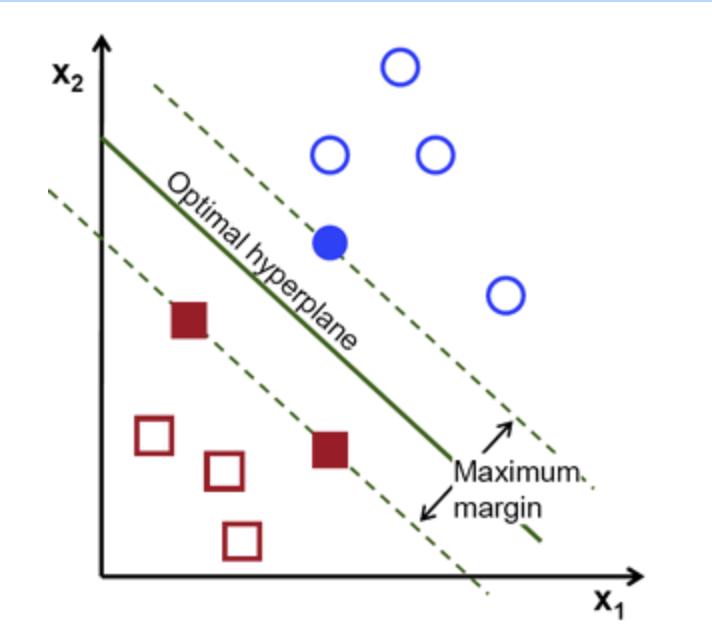

- Definition of a hyperplane: $f(x)=\beta_0+\beta ^Tx$
- Canonical hyperplane: by convention, among all the possible, we choose  $|\beta_0+\beta^Tx|=1$, where $x$ represent the training image closest to the hyperplane
- Distance between a point and hyperplane: $distance=\frac{\beta_0+\beta^T x}{||\beta||}=\frac{1}{||\beta||}$
- The margin M is twice the distance to the closest example: $M=\frac{2}{||M||}$
- Finally, maximizing M is minimizing $L(\beta)$ with some constraints to correctly classify all training examples
    
    $min_{\beta,\beta_0}(L(\beta))=\frac{1}{2}||\beta||^2$ 
    
    subject to
    
    $y_i(\beta^Tx_i+\beta_0)^2>1$
    
    this is a Lagrangian optimization problem
    
    - full script
        
        ```python
        labels = np.array([1, -1, -1, -1])
        trainingData = np.matrix([[501, 10], [255, 10], [501, 255], [10, 501]], dtype=np.float32)
        
        # train
        svm = cv.ml.SVM_create()
        svm.setType(cv.ml.SVM_C_SVC)
        svm.setKernel(cv.ml.SVM_LINEAR)
        svm.setTermCriteria((cv.TERM_CRITERIA_MAX_ITER, 100, 1e-6))
        
        svm.train(trainingData, cv.ml.ROW_SAMPLE, labels)
        
        # Data for visual representation
        width = 512
        height = 512
        image = np.zeros((height, width, 3), dtype=np.uint8)
        
        green = (0,255,0)
        blue = (255,0,0)
        for i in range(height):
            for j in range(width):
                sampleMat = np.matrix([[j,i]], dtype=np.float32)
                response = svm.predict(sampleMat)[1]
                if response == 1:
                    image[i,j] = green
                elif response == -1:
                    image[i,j] = blue
        
        thickness = 2
        sv = svm.getUncompressedSupportVectors()
        for i in range(sv.shape[0]):
            cv.circle(image, (sv[i,0], sv[i,1]), 6, (128, 128, 128), thickness)
        ```
        
    
    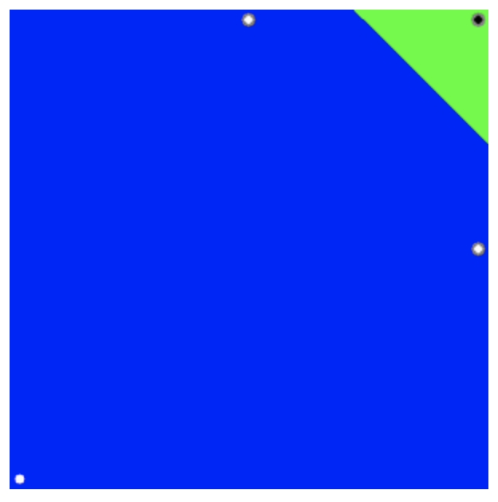
    

## Non Linear SVM

- T**he training data can be rarely separated using an hyperplane**.
- The training data can be rarely separated using an hyperplane
- Chance is more for a non-linear separable data in lower-dimensional space to become linear separable in higher-dimensional space.
    - In general, it is possible to map points in a d-dimensional space to some D-dimensional space to check the possibility of linear separability
- The new model has to include both the old requirement of finding the hyperplane that gives the biggest margin and the new one of generalizing the training data correctly by not allowing too many classification errors.
    - For example, one could think of minimizing the same quantity plus a constant times the number of misclassification errors in the training data
        
        $min||\beta||^2+C(misclassification\;error)$
        
    - A better solution will take into account the *distance of the misclassified samples to their correct decision regions*
        
        $min||\beta||^2+C(distance\; of\; misclassified\; samples\; to\; their\; correct\; regions)$
        
    
    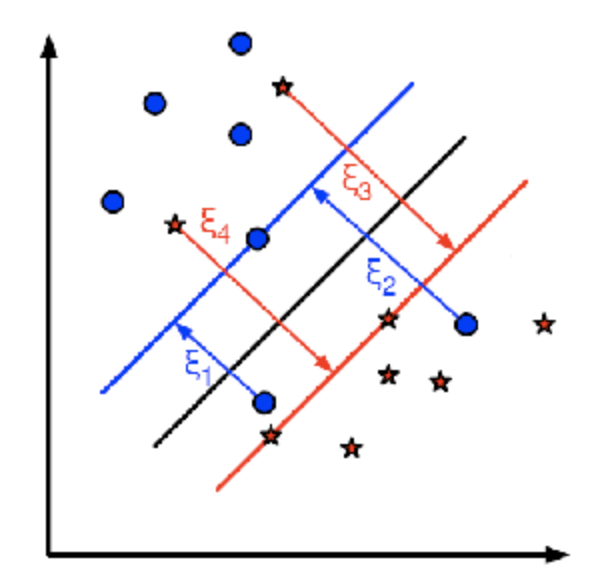
    
    $min_{\beta, \beta_0}L(\beta)=||\beta||^2+C\sum_i \xi_i$
    
    subject to
    
    $y_i(\beta^Tx_i+\beta_0)>1-\xi_i$ and $\xi_i>0$
    

- Choose C
    - Large values give solutions with less classification errors but smaller margin
    - Small values of C give solutions focusing more on the hyperplane, without much importance for classification errors, so wider margin
    
- Implementation
    
    ```python
    svm = cv.ml.SVM_create()
    svm.setType(cv.ml.SVM_C_SVC)
    svm.setC(0.1)  # new
    svm.setKernel(cv.ml.SVM_LINEAR)
    svm.setTermCriteria((cv.TERM_CRITERIA_MAX_ITER, int(1e7), 1e-6))
    ```
    
    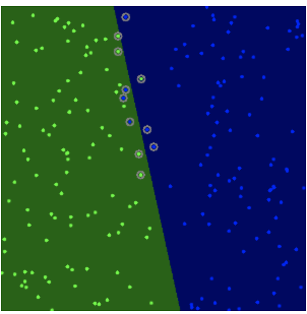
    

## PCA

[https://docs.opencv.org/4.5.0/d1/dee/tutorial_introduction_to_pca.html](https://docs.opencv.org/4.5.0/d1/dee/tutorial_introduction_to_pca.html)

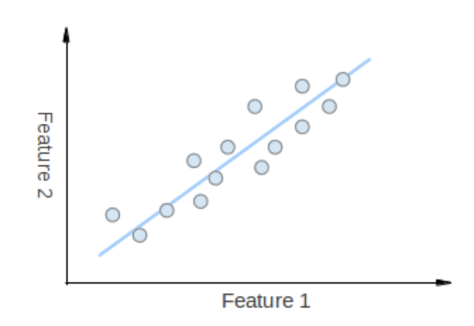

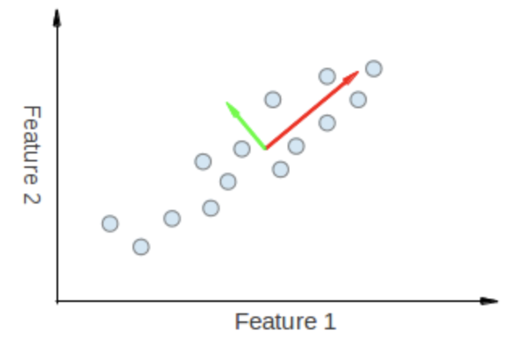

eigenvectors

- The points vary the most along the blue line, more than they vary along the Feature 1 or Feature 2 axes, so we'll be better off with that dimension only
- We want to turn dataset $X$ into a small dimension one $Y$
    - Karhunen-Loève transform: $Y = \mathbb{KLT}\{X\}$
- Algorithm
    1. Compute empirical mean for every dimension
        
        $u[j]=\frac{1}{n}\sum_i^nX[i,j]$, with $u$ vector of size (p, 1)
        
    2. Compute deviation from mean
        
        $B=X-hu^T$ with $h = [1, ..., 1]$, of size (n, 1)
        
    3. Find the covariant matrix of size (p, p)
        
        $C=\frac{B^*.B}{n-1}$, where $B^*$ is the conjugate transpose of $B$
        
        If B consists only of real number, it is just the regular transpose.
        
    4. SVD decomposition of the covariant matrix to find eigenvalues and eigenvectors
        
        $V^{-1}CV=D$
        
        With $D=diag(\lambda_1,...,\lambda_p)$, with $\lambda _i$ being the i-th eigenvalues of C
        
        $V$ are eigenvectors, come in pairs with eigenvalues
        
    
    - full script
        
        ```python
        from __future__ import print_function
        from __future__ import division
        import cv2 as cv
        import numpy as np
        import argparse
        from math import atan2, cos, sin, sqrt, pi
        
        def drawAxis(img, p_, q_, colour, scale):
            p = list(p_)
            q = list(q_)
            
            angle = atan2(p[1] - q[1], p[0] - q[0]) # angle in radians
            hypotenuse = sqrt((p[1] - q[1]) * (p[1] - q[1]) + (p[0] - q[0]) * (p[0] - q[0]))
            # Here we lengthen the arrow by a factor of scale
            q[0] = p[0] - scale * hypotenuse * cos(angle)
            q[1] = p[1] - scale * hypotenuse * sin(angle)
            cv.line(img, (int(p[0]), int(p[1])), (int(q[0]), int(q[1])), colour, 1, cv.LINE_AA)
            # create the arrow hooks
            p[0] = q[0] + 9 * cos(angle + pi / 4)
            p[1] = q[1] + 9 * sin(angle + pi / 4)
            cv.line(img, (int(p[0]), int(p[1])), (int(q[0]), int(q[1])), colour, 1, cv.LINE_AA)
            p[0] = q[0] + 9 * cos(angle - pi / 4)
            p[1] = q[1] + 9 * sin(angle - pi / 4)
            cv.line(img, (int(p[0]), int(p[1])), (int(q[0]), int(q[1])), colour, 1, cv.LINE_AA)
            
        
        def getOrientation(pts, img):
            
            sz = len(pts)
            data_pts = np.empty((sz, 2), dtype=np.float64)
            for i in range(data_pts.shape[0]):
                data_pts[i,0] = pts[i,0,0]
                data_pts[i,1] = pts[i,0,1]
            
        		# Perform PCA analysis
            mean = np.empty((0))
            mean, eigenvectors, eigenvalues = cv.PCACompute2(data_pts, mean)
            
        		# Store the center of the object
            cntr = (int(mean[0,0]), int(mean[0,1]))
            cv.circle(img, cntr, 3, (255, 0, 255), 2)
            p1 = (cntr[0] + 0.02 * eigenvectors[0,0] * eigenvalues[0,0], cntr[1] + 0.02 * eigenvectors[0,1] * eigenvalues[0,0])
            p2 = (cntr[0] - 0.02 * eigenvectors[1,0] * eigenvalues[1,0], cntr[1] - 0.02 * eigenvectors[1,1] * eigenvalues[1,0])
            
        		drawAxis(img, cntr, p1, (0, 255, 0), 1)
            drawAxis(img, cntr, p2, (255, 255, 0), 5)
        
            angle = atan2(eigenvectors[0,1], eigenvectors[0,0]) # orientation in radians
            
            return angle
        
        parser = argparse.ArgumentParser(description='Code for Introduction to Principal Component Analysis (PCA) tutorial.\
                                                      This program demonstrates how to use OpenCV PCA to extract the orientation of an object.')
        parser.add_argument('--input', help='Path to input image.', default='pca_test1.jpg')
        args = parser.parse_args()
        src = cv.imread(cv.samples.findFile(args.input))
        # Check if image is loaded successfully
        if src is None:
            print('Could not open or find the image: ', args.input)
            exit(0)
        cv.imshow('src', src)
        # Convert image to grayscale
        gray = cv.cvtColor(src, cv.COLOR_BGR2GRAY)
        # Convert image to binary
        _, bw = cv.threshold(gray, 50, 255, cv.THRESH_BINARY | cv.THRESH_OTSU)
        contours, _ = cv.findContours(bw, cv.RETR_LIST, cv.CHAIN_APPROX_NONE)
        for i, c in enumerate(contours):
            # Calculate the area of each contour
            area = cv.contourArea(c)
            # Ignore contours that are too small or too large
            if area < 1e2 or 1e5 < area:
                continue
            # Draw each contour only for visualisation purposes
            cv.drawContours(src, contours, i, (0, 0, 255), 2)
            # Find the orientation of each shape
            getOrientation(c, src)
        
        cv.imshow('output', src)
        cv.waitKey()
        ```
        
    
    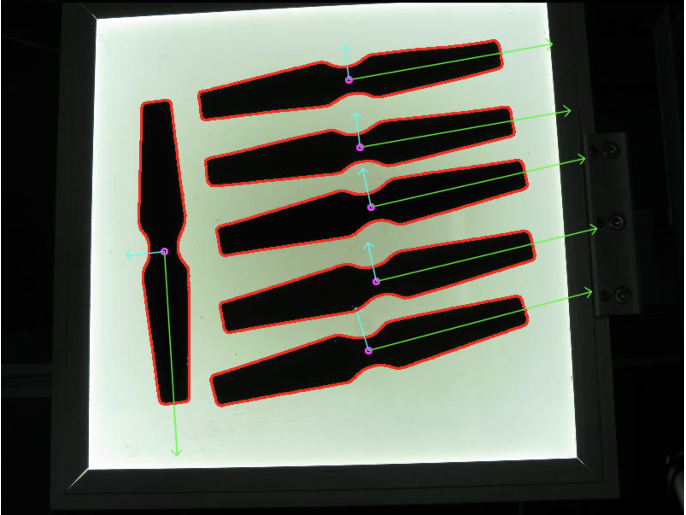
    

## Kmeans

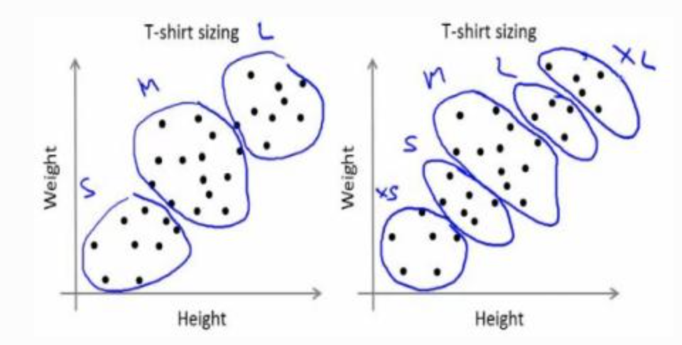

- Basic intuition
    1. Randomly choose 2 centroids, $C_1$ and $C_2$
    2. Calculate distance for each from both centroid. Closer to $C_1$ are labeled $0$, o.w labeled $1$
    
    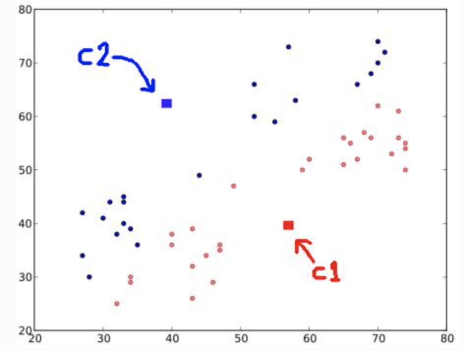
    
    1. Next, compute the average for blue and red points and update the centroids
    2. Iterate over 2 and 3 until convergence (or stopping criteria on number of iteration, or precision) is reach
        
        The distances between test data and their centroids are minimum
        
        $min \;[J=\sum_{reds}d(C_1, red)+\sum_{blues}d(C_2, blue)]$
        
        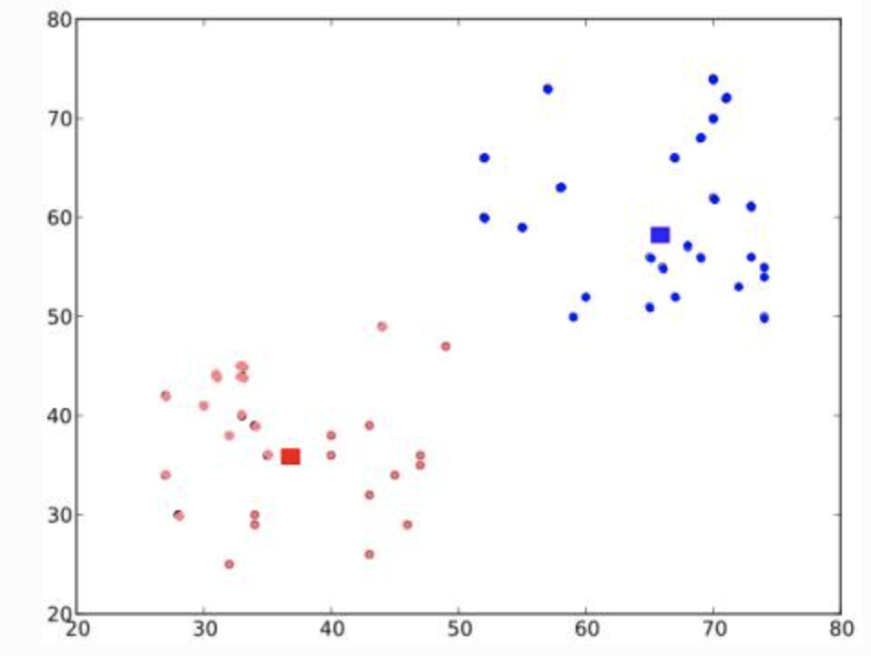
        
    
- full script
    
    ```python
    import numpy as np
    import cv2
    
    img = cv2.imread('home.jpg')
    Z = img.reshape((-1,3))
    
    # convert to np.float32
    Z = np.float32(Z)
    
    # define criteria, number of clusters(K) and apply kmeans()
    criteria = (cv2.TERM_CRITERIA_EPS + cv2.TERM_CRITERIA_MAX_ITER, 10, 1.0)
    K = 8
    ret, label, center = cv2.kmeans(
    	Z, K, None, criteria, 10, cv2.KMEANS_RANDOM_CENTERS
    )
    
    # Now convert back into uint8, and make original image
    center = np.uint8(center)
    res = center[label.flatten()]
    res2 = res.reshape((img.shape))
    
    cv2.imshow('res2',res2)
    cv2.waitKey(0)
    cv2.destroyAllWindows()
    ```
    

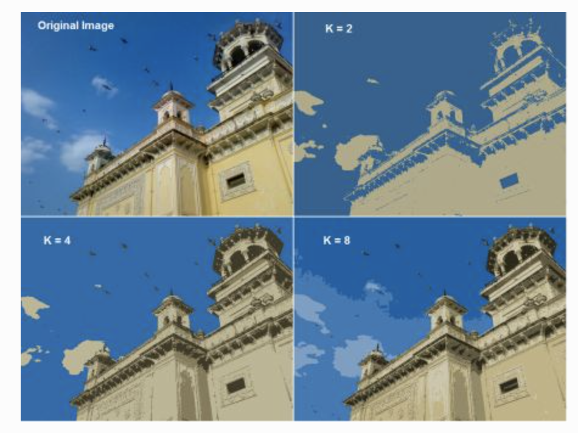