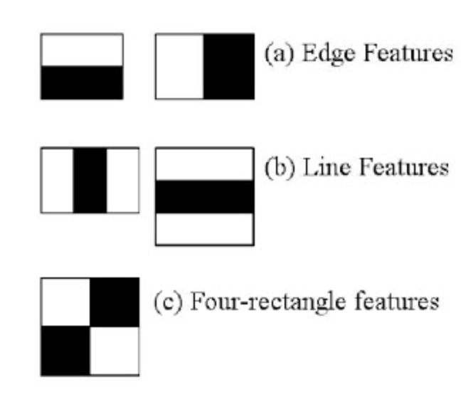
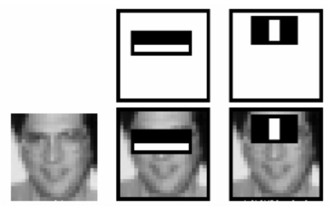

# Object Detection

## Haar Cascade Inference

[https://docs.opencv.org/4.5.0/db/d28/tutorial_cascade_classifier.html](https://docs.opencv.org/4.5.0/db/d28/tutorial_cascade_classifier.html)

- machine learning based approach where a cascade function is trained from a lot of positive and negative images. It is then used to detect objects in other images.
- Features extraction using Haar features.
    - They are just like our convolutional kernel.
    - Each feature is a single value obtained by subtracting sum of pixels under the white rectangle from sum of pixels under the black rectangle.
    
    
    
- However large your image, it reduces the calculations for a given pixel to an operation involving just four pixels. Nice, isn't it? It makes things super-fast.
    - But among all these features we calculated, most of them are irrelevant
    - The same windows applied to cheeks or any other place is irrelevant
    - So how do we select the best features out of 160000+ features? It is achieved by **Adaboost**
    
    
    
- For this, we apply each and every feature on all the training images. For each feature, it finds the best threshold which will classify the faces to positive and negative.
    - Obviously, there will be errors or misclassifications. We select the features with minimum error rate, which means they are the features that most accurately classify the face and non-face images
    - The final classifier is a weighted sum of these weak classifiers.
- In an image, most of the image is non-face region.
    - So it is a better idea to have a simple method to check if a window is not a face region.
    - For this they introduced the concept of **Cascade of Classifiers**. Instead of applying all 6000 features on a window, the features are grouped into different stages of classifiers and applied one-by-one.
    - If a window fails the first stage, discard it.
    - The authors' detector had 6000+ features with 38 stages with 1, 10, 25, 25 and 50 features in the first five stages
- full script
    
    ```python
    from __future__ import print_function
    import cv2 as cv
    import argparse
    
    def detectAndDisplay(frame):
        frame_gray = cv.cvtColor(frame, cv.COLOR_BGR2GRAY)
        frame_gray = cv.equalizeHist(frame_gray)
        #-- Detect faces
        faces = face_cascade.detectMultiScale(frame_gray)
        for (x,y,w,h) in faces:
            center = (x + w//2, y + h//2)
            frame = cv.ellipse(frame, center, (w//2, h//2), 0, 0, 360, (255, 0, 255), 4)
            faceROI = frame_gray[y:y+h,x:x+w]
            #-- In each face, detect eyes
            eyes = eyes_cascade.detectMultiScale(faceROI)
            for (x2,y2,w2,h2) in eyes:
                eye_center = (x + x2 + w2//2, y + y2 + h2//2)
                radius = int(round((w2 + h2)*0.25))
                frame = cv.circle(frame, eye_center, radius, (255, 0, 0 ), 4)
        cv.imshow('Capture - Face detection', frame)
    
    parser = argparse.ArgumentParser(description='Code for Cascade Classifier tutorial.')
    parser.add_argument('--face_cascade', help='Path to face cascade.', default='data/haarcascades/haarcascade_frontalface_alt.xml')
    parser.add_argument('--eyes_cascade', help='Path to eyes cascade.', default='data/haarcascades/haarcascade_eye_tree_eyeglasses.xml')
    parser.add_argument('--camera', help='Camera divide number.', type=int, default=0)
    args = parser.parse_args()
    face_cascade_name = args.face_cascade
    eyes_cascade_name = args.eyes_cascade
    face_cascade = cv.CascadeClassifier()
    eyes_cascade = cv.CascadeClassifier()
    
    #-- 1. Load the cascades
    if not face_cascade.load(cv.samples.findFile(face_cascade_name)):
        print('--(!)Error loading face cascade')
        exit(0)
    if not eyes_cascade.load(cv.samples.findFile(eyes_cascade_name)):
        print('--(!)Error loading eyes cascade')
        exit(0)
    camera_device = args.camera
    
    #-- 2. Read the video stream
    cap = cv.VideoCapture(camera_device)
    if not cap.isOpened:
        print('--(!)Error opening video capture')
        exit(0)
    while True:
        ret, frame = cap.read()
        if frame is None:
            print('--(!) No captured frame -- Break!')
            break
        detectAndDisplay(frame)
        if cv.waitKey(10) == 27:
            break
    ```
    

## Haar Cascade Training

[https://docs.opencv.org/4.5.0/dc/d88/tutorial_traincascade.html](https://docs.opencv.org/4.5.0/dc/d88/tutorial_traincascade.html)

- The `opencv_traincascade` supports both HAAR like wavelet features [**[248]**](https://docs.opencv.org/4.5.0/d0/de3/citelist.html#CITEREF_Viola01) and LBP (Local Binary Patterns) [**[140]**](https://docs.opencv.org/4.5.0/d0/de3/citelist.html#CITEREF_Liao2007) feature
    - LBP features yield integer precision in contrast to HAAR features, yielding floating point precision, so both training and detection with LBP are several times faster then with HAAR features.
- We need a set of positive samples (containing actual objects you want to detect) and a set of negative images (containing everything you do not want to detect).
    - The set of negative samples must be prepared manually, whereas set of positive samples is created using the `opencv_createsamples` application.
- Negative samples may be of different sizes.
    - However, each image should be equal or larger than the desired training window size *(which corresponds to the model dimensions, most of the times being the average size of your object)*
    - These images are used to subsample one negative image into several image samples having this training window size.
- 2 ways of generating positive samples
    1. Generate a bunch of positives from a single positive object image.
    2. Supply all the positives yourself and only use the tool to cut them out, resize them and put them in the opencv needed binary format (better)
- 100 real object images, can lead to a better model than 1000 artificially generated positives, by using the `opencv_createsamples` application
    
    
- Structure
    
    ```
    /img
      img1.jpg
      img2.jpg
    info.dat
    ```
    
    info.dat
    
    ```
    img/img1.jpg  1  140 100 45 45
    img/img2.jpg  2  100 200 50 50   50 30 25 25
    ```
    

- The manual process of creating the `info` file can also been done by using the opencv_annotation tool.
    - This is an open source tool for visually selecting the regions of interest of your object instances in any given images.
    - The project need to be build (git clone)
    - `opencv_annotation --annotations=/path/to/annotations/file.txt --images=/path/to/image/folder/`
- Next step is to train the model: `opencv_traincascade`
- Visualize the classifier with `opencv_visualisation --image=/data/object.png --model=/data/model.xml --data=/data/result/`