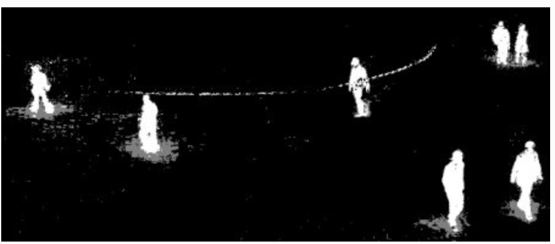

# Video Analysis

[https://docs.opencv.org/4.5.0/da/dd0/tutorial_table_of_content_video.html](https://docs.opencv.org/4.5.0/da/dd0/tutorial_table_of_content_video.html)

## Background Substraction (BS)

- Goal is generating a foreground mask (a binary image containing the pixels belonging to moving objects in the scene) by using static cameras.
- BS calculates the foreground mask performing a subtraction between the current frame and a background model, containing the static part of the scene


- Back ground modeling is made of 2 steps:
    1. Background initialization
    2. Back ground update, to adapt to possible changes
- But in most of the cases, you may not have a image without people or cars to init, so we need to extract the background from whatever images we have.
- It become more complicated when there is shadow of the vehicles. Since shadow is also moving, simple subtraction will mark that also as foreground. It complicates things.


- **BackGroundSubstractorMOG**
    - Gaussian Mixture-based Background/Foreground Segmentation Algorithm.
    - Model each background pixel by a mixture of K Gaussian distributions (K = 3 to 5).
    - The weights of the mixture represent the time proportions that those colours stay in the scene.
    - The probable background colours are the ones which stay longer and more static.
        
        
        

- **BackGroundSubstractorMOG2**
    
    
    

- **BackgroundSubtractorGMG**
    
    
    
- full script
    
    ```python
    from __future__ import print_function
    import cv2 as cv
    import argparse
    
    parser = argparse.ArgumentParser(description='This program shows how to use background subtraction methods provided by \
                                                  OpenCV. You can process both videos and images.')
    parser.add_argument('--input', type=str, help='Path to a video or a sequence of image.', default='vtest.avi')
    parser.add_argument('--algo', type=str, help='Background subtraction method (KNN, MOG2).', default='MOG2')
    
    args = parser.parse_args()
    if args.algo == 'MOG2':
        backSub = cv.createBackgroundSubtractorMOG2()
    else:
        backSub = cv.createBackgroundSubtractorKNN()
    
    #capture = cv.VideoCapture(cv.samples.findFileOrKeep(args.input))
    capture = cv.VideoCapture(0)
    if not capture.isOpened:
        print('Unable to open: ' + args.input)
        exit(0)
    
    while True:
        ret, frame = capture.read()
        if frame is None:
            break
        
        fgMask = backSub.apply(frame)
        
        cv.rectangle(frame, (10, 2), (100,20), (255,255,255), -1)
        cv.putText(frame, str(capture.get(cv.CAP_PROP_POS_FRAMES)), (15, 15),
                   cv.FONT_HERSHEY_SIMPLEX, 0.5 , (0,0,0))
        
        cv.imshow('Frame', frame)
        cv.imshow('FG Mask', fgMask)
        
        keyboard = cv.waitKey(30)
        if keyboard == 'q' or keyboard == 27:
            break
    ```
    

## Mean Shift and CamShift

[https://opencv24-python-tutorials.readthedocs.io/en/latest/py_tutorials/py_video/py_meanshift/py_meanshift.html#meanshift](https://opencv24-python-tutorials.readthedocs.io/en/latest/py_tutorials/py_video/py_meanshift/py_meanshift.html#meanshift)

- Meanshift
    
    
    
    - Start by computing back projection using a ROI window
    - Computing difference between circle windows center and points centroid, update the center with the centroid, until convergence
    - So finally what you obtain is a window with maximum pixel distribution.
    
    
    

- Continuously Adaptive Meanshift: Camshift
    - The issue with meanshift is that our window has always the same size
    - Applies meanshift first.
    - Once meanshift converges, update the window size as $s=2\sqrt{\frac{M_{00}}{256}}$
    - Also compute the orientation of the best fitting ellipse
    
    
    
    - Implementation
        
        ```python
        import numpy as np
        import cv2
        
        cap = cv2.VideoCapture('slow.flv')
        
        # take first frame of the video
        ret,frame = cap.read()
        
        # setup initial location of window
        r,h,c,w = 250,90,400,125  # simply hardcoded the values
        track_window = (c,r,w,h)
        
        # set up the ROI for tracking
        roi = frame[r:r+h, c:c+w]
        hsv_roi =  cv2.cvtColor(frame, cv2.COLOR_BGR2HSV)
        mask = cv2.inRange(hsv_roi, np.array((0., 60.,32.)), np.array((180.,255.,255.)))
        roi_hist = cv2.calcHist([hsv_roi],[0],mask,[180],[0,180])
        cv2.normalize(roi_hist,roi_hist,0,255,cv2.NORM_MINMAX)
        
        # Setup the termination criteria, either 10 iteration or move by atleast 1 pt
        term_crit = ( cv2.TERM_CRITERIA_EPS | cv2.TERM_CRITERIA_COUNT, 10, 1 )
        
        while(1):
            ret ,frame = cap.read()
        
            if ret == True:
                hsv = cv2.cvtColor(frame, cv2.COLOR_BGR2HSV)
                dst = cv2.calcBackProject([hsv],[0],roi_hist,[0,180],1)
        
                # apply meanshift to get the new location
                ret, track_window = cv2.CamShift(dst, track_window, term_crit)
        
                # Draw it on image
                pts = cv2.boxPoints(ret)
                pts = np.int0(pts)
                img2 = cv2.polylines(frame,[pts],True, 255,2)
                cv2.imshow('img2',img2)
        
                k = cv2.waitKey(60) & 0xff
                if k == 27:
                    break
                else:
                    cv2.imwrite(chr(k)+".jpg",img2)
        
            else:
                break
        
        cv2.destroyAllWindows()
        cap.release()
        ```
        
    - hardcode initial track_window
    - inRange on initial ROI to filter low saturation and low visibility
    - track_window computed iteratively and passed as a argument
    
    
    

## Optical Flow

[https://docs.opencv.org/4.5.0/d4/dee/tutorial_optical_flow.html](https://docs.opencv.org/4.5.0/d4/dee/tutorial_optical_flow.html)

[https://learnopencv.com/optical-flow-in-opencv/](https://learnopencv.com/optical-flow-in-opencv/)

### Sparse


- Hypothesis
    1. The pixel intensities of an object do not change between consecutive frames.
    2. Neighbouring pixels have similar motion.

- Optical flow equation
    
    $I(x,y,t)=I(x+dx,y+dy,t+dt)$
    
    using Taylor
    
    $uf_x+vf_y+f_t=0$, 
    
    with $f_x=\frac{\partial I}{\partial x}$, $f_y=\frac{\partial I}{\partial y}$, $u=\frac{dx}{dt}$, $v=\frac{dy}{dt}$
    
    $u, v$ are unknown. We solve it using Lucas-Kanade
    

- Kanade:
    - Takes a 3x3 patch around the point. So all the 9 points have the same motion
    - We can find $(f_x,f_y,f_t)$ for these 9 points, ie solving 9 equations with two unknown variables, which is over-determined
    - $f_x(p_1)u+f_y(p_1)v=-f_t(p_1)\\ ... \\
    f_x(p_9)v+f_y(p_9)v=-f_t(p_9)$
        
        ie
        
        $\begin{bmatrix} f_x(p_1) & f_y(p_1) \\ ... & ...\\ 
        f_x(p_9) & f_y(p_9)
        \end{bmatrix} \begin{bmatrix} u \\ v\end{bmatrix} = \begin{bmatrix} f_t(p_1) \\ ... \\ f_t(p_9) \end{bmatrix}$ 
        
        Least squares
        
        $A\gamma=b \rightarrow \gamma=(A^TA)^{-1}A^Tb$
        
        thus
        
        $\begin{bmatrix} u \\ v \end{bmatrix} = \begin{bmatrix} \sum_i f_x^2(p_i) &&  \sum_i f_x(p_i)f_y(p_i) \\ \sum_i f_x(p_i)f_y(p_i) && \sum_i  f_y^2(p_i) \end{bmatrix} ^{-1} \begin{bmatrix} -\sum_i f_x(pi)f_t(pi) \\ -\sum_i f_y(pi)f_t(pi) \end{bmatrix}$
        
    
- Fails when there is a large motion
- To deal with this we use pyramids: multi-scaling trick.
    - When we go up in the pyramid, small motions are removed and large motions become small motions.
- We find corners in the image using [Shi-Tomasi corner detector](https://opencv-python-tutroals.readthedocs.io/en/latest/py_tutorials/py_feature2d/py_shi_tomasi/py_shi_tomasi.html) and then calculate the corners’ motion vector between two consecutive frames.
    
    
- full script
    
    ```python
    # params for ShiTomasi corner detection
    feature_params = dict( maxCorners = 100,
                           qualityLevel = 0.3,
                           minDistance = 7,
                           blockSize = 7 )
    
    # Parameters for lucas kanade optical flow
    lk_params = dict( winSize  = (15,15),
                      maxLevel = 2,
                      criteria = (cv.TERM_CRITERIA_EPS | cv.TERM_CRITERIA_COUNT, 10, 0.03))
    
    # Create some random colors
    color = np.random.randint(0,255,(100,3))
    
    # Take first frame and find corners in it
    ret, old_frame = cap.read()
    old_gray = cv.cvtColor(old_frame, cv.COLOR_BGR2GRAY)
    p0 = cv.goodFeaturesToTrack(old_gray, mask = None, **feature_params)
    
    # Create a mask image for drawing purposes
    mask = np.zeros_like(old_frame)
    while(1):
        ret,frame = cap.read()
        frame_gray = cv.cvtColor(frame, cv.COLOR_BGR2GRAY)
        # calculate optical flow
        p1, st, err = cv.calcOpticalFlowPyrLK(old_gray, frame_gray, p0, None, **lk_params)
        # Select good points
        good_new = p1[st==1]
        good_old = p0[st==1]
        # draw the tracks
        for i,(new,old) in enumerate(zip(good_new, good_old)):
            a,b = new.ravel()
            c,d = old.ravel()
            mask = cv.line(mask, (a,b),(c,d), color[i].tolist(), 2)
            frame = cv.circle(frame,(a,b),5,color[i].tolist(),-1)
        img = cv.add(frame ,mask)
        cv.imshow('frame', img)
        k = cv.waitKey(30) & 0xff
        if k == 27:
            break
        # Now update the previous frame and previous points
        old_gray = frame_gray.copy()
        p0 = good_new.reshape(-1,1,2)
    ```
    

### Dense

Compute motion for every pixel in the image

```python
def dense_optical_flow(method, video_path, params=[], to_gray=False):
    
		# Read the video and first frame
    cap = cv2.VideoCapture(video_path)
    ret, old_frame = cap.read()
 
    # crate HSV & make Value a constant
    hsv = np.zeros_like(old_frame)
    hsv[..., 1] = 255
 
    # Preprocessing for exact method
    if to_gray:
        old_frame = cv2.cvtColor(old_frame, cv2.COLOR_BGR2GRAY)

		while True:
			  # Read the next frame
			  ret, new_frame = cap.read()
			  frame_copy = new_frame
			  if not ret:
			      break
			
			  # Preprocessing for exact method
			  if to_gray:
			      new_frame = cv2.cvtColor(new_frame, cv2.COLOR_BGR2GRAY)
			
			  # Calculate Optical Flow
			  flow = method(old_frame, new_frame, None, *params)
			
			  # Encoding: convert the algorithm's output into Polar coordinates
			  mag, ang = cv2.cartToPolar(flow[..., 0], flow[..., 1])
			  # Use Hue and Value to encode the Optical Flow
			  hsv[..., 0] = ang * 180 / np.pi / 2
			  hsv[..., 2] = cv2.normalize(mag, None, 0, 255, cv2.NORM_MINMAX)
			
			  # Convert HSV image into BGR for demo
			  bgr = cv2.cvtColor(hsv, cv2.COLOR_HSV2BGR)
			  cv2.imshow("frame", frame_copy)
			  cv2.imshow("optical flow", bgr)
			  k = cv2.waitKey(25) & 0xFF
			  if k == 27:
			      break
			
			  # Update the previous frame
			  old_frame = new_frame
```

- Dense Pyramid Lucas-Kanade algorithm
    
    ```python
    elif args.algorithm == 'lucaskanade_dense':
        method = cv2.optflow.calcOpticalFlowSparseToDense
        frames = dense_optical_flow(method, video_path, save, to_gray=True)
    ```
    
    
    

- Farneback algorithm
    - Approximate some neighbors of each pixel with a polynomial, taking the second order of Taylor expansion
        
        $I(x)\approx x^TAx+b^Tx+c$
        
    - We observe the differences in the approximated polynomials caused by object displacements
    
    ```python
    elif args.algorithm == 'farneback':
        method = cv2.calcOpticalFlowFarneback
        params = [0.5, 3, 15, 3, 5, 1.2, 0]  # default Farneback's algorithm parameters
        frames = dense_optical_flow(method, video_path, save, params, to_gray=True)
    ```
    
    
    

- RLOF
    - The intensity constancy assumption doesn’t fully reflect how the real world behaves.
    - There are also shadows, reflections, weather conditions, moving light sources, and, in short, varying illuminations.
        
        $I(x,y,t)+mI(x,y,t)+c=I(x+u,y+v,t+1)$ with $m,c$ illumination parameters
        
    
    ```python
    elif args.algorithm == "rlof":
        method = cv2.optflow.calcOpticalFlowDenseRLOF
        frames = dense_optical_flow(method, video_path, save)
    ```
    
    