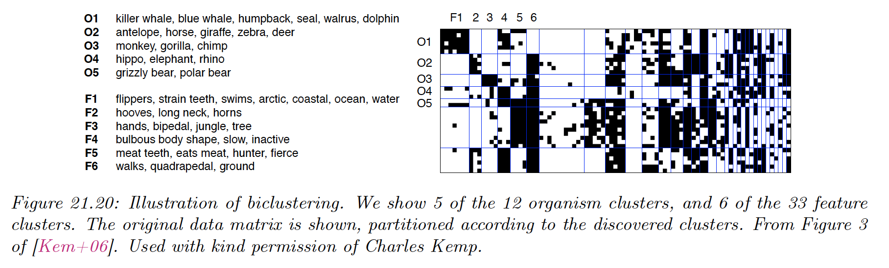
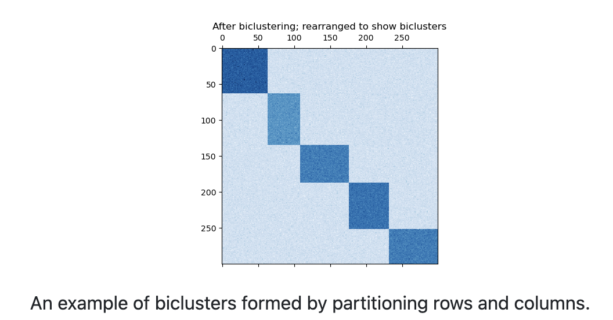
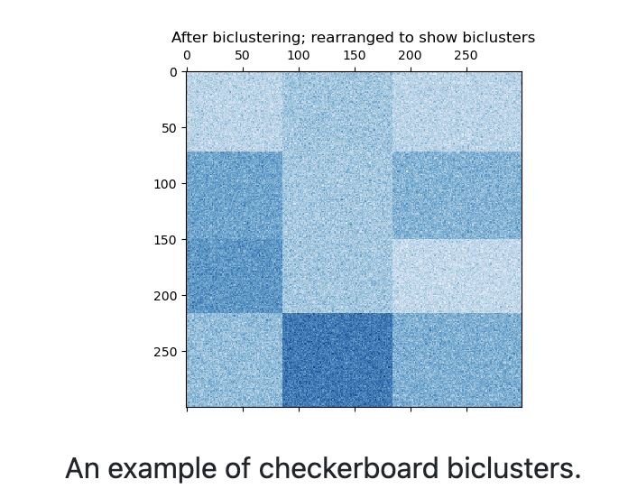

# 21.6 Biclustering

In some cases, we have a data matrix $X\in\R^{N_r\times N_c}$, and we want the cluster the rows *and* the columns. This is known as **biclustering**.

This is widely used in bioinformatic, where rows represent genes and columns represent conditions. It can also be used in collaborative filtering, where the rows represent users and columns represent movies.

### 21.6.1 Spectral Co-clustering

The spectral co-clustering algorithm finds bi-cluster with values higher than those in the corresponding other rows and columns.

Each row and each column belongs exactly to one bicluster, so rearranging the rows and columns to make partitions contiguous reveals these high values along the diagonal.

An approximate solution to the optimal normalized cut may be found via the generalized eigenvalue decomposition of the graph Laplacian.

If the original data $X$ has shape $(m\times n )$, then the Laplacian matrix for the corresponding bipartite graph has shape $(m+n)\times (m+n)$.

However, in this case it is possible to work directly with $A$, which is smaller and make the compute more efficient.

$A$ is preprocessed as follow:

$$
A_n=R^{-1/2}A C^{-{1/2}}
$$

where $R_i=\sum_{j}A_{ij}$ and $C_j=\sum_{i}A_{ij}$.

The SVD decomposition $A_n=U\Sigma V^\top$, provides the partition of rows and columns:

- A subset of $U$ gives the rows partitions
- A subset of $V$ gives the columns partitions.

The $\ell=\log_2k$ singular vectors, starting from the second give the partition.

We can then form a low dimensional matrix:

$$
Z=\begin{bmatrix}
R^{-1/2} \tilde{U}\\
C^{-1/2}\tilde{V} 

\end{bmatrix}
$$

where the columns of $\tilde{U}$ are $u_2,\dots,u_{\ell+1}$ and similarly for $\tilde{V}$.

Finally, we apply K-means on $Z$ to find our rows and columns partitioning.

### 21.6.2 Spectral Biclustering

The spectral biclustering assumes that the input data matrix has a hidden checkerboard structure.

The rows and columns matrix with this structure may be partitioned so that the entries of any bicluster in the Cartesian product of row cluster and column cluster is approximately constant.

For instance, if there are 2 row partitions and 3 column partitions, each row will belong to 3 bicluster and each column will belong to 2 bicluster.

The input matrix $A$ is first normalized to make the checkerboard pattern obvious. There are three possible methods:

1. Independent row and column normalization, as in spectral co-clustering.
2. **Bistochastization**: repeat row and column normalization until convergence. This methods make both rows and columns sum to the same constant.
3. **Log normalization**: we compute $L=\log A$ and we normalize by the following:
    
    $$
    K_{ij}=L_{ij}-\bar{L}_{i,:}-\bar{L}_{:,j}+\bar{L}
    $$
    

After normalizing, the first few eigenvectors are computed, as in co-clustering.

We rank the first singular vectors $\bold{u}_2,\dots,\bold{u}_p$ and $\bold{v}_2,\dots,\bold{v}_p$ according to which can be best approximated by a piecewise constant vector.

The approximation for each vector are found by using a 1d k-means and score via Euclidean distance.

Next, the data is projected to this best subset of singular vectors by computing $A\tilde{V}$ and $A\tilde{U}^\top$, and clustered.