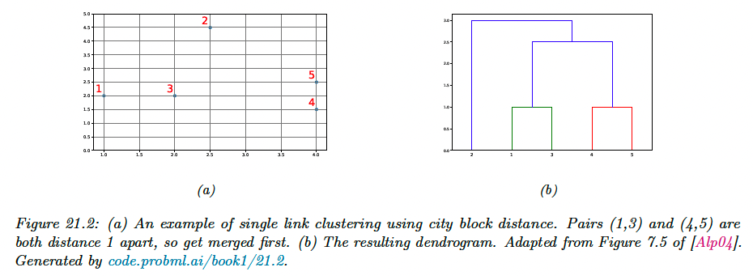
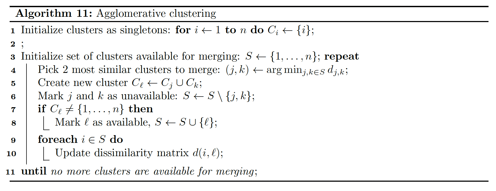
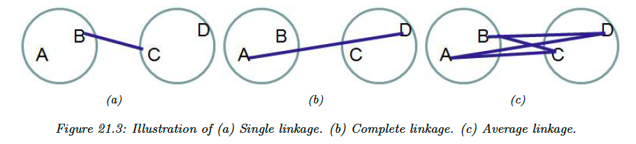
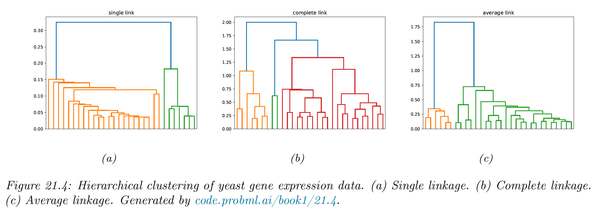
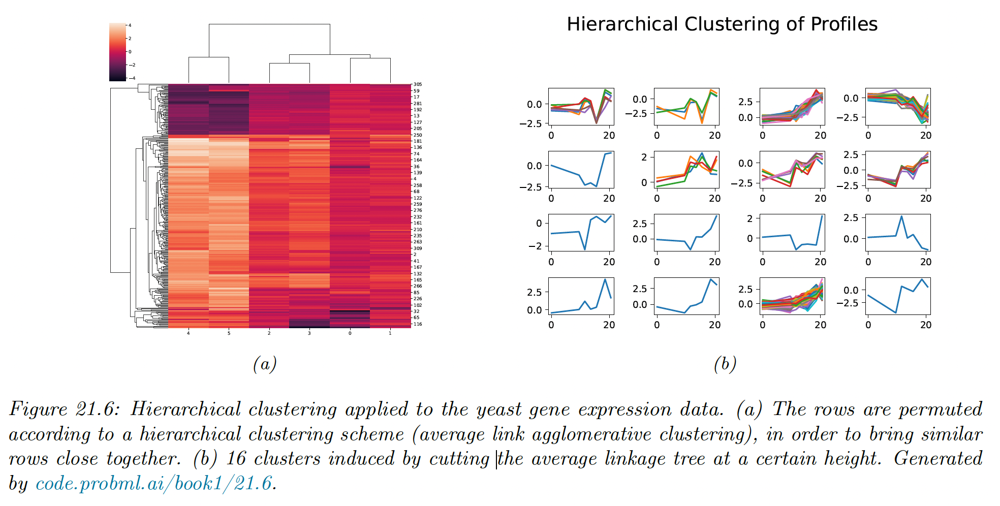

# 21.2 Hierarchical agglomerative clustering (HAC)

Hierarchical agglomerative clustering is a common form of clustering.

The input to the algorithm is an $N\times N$ dissimilarity matrix $D_{ij}\geq 0$ and the output is a tree structure in which groups $i$ and $j$ with small dissimilarity are grouped together in a hierarchical fashion.

We will use **city block distance** to define the dissimilarity:

$$
d_{ij}=\sum_{k=1}^2 |x_{ik}-y_{jk}|
$$

### 21.2.1 The algorithm

Agglomerative clustering starts with $N$
 groups, each initially containing one object, and then at each step it merges the two most similar groups until there is a single group containing all the data.

The result is a binary tree known as **dendogram**. By cutting the tree at different heights, we can induce a different number of (nested) clusters.

Since picking the two most similar groups takes $O(N^2)$ and there are $O(N)$ steps in the algorithm, the total running time is $O(N^3)$.

However, by using a priority queue, this can be reduced to $O(N^2\log N)$.

There are three variants of agglomerative clustering, depending on how we define the dissimilarity between groups of objects.

#### 21.2.1.1 Single link

In **single link clustering**, also called **nearest neighbor clustering**, the distance between two groups $H$ and $G$ is defined as the distance between the closest members of each groups:

$$
d_{SL}(H, G)=\min_{i\in G,\,j\in H } d_{i,j}
$$

The tree built using single link clustering is a minimum spanning tree of the data, connecting all objects in a way that minimize the sum of the edge weights (distance).

As a consequence of this, we can implement single link clustering in $O(N^2)$ time, whereas the naive form of other variants take $O(N^3)$ time.

#### 21.2.1.2 Complete link

In complete link clustering, aka **furthest neighbor clustering**, the distance between two groups is defined as the distance between the two most distant pairs:

$$
d_{CL}(H,G)=\max_{i\in G,\,j\in H}d_{ij}
$$

Single linkage only requires that a single pairs of object to be close for the two groups to be considered a cluster, regardless of the similarity of other members of the group.

Thus, clusters can be formed that violate the **compactness** property, which says that all observations within a group should be similar to each other.

If we define the **diameter** of a group as the largest dissimilarity of its members, then we can see that the single link can produce clusters with large diameters.

Complete linkage represents the opposite extreme: two groups are considered close if all of the observations in their union are relatively similar. This tends to produce compact clusterings, with small diameters.

In scipy, this is implemented using nearest neighbor chain, and takes $O(N^2)$ time.

#### 21.2.1.3 Average link

In practice, the preferred method is **average link clustering**, which measures the average distance between all pairs:

$$
d_{avg}(G,H)=\frac{1}{n_Gn_H}\sum_{i \in G}\sum_{j\in H} d_{ij}
$$

where $n_G$ and $n_H$ are the number of elements in each groups.

Average link clustering represent a compromise between single and complete link clustering. It tends to produce compact clusters that are relatively far apart.

However, since it involves averaging of the distances, any change to the measurement scale can change the result. In contrast, single linkage and complete linkage are invariant to monotonic transformations of $d_{ij}$, since they leave the relative ordering the same.

In scipy, this is also implemented using nearest neighbor chain, and takes $O(N^2)$ time.

### 21.2.2 Example

Suppose we have a set of time series measurements of the expression levels for $N=300$ genes at $T=7$ points, in response to a given stimulus. Each data sample is a vector $\bold{x}_n\in \R^7$.

We see that there are several kind of genes, some goes up monotonically over time, some goes down, and some exhibit more complex response patterns.

Suppose we use Euclidean distance to compute a pairwise distance matrix $D\in\R^{300 \times 300}$, and apply HAC using average linkage. We get the following dendogram:

The time series assigned to each cluster of the cut do indeed “look like” each other.