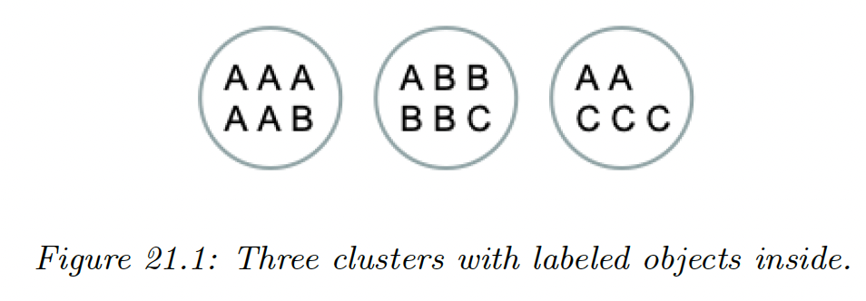

# 21.1 Introduction

**Clustering** is a very common form of unsupervised learning. There are two main kinds of method.

In the first approach, the input is a set of data samples $\mathcal{D}=\{\bold{x}_n:n=1:N\}$, where typically $\bold{x}_n\in\R^D$.

In the second approach, the input is a pairwise dissimilarity matrix $D \in\R^{N\times N}$, where $D_{ij}\geq 0$.

In both cases, the goal is to assign similar points to the same cluster. As often with unsupervised learning, it is hard to evaluate the quality of a clustering algorithm.

If we have labels for some points, we can use the similarity between the labels of two points as a metric for determining if the two inputs “should” be assigned to the same cluster or not.

If we we don’t have labels, but the method is based on generative model of the data, we can use log likelihood as a metric.

### 21.1.1 Evaluating the output of clustering methods

If we use probabilistic models, we can always evaluate the likelihood of the data, but this has two drawbacks:

1. It does not assess the clustering discovered by the model
2. It does not apply to non-probabilistic methods

Hence, we review performance measures not based on likelihood.

Intuitively, similar points should be assigned to the same cluster. We can rely on some external form of data, like labels or a reference clustering, by making the hypothesis that objects with the same label are similar.

#### 21.1.1.1 Purity

Let $N_{ij}$ be the number of objects in cluster $i$ that belong to class $j$, with $N_i=\sum_{j=1}^C N_{ij}$ be the total number of objects in cluster $i$.

Define $p_{ij}=N_{ij}/N_i$ the empirical probability of the class $j$ in cluster $i$.

We define the purity of a cluster as:

$$
p_i\triangleq \max_j p_{ij}
$$

and the overall purity of a clustering as:

$$
\mathrm{purity}\triangleq \sum_i \frac{N_i}{N}p_i
$$

On the figure above we have:

$$
\mathrm{purity}=\frac{6}{17}\frac{5}{6}+\frac{6}{17}\frac{4}{6}+\frac{5}{17}\frac{3}{5}=\frac{12}{17}=0.71
$$

However, this measure doesn’t penalize the number of cluster, since we can achieve the best purity of $1$ by trivially putting each object in its own cluster.

#### 21.1.1.2 Rand index

Let $U=\{u_1,\dots,u_R\}$ and $V=\{v_1,\dots,v_C\}$ two different partition of the $N$ data points. For example, $U$ could be the estimated clustering and $V$ some reference clustering derived from the class labels.

A common statistics is the **Rand index**:

$$
R\triangleq \frac{TP+TN}{TP+TP+FP+FN}
$$

which is analogous to the accuracy for classification.

#### 21.1.1.3 Mutual information

$$
\mathbb{I}(U,V)=\sum_{i=1}^R\sum_{j=1}^C p_{UV}(i,j)\log \frac{p_{UV}(i,j)}{p_U(i)p_V(j)}
$$

where:

- $p_{UV}(i,j)=|u_i \cap v_j|/N$ is the probability that a randomly chosen object belong to the cluster $u_i$ in $U$ and $v_j$ in $V$
- $p_U(i)=|u_i|/N$ be the probability that a randomly chosen object belong to the cluster $u_i$.

This lies between 0 and $\min\{\mathbb{H}(U),\mathbb{H}(V)\}$.

Unfortunately, the maximum can be achieved by using a lot of small clusters, which have low entropy.

To compensate for this, we can use the normalized mutual information:

$$
NMI(U,V)=\frac{\mathbb{I}(U,V)}{(\mathbb{H}(U)+\mathbb{H}(V))/2}
$$

This lies between $0$ and $1$