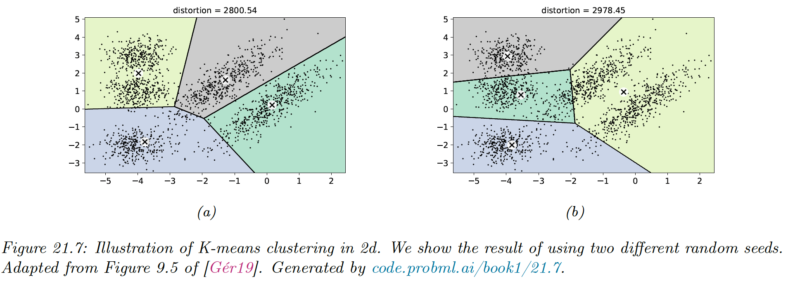
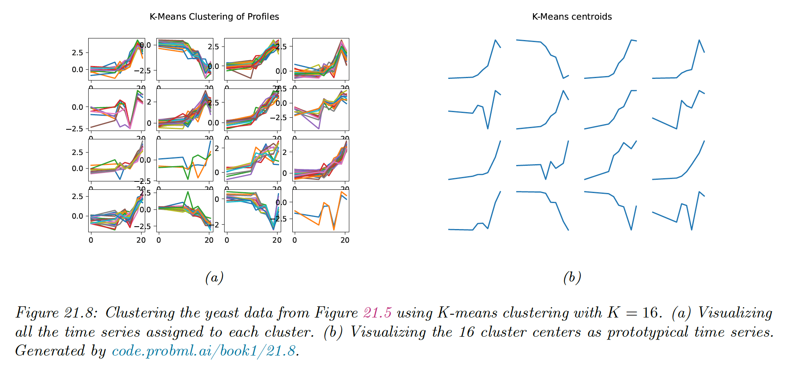
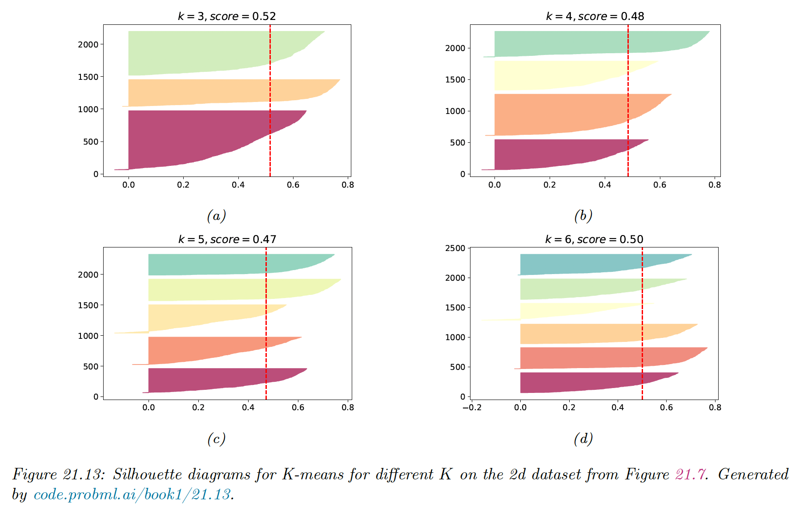

# 21.3 K means clustering

There are several issues with the hierarchical agglomerative clustering.

1. It takes $O(N^3)$ time to compute for the average link method, making it hard to apply to big datasets (note that scipy.linkage implements it in $O(N^2)$ time using **nearest-neighbor chain**).
2. It assumes that a dissimilarity matrix has already been computed, whereas the notion of similarity is often unclear and needs to be learned
3. It is an algorithm, not a model, so it is hard to evaluate how good it is. It doesn’t optimize an objective.

The K-means algorithm addresses these issues:

1. It runs in $O(NKT)$ where $T$ is the number of iterations
2. It computes dissimilarity in terms of Euclidean distance to learned cluster centers $\mu_k\in \R^D$, rather than requiring a dissimilarity matrix.
3. It optimizes a well-defined cost function.

### 21.3.1 The algorithm

We assume there are $K$ cluster centers $\mu_k\in \R^D$, so we can cluster the data by assigning each point $\bold{x}_n\in\R^D$ to its closest center:

$$
z_n^*=\argmin_k ||\bold{x}_n-\mu_k||^2_2
$$

We can then update the cluster centers by computing the average value of all points assigned to them:

$$
\mu_k=\frac{1}{N_k}\sum_{n:z_n=k} \bold{x}_n
$$

We can then iterate these steps to convergence.

More formally we can view this as finding a local minimum of the following cost function, known as **distortion**:

$$
J(M,Z)=\sum_{n=1}^N ||\bold{x}_n-\mu_{z_n}||^2_2 =||X-ZM^\top||_F^2
$$

where $X\in\R^{N\times D}$, $Z\in[0,1]^{N\times K}$ and $M\in \R^{D\times K}$ contains the cluster centers $\mu_k$ in its columns.

K-means optimizes this using alternative minimization (this is closely related to the EM algorithm for GMMs).

### 21.3.2 Examples

#### 21.3.2.1 Clustering points in the 2d plane

K-means clustering applied to some points in the 2d space induces a **Voronoi tessellation** of the points. The resulting clustering is sensitive to the initialization.

By default, sklearn uses 10 random restarts (combined with K-means++ initialization) and returns the clustering with lowest distortion (in sklearn, the distortion is called “inertia”).

#### 21.3.2.2 Clustering gene expression time series data

We show the result of applying K-means clustering with $K=16$. We see that time series that “look similar” to each other are assigned to the same cluster.

We also see that the centroid of each cluster is a reasonable summary of all the data points assigned to that cluster.

### 21.3.3 Vector quantization

Suppose we want to perform loss compression of some real-valued vector $\bold{x}_n\in\R^D$. A very simple approach is to use **vector quantization (VQ)**.

The basic idea is to replace each real-valued vector $\bold{x}_n$ with a discrete symbol $z_n \in \{1,\dots,K\}$, which is an index into a **codebook** of $K$ prototypes, $\mu_k\in\R^D
.$

Each data vector is encoded by using the index of the most similar prototype, where similarity is measured in terms of Euclidean distance:

$$
\mathrm{encode}(\bold{x}_n)=\argmin _k ||\bold{x}_n-\mu_k||^2
$$

We can define the cost function that measure the quality of the codebook by computing the **reconstruction error** (aka **distorsion**) it induces:

$$
J\triangleq  \frac{1}{N}\sum_{n=1}^N ||\bold{x}_n-\mathrm{decode}(\mathrm{encode}(\bold{x}_n))||^2=\frac{1}{N}\sum_{n=1}^N ||\bold{x}_n-\mu_{z_n}||^2
$$

where $\mathrm{decode}(k)=\mu_k$. This is exactly the cost function minimized by the K-means algorithm.

We can achieve zero distorsion by using $K=N$ and assigning $\mu_n=\bold{x}_n$, but this not compress the data at all. It takes $O(NDB)$ bits, where $B$ is the number of bits needed to represent a real-valued scalar.

We can do better by detecting similar vectors in the data, creating prototypes or centroids for them, and then representing the data as deviation from these prototypes.

This reduces the space requirement to $O(N\log_2K +KDB)$ bits.

- The first term arises because each of the $N$ data vectors need to specify which of the $K$ codeword it is using.
- The second term arises because we have to store each codebook entry, each of which is a $D$-dimensional vector.

When $N$ is large, the first term dominates the second, so we can approximate the **rate** of the encoding scheme (number of bits needed per object) as $O(\log_2K)$, which is typically much less than $O(DB)$.

We treat the $200\times 320$ pixel image below as a set of $N=64,000$ scalars (i.e., $D=1)$.

If we use one byte to represent each pixel (gray-scale intensity of 0 to 255), then $B=8$, so we need $NB=512k$  bits to represent the image in uncompressed form.

For the compressed image, we need $O(N \log_2K)$ bits. For $K=4$, this is about 128kb, a factor of 4 compression, yet resulting in negligible perceptual loss.

Greater compression could be achieved if we modeled spatial correlation between the pixels, e.g. if we encoded $5\times 5$ blocks (as used by JPEG). This is because the residual errors would be smaller, and would take fewer bits to encode.

This shows the deep connection between data compression and density estimation.

### 21.3.4 The K-means++ algorithm

K-means is optimizing a non-convex objective, and hence needs to be initialized carefully.

A simple approach is to pick $K$ data points at random, and use these as the initial values for $\mu_k$. We can improve on this using **multiple restarts**, i.e., we run the algorithm multiple times. However, this can be slow.

A better approach is to pick the centers sequentially, so as to try to “cover” the data. We pick the initial point uniformly at random, and then each subsequent point is picked from the remaining points, with probability proportional to the square distance to the point’s closest cluster center.

That is, at iteration $t$, we pick the next cluster to be $\bold{x}_n$ with probability:

$$
p(\mu_t=\bold{x}_n)=\frac{D_{t-1}(\bold{x}_n)}{\sum_{n'=1}^N D_{t-1}(\bold{x}_n')}
$$

where:

$$
D_t(\bold{x})=\min_{k=1}^{t-1} ||\bold{x}-\mu_k||^2_2
$$

is the squared distance of $\bold{x}$ to the closest existing centroid.

Thus, points that are far away from a centroid are more likely to be picked, thus reducing the distorsion. This is known as **farthest point clustering** or **K-means++**.

Surprisingly, this simple trick can be shown to guarantee that the reconstruction error is never more than $O(\log K)$ worse than optimal.

### 21.3.5 The K-medoids algorithm

**K-medoids** is a variant to K-means in which we estimate each cluster center $\mu_k$ by choosing the data example $\bold{x}_n\in\mathcal{X}$ whose average dissimilarity to all the other points in the cluster is minimal. This point is called a **medoid**.

By contrast in K-means, we take average over points assigned to each cluster to compute the center (so the cluster is often not a data example).

K-medoids can be more robust to outlier (although this can be mitigated by using a mixture of Student distributions instead of a mixture of Gaussian).

More importantly, K-medoids can be applied to data that doesn’t belong to $\R^D$, where averaging may not be well defined. The input is a $N\times N$ pairwise distance matrix $D(n,n')$, not a $N\times D$ feature matrix.

K-medoids can be solved using **Voronoi iteration**, where we first find the medoid in a cluster by computing the average distance for each point, and then update the clusters by assigning each point to its closest medoid.

### 21.3.6 Speedup tricks

K-means take $O(NKI)$ time, where $I$ is the number of iterations, but we can reduce the constant factors by using various tricks.

In sklearn, the classical EM-style algorithm is **Lloyd** (default) and the **Elkan** variation can be more efficient on some datasets with well-defined clusters, by using the triangle inequality to keep track of the lower and upper bounds for the distances between inputs and centroids. This can be used to eliminate some redundant computation.

Another approach is to use a minibatch approximation, which can be significantly faster for slightly worse results.

### 21.3.7 Choosing the number of clusters $K$

#### 21.3.7.1 Minimizing the distorsion

Based on our experience with supervised learning, a natural choice for picking $K$ is the value that minimizes the reconstruction error on a validation set:

$$
\mathrm{err}(\mathcal{D}_{valid}, K)=\frac{1}{|\mathcal{D}_{valid}|}\sum_{n\in\mathcal{D}_{valid}}||\bold{x}_n-\hat{\bold{x}}_n||^2_2
$$

where $\hat{\bold{x}}_n=\mathrm{decode(encode}(\bold{x}_n))$ is the reconstruction of $\bold{x}_n$.

Unfortunately, this technique will not work, and the distortion monotonically decreases with $K$.

To see why, note that the K-means is a degenerated density model which consists of $K$ “spikes” at the $\mu_k$ centers. As we increase $K$ we “cover” more of the input space, hence any given point is more likely to find a close prototype, which decrease the reconstruction error.

Thus, unlike supervised learning, we can’t use reconstruction error on a validation set to select the best unsupervised model (this also apply to PCA).

In the figure above, we see an **“elbow”** in the curve at $K=3$, but this is hard to detect.

#### 21.3.7.2 Maximizing the marginal likelihood

If we use a proper probabilistic model like a GMM, we can use the **log marginal likelihood (LML)** of the data to perform model selection.

We can approximate the LML using the BIC score, as discussed in section 5.2.5.1:

$$
\mathrm{BIC}(K)=\log p(\mathcal{D}|\hat{\theta}_k)-\frac{D_K}{2}\log N
$$

where $D_K$ is the number of parameters in a model with $K$ clusters, and $\hat{\theta}$ is the MLE.

We see this exhibits a typical U-shaped curve.

It works because its cluster is associated to a Gaussian distribution that fills a volume of the input space, rather than being a degenerate spike.

Once we have enough clusters to cover the true modes of the distribution, the Bayesian Occam’s razor kicks in, and start penalizing the model for being overly complex.

#### 21.3.7.3 Silhouette coefficient

The **silhouette coefficient** is common heuristic for picking the number of clusters in K-means clustering model. This is designed to work with spherical (not elongated) clusters.

We define the silhouette coefficient as:

$$
\mathrm{sc}(i)=\frac{a_i-b_i}{\max(a_i, b_i)}
$$

where $a_i$ is the mean distance to the other instances within the cluster $k_i$, defined as:

$$
k_i=\argmin_{k}(||\mu_k-\bold{x}_i||)
$$

and $b_i$ is the mean distance to the other instances in the next closest cluster $k_i'$, defined as:

$$
k_i'=\argmin_{k\neq k_i}(||\mu_k-\bold{x}_i||)
$$

Thus $a_i$ measure the compactness of $i$’s cluster, and $b_i$ measure the distance between the clusters.

The silhouette coefficient varies from $-1$ to $+1$, where:

- $+1$ means that the instance is close to the members of the clusters and far from other clusters
- $0$ means that the instance is close to a cluster boundary
- $-1$ means that the instance may be in the wrong cluster

The **silhouette score** of a clustering $K$ is the mean silhouette coefficient over all instances.

In the figure above, we see a prominent peak at $K=3$, although $K=7$ is almost as good.

It can be informative to look at individual silhouette coefficients and just the mean score. We can plot these in a **silhouette diagram**:

The dotted vertical line is the average coefficient. Clusters with many point the left are likely to be of low quality. We can also use this figure to look at the size of each cluster, even when the data is not 2d.

#### 21.3.7.4 Incrementally growing the number of mixture components

An alternative to searching the best $K$ is to incrementally “grow” GMMs.

We can start with a small value of $K$, and after each round of training we consider splitting the highest mixing weight into two, with the new centroids being random perturbations of the original centroid, and the new scores being half of old scores.

If a new cluster has too small a score or too narrow a variance, it is removed. We continue in this way until the desired number of cluster is reached.