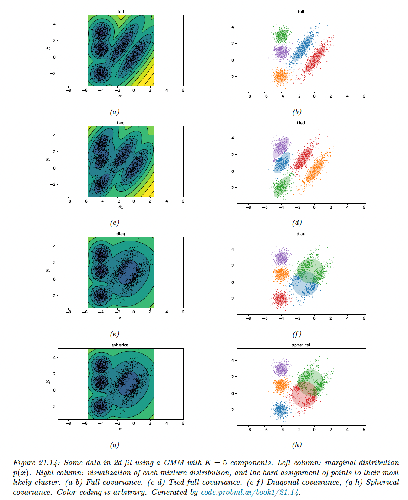

# 21.4 Clustering using mixture models

We have seen how the K-means algorithm can be used to cluster data vectors in $\R^D$. However, this method assumes that all clusters have the same spherical shape, which is a very restrictive assumption.

In addition, K-means assumes that all clusters can be described by Gaussian in the input space, so it can’t be applied to categorical data.

We can overcome both of these issues with mixture models.

### 21.4.1 Mixtures of Gaussians

Recall from section 3.5.1 that a Gaussian mixture model (GMM) has the form:

$$
p(\bold{x}|\theta)=\sum_{k=1}^K \pi_k \mathcal{N}(\bold{x}|\mu_k,\Sigma_k)
$$

If we know the model parameters, $\theta=(\pi,\{\mu_k,\Sigma_k\})$, we can use the Bayes rule to compute the **responsibility** (posterior membership probability) of a cluster $k$ for the data point $\bold{x}_n$:

$$
r_{nk}\triangleq p(z_n=k|\bold{x}_n,\theta)=\frac{p(z_n=k|\theta)p(\bold{x}_n|z_n=k,\theta)}{\sum_{k'}p(z_n=k'|\theta)p(\bold{x}_n|z_n=k',\theta)}
$$

We can then compute the most probable cluster assignment:

$$
\hat{z}_n=\argmax_k r_{nk}=\argmax_k [\log p(z_n=k|\theta) +\log p(\bold{x}_n|z_n=k,\theta)]
$$

This is known as **hard clustering**.

#### 21.4.1.1 K-means is a special case of EM

We can estimate the parameter of a GMM using the EM algorithm (section 8.7.3).

It turns out K-means is a special case of this algorithm, which makes two assumptions:

1. We fix $\Sigma_k=I$ and $\pi_k=1/K$ for all clusters, so we just have to estimate the means $\mu_k$
2. We approximate the E step by replacing the soft responsibilities with hard assignment, i.e. we set $r_{nk}=\mathbb{I}(k=z_n^*)$ instead of $r_{nk}=p(z_n=k|\bold{x}_n,\theta)$.

With this approximation, the weighted MLE problem of the M step reduces to equation:

$$
\mu_k=\frac{1}{N_k}\sum_{n:z_n=k}\bold{x}_n
$$

So we recover K-means.

However, the assumption that all cluster have the same spherical shape is very restrictive. The figure below shows the marginal density and clusters induced by different covariance matrix shape.

We see that for this dataset, we need to capture off-diagonal covariance (top row).

### 21.4.2 Mixtures of Bernoullis

We can use a mixtures of Bernoulli to cluster binary data (as discussed in section 3.5.2). The model has the form:

$$
p(\bold{y}|z=k,\theta)=\prod_{d=1}^D \mathrm{Ber}(y_d|\mu_{dk})=\prod_{d=1}^D \mu_{dk}^{y_d}(1-\mu_{dk})^{1-y_d}
$$

Here $\mu_{dk}$ is the probability that bits $d$ turns on in cluster $k$.

We can fit this model using EM, SGD or MCMC.