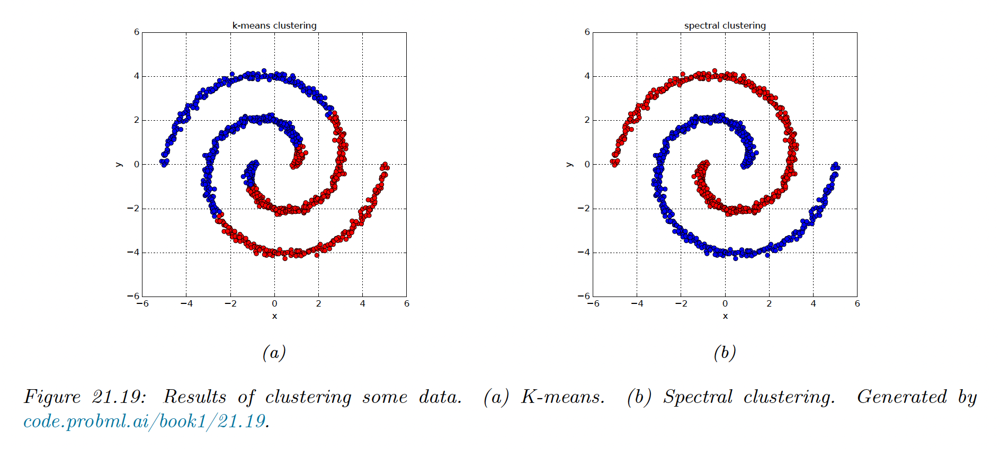

# 21.5 Spectral clustering

**Spectral clustering** is an approach based on eigenvalue analysis of a pairwise similarity matrix. It uses the eigenvectors to derive feature vectors for each data point, which are then clustered using feature-based clustering methods like K-means.

### 21.5.1 Normalized cuts

We start by creating an undirected weighted graph $W$, where each data point is a node, and the strength of the edge $i$-$j$ is a measure of similarity.

We only connect a node to its nearest neighbors to ensure the graph is sparse, which speeds computation.

Our goal is to find $K$ clusters of similar point, i.e. a **graph partition** into $S_1,\dots,S_K$ disjoints sets of nodes so as to minimize the **normalized cut**:

$$
\mathrm{Ncut}(S_1,\dots,S_K)=\sum_{k=1}^K\frac{\mathrm{cut}(S_k,\bar{S}_k)}{\mathrm{vol}(S_k)}
$$

where:

$$
\begin{align}
\mathrm{cut}(A,B) &= \frac{1}{2}\sum_{i\in A\, j\in B} w_{ij} \\
\mathrm{vol}(A)&= \sum_{i\in A}\sum_{j=1}^N w_{ij}
\end{align}
$$

and where $\bar{S}_k=V\backslash S_k$  is the complement of $S_k$, $V=\{1,\dots,N\}$, $\mathrm{vol}$ is the total weight of set $A$ (the sum of the degree of its edges).

This splits the graph into $K$ clusters such that the nodes of each cluster are similar to each other but different from the rest.

We could formulate the Ncut problem by using $\bold{c}_i\in \{0,1\}^K$, where $c_{ik}=1$ iff the point $i$ belongs to the cluster $k$.

Unfortunately, this is NP-hard. Below, we discuss a continuous relaxation of the problem based on eigenvectors that is easier to solve.

### 21.5.2 Eigenvectors of the graph Laplacian encode the clustering

The graph Laplacian is defined by:

$$
L \triangleq D- W
$$

where $W$ is the symmetric weight matrix of the graph and $D=\mathrm{diag}(d_i)$ is the diagonal matrix containing the weight degree of each node, $d_i=\sum_{j}w_{ij}$.

In practice, it is important to account for the normalized graph Laplacian, to account for the fact that some nodes are more highly connected than others. One way to do it is to create the symmetry matrix:

$$
L_{sym}=D^{-1/2}LD^{-1/2}=I-D^{-1/2}WD^{-1/2}
$$

The algorithm is the following:

- Find the smallest $K$ eigenvectors of $L_{sym}$
- Stack them into a matrix $U\in \R^{N\times K}$
- Normalize each row to unit norm $t_{ij}=u_{ij}/\sqrt{\sum_{k}u_{ik}^2}$ to make the matrix $T$
- Cluster the matrix $T$ using K-means, then infer the partition of the original point

### 21.5.3 Example

We see that for nested circles, K-means does a poor job, since it assumes each cluster corresponds to a spherical Gaussian.

Next, we compute a dense similarity matrix $W$ using a Gaussian kernel:

$$
W_{ij}=\exp(-\frac{1}{2\sigma^2}||\bold{x}_i-\bold{x}_j||^2_2)
$$

We then compute the first two eigenvectors of the normalized Laplacian $L_{sym}$. From this we infer the clustering using K-means with $K=2$.

### 21.5.4 Connection with other methods

#### 21.5.4.1 Spectral clustering and kPCA

Kernel PCA uses the largest eigenvectors of $W$, which are equivalent to the smallest eigenvectors of $I-W$.

In practice, spectral clustering tends to give better results than kPCA.