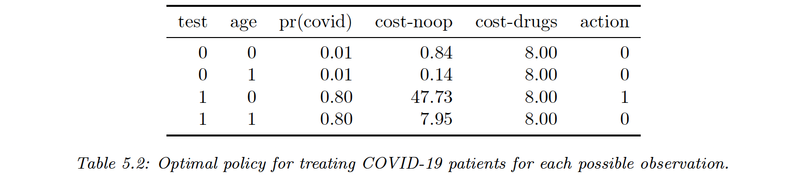

# 5.1 Bayesian decision theory

Bayesian inference allows us to update our belief about hidden quantities $H$ based on observed data $x\in X$. To convert this inference into an action, we use Bayesian decision theory.

### 5.1.1 Basics

We assume an agent has a set of possible actions $\mathcal{A}$. Each of these actions have a cost and benefits, depending on some state $H \in\mathcal{H}$.

We can encode this information using a loss function $\ell(h, a)$, specifying the cost of taking action $a\in\mathcal{A}$ with state $h\in\mathcal{H}$.

In medical circles, a common measure to quantify the benefits of a drug is the quality-adjusted life years (QALY)

Once we have the loss function, we can compute the **posterior expected loss** or **risk**

$$
R(a|x) \triangleq \mathbb{E}_{p(h|x)}[\ell(h,a)]=\sum_{h\in \mathcal{H}} \ell(h,a)p(h|x)
$$

The optimal policy specifies what action to take given observed data $x$

$$
\pi^*(x)= \argmin_{a\in\mathcal{A}} R(a|x)
$$

In the case of Covid, let say that $x$ is the age of each patient. We can convert test results into a distribution over disease states, and by combining it with the loss matrix above we can compute the optimal policy for each observation.

Let say we improve the precision of the test, the probability that a positive test is correct increases and the cost of no-op for elderly increases as well, thus changing the action to take into 1.

### 5.1.2 Classification problems

Given an observed input $x$, what is the optimal class label to predict?

**Zero-one loss**

Suppose the states are some classes $\mathcal{H}=\mathcal{Y}=\{1,...,C\}$, and the action correspond to class labels $\mathcal{A = Y}$.

Which corresponds to

$$
\ell_{01}(y^*, \hat{y})=\mathbb{I}(\hat{y}\neq y^*)
$$

In this case the posterior expected loss is

$$
R(\hat{y}|x)=p(\hat{y}\neq y^*|x)=1-p(\hat{y}=y^*)
$$

Hence the action that minimize the risk is the most probable label, that is the mode of the posterior distribution, aka the MAP estimate

$$
\pi(x)=\argmax_{y}p(y|x)
$$

**Cost sensitive classification**

Let’s now have the following loss function $\ell(y^*,\hat{y})$

$$
\begin{pmatrix}
\ell_{00} & \ell_{01} \\
\ell_{10} & \ell_{11}
\end{pmatrix}
$$

Let $p_0=p(y^*=0|x)$ and $p_1=1-p_0$. We select $\hat{y}=0$ iff

$$
p_0 \ell_{00} + p_1 \ell_{10} < p_0 \ell_{01} + p_1 \ell_{11}
$$

when $\ell_{00}=\ell_{11}=0$ that simplifies to 

$$
p_1<\frac{\ell_{01}}{\ell_{01}+\ell_{10}}
$$

And we have $\ell_{10}=c\, \ell_{01}$

$$
p_1<\frac{1}{1+c}
$$

So if a false negative cost 2 times as much as a false positive, our positive threshold is $1/3$.

**The reject option**

In some cases we would like to be able “I don’t know” instead of answering: that’s the reject option. The actions are $\mathcal{A}=\mathcal{Y} \cup \{0\}$ where 0 is the reject option.

The loss function is

$$
\ell(y^*,a)=
\begin{cases}
0 & \mathrm{if}\,y^*=a, a\in\{1,...,C\} \\
\lambda_r & \mathrm{if} \;a=0
\\ \lambda_e & o.w.
\end{cases}
$$

And we choose the reject action whenever the highest probability is below $\lambda^*=1-\frac{\lambda_r}{\lambda_e}$. Otherwise choose the most probable class.

$$
a^*= \begin{cases}y^* &\mathrm{if}\,p^*>\lambda^*\\ \mathrm{reject} & o.w.\end{cases}
$$

### 5.1.3 ROC curve

For any fixed threshold $\tau$ we consider the following

$$
\hat{y}_{\tau}(x)=\mathbb{I}(p(y=1|x) \geq 1-\tau)
$$

We can compute the number of false positives

$$
FP_{\tau}=\sum_{n=1}^N \mathbb{I}(\hat{y}_\tau(x_n)=1,y_n=0)
$$

By normalizing by row $p(\hat{y}|y)$ or by columns $p(y|\hat{y})$ we can derive various summary statistics.

$$
\begin{align}
TPR_{\tau}=Recall_\tau&=p(\hat{y}=1|y=1, \tau)=\frac{TP_\tau}{TP_\tau+FN_\tau}=\frac{TP_\tau}{P} \\
FPR_\tau &= p(\hat{y}=1| y=0,\tau)=\frac{FP_\tau}{FP_\tau+TN_\tau}=\frac{FP_\tau}N{}\\
Prec_\tau&=p(y=1|\hat{y}=1,\tau)=\frac{TP_\tau}{TP_\tau+FP_\tau} \\
\end{align}
$$

We can plot the $TPR_\tau$ and $FPR_\tau$ as a function of $\tau$ (ROC curve) and the PR curve.

We summarize the ROC curve using its area under the curve (AUC), the best being 1 and the worst being 0.5 (random prediction).

PR curve can be summarized by taking the precision of the $K$ first recalled elements: this is the **precision at $K$ score (P@k)**.

### 5.1.4 PR Curve

[In rank retrieval problems, a PR curve can be non-monotonic](https://nlp.stanford.edu/IR-book/html/htmledition/evaluation-of-ranked-retrieval-results-1.html). Suppose a classifier has a precision of 90% with recall of 10%, and a precision of 96% with a recall of 20%. We can compute the maximum precision (96%) we can achieve with *at least* a recall of $K$ (10%): this is the **interpolated precision**.

The **average of the interpolated precisions (AP)** is the area under the interpolated PR curve.

The **mean average precision (mAP)** is the mean of the AP over a set of different PR curves.

The $F_\beta$ score can be defined as follow for $\beta>0$:

$$
\frac{1}{F_\beta}=\frac{\beta^2}{\beta^2+1}\frac{1}{\mathcal{R}}+\frac{1}{1+\beta^2}\frac{1}{\mathcal{P}}
$$

Or

$$
F_\beta\triangleq(1+\beta^2)\mathcal{\frac{P.R}{\beta^2P+R}}
$$

If we set $\beta=1$ we got the harmonic mean of the precision and recall:

$$
F_1=\mathcal{\frac{2P.R}{P+R}}
$$

The harmonic mean is more conservative than the arithmetic mean and it requires both precision and recall to be high.

Suppose the recall is very high and the precision is very low, we would have $\frac{\mathcal{P+R}}{2} \approx R/2 \approx50\%$ 

whereas $F_1 \approx\mathcal{2P.R/R\approx2P<< 50\%}$

Using the $F_1$ score weights precision and recall equally. If recall is more important we may use $\beta=2$, and if precision is more important we may use $\beta=0.5$.

**Class imbalance** doesn’t affect ROC curve, since the TPR and FPR are a class ratio.

However the RC curve is affected, since the precision can be written:

$$
Prec_\tau=\frac{TP_\tau}{TP_\tau+FP_\tau}=\frac{TPR_\tau .P}{TPR_\tau.P + FPR_\tau.N}=\frac{TPR_\tau}{TPR_\tau+\frac{1}{r}FPR_\tau}
$$

with $r=\frac{P}{N}$, so that $Prec_\tau \rightarrow 1$  when $N\rightarrow0$ and $Prec_\tau \rightarrow 0$ when $P\rightarrow0$

The F1 score is also affected, since:

$$
F_\beta=\frac{(1+\beta^2)TPR}{TPR+\frac{1}{r}FPR+\beta^2}
$$

### 5.1.5 Regression problems

In regression settings, the set of state and action space is $\mathcal{H=A}=\mathbb{R}$

**L2 loss**

The most common loss is the $\ell_2$ loss:

$$
\ell_2(h, a)=(h-a)^2
$$

In this case, the risk is given by: 

$$
R(a|x)=\mathbb{E}[(h-a)^2|x]=\mathbb{E}[h^2|x]-2a\mathbb{E}[h|x]+a^2
$$

The optimal action reduce the risk at that point to 0, in this case the posterior mean:

$$
\frac{\partial}{\partial a}R(a|x)=-2\mathbb{E}[h|x]+2a=0 \Rightarrow \pi(x)=\mathbb{E}[h|x]=\int hp(h|x)dh
$$

**L1 loss**

$\ell_1$ loss is less sensitive to outliers than $\ell_2$ loss:

$$
\ell_1(h,a)=|h-a|
$$

The optimal action is the posterior median, $a$ such that:

$$
\Pr(h<a|x)=\Pr(h>a|x)=0.5
$$

**Huber loss**

Another robust loss function:

$$
\ell_\delta(h,a)=
\begin{cases} r^2/2&\mathrm{if}\;|r|< \delta/2 \\
\delta|r|-\delta^2/2 & o.w.
\end{cases}
$$

where $r=h-a$

### 5.1.6 Probabilistic prediction problems

We now assume the set of possible actions is to pick a probability distribution over some value. The state is a distribution $h=p(Y|x)$ and the action is another $a=q(Y|x)$.

We want to pick $q$ to minimize $\mathbb{E}[\ell(p,q)]$ for a given $x$.

**Kullback Leibler divergence**

$$
\begin{align}
D_{KL}(p||q)&\triangleq\sum_{y\in\mathcal{Y}} p(y)\log\frac{p(y)}{q(y)} \\
&= \sum p(y)\log p(y) -\sum p(y) \log q(y) \\
&= -\mathbb{H}(p) + \mathbb{H}(p,q)
\end{align}
$$

$\mathbb{H}(p)$ and $\mathbb{H}(p,q)$ are the entropy and cross-entropy.

$y$ is discrete, but this can be generalized to continuous values.

To find the optimal distribution to use, we minimize $D_{KL}(p||q)$ and as $\mathbb{H}(p)$ is constant wrt $q$, we only minimize the cross-entropy term:

$$
q^*(Y|x)= \argmin_q \mathbb{H}(p(Y|x),q(Y|x))
$$

If the state is degenerate and puts all its mass on a single outcome i.e. $h=p(Y|x)=\mathbb{I}(y=c)$, the cross entropy becomes:

$$
\mathbb{H}(\delta(y=c),q)=-\sum_y\delta(y=c)\log q(y)=-\log q(c)
$$

This is the log loss of the predictive distribution $q$ when given target label $c$.

**Proper scoring rule**

The key property we desire is that the loss function is minimized iff the chosen distribution $q$ matches the true distribution $p$, ie $\ell(p,p)\leq \ell(p,q)$ $$, $\ell$ is the proper scoring rule.

The cross-entropy is a proper scoring rule since $D_{KL}(p||p)\leq D_{KL}(p||q)$, but the $\log p(y)/q(y)$ term is sensitive to errors for low probability events

A common alternative is the **Brier score:**

$$
\ell(p,q) \triangleq\frac{1}{C}\sum_{c=1}^C\big(q(y=c|x)-p(y=c|x)\big)^2
$$

See [this discussion on scikit-learn](https://github.com/scikit-learn/scikit-learn/issues/23525) about the benefit and drawbacks of Log loss vs Brier score.