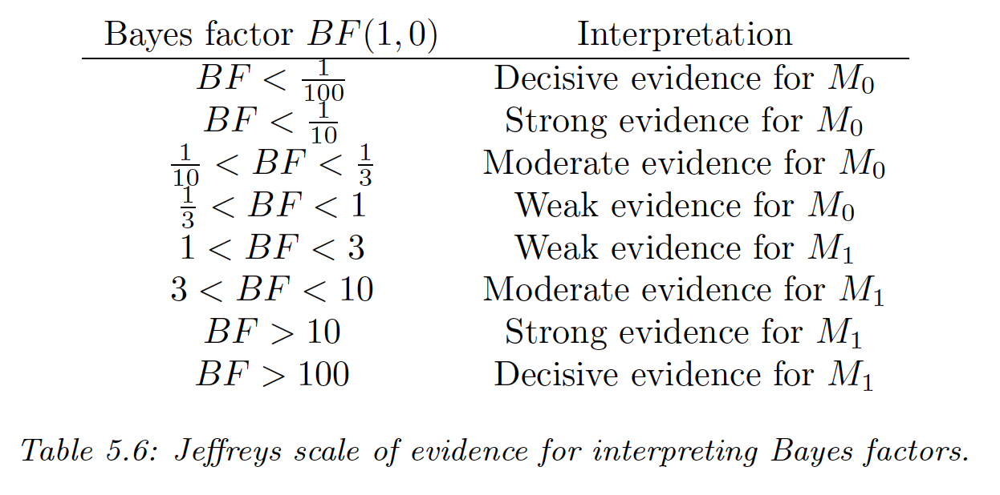
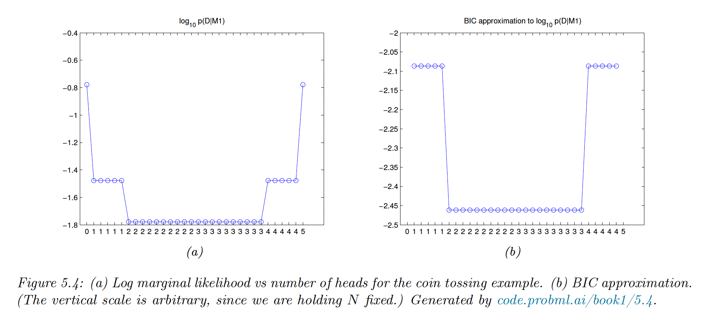
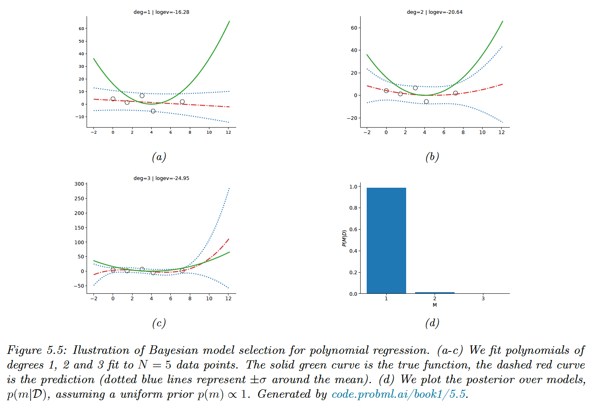
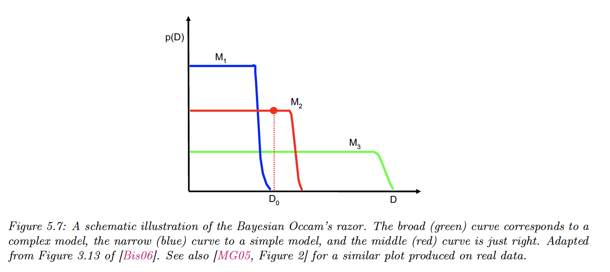
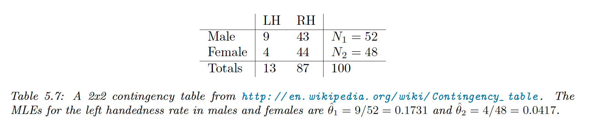

# 5.2 Choosing the right model

We can use Bayesian decision theory to choose the best model among candidates.

### 5.2.1 Bayesian hypothesis testing

We have two hypothesis: the null $M_0$ and the alternative $M_1$ and we want to know which one is more likely to be true: this is hypothesis testing.

If we use zero-one loss, the optimal decision is to pick $H_1$ when $p(M_1|\mathcal{D})>p(M_0|\mathcal{D})$. With uniform prior, $p(M_1)=p(M_0)=0.5$ and hence we pick $M_1$  when the **Bayes factor** is:

$$
B_{10}\triangleq\frac{p(\mathcal{D}|M_1)}{p(\mathcal{D}|M_0)}>1
$$

This is close to a **likelihood ratio** except we integrate out the parameters, so that we can compare models of different complexity, due to the Bayesian Occam’s razor effect. 

The Bayes factor is the frequentist equivalent to p-values.

 

**Exemple: testing the fairness of a coin**

The marginal likelihood under $H_0$ is simply:

$$
p(\mathcal{D}|M_0)=\Big(\frac{1}{2}\Big)^N
$$

And the marginal likelihood under $H_1$ by taking a Beta prior is:

$$
p(\mathcal{D}|M_1)=\int p(\mathcal{D}|\theta)p(\theta)d\theta=\frac{B(a+N_1,b+N_0)}{B(a,b)}
$$

We prefer $M_0$ over $M_1$ when observing 2 or 3 heads. The figure below list all the possible draw 
($2^5$) for 5 tosses.

### 5.2.2 Model selection

We now have more than 2 models and need to pick the most likely. We can view model selection as decision theory problem, where the action space requires choosing a model $m\in \mathcal{M}$.

If we have a 0-1 loss, the optimal action is to pick the higher posterior over models:

$$
\hat{m}=\argmax_{m\in\mathcal{M}} p(m|\mathcal{D})
$$

With a uniform prior, $p(m)=1/|\mathcal{M}|$, then the MAP is given by:

$$
\hat{m}=\argmax_{m\in\mathcal{M}} p(\mathcal{D}|m)
$$

with the marginal likelihood:

$$
p(\mathcal{D}|m)=\int p(\mathcal{D}|\theta,m)p(\theta|m)d\theta
$$

If all settings of $\theta$ assign a high probability to the data, $m$ is probably a good model.

We use a uniform prior over models and use empirical Bayes to estimate the prior over the regression weights. We then compute the evidence for each model. With $N=5$, there is not enough data to choose a more complex model than degree of 1.

### 5.2.3 Occam’s razor

Consider two models: a simpler one $m_1$ and a more complex one $m_2$. If both can explain the data equally well, ie $p(\mathcal{D}|\theta_1,m_1)\approx p(\mathcal{D}|\theta_2,m_2)$, then we should choose the simpler one.

This is because the complex model will put less prior probability on the “good parameters” that explain the data, since the prior must integrate to 1 over the feature space.

The figure present the predictions (marginal likelihood) of 3 models on increasingly more “complex“ datasets ($D_0$ is the observed dataset, on which $M_2$ is optimal).

### 5.2.4 Connection between cross validation and marginal likelihood

Marginal likelihood helps us choose models of the right complexity. In non-Bayesian approaches, it is standard to select model via cross validation.

The marginal likelihood can be written:

$$
p(\mathcal{D}|m)=\prod_{n=1}^Np(y_n|y_{n-1},x_{1:N},m)=\prod_{n=1}^N p(y_n|x_n,\mathcal{D}_{1:n-1},m)
$$

and by using the plugin approximation:

$$
\begin{align}
p(y|x,\mathcal{D}_{1:n-1},m)&=\int p(y|x,\theta)p(\theta|\mathcal{D}_{1:n-1},m)d\theta \\
&\approx \int p(y|x,\theta)\delta(\theta-\hat{\theta}_m(\mathcal{D}_{1:n-1}))d\theta
\\
&= p(y|x,\hat{\theta}_m(\mathcal{D}_{1:n-1}))
\end{align}
$$

Finally:

$$
\log p(\mathcal{D}|m)\approx\sum_{n=1}^N \log p(y_n|x_n,\hat{\theta}_m({\mathcal{D}_{1:n-1}}))
$$

This is similar to the leave-one-out cross validation (LOO-CV) which has the form:

$$
\log p(\mathcal{D}|m)\approx\sum_{n=1}^N \log p(y_n|x_n,\hat{\theta}_m({\mathcal{D}_{1:n-1,n+1:N}}))
$$

except the marginal likelihood ignores the $\mathcal{D}_{n+1:N}$ part.

Overly complex models will overfit the early data examples and will predict the remaining poorly, leading to a low CV score.

### 5.2.5 Information criteria

The marginal likelihood $p(\mathcal{D}|m) = \int p(\mathcal{D}|\theta)p(\theta|m)d\theta$ can be difficult to obtain since it requires integrating over the entire parameter space.

We introduce alternative information criterias

**5.2.5.1 Bayesian information criterion (BIC)**

BIC can be considered as a simple approximation to the marginal likelihood. If we make a Gaussian approximation to the posterior and use the quadratic approximation from section 4.6.8.2:

$$
\log p(\mathcal{D}|m)\approx\log p(\mathcal{D}|\hat{\theta}_{map})+\log p(\hat{\theta}_{map})-\frac{1}{2}\log |\bold{H}|
$$

where $\bold{H}$ is the hessian of the negative log joint $\log p(\mathcal{D},\theta)$ evaluated in $\hat{\theta}_{map}$. The hessian is called the Occam factor since it measures the model complexity.

So:

$$
\bold{H}=\sum_{i=1}^N \bold{H}_i = \sum_{i=1}^N \nabla \nabla \log p(\mathcal{D_i},\theta)
$$

Let’s approximate each $\bold{H}_i$ by a constant $\hat{\bold{H}}$:

$$
\log |\bold{H}|=\log |N\hat{\bold{H}}|= \log N^D|\bold{\hat{H}}|=D\log N +\log |\hat{\bold{H}}|
$$

Where $D=\dim(\theta)$. We can drop the last term, constant in $N$.

With a uniform prior, $p(\theta) \propto 1$, we have the BIC score:

$$
J_{\mathrm{BIC}}(m)=\log p(\mathcal{D}|m) \approx \log p(\mathcal{D}|\hat{\theta},m) - \frac{D_m}{2} \log N
$$

Then the BIC loss is

$$
\mathcal{L}_{\mathrm{BIC}}(m)=-2 J_{\mathrm{BIC}}(m)=-2\log p(\mathcal{D}|\hat{\theta},m)+D_m \log N
$$

**5.2.5.2 Akaike information criterion (AIC)**

It has the form:

$$
\mathcal{L}_{\mathrm{AIC}}(m)=-2 \log p(\mathcal{D}|\hat{\theta},m) + 2D
$$

This penalizes less heavily than BIC since the penalty doesn’t depend on $N$

### 5.2.6 Posterior inference over effect sizes and Bayesian significance testing

Bayesian hypothesis testing leverages the Bayes factor $p(\mathcal{D}|H_0)/p(\mathcal{D}|H_1)$ but computing the marginal likelihood is computationally difficult and the results can be sensitive to the choice of the prior.

We are often more interested in the effect size, e.g. when comparing the means of 2 models 
$\delta=\mu_1-\mu_2$. The probability that the mean of $m_1$ is higher than mean of $m_2$ can be computed as  $p(\delta>\epsilon|\mathcal{D})$ or $p(|\delta|>\epsilon|\mathcal{D})$, with $\epsilon$  the minimum magnitude effect (one-sided or two-sided t-test).

More generally, $R=[-\epsilon,\epsilon]$ represents the region of practical equivalence (ROPE). We can define 3 events of interest:

- The null hypothesis $H_0$, when $\delta \in R$ (which is more realistic than $\delta =0$)
- $H_A$: $\delta > \epsilon$, $m_1$ is better than $m_2$
- $H_B$: $\delta < -\epsilon$, the opposite

To choose among these hypothesis, we have to estimate $p(\delta|\mathcal{D})$, which avoids computing the Bayes factor.

**Bayesian t-test for difference in means**

Let $e^i_m$ be the error of method $m$ on sample $i$. Since the samples are common across datasets, we use paired test, that better compare methods than average performances.

Let $d_i=e^i_1-e^i_2$, we assume $d_i \sim \mathcal{N}(\delta,\sigma^2)$ and our goal is to estimate $p(\delta|\bold{d})$ with 
$\bold{d}=(d_1,...,d_n)$.

If we use a non-informative prior, one can show that the posterior marginal for the mean is given by the student distribution:

$$
p(\delta|\bold{d})=\mathcal{T}(\delta|\mu, s^2/N)
$$

with the sample mean $\mu = \frac{1}{N}\sum^N_{i=1}d_i$  and an unbiased estimate of the variance 
$s^2= \frac{1}{N-1}\sum^N_{i=1}(\mu - d_i)^2$.

Therefore we can easily compute $p(|\delta|>\epsilon|\bold{d})$ with a ROPE of $\epsilon=0.01$

**Bayesian $\chi^2$-test for differences in rates**

Let $y_m$ be the number of correct sample for method $m$ over a total of $N_m$  trial, so the accuracy is $y_m/N_m$.

We assume $y_m \sim \mathrm{Bin}(N_m,\theta_m)$, and we are interested in $p(\delta|\mathcal{D})$ with $\delta=\theta_1-\theta_2$ and 
$\mathcal{D}=(N_1,y_1,N_2,y_2)$.

If we use a uniform prior: $p(\theta_m)=\mathrm{Beta}(\theta_m|1,1)$, our posterior is:

$$
p(\theta_1,\theta_2|\mathcal{D})=\mathrm{Beta}(\theta_1|y_1+1,N_1-y_1+1) \mathrm{Beta}(\theta_2|y_2+1,N_2-y_2+1)
$$

The posterior for $\delta$ is given by:

$$
p(\delta|\mathcal{D})
= \int^1_0 \mathrm{Beta}(\theta_1|y_1+1,N_1-y_1+1)\mathrm{Beta}(\theta_1-\delta|y_2+1,N_2-y_2+1)d\theta_1
$$

We can compute it for any $\delta$:

$$
p(\delta>\epsilon|\mathcal{D})=\int^{+\infin}_{\epsilon} p(\delta|\mathcal{D}) d\delta
$$

This can be computed using 1-dimensional numerical integration or analytically.

Note that data is often summarized in a contingency table:

