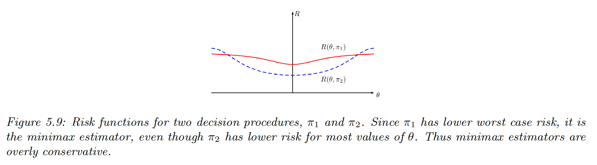

# 5.3 Frequentist decision theory

In frequentist decision theory, we don’t use prior and thus no posterior, so we can’t define the risk as the posterior expected loss anymore.

### 5.3.1 Computing the risk of an estimator

The frequentist risk of an estimator $\pi$, applied to data $x$ sampled from the likelihood $p(x|\theta)$:

$$
R(\theta,\pi) \triangleq \mathbb{E}_{p(x|\theta)}[\ell(\theta,\pi(x))]
$$

**Exemple**

We estimate the true mean of a Gaussian. Let $x_n \sim \mathcal{N}(\theta^*,\sigma^2=1)$. We use a quadratic loss, so the risk is the MSE.

We compute the risk for different estimators, the MSE can be decomposed:

$$
\mathrm{MSE}(\hat{\theta}|\theta^*)=Var[\hat{\theta}] +bias^2(\hat{\theta})
$$

with $bias(\hat{\theta})=\mathbb{E}[\hat{\theta}-\theta^*]$.

- $\pi_1=\bar{x}$ is the sample mean. This is unbiased, so its risk is:

$$
\mathrm{MSE}(\pi_1|\theta^*)=\frac{\sigma^2}{N}
$$

- $\pi_2=\mathrm{median}(\mathcal{D})$. This is also unbiased. One can show its variance is approximately:

$$
\mathrm{MSE}(\pi_2|\theta^*)=\frac{\pi}{2N}
$$

- $\pi_3$ returns the constant $\theta_0$ so its biased is $(\theta_0-\theta^*)$, and its variance is zero. Hence:

$$
\mathrm{MSE}(\pi_3|\theta^*)=(\theta_0-\theta^*)^2
$$

- $\pi_\kappa$ is the posterior mean under a $\mathcal{N}(\theta|\theta_0,\sigma^2/\kappa)$ prior:

$$
\pi_\kappa(\mathcal{D})=\frac{N}{N+\kappa}\bar{x}+\frac{\kappa}{N+\kappa}\theta_0=w \bar{x}+(1-w)\theta_0
$$

We can derive its MSE as follow:

$$
\begin{align}
\mathrm{MSE}(\pi_k|\theta^*)&= \mathbb{E}[(w\bar{x}+(1-w)\theta_0-\theta^*)^2] \\
&= \mathbb{E}[(w(\bar{x}-\theta^*)+(1-w)(\theta_0-\theta^*))^2] \\
&= w^2 \frac{\sigma^2}{N}+(1-w)^2(\theta_0-\theta^*)^2 \\
&= \frac{1}{(N+\kappa)^2}(N\sigma^2+\kappa^2(\theta_0-\theta^*)^2)
\end{align}
$$

The best estimator depends on $\theta^*$, which is unknown. If $\theta_0$ is far from $\theta^*$, the MLE is best.

**Bayes risk**

In general the true distribution of $\theta$  is unknown, so we can’t compute $R(\theta,\pi)$. One solution is to average out all values of the prior $\pi_0$ for $\theta$. This is the Bayes risk or integrated risk.

$$
R(\pi_0,\pi) \triangleq \mathbb{E}_{\pi_0(\theta)}[R(\theta,\pi)]=\int_{\Theta} \int_{\mathcal{X}}p(x|\theta)\ell(\theta,\pi(x)) dx \;\pi_0(\theta)d\theta
$$

The Bayes estimator minimizes the Bayes risk:

$$
\pi(x)=\argmin_a \int \pi_0(\theta)p(x|\theta)\ell(\theta,a)d\theta=\argmin_a\int p(\theta|x) \ell(\theta,a)d\theta
$$

which corresponds to optimal policy recommended by Bayesian decision theory [here](5%201%20Bayesian%20decision%20theory%20e90b5d5f211b4a31aba558291536af58.md).

**Maximum risk**

To avoid using a prior in frequentist, we can define the maximum risk:

$$
R_{max}(\pi) \triangleq \sup_\theta R(\theta,\pi)
$$

To minimize the maximum risk, we use minimax $\pi_{MM}$. Computing them can be hard though.

### 5.3.2 Consistent estimators

An estimator $\pi: \mathcal{X}^N\rightarrow\Theta$ is consistent when $\hat{\theta}(\mathcal{D}) \rightarrow \theta^*$ as $N\rightarrow +\infin$, where the arrow is the convergence in probability.

This is equivalent to minimizing the 0-1 loss $\mathcal{L}(\hat{\theta},\theta^*)= \mathbb{I}(\hat{\theta}\neq \theta^*)$.

An example of consistent estimator is the MLE.

Note that an estimator can be unbiased but not consistent, like $\pi(\{x_1,...,x_N\})=x_N$. Since $\mathbb{E}[\pi(\mathcal{D})]=\mathbb{E}[x]$ this is unbiased, but the sampling distribution of $\pi(\mathcal{D})$ doesn’t converge to a fix value so it is not consistent.

In practice, it is more useful to find some estimators that minimize the discrepancy between our empirical distribution $p_\mathcal{D}(x|\mathcal{D})$ and the estimated distribution $p(x|\hat{\theta})$. If this discrepancy is the KL divergence, our estimator is the MLE.

### 5.3.3 Admissible estimators

$\pi_1$ dominates $\pi_2$ if:

$$
\forall\theta,R(\theta,\pi_1)\leq R(\theta,\pi_2)
$$

An estimator is admissible when it is not dominated by any others.

In figure 5.8 above, we see that the risk of the sample median $\pi_2$ is dominated by the sample mean $\pi_1$.

However this concept of admissibility is of limited value, since $\pi_3(x)=\theta_0$ is admissible even though this doesn’t even look at the data.