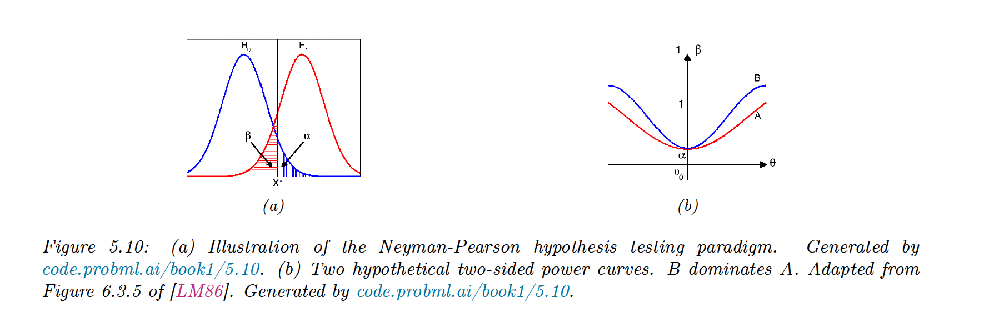
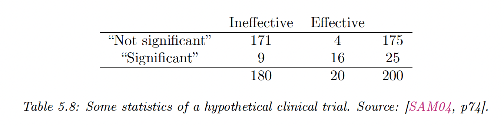

# 5.5 Frequentist hypothesis testing

The Bayes factor $p(H_0|\mathcal{D})/p(H_1|\mathcal{D})$ is expensive to compute since it requires integrating over all parametrization of model $H_0$ and $H_1$. It’s also sensitive to the choice of prior.

### 5.5.1 Likelihood ratio test

If we use 0-1 loss, and assume that $p(H_0)=p(H_1)$, then the optimal decision rule is to accept $H_0$ if:

$$
\frac{p(\mathcal{D}|H_0)}{p(\mathcal{D}|H_1)}>1
$$

**Gaussian means**

If we have two Gaussian distributions with $\mu_0$ and $\mu_1$ and known shared variance $\sigma^2$, the likelihood ratio test is:

$$
\begin{align}
\frac{p(\mathcal{D}|H_0)}{p(\mathcal{D}|H_1)}&=\frac{\exp\Big(-\frac{1}{2\sigma^2}\sum_{n=1}^N (x_n-\mu_0)^2\Big)}{\exp\Big(-\frac{1}{2\sigma^2}\sum_{n=1}^N (x_n-\mu_1)^2\Big)} \\
&= \exp \Big(\frac{1}{2\sigma^2}(2N\bar{x}(\mu_0-\mu_1))+N\mu_1^2-N\mu_0^2)\Big)
\end{align}
$$

Thus the test only depends on the observed data on the sufficient statistic $\bar{x}$. From the figure below, we see that we accept $H_0$ if $\bar{x}<x^*$:

**Simple vs compound parameters**

In our simple hypothesis test above, parameters were either specified ($\mu_0,\mu_1$) or shared ($\sigma^2$).

A compound hypothesis doesn’t specify all parameters, and we should integrate out these unknown parameters like in the Bayesian hypothesis testing:

$$
\frac{p(\mathcal{D}|H_0)}{p(\mathcal{D}|H_1)}=\frac{\int_{\theta \in H_0} p(\theta)p_{\theta}(\mathcal{D})}{\int_{\theta \in H_1} p(\theta)p_{\theta}(\mathcal{D})} \approx \frac{\max_{\theta \in H_0}p_\theta(\mathcal{D})}{\max_{\theta \in H_1} p_\theta(\mathcal{D})}
$$

As an approximation, we can maximize them out, giving the maximum likelihood ratio.

### 5.5.2 Null hypothesis significance testing (NHST)

Instead of assuming the 0-1 loss, we design a decision rule with a false positive (error type I) probability of $\alpha$, called the significance of the test.

In our Gaussian example:

$$
\begin{align}
\alpha(\mu_0)&=p(\mathrm{reject}\; H_0|H_0\;\mathrm{is\ true})\\
&= p(\bar{X}(\mathcal{D})>x^*|\mathcal{D}\sim H_0) \\
&= p\Big(\frac{\bar{X}-\mu_0}{\sigma/\sqrt{N}}>\frac{x^*-\mu_0}{\sigma /\sqrt{N}}\Big)
\end{align}
$$

Hence:

$$
x^*=z_\alpha \sigma /\sqrt{N} + \mu_0
$$

with $z_\alpha$ the upper $\alpha$-quantile of the standard Normal.

Let’s $\beta$ be the false negative error (error type II) probability:

$$
\beta(\mu_1)=p(\mathrm{accept\;} H_0|H_1\,\mathrm{is\ true})
$$

The power of a test is $1-\beta(\mu_1)$, it is the probability of rejecting $H_0$ when $H_1$ is true

The least power occurs when the two Gaussian overlap: $\alpha(\mu_0)=1-\beta(\mu_1)$

When $\mathrm{power}(B)\geq\mathrm{power}(A)$, for the same type I error, $B$ dominates $A$.

### 5.5.3 p-values

Rather than arbitrarily declaring a result significant or not, we compute its p-value:

$$
\mathrm{pval}(\mathrm{test}(\mathcal{D})) \triangleq \Pr\Big(\mathrm{test}(\mathcal{\tilde{D}})\geq \mathrm{test}(\mathcal{D})|\mathcal{\tilde{D}}\sim H_0\Big)=\alpha
$$

If we accept hypothesis where $\alpha=0.05$, then 95% of the time we will correctly reject $H_0$. However, **it doesn’t** mean that $H_1$ is true with probability 0.95. 

That quantity is given by the Bayesian posterior $p(H_1|\mathcal{D})=0.95$

### 5.5.4 p-values considered harmful

The frequent and invalid reasoning about p-value is: 

“If $H_0$ is true, then this test statistic would probably not occur. This statistic did occur, therefore $H_0$ is false“.

This gives us: “If this person is American, he is probably not a member of congress. He is a member of Congress. Therefore he is probably not American”

This is **induction**: reasoning backward from observed data to probable causes, using statistics regularity and not logical definitions. Logic usually works with **deduction**: $P \Rightarrow Q$.

To perform induction, we need to compute the probability of $H_0$:

$$
p(H_0|\mathcal{D})=\frac{p(\mathcal{D}|H_0)p(H_0)}{p(\mathcal{D}|H_1)p(H_1)+p(\mathcal{D}|H_0)p(H_0)}=\frac{LR}{1+LR}
$$

when the prior is uniform with $p(H_0)=p(H_1)=0.5$ and the likelihood ratio $LR$.

If “being an American” is $H_0$ and “being a member of Congress” is $\mathcal{D}$, then $p(\mathcal{D}|H_0)$ is low, and $p(\mathcal{D}|H_1)$ is zero, thus the probability of $H_0$ is 1, which follows intuition.

The NHST ignores $p(\mathcal{D}|H_1)$ and also $p(H_0)$, hence the wrong results. This is why p-values can be much different from $p(H_0|\mathcal{D})$.

$$
\begin{align}
p(H_0|"Sig")&=\frac{p("Sig"|H_0)p(H_0)}{p("Sig"|H_0)p(H_0)+p("Sig"|H_1)p(H_1)} \\
&= \frac{\alpha p(H_0)}{\alpha p(H_0)+(1-\beta)p(H_1)} \\ 
&\approx 0.36
\end{align}
$$

Which is far greater that the 5% probability people often associate with a p-values of 
$\alpha=9/180=0.05$

### 5.5.5 Why isn’t everyone a Bayesian?

The frequentist theory yields counter-intuitive results because it violates the likelihood principle, saying that inference should be made based on prior knowledge, not on some unseen future data.

Bradley Efron wrote [Why isn’t everyone a Bayesian](https://www2.stat.duke.edu/courses/Spring10/sta122/Handouts/EfronWhyEveryone.pdf), stating that if the 19th century was Bayesian and the 20th frequentist, the 21th could be Bayesian again.

Some journals like *The American Statistician* have already banned or warn against p-values and NHST.

Computation has traditionally been a major road block for Bayesian, which is less of an issue nowadays with fast algorithms and powerful computers.

Also, the Bayesian modeling assumptions can be restraining, but this is true as well for the Frequentist since sampling distribution relies on some hypothesis about data generation.

We can check models empirically using cross-validation, calibration and Bayesian model checking.