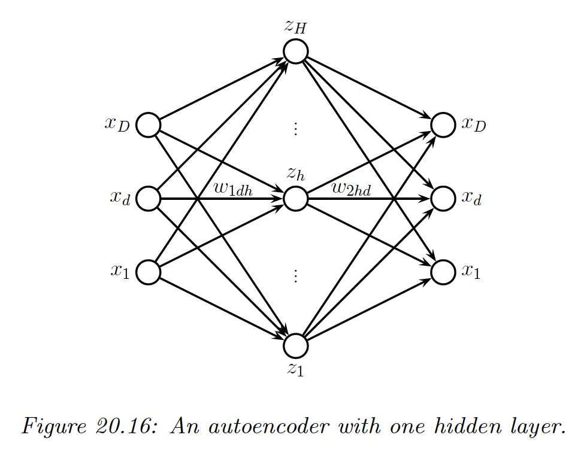
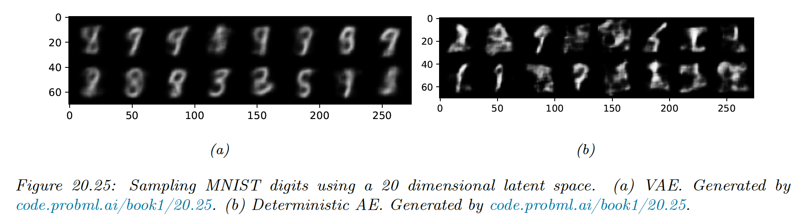

# 20.3 Autoencoders

We can think of PCA and factor analysis (FA) as learning a mapping $f_e:\bold{x}\rightarrow \bold{z}$ called the encoder and another mapping $f_d:\bold{z}\rightarrow \bold{x}$ called the decoder.

The model tries to minimize the following loss function:

$$
\mathcal{L}(\theta)=||\bold{x}-r(\bold{x})||^2_2
$$

where the reconstruction function is $r(\bold{x})=f_d(f_e(\bold{x}))$.

More generally, we can use:

$$
\mathcal{L}(\theta)=-\log p(\bold{x}|r(\bold{x}))
$$

In this section, we consider the case where encoder and decoder are nonlinear mappings implemented by neural nets. This is called an **autoencoder**.

If we use an MLP with one hidden layer, we get:

We can think of the hidden units in the middle as a low-dimensional **bottleneck** between the input and its reconstruction.

If the hidden layer is wide enough, we can’t prevent it from learning the identity function. To avoid this degenerate solution, we can set use a narrow bottleneck layer $L\ll D$; this is called **undercomplete representation**.

The other approach is to use $L\gg D$, known as an **overcomplete representation**, but to impose some kind of regularization, such as adding noise to the inputs, forcing the activation of the hidden units to be sparse, or imposing a penalty on the derivate of the hidden units. 

### 20.3.1 Bottleneck autoencoders

We start by considering linear autoencoders, in which there is one hidden layer.

The hidden units are computed using:

$$
\bold{z}=W_1\bold{x}
$$

 and the output is reconstructed using

$$
\bold{\hat{x}}=W_2\bold{z}
$$

where $W_1\in \R^{L\times D}$, $W_2\in, \R^{D\times L}$ and $L<D$.

Hence the output of the model is:

$$
\bold{\hat{x}}=W_2W_1\bold{x}=W\bold{x}
$$

If we train this model to minimize the squared reconstruction error,

$$
\mathcal{L}(W)=\frac{1}{N}\sum_{n=1}^N||\bold{x}_n-W\bold{x}_n||_2^2
$$

one can show that $\hat{W}$ is an orthonal projection onto the first $L$ eigenvectors of the covariance matrix of $X$. This is therefore equivalent to PCA.

If we introduce nonlinearity in the autoencoder, we get a model that is strictly more powerful than PCA.

We consider both an MLP architecture (2 layers and a bottleneck of size 30), and a CNN based architecture (3 layers, and a 3d bottleneck with 64 channels).

We use a Bernoulli likelihood model and binary cross entropy at the loss.

We see that the CNN model reconstructs the images more accurately than the MLP model (although both models are small and only trained on 5 epochs).

We visualize above the first 2 (of 30) latent dimensions produced by the MLP-AE, by plotting the tSNE embeddings, color coded by class label.

We see that both this method and the CNN have done a good job of separating the classes in a fully unsupervised way. We also see that both latent spaces are similar when viewed through 2d projection.

### 20.3.2 Denoising autoencoders

One way to control the capacity of an autoencoder is to add noise to the input, and then train the model to reconstruct the uncorrupted version of the input. This is called a **denoising autoencoder**.

We can implement this by adding Gaussian noise or Bernoulli dropout.

We see that the model is able to hallucinate details that are missing in the input, because it has already see similar images before and can store this information in its parameters.

Suppose we train a DAE using Gaussian corruption and squared error reconstruction, i.e. we use:

$$
p_c(\bold{\tilde{x}}|\bold{x})=\mathcal{N}(\bold{\tilde{x}}|\bold{x},\sigma^2I)
$$

and:

$$
\ell(\bold{x},r(\bold{\tilde{x}}))=||\bold{e}||^2_2=||r(\bold{\tilde{x}})-\bold{x}||^2_2
$$

where $\bold{e}$ is the residual error.

Then one can show that as $\sigma\rightarrow 0$ (and with a sufficiently powerful model and enough data), the residuals approximate the score function, which is the log probability of the data:

$$
\bold{e}(\bold{x})\approx \nabla_\bold{x}\log p(\bold{x})
$$

That is, the DAE learns a **vector field**, corresponding to the gradient of the log data density. Thus, points that are close to the manifold will be projected onto it via the sampling process.

### 20.3.3 Contractive autoencoders

A different way to regularize autoencoders is to adding a penalty term to the reconstruction loss:

$$
\Omega(\bold{z},\bold{x})=\lambda||\frac{\partial f_e(\bold{x})}{\partial \bold{x}} ||^2_F=\lambda\sum_{k}||\nabla_\bold{x}h_k(\bold{x})||^2_2
$$

where $h_k$ is the value of the $k$th hidden embedding unit.

We penalize the Frobenius norm of the encoder’s Jacobian. This is called a **contractive AE (CAE)**. A linear operator with Jacobian $J$ is called a **contraction** if $||J\bold{x}||_2\leq 1$ for all unit norm input $\bold{x}$.

Intuitively, to minimize the penalty, the model would like to ensure the encoder is a constant function. However, if it was completely constant, it would ignore its input and hence incur high reconstruction error.

Thus, the two terms together encourage to model to learn a representation where only a few units change in response to the most significant variation of the input.

Unfortunately, CAEs are slow to train due to the expense of computing the Jacobian.

### 20.3.4 Sparse autoencoders

Another way to regularize AEs is to add a sparsity penalty to the latent activations of the form:

$$
\Omega(\bold{z})=\lambda||\bold{z}||_1
$$

This is called **activity regularization**.

An alternative way to implement sparsity is to use logistic units, and then compute $q_k$, the average activation on each unit $k$ in a minibatch.

We use:

$$
\Omega(\bold{z}_{1:L,1:N})=\lambda\sum_{k=1}^LD_{\mathbb{KL}}(\bold{p},\bold{q}_k)
$$

where $\bold{p}=(p,1-p)$ is the desired target distribution and $\bold{q}_k=(q_k,1-q_k)$ is the empirical distribution for unit $k$, computed as:

$$
q_k=\frac{1}{N}\sum_{n=1}^N\mathbb{I}(z_{nk}=1)
$$

We show below the activation of the hidden layer for a AE-MLP (with 300 hidden units).

### 20.3.5 Variational autoencoders (VAE)

**VAE** can be thought of as a probabilistic version of the deterministic AE  we previously saw. The principle advantage is that VAE is a generative model that can create new samples, whereas an autoencoder generates embeddings of input vectors.

VAEs combined two key ideas.

First we create a non linear extension of the factor analysis generative model, i.e. we replace:

$$
p(\bold{x}|\bold{z})=\mathcal{N}(\bold{x}|W\bold{z},\sigma^2I)
$$

with:

$$
p(\bold{x}|\bold{z};\theta)=\mathcal{N}(\bold{x}|f_d(\bold{z};\theta),\sigma^2I)
$$

where $f_d$ is the decoder.

For binary observations we should use a Bernoulli likelihood:

$$
p(\bold{x}|\bold{z};\theta)=\prod_{i=1}^D\mathrm{Ber}(x_i|f_d(\bold{z;\theta}))
$$

Second, we create another model $q(\bold{z}|\bold{x})$ called the **recognition network** or **inference network**, that is trained simultaneously with the generative model to approximate the posterior inference.

If we assume the posterior is Gaussian with diagonal variance we get:

$$
q(\bold{z}|\bold{x})=\mathcal{N}(\bold{z}|f_{e,\mu}(\bold{x};\phi),\mathrm{diag}(f_{e,\sigma}(\bold{x};\phi)))
$$

Thus, we train an inference network to “invert” a generative network, rather than running the optimization algorithm to infer the latent code. This is called **amortized inference**.

**20.3.5.1 Trainings VAEs**

We can’t compute the exact marginal likelihood $p(\bold{x}|\theta)$ needed for MLE training, because posterior inference in a nonlinear FA model is intractable. However, we can use the inference network to compute an approximation of the posterior $q(\bold{z}|\bold{x})$.

We can then use this to compute the **evidence lower bound (ELBO)**. For a single example $\bold{x}$, this is given by:

$$
\begin{align}
Ł(\theta,\phi|\bold{x})&=\mathbb{E}_{q(\bold{z|x},\phi)}[\log p(\bold{x},\bold{z}|\theta)-\log q(\bold{z|x};\phi)] \\
&= \mathbb{E}_{q(\bold{z|x},\phi)}[\log p(\bold{x|z};\theta)]-D_{\mathbb{KL}}(q(\bold{z|x};\phi)||p(\bold{z}))
\end{align}
$$

This can be interpreted as the expected log likelihood, plus a regularizer that penalize the posterior from deviating too much from the prior. This is different from sparse AEs where we apply KL penalty to the aggregate posterior in each minibatch.

The ELBO is a lower bound on the log marginal likelihood (aka evidence) as can be seen from Jensen’s inequality:

$$
\begin{align}
Ł(\theta,\phi|\bold{x})&=\int q(\bold{z}|\bold{x},\phi)\log \frac{p(\bold{x,z}|\theta)}{q(\bold{z}|\bold{x},\phi)}d\bold{z} \\
&\leq \log \int q(\bold{z|x,\phi})\frac{p(\bold{x,z}|\theta)}{q(\bold{z}|\bold{x},\phi)}d\bold{z} \\
&= \log p(\bold{x|\theta})
\end{align}
$$

Thus, for a fix inference network $\phi$, increasing the ELBO should increase the log likelihood of the data.

**20.3.5.2 The reparameterization trick**

We now discuss how to compute the ELBO and its gradient. Since $q_\phi$  is Gaussian, we can write:

$$
\bold{z}=f_{e,\mu}(\bold{x};\phi)+f_{e,\sigma}(\bold{x};\phi)\odot \epsilon
$$

where $\epsilon\sim \mathcal{N}(\bold{0},I)$. Hence:

$$
\begin{align}
Ł(\theta,\phi|\bold{x})&=\mathbb{E}_{\epsilon\sim N(\bold{0},I)}[\log p(\bold{x}|\bold{z}=f_{e,\mu}(\bold{x};\phi)+f_{e,\sigma}(\bold{x};\phi)\odot \epsilon;\theta)]\\
&-D_{\mathbb{KL}}(q(\bold{z|x};\phi)||p(\bold{z}))
\end{align}
$$

Now the expectation is independent of the parameters of the model so we can push gradients inside and use backpropagation for training the usual way, by minimizing $-\mathbb{E}_{\bold{x}\in \mathcal{D}}[Ł(\theta,\phi|\bold{x})]$ wrt $\phi$ and $\theta$. This is known as the **reparameterization trick**.

The first term of the ELBO can be approximated by sampling $\epsilon$, scaling it by the output of the inference network to get $\bold{z}$, and then evaluating $\log p(\bold{x|z})$ using the decoder network.

The second term of the ELBO is the KL of two Gaussian, which has a close form solution. In particular, by using $p(\bold{z})=\mathcal{N}(\bold{z}|\bold{0},I)$ and $q(\bold{z})=\mathcal{N}(\bold{z}|\mu,\mathrm{diag}({\sigma}))$, we get:

$$
\begin{align}
D_{\mathbb{KL}}(q||p)&=\sum_{k=1}^K \Big[\log(\frac{1}{\sigma_k})+\frac{\sigma^2+(\mu_k-0)^2}{2.1}-\frac{1}{2}\Big]\\

&=-\frac{1}{2}\sum_{k=1}^K [\log \sigma^2_k-\sigma^2_k+\mu_k^2+1]
\end{align}
$$

(see section 6.3 for details).

**20.3.5.3 Comparison of VAEs and autoencoders**

VAEs are very similar to autoencoders, where the generative model $p(\bold{x|z};\theta)$ acts like the decoder and the inference network $q(\bold{z}|\bold{x};\phi)$ acts like the encoder.

Their reconstruction abilities are similar.

The primary advantage of the VAE is that it can be used to generate new data from random noise. In particular, we sample $\epsilon \sim\mathcal{N}(\bold{0},I)$, scale it to get $\bold{z}$ and then pass this through the decoder to get $\mathbb{E}[\bold{x}|\bold{z}]=f_d(\bold{z};\theta)$.

The VAE’s decoder is trained to convert random points in the embedding space (generated by perturbing the input encodings) to sensible outputs.

By contrast, the decoder for the deterministic AE only ever gets as input the exact encodings of the training set, so it is not equipped to handle random inputs outside of what it has been trained on. So, a standard AE can’t create new samples.

The reason the VAE is better at sample is that it embeds images into Gaussians in latent space, whereas the AE embeds images into points, which are like delta functions.

The advantage of using a latent distribution is that it encourages local smoothness, since a given image may map to multiple nearby places, depending on the stochastic sampling.

By contrast, in a AE, the latent space is typically not smooth, so images from different classes often end-up next to each other.

We can leverage smoothness of the latent space to perform **linear interpolation**.

Let $\bold{x}_1$ and $\bold{x}_2$ be two images and let $\bold{z}_1=\mathbb{E}_{q(\bold{z|x}_1)}[\bold{z}]$ and $\bold{z}_2=\mathbb{E}_{q(\bold{z|x}_2)}[\bold{z}]$ be their embeddings. We can now generate new images that interpolate between these two anchors by computing:

$$
\bold{z}=\lambda \bold{z}_1+(1-\lambda)\bold{z}_2
$$

where $0\leq\lambda\leq1$, and then decoding by using $\mathbb{E}[\bold{x|z}]$.

This is called **latent space interpolation**. We can use a linear interpolation since it has been shown that the learned manifold has approximately zero curvature.

