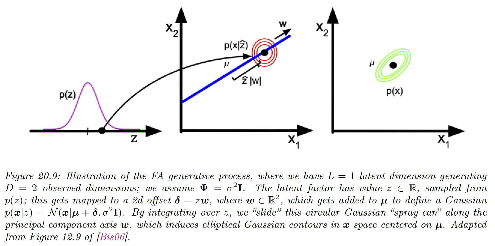

# 20.2 Factor analysis

PCA is a simple form of linear low-dimensional representation of the data.

Factor analysis is a generalization of PCA based on probabilistic model, so that we can treat it as building block for more complex models such as mixture of FA models or nonlinear FA models.

### 20.2.1 Generative model

Factor analysis is a linear-Gaussian latent variable generative model:

$$
\begin{align}
p(\bold{z}) &=\mathcal{N}(\bold{z}|\mu_0,\Sigma_0)\\
p(\bold{x}|\bold{z},\theta)&=\mathcal{N}(\bold{x}|W\bold{z}+\mu|\Psi)
\end{align}

$$

where $W\in\R^{D\times L}$ is known as the **factor loading matrix** and $\Psi\in\R^{D\times D}$ is the covariance matrix.

FA can be thought as a low-rank version of a Gaussian distribution. To see this, note that the following induced marginal distribution is Gaussian:

$$
\begin{align}
p(\bold{x}|\theta)&=\int p(\bold{x}|\bold{z},\theta)p(\bold{z})d\bold{z} \\
&= \int \mathcal{N}(\bold{x}|W\bold{z}+\mu,\Psi)\mathcal{N}(\bold{z}|\mu_0,\Sigma_0)d\bold{z} \\
&=\mathcal{N}(\bold{x}|W\mu_0+\mu,\Psi + W \Sigma_0W^\top)
\end{align}
$$

Without loss of generality, we set $\mu_0=\bold{0}$ and $\Sigma_0=I$.

We get:

$$
\begin{align}
p(\bold{z})&=\mathcal{N}(\bold{z}|\bold{0},I)\\
p(\bold{x}|\bold{z})&=\mathcal{N}(\bold{x}|W\bold{z}+\mu,\Psi)\\
p(\bold{x})&= \mathcal{N}(\bold{x}|\mu,\Psi+WW^\top)
\end{align}
$$

Suppose we use $L=1$ and $D=2$ and $\Psi=\sigma^2I$.

We can see it as taking an isotropic Gaussian “spray can” representing the likelihood $p(\bold{x|z})$, and sliding it along the 1d line defined by $z\bold{w}+\mu$ as we vary the 1d latent prior $p(z)$.

In general, FA approximates the low rank decomposition of the visible covariance matrix:

$$
C=\mathrm{Cov}[\bold{x}]=WW^\top +\Psi
$$

This only uses $O(LD)$ parameters, which allows a flexible compromise between a full covariance Gaussian with $O(D^2)$ parameters, and a diagonal covariance with $O(D)$ parameters.

From this equation, we see that we should restrict $\Psi$ to be diagonal, otherwise we could set $W=\bold{0}$, ignoring latent factors while still being able to model any covariance.

The marginal variance of each visible variable is:

$$
\mathbb{V}[x_d]=\sum_{k=1}^L w_{dk}^2+\psi_d
$$

where the first term is the variance due to the common factors, and the **uniqueness** $\psi_d$ is the variance specific to that dimension.

We can estimate the parameters of a FA using EM. Once we have fit the model, we can compute probabilistic latent embeddings using $p(\bold{z}|\bold{x})$.

Using Bayes rule for Gaussians, we have:

$$
p(\bold{z}|\bold{x})=\mathcal{N}(\bold{z}|W^\top C^{-1}(\bold{y}-\mu),I-W^\top C^{-1}W)
$$

### 20.2.2 Probabilistic PCA

We consider a special case when of the factor analysis in which $W$ has orthonormal columns, $\Psi=\sigma^2I$ $\Psi=\sigma^2I$$\mu=\bold{0}$. This is called **probabilistic PCA** or **sensible PCA**.

The marginal distribution on the visible variables has the form:

$$
p(\bold{x}|\theta)=\int \mathcal{N}(\bold{x}|\mu,\sigma^2I)\mathcal{N}(\bold{z}|\bold{0},I)d\bold{z}=\mathcal{N}(\bold{x}|\mu ,C)
$$

where:

$$
C=\sigma^2I+WW^\top 
$$

The log likelihood is:

$$
\begin{align}
\log p(\bold{x}|W,\mu,\sigma^2)&=-\frac{N}{2}[D\log 2\pi+\log|C|]-\frac{1}{2}\sum_{n=1}^N(\bold{x}_n-\mu)^\top C^{-1}(\bold{x}_n-\mu) \\
&= -\frac{N}{2}[D\log 2\pi+\log |C|+\mathrm{tr}(C^{-1}S)]
\end{align}
$$

where we plugged $\bar{\bold{x}}$, the MLE of $\mu$, and used the trace trick on the empirical covariance matrix  $S=\frac{1}{N}\sum_{n}(\bold{x}_n-\bar{\bold{x}})(\bold{x}_n-\bar{\bold{x}})^\top$  

It has been shown that the maximum of this objective must satisfy:

$$
W=U_L(L_L-\sigma^2I)^{1/2}
$$

where $U_L\in\R^{D\times L}$ are the eigenvectors associated to the $L$ largest eigenvalues of $S$, and $L_L\in \R^{L\times L}$ is the diagonal eigenvalues matrix.

In the noise free limit, where $\sigma^2=0$, we get:

$$
W_{\mathrm{mle}}=U_L L_L^{1/2}
$$

which is proportional to the PCA solution.

The MLE for the observation variance is:

$$
\sigma^2=\frac{1}{D-L}\sum_{i=L+1}^D \lambda_i
$$

which is the average distortion associated with the discarded dimensions.

### 20.2.4 Unidentifiability of the parameters

The parameters of a FA model are unidentifiable. To see this, consider a model with weight $\tilde{W}=WR$, where $R$ is an arbitrary orthogonal rotation matrix, satisfying $RR^\top =I$.

This has the same likelihood as model with weight $W$, since:

$$
\begin{align}
\mathrm{Cov}[\bold{x}]&= \tilde{W}\mathbb{E}[\bold{z}\bold{z}^\top]\tilde{W}^\top+\mathbb{E}[\bold{x}\bold{x}^\top]\\
&= WRR^\top W^\top +\Psi \\
&=WW^\top +\Psi
\end{align}
$$

Geometrically, multiplying $\bold{z}$ by an orthogonal matrix is like rotating $\bold{z}$ before generating $\bold{x}$; but since $\bold{z}$ is drawn from an anisotropic Gaussian distribution, it makes no difference on the likelihood.

Consequently, we can’t uniquely identify $W$ and the latent factors either.

To break this symmetry, several solutions have been proposed:

- Forcing $W$ to have orthonormal columns. This is the approach adopted by PCA.
- Forcing $W$ to be lower triangular.
- Sparsity promoting priors on the weight, by using $\ell_1$ regularization on $W$.
- Non gaussian prior $p(\bold{z})$.

### 20.2.5 Nonlinear factor analysis

The FA model assumes the observed data can be modeled with a linear mapping from a low-dimensional set of Gaussian factors.

One way to relax such assumption is to let the mapping from $\bold{z}$ to $\bold{x}$ be a nonlinear model, such as a neural network. The model becomes:

$$
p(\bold{x}|\theta)=\int \mathcal{N}(\bold{x}|f(\bold{z};\theta),\Psi)\mathcal{N}(\bold{z}|\bold{0},I)d\bold{z}
$$

This is called **nonlinear factor analysis**.

Unfortunately, we can’t compute the posterior or MLE exactly. Variational autoencoders is the most common way to approximate nonlinear FA model.

### 20.2.6 Mixture of factor analysers

One other way to relax the assumption made by FA is assuming the model is only locally linear, so the overall model becomes a weighted combination of FA models. This is called a **mixture of FA (MFA).**

The overall model for the data is a mixture of linear manifolds, which can be used to approximate the overall curved manifold.

Let $c_n\in\{1,\dots,K\}$ be the latent indicator which specify which subspace we should use to generate the data.

If $c_n=k$, we sample $\bold{z}_n$ from a Gaussian prior and pass it through the $W_k$ matrix and add noise.

$$
\begin{align}
p(\bold{z}|\theta)&=\mathcal{N}(\bold{z}|\bold{0},I)\\

p(c_n|\theta)&= \mathrm{Cat}(c_n|\pi)
\\
p(\bold{x}_n|\bold{z}_n,c_n=k,\theta)&=\mathcal{N}(\bold{x}_n|W_k\bold{z}_n+\mu_k,\Psi_k)
\end{align}
$$

The distribution in the visible space is:

$$
\begin{align}
p(\bold{x}|\theta)&=\sum_k p(c=k)\int p(\bold{x}|\bold{z},c)p(\bold{z}|c)d\bold{z} \\
&= \sum_k \pi_k \int \mathcal{N}(\bold{x}|W_k\bold{z,}\sigma^2I)\mathcal{N}(\bold{z}|\mu_k,I)d\bold{z}
\end{align}
$$

In the special case of $\Psi=\sigma^2I$ we get a mixture of PPCA (although it is diffucilt to ensure orthogonality of the $W_k$ in this case).

