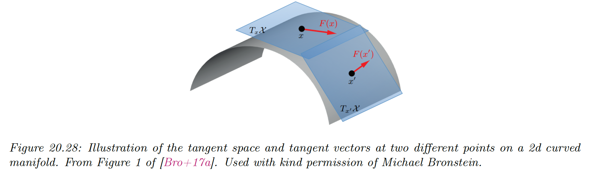
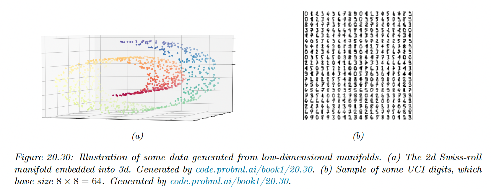

# 20.4 Manifold learning

We discuss the problem of recovering the underlying low-dimensional structure of a high-dimensional dataset. This structure is often assumed to be a curved manifold so this problem is called **manifold learning or nonlinear dimensionality reduction**.

The key difference from methods like AE is that we will focus on non-parametric methods, in which we compute an embedding for each point in the training set, as opposed to learning a generic model that can embed any input vector.

This is, the methods we discuss don’t (easily) support **out-of-sample generalization**. However, they can be easier to fit and are quite flexible.

Such methods can be useful for unsupervised learning, data visualization, and as a preprocessing step for supervised learning.

### 20.4.1 What are manifolds?

Roughly speaking, a **manifold** is a topological space that is locally Euclidean. One of the simplest examples is the surface of the earth, which is a curved 2d surface embedded in a 3d space. At each local point on the surface, the earth seems flat.

More formally, a $d$-dimensional manifold $\mathcal{X}$ is a space in which each point $\bold{x}\in\mathcal{X}$ has a neighborhood which is topologically equivalent to a $d$-dimensional Euclidean space, called the **tangent space**, denoted $\mathcal{T}_x=T_x\mathcal{X}$.

A **Riemannian manifold** is a differentiable manifold that associates an inner product operator at each $x$ in tangent space. This is assumed to depend smoothly on the position $x$.

The collection of these inner product is called a **Riemannian metric**. It can be shown that any sufficiently smooth Riemannian manifold can be embedded in any Euclidean space of potentially higher dimension. The Riemannian inner product at a point becomes Euclidean inner product in the tangent space.

### 20.4.3 Approaches to manifold learning

The manifold methods can be categorized as:

The term “nonparametric” refers to methods that learn a low dimensional embedding $\bold{z}_i$ for each datapoint $\bold{x}_i$, but do not learn a mapping function that can be applied to out-of-sample example.

To compare methods, we use 2 different datasets: a set of 1000 3d-points sampled from the 2d “**Swiss roll**” manifold, and a set of 1797 points from the UCI digit datasets.

We will learn a 2d manifold to visualize the data.

### 20.4.4 Multi-dimensional scaling (MDS)

The simplest approach to manifold learning is **multi-dimensional scaling (MDS)**. This tries to find a set of low dimensional vectors $\{\bold{z}_i\in\R^L:i=1:N\}$.

**20.4.4.1 Classical MDS**

We start with $X\in\R^{N\times D}$. The centered Gram (similarity) matrix is:

$$
\tilde{K}_{ij}=\lang \bold{x}_i-\bar{\bold{x}},\bold{x}_j-\bar{\bold{x}} \rang
$$

In matrix notation, we have $\tilde{K}=\tilde{X}\tilde{X}^\top$ with $\tilde{X}=C_N X$ and $C_N=I_N-\frac{1}{N}1_N1_N^\top$

Now define the **strain** of a set of embeddings:

$$
\mathcal{L}_{\mathrm{strain}}(Z)=\sum_{i,j}(\tilde{K}_{ij}-\lang \tilde{\bold{z}}_i ,\tilde{\bold{z}}_j\rang)^2=||\tilde{K}-\tilde{Z}\tilde{Z}^\top||^2_F
$$

where $\bold{z}_i=\tilde{\bold{z}}-\bold{z}_i$ is the centered vector.

Intuitively, this measures how well similarities in the high-dimensional space are preserved in the low-dimensional space. Minimizing this loss is called **classical** **MDS**.

We know that the best rank $L$ approximation to a matrix is its truncated SVD representation $\tilde{K}=USV^\top$. Since $\tilde{K}$ is positive semi-definite, we have $U=V$.

Hence the optimal embeddings satisfies:

$$
\tilde{Z}\tilde{Z}^\top=USU=(US^{\frac{1}{2}})(S^{\frac{1}{2}}U^\top)
$$

Thus we can set the embedding vectors to be the rows of $\tilde{Z}=US^{\frac{1}{2}}$.

We can still apply the MDS when we just have the Euclidean distance $D$ instead of the raw data $X$.

First, we compute the squared Euclidean matrix:

$$
\begin{align}
D^{(2)}_{ij}&=||\bold{x}_i-\bold{x}_j||^2\\
&=||\bold{x}_i-\bar{\bold{x}}||^2+||\bold{x}_j-\bar{\bold{x}}||^2-2\lang \bold{x}_i-\bar{\bold{x}},\bold{x}_j-\bar{\bold{x}}\rang \\
&=||\bold{x}_i-\bar{\bold{x}}||^2+||\bold{x}_j-\bar{\bold{x}}||^2-2 \tilde{K}_{ij} 
\end{align}
$$

So, we see that $D^{(2)}$ only differs from $K$ a $-2$ factor and some rows and columns constants. Thus, we can apply the **double centering trick** on $D$ to obtain $\tilde{K}$:

$$
\tilde{K}=-\frac{1}{2}C_ND^{(2)} C_N
$$

or equivalently:

$$
\tilde{K}_{ij}=-\frac{1}{2}(d_{ij}^2-\frac{1}{N}\sum_{k=1}^N d_{ik}^2-\frac{1}{N}\sum_{k=1}^N d_{kj}^2+\frac{1}{N^2}\sum_{k=1}^N\sum_{l=1}^N d_{kl}^2)
$$

We can then compute the embeddings as before.

It turns out the classical MDS is equivalent to PCA.

To see this, let $\tilde{K}=U_LS_LU_L^\top$ be the rank $L$ truncated SVD of the centered kernel matrix.

The MDS embeddings are given by $Z_{\mathrm{MDS}}=U_LS_L^{\frac{1}{2}}$.

Now consider the rank $L$ SVD of the centered data matrix $\tilde{X}=U_XS_XV_X^\top.$ The PCA embedding is $Z_{\mathrm{PCA}}=U_XS_X$.

Now:

$$
\tilde{K}=\tilde{X}\tilde{X}^\top=U_LS_LU_L^\top=U_XS_X^2U_X^\top
$$

Therefore, $U_L=U_X$, $S_L=S_X^2$ and $Z_{\mathrm{PCA}}=Z_{\mathrm{MDS}}$.

**20.4.4.2 Metric MDS**

Classical MDS assumes Euclidean distances. We can generalize it using any dissimilarity measure by defining the **stress function**:

$$
\mathcal{L}_{\mathrm{stress}}(Z)=\sqrt{\frac{\sum_{i<j}(d_{ij}-\hat{d}_{ij})^2}{\sum_{ij} d^2_{ij}}}
$$

where $\hat{d}_{ij}=||\hat{\bold{z}}_i-\hat{\bold{z}}_j||$.

Note that this is a different objective than the one used with classical MDS, so even using Euclidean distances the results will be different.

We can use gradient descent to solve the optimization problem, however it’s better to use a bound algorithm problem called **Scaling by Majorizing a Complication Function** (**SMACOF)**.

This is the method implemented in scikit-learn.

**20.4.4.3 Non-metric MDS**

Instead of trying to match the distance between points, we can instead try to match the ranking of how similar points are. Let $f(d)$ be a monotonic transformation from distances to ranks.

The loss is:

$$
\mathcal{L}_{\mathrm{NM}}(Z)=\sqrt{\frac{\sum_{i<j}(f(d_{ij})-\hat{d}_{ij})^2}{\sum_{ij} \hat{d}^2_{ij}}}
$$

where $\hat{d}_{ij}=||\hat{\bold{z}}_i-\hat{\bold{z}}_j||$. Minimizing this is known as **non-metric MDS.**

This objective can be optimized iteratively.

First, the function $f$ is approximated using isotonic regression; this finds the optimal monotonic transformation of the input distance to match the current embedding distances.

Then, the embeddings $Z$ are optimized, using a given $f$, using gradient descent, and the process repeats.

### 20.4.5 Isomap

If the high-dimensional data lies on or near a curved manifold, such as the Swiss roll example, then MDS might consider the two points to be close even if their distance along the manifold is large.

One way to capture this is to create the $K$-nearest neighbor graph ([by using scikit-learn](https://scikit-learn.org/stable/modules/generated/sklearn.neighbors.kneighbors_graph.html#sklearn.neighbors.kneighbors_graph)) between datapoints and then approximate the manifold distance between a pair of points by the shortest distance on the graph.

This can be computed efficiently using Dijkstra’s shortest path algorithm. Once we have computed this new distance metric, we use classical MDS (i.e. PCA).

This is a way to capture local structure while avoiding local optima. The overall method is called **Isometric mapping (Isomap).**

The results are quite reasonable.

However, if the data is noisy, there can be “false“ edges in the nearest neighbor graph, which can result in “short circuits”, which significantly distort the embedding.

This problem is known as **topological instability**. Choosing a very small neighborhood doesn’t solve the problem since this can fragment the manifold into a large number of disconnected regions.

[See more details on scikit-learn documentation](https://scikit-learn.org/stable/auto_examples/cluster/plot_ward_structured_vs_unstructured.html#sphx-glr-auto-examples-cluster-plot-ward-structured-vs-unstructured-py).

### 20.4.6 Kernel PCA

We now consider nonlinear projections of the data. The key idea is to solve PCA by finding the eigenvectors of the inner product (Gram) matrix $K=XX^\top$ and then to use the kernel trick, which lets us replace inner product $\bold{x}^\top_i\bold{x}_j$ with kernel function $\mathcal{K}(\bold{x}_i,\bold{x}_j)$. This is known as **kernel PCA**.

Recall from Mercer’s theorem that the use of kernel implies some underlying feature space, we are implicitly replacing $\bold{x}_i$ by $\phi_i=\phi(\bold{x}_i)$.

Let $\Phi$ be the corresponding (notional) design matrix, and $S_\Phi =\frac{1}{N}\sum_{i}\phi_i \phi_i^\top$ be the covariance matrix in feature space (we assume $\phi_i$  are centered)

From section 20.1.3.2, we know:

$$
V_{\mathrm{kPCA}}=\Phi^\top U\Lambda^{-\frac{1}{2}}
$$

where $U$ and $\Lambda$ contains the eigenvectors and eigenvalues of $K$.

We can’t compute $V_{\mathrm{kPCA}}$ directly since the $\phi_i$ might be infinite dimensional. However, we can compute the projection of the test vector $\bold{x}_*$ on the feature space:

$$
\phi_*^\top V_{\mathrm{kPCA}}=\phi^\top_*\Phi^\top U\Lambda^{-\frac{1}{2}}=k_*^\top U\Lambda{^{-\frac{1}{2}}}
$$

where $k_*=[\mathcal{K}(\bold{x}_*,\bold{x}_1),\dots,\mathcal{K}(\bold{x}_*,\bold{x}_N)]$

If we apply kPCA with a linear kernel we recover the regular PCA. This is limited to using $L\leq D$ embedding dimensions.
If we use a non-degenerate kernel, we can use up to $N$ components, since $\Phi\in\R^{N\times D^*}$ where $D^*$ is the dimensionality of embedded feature vectors (potentially infinite).

The figure below gives an example of the method with $D=2$ using a RBF kernel. 

We obtain the blue levels using the following method: for each plot, we project points in the unit grid onto each component by computing $K_*$ and its product with $U\Lambda^{-\frac{1}{2}}$, obtained from the data points. We obtain a “density map” for the points in the grid, and then draw a contour plot.

We see that the first two components separate the three clusters, while the other split the clusters.

The figure below show that the kPCA is not very useful for our dimension reduction problem. It can be shown that kPCA expand features instead of reducing it.

### 20.4.7 Maximum variance unfolding (MVU)

kPCA with RBF kernel might not result in low dimensional embedding. This observation led to the development of the **semidefinite embedding** algorithm, aka **maximum variance unfolding**, which tries to learn an embedding $\bold{z}_i$ such that:

$$
\max \sum_{i,j}||\bold{z}_i-\bold{z}_j||^2 \;s.t.\; ||\bold{z}_i-\bold{z}_j||^2=||\bold{x}_i-\bold{x}_j||^2,(i,j)\in G
$$

when $G$ is the nearest neighbor graph (as in Isomap).

This approach tries to “unfold” the manifold while respecting its nearest neighbor constraints.

This can be reformulated as a **semidefinite programming (SDP)** problem by defining the kernel matrix $K=ZZ^\top$ and maximizing:

$$
\max \mathrm{tr}(K)\;s.t.\;||\bold{z}_i-\bold{z}_j||^2=||\bold{x}_i-\bold{x}_j||^2, \sum_{ij} K_{ij}=0,K \succ 0
$$

The resulting kernel is then passed to kPCA, and the resulting eigenvectors give the low dimensional embedding.

### 20.4.8  Local linear embedding (LLE)

The techniques discussed so far relied on the eigenvalue decomposition of a full matrix of pairwise similarities, either in the input space (PCA), in the feature space (kPCA) or along the KNN graph (Isomap).

In this section we discuss **local linear embedding (LLE)**, a technique that solves a sparse eigenproblem, by focusing on local structure in the data.

LLM assumes the data manifold around each point $\bold{x}_i$ is locally linear. The best linear approximation can be found by predicting $\bold{x}_i$  as a linear combination of its $K$ nearest neighbors using reconstruction weights $\bold{w}_i$ (aka the barycentric coordinate of $\bold{x}_i)$:

$$
\hat{W}=\argmin_W\sum_{i=1}^N \Big(\bold{x}_i-\sum_{j=1}^N w_{ij}\bold{x}_j\Big)^2 \\
s.t.
\begin{cases}
w_{i,j}=0 &\mathrm{if} \;\bold{x}_j\notin \mathrm{Nbr}(\bold{x}_i,K)\\
\sum_{j=1}^Nw_{ij}=1 &\mathrm{for}\;i=1:N

\end{cases}
$$

Any linear mapping of this hyperplane to a lower dimensional space preserves the reconstruction weights, and thus the local geometry.

Thus we can solve for the low dimensional embeddings for each point by solving:

$$
\hat{Z}=\argmin_Z \sum_{i=1}^N ||\bold{z}_i-\sum_{j=1}\hat{w}_{ij}\bold{z}_j||^2
$$

with the same constraints.

We can rewrite this loss as:

$$
\mathcal{L}(Z)=||Z-WZ||^2=Z^\top(I-W)^\top(I-W)Z
$$

As shown in section 7.4.8, the solution is given by the eigenvectors of $(I-W)^\top(I-W)$ corresponding to the smallest non-zero eigenvalues.

The results do not seem as good as the one obtained with the Isomap, however this method tend to be more robust to short-circuiting (noise).

### 20.4.9 Laplacian eigenmaps (Spectral embeddings)

The key idea of Laplacian eigenmaps is to find a low-dimensional representation of data in which the weighted distances between a datapoint and its $K$ nearest neighbors are minimized.

We put more weight on the first nearest neighbor than the second, etc.

**20.4.9.1 Using eigenvectors of the graph Laplacian to compute embeddings**

We want to find the embeddings that minimizes:

$$
\mathcal{L}(Z)=\sum_{i,j\in E} w_{ij}||\bold{z}_i-\bold{z}_j||^2_2
$$

where $w_{ij}=\exp(-\frac{1}{2\sigma^2}||\bold{x}_i-\bold{x}_j||^2_2)$ if $(i,j)$ are neighbors on the KNN graph, 0 otherwise. 

We add the constraint $Z^\top D Z=I$ to avoid the degenerate solution where $Z=\bold{0}$, where $D$ is the diagonal weight matrix storing the degree of each node $D_{ii}=\sum_jw_{ij}$

We can rewrite the objective as follows:

$$
\begin{align}
\mathcal{L}(Z)&= \sum_{ij} w_{ij}(||\bold{z}_i||^2+||\bold{z}_j||^2-2\bold{z}_i^\top\bold{z}_j)\\
&= \sum_{i}D_{ii} ||\bold{z}_i||^2+\sum_{j}D_{jj} ||\bold{z}_j||^2-2\sum_{ij}w_{ij}\bold{z}_i^\top \bold{z}_j \\

&= 2\mathrm{tr}(Z^\top DZ)-2\mathrm{tr}(Z^\top WZ) \\
&=2\mathrm{tr}(Z^\top LZ)
\end{align}
$$

where $L\triangleq D-W$ is the graph Laplacian.

One can show that minimizing this graph is equivalent to solving the (generalized) eigenvalue problem:

$$
L\bold{z}_i=\lambda_iD \bold{z}_i
$$

for the $k$ smallest nonzero eigenvalues.

**20.4.9.2 What is the graph Laplacian?**

We saw above that we need to compute the eigenvectors of the graph Laplacian to compute a good embedding of the high dimensional points. We now give some intuitions on why this works.

We saw that the elements of $L$ can be computed as:

$$
L_{ij}=\begin{cases}
d_{ii} &\mathrm{if}\;i=j \\
-w_{ij} &\mathrm{o.w.}
\end{cases}
$$

Suppose we associate a value $f_i$ to each node of the graph:

Then we can use the graph Laplacian as a difference operator, to compute a discrete derivative of a function at a point:

$$
(Lf)(i)=\sum_{j\in\mathrm{nbr}(i)} w_{ij}(f(i)-f(j))
$$

where $\mathrm{nbr}(i)$ refers to the set of neighbors of node $i$.

We can also compute an overall measure of smoothness of the function by computing its **Dirichlet energy**:

$$
\begin{align}
f^\top Lf &=f^\top Df-f^\top W f \\
&= \sum_{i}d_if_i^2-\sum_{i,j} w_{ij}f_j^2 \\
&= \frac{1}{2}\Big(\sum_{i}d_if_i^2-2\sum_{i,j} w_{ij}f_i f_j+\sum_{j}d_jf_j^2\Big) \\
&=\frac{1}{2}\sum_{i,j} w_{i,j}(f_i-f_j)^2
\end{align}
$$

Applying linear algebra to study the adjacency matrix of a graph is called **spectral graph theory**.

For example, we see that $L$ is semi-positive definite, since $f^\top Lf\geq 0$  for all $f\in \R^N$.

Consequently, $L$ has $N$ nonzero, real-valued eigenvalues $0\leq \lambda_1\leq \dots \leq \lambda_N$.

The corresponding eigenvectors form an orthogonal basis for the function $f$ defined on the graph, in order of decreasing smoothness.

There are many applications of the graph Laplacian in ML, like normalized cuts (which is way of learning a clustering based on pairwise similarity) and RL where the eigenvectors of the state transition matrix are used.

### 20.4.10 t-SNE

We describe a very popular nonconvex technique for learning low dimensional embeddings, called **t-SNE**. This is an extension of the earlier [**stochastic neighbor embedding (SNE)**](https://proceedings.neurips.cc/paper_files/paper/2002/file/6150ccc6069bea6b5716254057a194ef-Paper.pdf).

**20.4.10.1 Stochastic neighbor embedding (SNE)**

The basic idea is to convert a high-dimensional Euclidean distance into a conditional probability. More precisely, we define $p_{j|i}$ to be the probability that point $i$ would pick point $j$ as its neighbor:

$$
p_{j|i}=\frac{\exp(-\frac{1}{2\sigma_i^2}||\bold{x}_i-\bold{x}_{j}||^2)}{\sum_{k\neq i}\exp(-\frac{1}{2\sigma_i^2}||\bold{x}_i-\bold{x}_k||^2)}
$$

Here $\sigma^2_i$ is the variance of data point $i$, which can be used to magnify the scale of points in dense regions of input space, and diminish the scale in sparser regions.

Let $\bold{z}_i$ be the low-dimensional embedding representing $\bold{x}_i$. We define similarities in the low-embedding space in a similar way:

$$
q_{j|i}=\frac{\exp(-||\bold{z}_i-\bold{z}_j||^2)}{\sum_{k\neq i}\exp(-||\bold{z}_i-\bold{z}_k||^2)}
$$

If the embedding is good, then $q_{j|i}$ should match $p_{j|i}$. Therefore, SNE defines the objective:

$$
\mathcal{L}=\sum_{i}D_{\mathbb{KL}}(P_i||Q_i)=\sum_i\sum_j  p_{j|i}\log \frac{p_{j|i}}{q_{j|i}}
$$

where $P_i$ is the conditional distribution over all other data points given $\bold{x}_i$.

Note that this is an asymmetric objective: the cost is high if a small $q_{j|i}$ is used to model a large $p_{j|i}$. This objective will prefer pulling distance point together rather than pushing nearby point  apart.

We can get a better sense of the geometry by computing the gradient of the objective at $\bold{z}_i$:

$$
\nabla_{\bold{z}_i}\mathcal{L}(Z)=2\sum_{j}(\bold{z}_j-\bold{z}_i)(p_{j|i}-q_{j|i}+p_{i|j}-q_{i|j})
$$

Thus points are pulled together if the $p$’s are bigger than the $q$’s, and repelled otherwise.

This objective is not convex, but it can be minimized using SGD nevertheless. In practice, it is helpful to add Gaussian noise to the embeddings and anneal the amount of noise.

**20.4.10.2 Symmetric t-SNE**

We can simplify SNE by minimizing a single KL between the joint distribution $P$ and $Q$:

$$
\mathcal{L}=D_{\mathbb{KL}}(P||Q)=\sum_{i<j}p_{ij}\log \frac{p_{ij}}{q_{ij}}
$$

This is called **symmetric SNE**.

We can define $p_{ij}$ as:

$$
p_{ij}=\frac{\exp(-\frac{1}{2\sigma^2}||\bold{x}_i-\bold{x}_j||^2)}{\sum_{k<l} \exp(-\frac{1}{2\sigma^2}||\bold{z}_i-\bold{z}_j||^2)}
$$

This corresponds to the gradient:

$$
\nabla_{\bold{z}_i}\mathcal{L}(Z)=2\sum_{j}(\bold{z}_i-\bold{z}_j)(p_{ij}-q_{ij})
$$

Which gives similar results than regular SNE when $L\ll D$.

**20.4.10.3 t-SNE**

A fundamental problem with SNE and many other embedding techniques is that they tend to squeeze points that are far in the high dimensional space close together in the low dimensional embedding space, this is called the **crowding problem**. This is due to the use of squared errors (or Gaussian probabilities).

One solution to this is to use a probability distribution in latent space that has heavier tails, which eliminates the unwanted force of attraction between distant points in the high dimensional space.

We can choose the Student-t distribution. In t-SNE, they set the degree $\nu=1$, so the distribution is equivalent to a Cauchy:

$$
q_{ij}=\frac{(1+||\bold{z}_i-\bold{z}_j||^2)^{-1}}{\sum_{k<l}(1+||\bold{z}_k-\bold{z}_l||^2)^{-1}}
$$

This uses the same objective as the symmetric SNE, and the gradient turns out to be:

$$
\nabla_{\bold{z}_i}\mathcal{L}(Z)=4\sum_j(\bold{z}_i-\bold{z}_j)(p_{ij}-q_{ij})(1+||\bold{z}_i-\bold{z}_j||^2)^{-1}
$$

The new term acts like an inverse square law. This means data points is the embedding space act like stars and galaxies, forming well separated clusters each of which has many stars tightly packed inside.

This can be useful to separate different classes of data in a unsupervised way.

**20.4.10.4 Choosing the length scale**

The local bandwidth $\sigma_i^2$ is an important parameter in t-SNE, and is usually chosen so that $P_i$ has  a perplexity chosen by the user, defined as $2^{\mathbb{H}(P_i)}$ where:

$$
\mathbb{H}(P_i)=-\sum_j p_{j|i}\log p_{j|i}
$$

This can be interpreted as smooth measure of the effective number of neighbors.

Unfortunately, the results of t-SNE can be quite sensitive to the perplexity parameter, so it is often advised to run the algorithm with different values.

If the perplexity is too small, the algorithm will find structure within the cluster which is not present. At perplexity 30 (the default for scikit-learn), the clusters seem equidistant in the embedding space.

**20.4.10.5 Computational issues**

The Naive implementation of t-SNE takes $O(N^2)$ time. A faster version can be created by leveraging an analogy to the $N$-body simulation in physics.

In particular, the gradient requires computing the forces of $N$ points on each of $N$  points. However, points that are far away can be grouped into clusters (computationally speaking), and their effective force can be approximated by a few representatitve points per cluster.

We can then approximate the forces using the **Barnes-Hut algorithm**, which takes $O(N\log N)$.

Unfortunately, this only works well for low dimensional embeddings, such as $L=2$ (which is adapted to data visualization).

### 20.4.11 UMAP

Various extension of t-SNE have been proposed to improve its speed, the quality of its embedding space or the ability to embed into more than 2 dimensions.

**Uniform Manifold Approximation and Projection (UMAP)** is a popular recent extension. At a high level, it is similar to t-SNE, but it tends to preserve global structure better, and it is much faster. This makes it easier to try different hyperparameters.