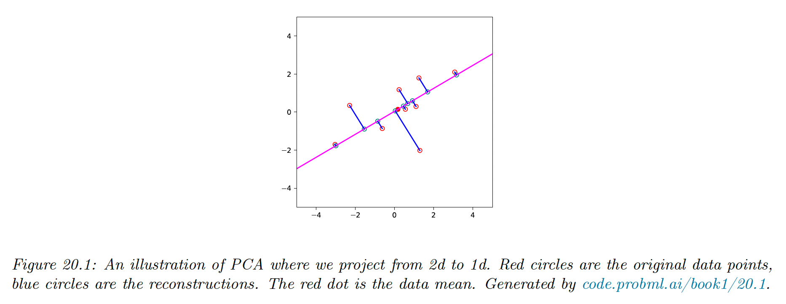
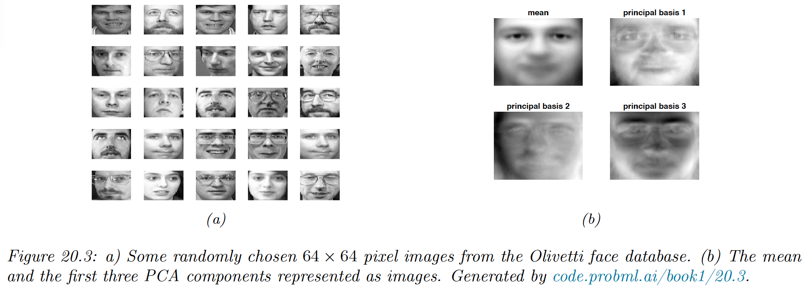
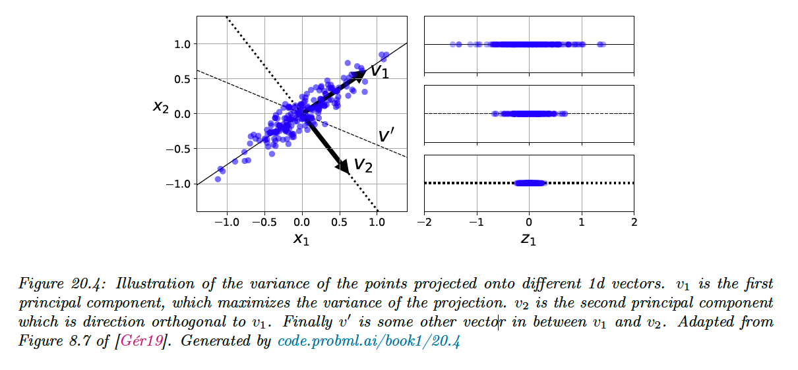
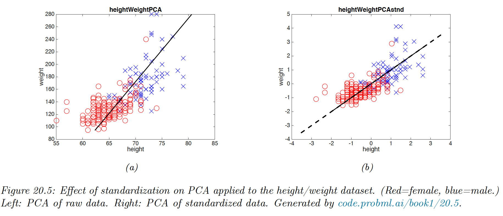
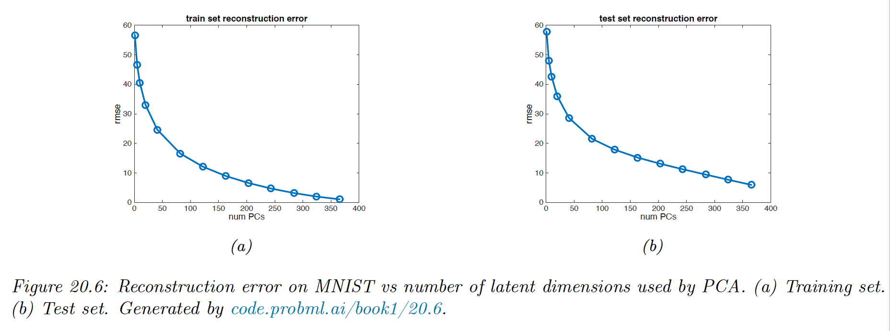
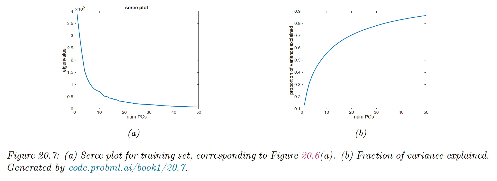

# 20.1 Principal component analysis (PCA)

The simplest and most widely used form of dimensionality reduction is **PCA**. The basic idea is to find a linear and orthogonal projection of the high dimensional data $\bold{x}\in \R^D$ to a low dimensional subspace $\bold{z}\in \R^L$, such that the low dimensional representation is a “good approximation” to the original data.

More specifically, if we project or **encode** $\bold{x}$ to get $\bold{z}=W^\top \bold{x}$ and then unproject or **decode $\bold{z}$** to get $\hat{\bold{x}}=W\bold{z}$, then we want $\bold{x}$ and $\hat{\bold{x}}$ to be close in the $\ell_2$ distance.

We define the following **reconstruction error** or **distortion**:

$$
\mathcal{L}(W)\triangleq \frac{1}{N}\sum_{n=1}^N ||\bold{x}_n-\mathrm{decode}(\mathrm{encode(\bold{x}_n;W);W}))||_2^2
$$

where the encoder and decoder stages are both linear maps.

We can minimize this objective by setting $\hat{W}=U_L$, where $U_L$ contains the $L$ eigenvectors with the largest eigenvalues of the empirical covariance matrix:

$$
\hat{\Sigma}=\frac{1}{N}\sum_{n=1}^N (\bold{x}_n-\hat{\bold{x}})(\bold{x}_n-\hat{\bold{x}})^\top=\frac{1}{N}X_c^\top X_c
$$

where $X_c$ is the centered version of the $N\times D$ design matrix.

This is equivalent to maximizing the likelihood of a latent linear Gaussian model known as probabilistic PCA.

### 20.1.1 Examples

We project below 2d data to a 1d line. This direction captures the most variation in the data.

We show PCA applied to the Olivetti face image dataset, which is a set of 64 x 64 grayscale images.

We project these to a 3d subspace and display the basic vectors (the columns of the projection matrix $W$) known as **eigenfaces**. We see that the main mode of variation of the data are related to overall lighting and then differences around the eyebrows

If we use enough dimensions (but less than the original 4096) we can use the representation $\bold{z}= W^\top \bold{x}$  as input to a nearest-neighbor classifier to perform face recognition. This is faster and more reliable than working in the pixel space.

### 20.1.2 Derivation of the algorithm

Suppose we have an unlabeled dataset $\mathcal{D}=\{\bold{x}_n:n=1:N\}$ where $\bold{x}_n\in \R^D$. We can represent this as a $X\in \R^{N\times D}$ data matrix.

We assume $\bar{\bold{x}}=\frac{1}{N}\sum_{n=1}^N \bold{x}_n=\bold{0}$, which can be assured by centering the data.

We would like to approximate each $\bold{x}_n$ by a latent vector $\bold{z}_n\in \R^L$. The collection of these latent variable are called the **latent factors**.

We assume each $\bold{x}_n$ can be “explained” in terms of a weighed combination of basis functions $\bold{w}_1,\dots,\bold{w}_L$ where each $\bold{w}_k\in \R^D$ and the weigths are $\bold{z}_n\in \R^L$, i.e we assume:

$$
\bold{x}_n\approx \sum_{k=1}^L z_{n,k}\bold{w}_k
$$

We can measure the **reconstruction error** produced by this approximation as:

$$
\begin{align}
\mathcal{L}(W,Z)&=\frac{1}{N}||X-ZW^\top||^2_F\\
&=\frac{1}{N}||X^\top-WZ^\top||^2_F \\
&=\frac{1}{N}\sum_{n=1}^N ||\bold{x}_n-W\bold{z}_n||^2_2
\end{align}
$$

We want to minimize this subject to the constraint that $W$ is an orthogonal matrix.

We show below that the optimal solution is obtained by setting $\hat{W}=U_L$ where $U_L$ contains the $L$ eigenvectors with largest eigenvalues of the empirical covariance matrix.

**20.1.2.1 Base case**

We start by estimating the best 1d solution $\bold{w}_1\in \R^D$. We will find the remaining basis vectors later.

Let the latent coefficient $\bold{}$for each data points associated with the first basis vector be $\tilde{\bold{z}}_1=[z_{1,1},\dots,z_{N,1}]\in \R^N$

The reconstruction error is given by:

$$
\begin{align}
\mathcal{L}(\bold{w}_1,\tilde{\bold{z}}_1)&=\frac{1}{N}\sum_{n=1}^N ||\bold{x}_n-z_{1,n}\bold{w}_1||^2_2\\
&=\frac{1}{N}\sum_{n=1}^N (\bold{x}_n-z_{1,n}\bold{w}_1)^\top(\bold{x}_n-z_{1,n}\bold{w}_1)
\\
&= \frac{1}{N} \sum_{n=1}^N \bold{x}_n^\top \bold{x}_ n-2z_{1,n}\bold{w}_1^\top\bold{x}_n+z_{1,n}^2\bold{w}_1^\top \bold{w}_1
\end{align}
$$

where $\bold{w}_1^\top \bold{w}_1=1$ by the orthonormality assumption.

Taking derivative wrt $z_{1,n}$ gives:

$$
\begin{align}
\frac{\partial}{\partial z_{1,n}}\mathcal{L}(\bold{w}_1,\tilde{\bold{z}}_1)&=-2\bold{w}_1\bold{x}_n+2z_{1,n}=0 \\
&\implies z_{1,n}=\bold{w}_1^\top\bold{x}_n
\end{align}
$$

So the optimal embedding is obtained by orthogonally projecting the data onto $\bold{w}_1$.

Plugging it back to loss gives us:

$$
\begin{align}
\mathcal{L}(\bold{w}_1,\tilde{\bold{z}}_1^*)&=\frac{1}{N}\sum_{n=1}^N \bold{x}_n^\top\bold{x}_n -z_{1,n}^2\\
&=C-\frac{1}{N}\sum_{n=1}^N z_{1,n}^2 \\
&= C -\frac{1}{N}\sum_{n=1}^N \bold{w}_1^\top \bold{x}_n \bold{x}_n^\top  \bold{w}_1\\
&=C-\bold{w}_1^\top \hat{\Sigma}\bold{w}_1
\end{align}
$$

Where $\Sigma$ is the empirical covariance matrix (since we assumed the data is centered) and $C$ a constant.

We can trivially optimize this by letting $\bold{w}_1\rightarrow \infin$, so we impose the constraint $||\bold{w}_1||_2=1$ and instead optimize:

$$
\begin{equation}
\tilde{\mathcal{L}}(\bold{w}_1,\bold{z}_1^*)=-\bold{w}_1^\top\Sigma\bold{w}_1+\lambda_1(\bold{w}_1^\top \bold{w}_1-1)
\end{equation}
$$

where $\lambda_1$ is a Lagrange multiplier.

Taking derivatives and equating to zero we have:

$$
\begin{align}
\frac{\partial }{\partial \bold{w}_1}\mathcal{L}(\bold{w}_1,\bold{z}_1^*)&=-2\bold{w_1}\hat{\Sigma}+2\lambda_1\bold{w}_1=0 \\
&\implies \hat{\Sigma }\bold{w}_1=\lambda_1 \bold{w}_1
\end{align}
$$

Hence, the optimal direction onto which should project the data is an eigenvector of the covariance matrix.

And since we have:

$$
\bold{w}_1^\top \hat{\Sigma} \bold{w_1}=\lambda_1
$$

We can minimize the loss in (13) by picking the largest eigenvector which corresponds to the largest eigenvalue.

**20.1.2.2 Optimal weight vector maximizes the variance of the projected data**

Before continuing, we observe that, since the data has been centered:

$$
\mathbb{E}[z_{1,n}]=\mathbb{E}[\bold{w}_1^\top\bold{x}_n]=\bold{w}_1^\top\mathbb{E}[\bold{x}_n]=0
$$

Hence the variance of the projected data is given by:

$$
\mathbb{V}[\tilde{\bold{z}}_1]=\mathbb{E}[\tilde{\bold{z}}_1^2]=\frac{1}{N}\sum_{n=1}^Nz_{1,n}^2=-\mathcal{L(\bold{w}_1)}+C
$$

From this we see that minimizing the reconstruction error is equivalent to maximizing the variance of the projected data.

This is why it is often said that PCA finds the direction of maximal variance.

**20.1.2.3 Induction step**

Now let us find another direction $\bold{w}_2$ to further minimize the reconstruction error, subject to $\bold{w}_1^\top \bold{w}_2=0$ and $\bold{w}_2^\top \bold{w}_2=1$:

$$
\mathcal{L}(\bold{w}_1,\tilde{\bold{z}}_1,\bold{w}_2,\tilde{\bold{z}}_2)=\frac{1}{N}\sum_{n=1}^N||\bold{x}_n-z_{1,n}\bold{w}_1-z_{2,n}\bold{w}_2||_2^2
$$

Optimizing wrt $\bold{w}_1$ and $\tilde{\bold{z}}_1$ gives the same solution as before.

We can show that $\frac{\partial \mathcal{L}}{\partial \bold{w}_2}=0$ yields $z_{2,n}=\bold{w}_2^\top\bold{x}_n$.

Substituting this solution yields:

$$
\begin{align}
\mathcal{L}(\bold{w}_2)&=\frac{1}{N}\sum_{n=1}^N \bold{x}_n^\top \bold{x}_n-\bold{w}_1^\top \bold{x}_n \bold{x}_n^\top \bold{w}_1-\bold{w}_2^\top \bold{x}_n \bold{x}_n^\top \bold{w}_2 \\ &=C-\bold{w}_2^\top \hat{\Sigma}\bold{w}_2
\end{align}
$$

Dropping the constant term, plugging the optimal $\bold{w}_1$ and adding the constraint yields:

$$
\tilde{\mathcal{L}}(\bold{w}_2)=-\bold{w}_2^\top\hat{\Sigma}\bold{w}_2+\lambda_1(\bold{w}_2^\top\bold{w}_2-1)+\lambda_2(\bold{w}_1^\top\bold{w}_2-0)
$$

The solution is given by the eigenvector with the second largest eigenvalue:

$$
\hat{\Sigma}\bold{w}_2=\lambda_2\bold{w}_2
$$

The proof continue that way to show that $\hat{W}=U_L$.

### 20.1.3 Computational issues

**20.1.3.1 Covariance matrix vs Correlation matrix**

We have been working with the covariance matrix, but it’s better to work with the correlation matrix because PCA might be “mislead” by the directions in which the variance is higher because of the measurement scale.

**20.1.3.2 Dealing with high-dimensional data**

We have introduced PCA as finding the eigenvectors of the covariance matrix $X^\top X \in \R^{D\times D}$.

When $N<D$, it is faster to work with the Gram matrix $XX^\top \in \R^{N\times N}$ instead. We show how to use it.

Let $U$ be the eigenvectors of $XX^\top$ with corresponding eigenvalues $\Lambda$. By definition, we have:

$$
(XX^\top) U = U\Lambda 
$$

so by left-multiplying by $X^\top$we get:

$$
(X^\top X)(X^\top U)=(X^\top U)\Lambda
$$

from which we see that the eigenvectors of $X^\top X$ are $V=X^\top U$, with the same eigenvalues $\Lambda$.

However, these eigenvectors are not normalized, since:

$$
||\bold{v}_j||^2=\bold{u}_j^\top X X^\top \bold{u}_j=\lambda_j \bold{u}^\top_j\bold{u}_j=\lambda_j
$$

The normalized eigenvector are given by:

$$
V=X^\top U \Lambda^{-1/2}
$$

This provides an alternative way to compute the PCA basis, it also allows us to use to kernel trick.

**20.1.3.3 Computing PCA using SVD**

We now show the equivalence between the PCA computed using eigenvectors and the truncated SVD.

Let $U_\Sigma \Lambda_\Sigma U_\Sigma^\top$   be the top $L$ engendecomposition of the covariance matrix $\Sigma \propto X^\top X$ (assuming $X$ is centered).

We know that the optimal estimate of the projection is $W=U_\Sigma$. 

Now let $U_X S_XV^\top _X$ be the $L$-truncated SVD approximation of the matrix $X$.

We know that the right singular vectors of $X$ are the eigenvectors of $X^\top X$, so $V_X =U_\Sigma=W$.

In addition, the singular values of $X$ are related to the eigenvalues of $X^\top X$ with:

$$
\lambda_k=s_k^2/N
$$

Now suppose we are interested in the principal components, we have:

$$
Z=XW=U_XS_XV_X^\top V_X=U_XS_X
$$

Finally, if we want to reconstruct the data:

$$
\hat{X}=ZW^\top =U_XS_XV_X^\top
$$

This is precisely the same as truncated SVD approximation.

Thus, we see that we can perform PCA either using a eigendecomposition of $X^\top X$ or a SVD decomposition of $X$. The latter is often preferable for computational reason.

For very high dimensional problem, we can use a randomized SVD algorithm.

### 20.1.4 Choosing the number of latent dimensions

**20.1.4.1 Reconstruction error**

Let us define the reconstruction error on some dataset $\mathcal{D}$ when using $L$ dimensions:

$$
\mathcal{L}_L=\frac{1}{|\mathcal{D}|}\sum_{n\in \mathcal{D}} ||\bold{x}_n-\bold{\hat{x}}_n||^2_2
$$

where the reconstruction is given by $\bold{\hat{x}}_n=W\bold{z}_n+\mu$ and $\bold{z}_n=W^\top (\bold{\hat{x}}_n-\mu)$.

We see that it drops quite quickly after, indicating that we capture most of the empirical correlation with a small number of factors.

Of course, if we choose $L=\mathrm{rank}(X)$, we get zero reconstruction error on the training set. To avoid overfitting, we compute the reconstruction error on the test set.

Here we see that the error continues to decrease even when the model gets more complex. Thus, we don’t see the typical U-shaped curve that we see in supervised learning.

The problem is that PCA is not a proper generative model of the data: if you give it more latent dimensions, it will approximate the test data more accurately. A similar problem arises if we plot reconstruction error on the test set with K-means clustering.

**20.1.4.2 Scree plot**

A common alternative to plotting reconstruction error vs $L$ is to plot the eigenvalues in decreasing order of magnitude.

We can show that:

$$
\mathcal{L}_L=\sum_{j=L+1}^{D}\lambda_j
$$

Thus as the number of dimensions increases, the eigenvalues get smaller and so do the reconstruction error.

An related quantity is the **fraction of variance explained**:

$$
F_L=\frac{\sum_{j=1}^L \lambda_j}{\sum_{j=1}^{L_\mathrm{max}} \lambda_j}
$$

**20.1.3.4 Profile likelihood**

Although there is no U-shape in the reconstruction error plot, there is sometimes an “elbow” where the error suddenly changes from relatively large to relatively small.

The idea is that, for $L<L^*$ where $L^*$ is the “true” latent dimensionality, the rate of decrease of errors will be high, whereas for $L>L^*$ the gains will be smaller since the model is already complex enough to capture the true distribution.

One way to automate the detection of the change of gradient in the curve is to **profile likelihood**.

Let $\lambda_L$ be some measure of error incurred by the model of size $L$, such that $\lambda_1\geq \dots \geq \lambda_{L^{max}}$. In PCA these are the eigenvalues but the method can be applied to reconstruction error from K-means clustering.

We partition these values into two group depending on whether $k<L$ or $k>L$, where $L$ is some threshold.

To measure the quality of $L$, we use a changepoint model such that:

$$
\begin{align}
\lambda_k&\sim \mathcal{N}(\lambda_k|\mu_1,\sigma^2) & \mathrm{if}\;k\leq L \\
\lambda_k&\sim \mathcal{N}(\lambda_k|\mu_2,\sigma^2) & \mathrm{o.w.}\ 
\end{align}
$$

It’s important that $\sigma^2$ be the same to avoid overfitting in the case on regime has more data than the other. Within each of the two regimes, we assume $\lambda_j$ are iid, which is obviously incorrect but adequate for our present purposes.

We can fit this model for each $L=1:L^{\mathrm{max}}$ by partitioning the data and computing the MLEs, using a pool estimate of the variance:

$$
\begin{align}
\mu_1(L)&=\frac{\sum_{k\leq L}\lambda_k}{L} \\
\mu_2(L)&=\frac{\sum_{k>L}\lambda_k}{L^{max}-L} \\ 
\sigma^2(L)&= \frac{\sum_{k\leq L}(\lambda_k-\mu_1(L))^2+\sum_{k> L}(\lambda_k-\mu_2(L))^2}{L^{max}}
\end{align}
$$

We can then evaluate the profile log likelihood:

$$
\ell(L)=\sum_{k\leq L}\log \mathcal{N}(\lambda_k|\mu_1(L),\sigma^2(L))+\sum_{k>L}\log \mathcal{N}(\lambda_k|\mu_2(L),\sigma^2(L))
$$

We that the peak $L^*=\argmax_L \ell(L)$ is well determined.