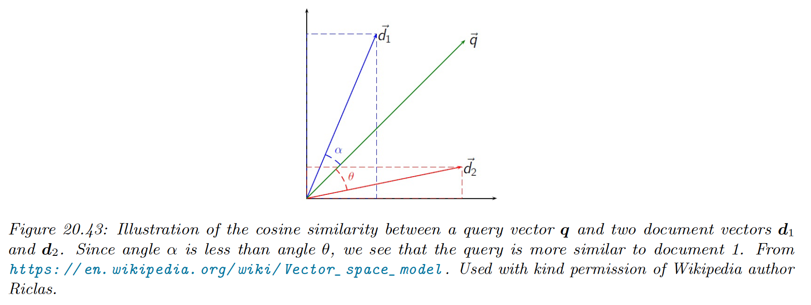
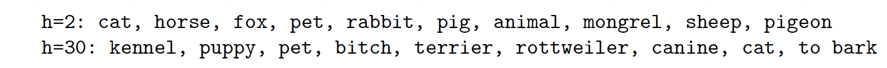
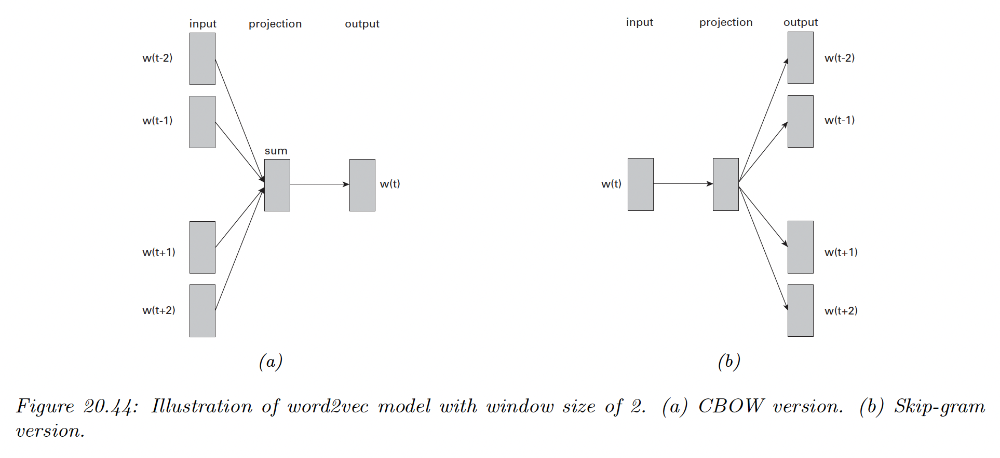
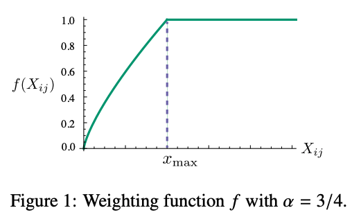
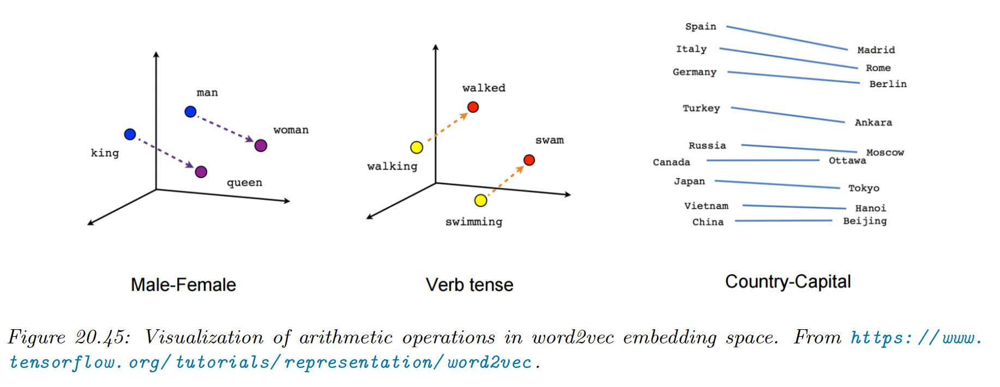

# 20.5 Word embeddings

Words are categorical random variable, so their one-hot representation is sparse.

The issue with this representation is that semantically similar words can have very different vector representation. “man” and “woman” will have the same Hamming distance of 1 than “man” and “banana”.

The standard way to solve this is to use **word embeddings**. Instead of using sparse vectors $\bold{s}_{n,t}\in\{0,1\}^M$, we can use a denser low dimensional representation $\bold{z}_{n,t}\in \R^D$, for the $t$th word in the $n$th document. This can significantly help with sparsity.

We define semantic similarity by saying that similar words occur in similar contexts. This is known as the **distributional hypothesis**, summarized by “a word is characterized by the company it keeps”.

### 20.5.1 Latent semantic analysis / indexing

We discuss a simply way to learn word embeddings based on a SVD of a term-frequency count-matrix.

#### 20.5.1.1 Latent semantic indexing (LSI)

Let $C_{i,j}$ be the frequency of “term” $i$ occurs in “context” $j$.

The definition of “term” is application specific, often considered to be the words by simplicity. We may remove infrequent or very frequent words during preprocessing.

The definition of “context“ is also application specific. We often consider a set of document or corpus. $C$ is then called the **term-document frequency matrix**.

Sometimes we apply TF-IDF transformation to the count, as discussed in section 1.5.4.2.

Let $C\in \R^{M\times N}$ be the count matrix and $\hat{C}$ the rank $K$ approximation the minimizes the following loss:

$$
\mathcal{L}(\hat{C})=||C-\hat{C}||^2_F=\sum_{ij}(C_{ij}-\hat{C}_{ij})^2
$$

One can show that the minimizer of this loss is given by the rank $K$ truncated SVD approximation $\hat{C} = USV$. 

This means we can represent each $c_{ij}$ as a bilinear product:

$$
c_{ij}\approx \sum_{k=1}^K u_{ik}s_kv_{jk}
$$

We define $\bold{u}_i$ to be the embedding for word $i$, and $\bold{s}\odot \bold{v}_j$ the embedding for context $j$.

We can use these embeddings for **document retrieval**. The idea is to compute embeddings for the query words, and compare this to the document embeddings $\bold{v}_j$. This is known as **latent** **semantic embedding (LSI)**.

More precisely, suppose the query is a bag of words $w_1,\dots,w_B$, represented by the vector:

$$
\bold{q}=\frac{1}{B}\sum_{b=1}^B \bold{u}_{w_b}
$$

Then, we rank document by the **cosine similarity** between the query vector and the document:

$$
\mathrm{sim}(\bold{q},\bold{d})=\frac{\bold{q}^\top \bold{d}}{||\bold{q}||_2\;||\bold{d}||_2}
$$

Note that if the vectors are unit norm, cosine similarity is the same as inner product. It is also equal to squared euclidean distance, up to a change of sign and an additive constant.

$$
||\bold{q}-\bold{d}||^2=\bold{q}^\top \bold{q}+\bold{d}^\top\bold{d}-2\bold{q}^\top \bold{d}=2-2\mathrm{sim}(\bold{q},\bold{d})
$$

#### 20.5.1.2 Latent semantic analysis (LSA)

Now suppose we define context more generally to be some local neighborhood of words $j\in\{1,\dots,M^h\}$ where $h$ is the window size.

Thus $C_{ij}$ is how many times the word $i$ occurs in a neighborhood of type $j$. We have the same formula as previously, and this is known as **latent semantic analysis (LSA)**.

For example, we compute $C$ on the British National Corpus, and retrieve the $K$ nearest neighbors ranked by cosine similarity. If the query word is “dog”, and we use $h=2$ or $h=30$, the nearest neighbors are:

The 2-word context window is more sensitive to syntax, while the 30-word window is more sensitive to semantics. The “optimal” value of $h$ depends on the application

#### 20.5.1.3 Pointwise mutual information (PMI)

In practice, LSA (and similar methods) give better results if we replace the raw counts $C_{ij}$ by the **pointwise mutual information (PMI).**

$$
\mathbb{PMI}(i,j)=\log \frac{p(i,j)}{p(i)p(j)}
$$

If word $i$ is strongly associated to document $j$, we have $\mathbb{PMI}(i,j)>0$.

If the PMI is negative it means that $i$ and $j$  co-occurs less that if they were independent. However, such negative correlation can be unreliable, so it is common to use the positive PMI:

$$
\mathbb{PPMI}(i,j)=\max(0,\mathbb{PMI}(i,j))
$$

It has been showed that the SVD applied to the PPMI matrix result in word embeddings that perform well on various tasks related to word meaning.

### 20.5.2 Word2vec

The popular **word2vec** model is a shallow neural net for predicting a word given its context. In section 20.5.5 we will discuss it connection with the SVD of the PMI matrix.

There are two versions of word2vec: **continuous bag of words (CBOW)** and **skipgram**.

#### 20.5.2.1 Word2vec CBOW model

In the CBOW model, the log likelihood of a sequence is:

$$
\begin{align}
\log p(\bold{w})&=\sum_{t=1}^T\log p(w_t|w_{t-m:t+m}) \\
&= \sum_{t=1}^T \log \frac{\exp(\bold{v}_{w_t}^\top \bold{\bar{v}_t})}{\sum_{w'} \exp(\bold{v}_{w'}^\top\bold{\bar{v}}_t)} \\
&=\sum_{t=1}^T \bold{v}_{w_t}^\top \bold{\bar{v}}_t-\log \sum_{i\in\mathcal{V}} \exp(\bold{v}_i^\top \bold{\bar{v}}_t)
\end{align}
$$

where $\bold{v}_{w_t}$ is the vector for word at location $w_t$, $m$ is the context size, $\mathcal{V}$ the vocabulary and

$$
\bold{\bar{v}}_t=\frac{1}{2m}\sum_{h=1}^m (\bold{v}_{w_{t-h}}+\bold{v}_{w_{t+h}})
$$

is the average of word vectors in the window around word $w_t$.

Thus, we will try to predict each word given its context. The model is called CBOW because it uses a bag of words assumption for the context, and represent each word by its embedding.

#### 20.5.2.2 Word2vec Skip-gram model

A variant of CBOW is to predict the context (surrounding words) given a word:

$$
\begin{align}
-\log p(\bold{w})&=-\sum_{t=1}^T \sum_{h=1}^m \Big[p(w_{t-m}|w_t)+p(w_{t+m}|w_t)\Big]\\
&= -\sum_{t=1}^T \sum_{-m\leq h \leq m,\;h\neq 0} p(w_{t+h}|w_t)
\end{align}
$$

We define the log probability of some other context word $w_o$ given the central word $w_t$:

$$
\log p(w_o|w_c)= \bold{u}_o^\top \bold{v}_c-\log \sum_{i\in\mathcal{V}} \exp(\bold{u}_i^\top \bold{v}_c)
$$

See [the derivation of the loss to obtain the gradient](https://stats.stackexchange.com/questions/253244/gradients-for-skipgram-word2vec).

#### 20.5.2.3 Negative sampling

Computing the conditional probability of each word in the previous equation is expensive, because it needs to normalize over all possible words in $\mathcal{V}$. This makes computing the gradient slow for the CBOW and skip-gram models.

A fast approximation has been proposed, called **skip-gram with negative sampling (SGNS).**

The basic idea is to create a set of $K+1$ context words for each central word $w_t$ and label the one that actually occurs as positive and the rest as negative.

The negative words are called noise words and can be sampled from a reweighted unigram distribution $p(w)\propto \mathrm{freq}(w)^{3/4}$, which has the effect of redistributing probability mass from common to rare words.

The conditional probability is now approximated by:

$$
p(w_{t+j}|w_t)=p(D=1|w_{t+j},w_j)\prod_{k=1}^K p(D=0|w_{t},w_k)
$$

where $w_k\sim p(w)$ are noise words, and $D=1$ is the event that the word pair actually occurs in the data.

The binary probabilities are given by:

$$
\begin{align}
p(D=1|w_t,w_{t+j})&=\sigma(\bold{u}_{w_{t+j}}^\top \bold{v}_{w_t}) \\
p(D=0|w_{t},w_k)&=1-\sigma(\bold{u}^\top_{w_k}\bold{v}_{w_t})
\end{align}
$$

To train the model, we can then compute the log probability of the data and optimize the embedding vectors $\bold{u}_i$ and $\bold{v}_i$ for each word using SGD.

See [this implementation](https://d2l.ai/chapter_natural-language-processing-pretraining/word2vec-pretraining.html).

### 20.5.3 GloVE

A popular alternative to Skipgram is **GloVe (global vectors for word representation)**. This methods use a simpler objective, faster to optimize.

Recall that in the skipgram model, the predicted conditional probability of word $j$ occuring in the context window of central word $i$ is:

$$
q_{ij}=\frac{\exp(\bold{u}_j^\top \bold{v}_i)}{\sum_{k\in\mathcal{V}} \exp(\bold{u}_k^\top \bold{v}_i)}
$$

Let $x_{ij}$ the number of time the word $j$ occurs in any context of the word $i$ (note that this is symmetric, $x_{ij}=x_{ji}$).

Then we can rewrite the loss as:

$$
\mathcal{L}=-\sum_{i \in\mathcal{V}} \sum_{j \in\mathcal{V}} x_{ij}\log q_{ij}
$$

If we define $p_{ij}=x_{ij}/x_i$ to be the empirical probability of word $j$ occuring in the context window of central word $i$, we can rewrite the skipgram loss as a cross entropy loss:

$$
\mathcal{L}=-\sum_{i\in\mathcal{V}} x_i\sum_{j\in\mathcal{V}} p_{ij}\log q_{ij}
$$

The issue with this objective is that computing $q_{ij}$ is expensive due to the normalization term over all words.

In GloVe, we work with unnormalized probabilities:

$$
\begin{align}
p_{ij}' &= x_{ij}\\
q_{ij}' &= \exp(\bold{u}_j^\top\bold{v}_i+b_i+c_j)
\end{align}
$$

where $b_i,c_j$ are bias term to capture marginal probabilities.

In addition, we minimize the square loss,  $(\log p_{ij}' - \log q_{ij}')^2$, which is more robust to errors in estimating small probabilities than log loss.

Finally, we down-weight rare words, which carry noise, by:

$$
h(x_{ij})=
\begin{cases}
(x_{ij}/x_{max})^{0.75} & \mathrm{if}\;x_{ij}<x_{max} \\
1 & \mathrm{o.w.}
\end{cases}
$$

with $x_{max}=100$.

This gives the final GloVe objective:

$$
\begin{align}
\mathcal{L} &= -\sum_{i\in\mathcal{V}} \sum_{j\in\mathcal{V}} h(x_{ij})(\log p'_{ij}-\log q'_{ij})^2 \\
&= -\sum_{i\in\mathcal{V}} \sum_{j\in\mathcal{V}} h(x_{ij})(\bold{u}_j^\top \bold{v}_i+b_i+c_j-\log x_{ij})^2
\end{align}
$$

We can precompute $x_{ij}$ offline, and then optimize the above objective using SGD.

After training, we define the embedding of word $i$ to be the average of $\bold{u}_i$ and $\bold{v}_i$

Empirically, GloVe gives similar results to skipgram, but is faster to train.

### 20.5.4 Word analogies

One of the remarkable properties of word embeddings produced by word2vec or GloVe is that the learned vector space capture relational semantics in terms of vector addition.

Suppose we take the words $a=\mathrm{man},b=\mathrm{woman},c=\mathrm{king}$. How do we find $d=\mathrm{queen}$?

Let $\delta=\bold{v}_b-\bold{v}_a$ be the vector representing the concept of “converting the gender from male to female”. Intuitively, we can find the word $d$ by computing $\bold{v}_d=\bold{v}_c+\delta$, and then finding the closest word in the vocabulary to $\bold{v}_d$.

It has been conjectured that $a:b::c:d$ holds iff for every word $w$ in the vocabulary, we have:

$$
\frac{p(w|a)}{p(w|b)}\approx \frac{p(w|c)}{p(w|d)}
$$

This follows the Rand-Walk modeling assumption.

### 20.5.5 Rand-Walk model of word embeddings

Word embeddings significantly improve the performance of various kinds of NLP models compared to using one-hot encodings. We explain why in this section.

Consider a sequence of words $w_1,\dots, w_T$, we assume each word is generated by a latent context $\bold{z}_t\in\R^D$ using the following bilinear language model:

$$
p(w_t=w|\bold{z}_t)=\frac{\exp(\bold{z}_t^\top \bold{v}_w)}{\sum_{w'}\exp(\bold{z}_t^\top \bold{v}_{w'})}=\frac{\exp(\bold{z}_t\bold{v}_w)}{Z(\bold{z}_t)}
$$

where $\bold{v}_w\in\R^D$ is the mebedding for word $w$, and $Z(\bold{z}_t)$ is the partition function.

Let us further assume the prior for the word embedding $\bold{v}_w$ is an isotropic Gaussian, and that the latent topic $\bold{z}_t$ undergoes a slow Gaussian random walk.

Under this model, one can show that $Z(\bold{z}_t)$ is approximately equal to a fixed constant, $Z$, independent of the context. This is known as the **self-normalizing property** of log-linear model.

Furthermore, one can show that the pointwise mutual information of predictions from the model is given by:

$$
\mathbb{PMI}(w,w')=\frac{p(w,w')}{p(w)p(w')}\approx \frac{\bold{v}_w^\top \bold{v}_{w'}}{D}
$$

We can therefore fit the Rand-Walk model by matching the model’s predicted values for PMI with the empirical values, i.e. we minimize:

$$
\mathcal{L}=\sum_{w,w'}X_{w,w'}(\mathbb{PMI}(w,w')-\bold{v}_w^\top \bold{v}_{w'})^2
$$

where $X_{w,w'}$ is the number of times $w$ and $w'$ occur next to each other.

This objective can be seen as frequency-weighted version of the SVD loss in LSI (section 2.5.1.1 above).

Some additional approximations can be used to show that the NLL for the Rand-Walk model is equivalent to the CBOW and SGNS word2vec objectives. We can also derive the objective for GloVe from this approach.

### 20.5.6 Contextual word embeddings

In the sentences “I ate an apple” and “I bought a new phone from Apple”, the meaning of the word “apple” is different in both cases, but a fixed word embedding, of the type we saw in this section, wouldn’t be able to capture this.

In section 15.7 we discuss **contextual word embeddings**, where the embedding of a word is a function of all the words in its context (usually a sentence). This can give much improved results, and is currently the standard approach to representing natural language data, as a pre-processing step before doing transfer learning.