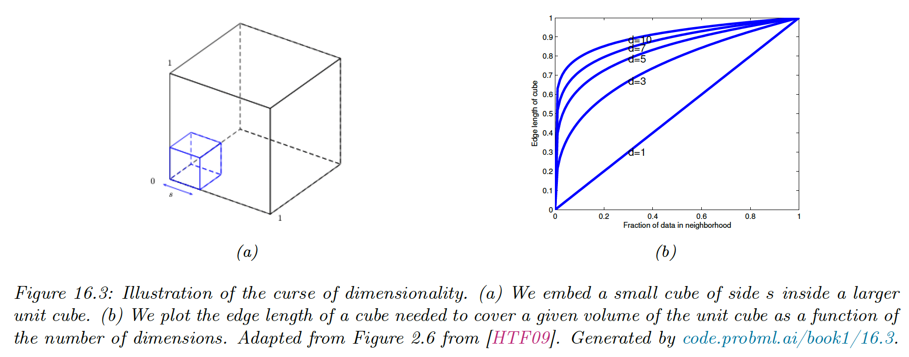

# 16.1 K Nearest Neighbor (KNN) Classification

KNN is one of the simplest kind of classifier: to classify a new input $\bold{x}$, we find the $K$ closest examples in the training dataset, denoted $N_K(\bold{x},\mathcal{D})$, and look at their labels, to derive a distribution over the outputs for a local region around $\bold{x}$.

$$
p(y=c|\bold{x},\mathcal{D})=\frac{1}{K}\sum_{n\in N_K(\bold{x},\mathcal{D})}\mathbb{I}(y_n=c)
$$

We can return this distribution or the majority label.

The two main parameters are the size of the neighborhood $K$ and the distance metric $d(\bold{x',x})$. It is common to use the **Mahalanobis distance**:

$$
d_M(\bold{x},\mu)=\sqrt{(\bold{x}-\mu)^\top M(\bold{x}-\mu)}
$$

where $M$ is a positive definite matrix. When $M=I$, this reduces to the Euclidean distance.

Despite its simplicity, when $n\rightarrow \infin$ the KNN model can becomes within a factor of 2 of the Bayes error (measuring the performance of the best possible classifier).

### 16.1.1 Example

Below is an example in the case of $K=5$, where the test point is marked as an “x”.

We can predict $p(y=1|\bold{x},\mathcal{D})=3/5$.

If we use $K=1$ we can return the label of the nearest point, and the classifier induces a **Voronoi tessellation** of the points. This is a partition of space which associates a region $V(\bold{x}_n)$ to each $\bold{x}_n$ such that all point in $V(\bold{x}_n)$ are closer to $\bold{x}_n$ that any other points in $\mathcal{D}$. 

Since the predictive label of each region is the label of $\bold{x}_n$, the training error is 0. However, such a model is overfitting the training set.

The example below applies a KNN over 3 classes, and we see the decision boundaries becoming smoother as $K$ increases. This results in the training error increasing, and the start of underfitting.

The test error shows the characteristic U-shaped curve.

### 16.1.2 The curse of dimensionality

The main statistical issue with KNN classifiers is that they don’t work well with high-dimensional inputs due to the **curse of dimensionality**.

The basic problem is that the volume of space grows exponentially fast with dimension, so you might have to look far away in space to find your nearest neighbor.

Suppose we apply KNN classifier to data uniformly distributed within a unit cube of dimension $D$. We estimate the class labels density around a point $\bold{x}$ by growing a hypercube around $\bold{x}$ until it contains a fraction $p$ of the data points.

The expected length edge of this cube is:

$$
e_D(p)\triangleq p^{1/D}
$$

Therefore, if $D=10$ and we want $10\%$ of the data points, we need to extend the cube $80\%$ along each dimension around $\bold{x}$.

Since the range of the data is 0 to 1, we see this method is not very “local”, so the neighbors might not be good predictors about the behavior of $\bold{x}$.

There are two main solutions: make some assumption about the form of the function (i.e. use a parametric model) or use a metric that only care about a subset of the dimensions.

### 16.1.3 Reducing the speed and memory requirements

KNN classifiers store of the training data, which is very wasteful of space. Various pruning techniques have been proposed to remove points that don’t affect decision boundaries.

In terms of running time, the challenge is to find the $K$ nearest neighbors in less than $O(N)$ time, where $N$ is the size of the training set.

Finding exact nearest neighbors is intractable when $D>10$ so most methods focus on finding good approximates.

There are two main classes of techniques:

- **Partitioning methods** use some kind of **k-d tree** which divide space into axis-parallel region, or some kind of **clustering methods** which use anchor points
- Hashing methods, like **local sensitive hashing (LSH)** is widely used, although [more recent methods](https://arxiv.org/abs/1509.05472) learn the hashing method from the data

[FAISS](https://arxiv.org/abs/1702.08734), an open source library for efficient exact or approximate nearest neighbors search (and K-means clustering) of dense vector is available at https://github.com/facebookresearch/faiss

### 16.1.4 Open set recognition

In all of the classification tasks so far we assumed the number of classes $\mathcal{C}$ was fixed (this is called **closed world assumption**).

However, many real-world problem involve test samples that come from new categories. This is called **open set recognition**.

**16.1.4.1 Online learning, OOD recognition and open set recognition**

Suppose we train a face recognition system to predict the identity of a person from a fixed set of images.

Let $\mathcal{D}_t=\{(\bold{x}_n,y_n),\bold{x}_n\in\mathcal{X},y_n\in\mathcal{C}_t,n=1:N_t\}$ be the labeled dataset at time $t$, with $\mathcal{X}$ the set of images and $\mathcal{C}_t$ the set of people known to the system.

At test time, the system may encounter a new person, let $\bold{x}_{t+1}$ the new image and $y_{t+1}=C_{t+1}$ the new label. The system need to recognize this is a new category, and not accidentally classify it with a label from $\mathcal{C}_t$.

This is called **novelty detection**, where in this case the image is being generated from $p(\bold{x}|y=C_{t+1})$ with $C_{t+1}\notin \mathcal{C}_t$. This can be challenging if the new image appears close to an existing image in $\mathcal{D}_t$.

If the system successfully detects that $\bold{x}_{t+1}$ is novel, then it may ask for the identity of this new person, and add both image and label to the dataset $\mathcal{D}_{t+1}$. This is called **incremental or online learning**.

If the system encounters a photo sampled from an entirely different distribution (e.g. a dog) this is called **out of distribution (OOD) detection**.

In this online setting, we often get a few (sometimes just one) example of each class. Prediction in this setting is called **few-shot classification**.

KNN classifiers are well suited to this task, by storing all instances of each classes. At time $t+1$, rather than labeling $\bold{x}_{t+1}$ using some parametric model, we just find the nearest example in the training set, called $\bold{x}'$. We then need to determine if $\bold{x}_{t+1}$ and $\bold{x}'$ are similar enough to constitute a match (this is called face verification in our example).

If there is no match, we can declare the image to be novel or OOD.

The key ingredient for all the above problems is the similarity metric between inputs.

**16.1.4.2 Other open world problems**

The open set recognition is an example of problem requiring the **open world assumption**.

**Entity resolution** or **entity linking** is another example of this range of problem, where we have to determine whether different strings refer to the same entity or not (e.g. “John Smith” and “Jon Smith).

**Multi-object tracking** is another important application, also belonging to **random finite sets** problems.