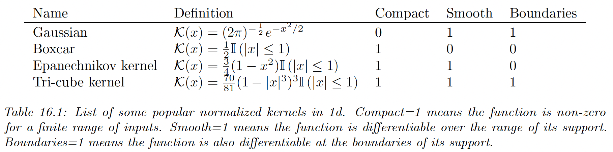
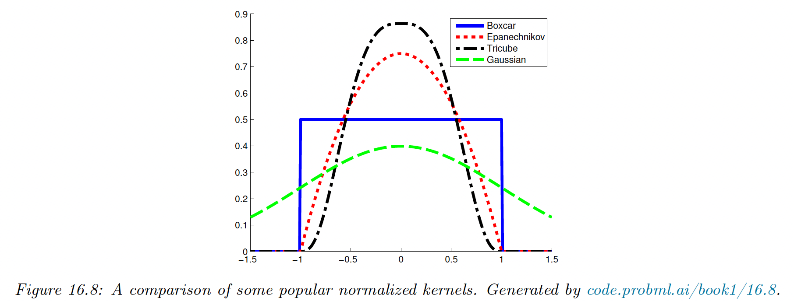
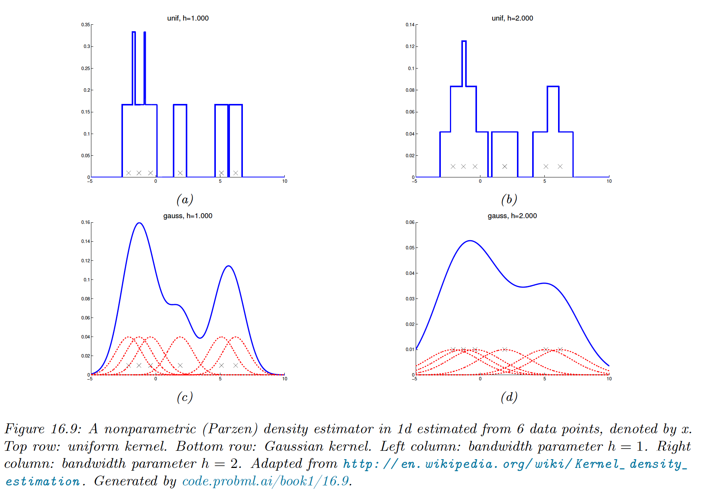
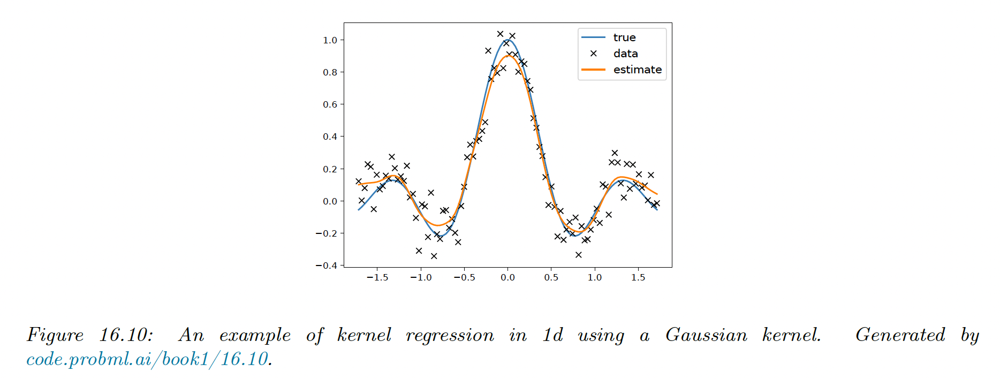

# 16.3 Kernel density estimation (KDE)

KDE is a form of non-parametric density estimation. This also a form of generative model, since it defines a probability distribution $p(\bold{x})$ that can be evaluated pointwise, and which can be sampled to generate new data

### 16.3.1 Density kernels

Density kernels are function $\mathcal{K}:\R \rightarrow \R_+$, such that $\int \mathcal{K}(x)dx=1$ and $\mathcal{K}(x)=\mathcal{K}(-x)$.

This latter symmetry property implies $\int x\mathcal{K}(x)dx=0$ and hence:

$$
\int x\mathcal{K}(x-x_n)dx = x_n
$$

A simple example of such a kernel is the **boxcar kernel**, which is the uniform distribution around within the unit interval around the origin:

$$
\mathcal{K}(x)\triangleq 0.5\mathbb{I}(|x|\le 1)
$$

Another example is the **Gaussian kernel**:

$$
\mathcal{K}(x)\triangleq \frac{1}{\sqrt{2\pi}}e^{-x^2/2}
$$

We can control the width of the kernel by introducing a bandwidth parameter $h$:

$$
\mathcal{K}_h(x)\triangleq \frac{x}{h}\mathcal{K}(\frac{x}{h})
$$

We can generalize to vector valued inputs by defining a **radial basis function (RBF)** kernel:

$$
\mathcal{K}_h(\bold{x})\propto \mathcal{K}_h(||\bold{x}||)
$$

In the case of the Gaussian kernel this becomes:

$$
\mathcal{K}_h(\bold{x})=\frac{1}{(2\pi)^{D/2}}\prod_{d=1}^D \exp({-\frac{x_d^2}{2h^2}})
$$

Although the Gaussian kernel is popular, it has unbounded support. Compact kernels can be faster to compute.

### 16.3.2 Parzen window density estimator

We now explain how to use kernels to define a nonparametric density estimate.

Recall the form of Gaussian mixture, with a fixed spherical Gaussian covariance and uniform mixture weights:

$$
p(\bold{x}|\theta)=\frac{1}{K}\sum_{k=1}^K p(\bold{x}|\mu_k,\sigma^2 I)
$$

One problem with this model is that it requires specifying the number $K$ of clusters and their positions $\mu_k$.

An alternative is to allocate one cluster center per data point:

$$
p(\bold{x}|\theta)=\frac{1}{N}\sum_{n=1}^N p(\bold{x}|\bold{x}_n,\sigma^2I)
$$

This can be generalized to:

$$
p(\bold{x}|\theta)=\frac{1}{N}\sum_{n=1}^N \mathcal{K}_h(\bold{x}-\bold{x}_n)
$$

This is called a **Parzen window density estimator** or **kernel density estimator (KDE)**.

Its advantage over a parametric model is that no fitting is required (except for choosing $h$) and there is no need to select the clusters.

The drawback is that it takes a lot of memory and a lot of time to evaluate.

The resulting model using the boxcar kernel simply count the number of points within a window of size $h$. The Gaussian kernel gives a smoother density.

### 16.3.3 How to choose the bandwith parameter

The bandwidth parameter $h$ controls the complexity of the model.

In 1d data, if we assume the data has been generated from a Gaussian distribution, one can show the bandwidth minimizing the frequentist risk is given by:

$$
h=\sigma(\frac{4}{3N})^{1/5}
$$

We can compute a robust approximation to the standard deviation by first computing the **median absolute deviation (MAD)**:

$$
\mathrm{MAD}(x)=\mathrm{median}(|x-\mathrm{median}|)
$$

and then using $\hat{\sigma}=1.4826 \,\mathrm{MAD}$.

If we have $D$ dimension, we can estimate each $h_d$ separately for each dimension and then set:

$$
h=\Big(\prod_{d=1}^D h_d\Big)^{1/D}
$$

### 16.3.4 From KDE to KNN classification

We previously discussed the $K$ neighbor classifier as a heuristic approach to classification. Interestingly, we can derive it as a generative classifier in which the class conditional densities $p(\bold{x}|y=c)$ are modeled using a KDE.

Rather than a fixed bandwidth a counting the points within a hypercube centered on a datapoint, we allow the bandwidth to be different for each point.

We “grow” a volume around $\bold{x}$ until we captured $K$ points, regardless of their class label. This is called a **balloon density kernel estimator**.

Let the resulting volume have size $V(\bold{x})$ (this was previously $h^D)$ and let there $N_c(\bold{x})$ example of the class $c$ in this volume. We can then estimate the class conditional density:

$$
p(\bold{x}|y=c)=\frac{N_c(\bold{x})}{V(\bold{x})N_c}
$$

where $N_c$ is the total number of point with class labels $c$ in the dataset.

If we take the class prior to be $N_c/N$, we have the posterior:

$$
p(y=c|\bold{x},\mathcal{D})=\frac{\frac{N_c(\bold{x})}{V(\bold{x})N_c}\frac{N_c}{N}}{\sum_{c'}\frac{N_{c'}(\bold{x})}{V(\bold{x})N_{c'}}\frac{N_{c'}}{N}}=\frac{N_c(\bold{x})}{\sum_{c'} N_{c'}}=\frac{N_c(\bold{x})}{K}
$$

### 16.3.5 Kernel regression

Just as KDE can be use for generative classifiers, it can also be used as generative models for regression.

**16.3.5.1 Nadaraya-Watson estimator for the mean**

In regression, our goal is to compute:

$$
\mathbb{E}[y|x,\mathcal{D}]=\int y p(y|\bold{x},\mathcal{D})dy=\frac{\int yp(\bold{x},y|\mathcal{D})dy}{\int p(\bold{x},y|\mathcal{D})dy}
$$

If we use a MVN for $p(\bold{x},y|\mathcal{D})$, we derive a result which is equivalent to linear regression.

However, the Gaussian assumption on $p(\bold{x},y|\mathcal{D})$ is rather limiting. We can use KDE to more accurately approximate this joint density:

$$
p(\bold{x},y|\mathcal{D})\approx \frac{1}{N}\sum_{n=1}^N\mathcal{K}_h(\bold{x}-\bold{x}_n)\mathcal{K}_h(y-y_n)
$$

Hence, using the previous kernel properties:

$$
\begin{align}
\mathbb{E}[y|\bold{x},\mathcal{D}]
&=\frac{\sum_{n=1}^N\mathcal{K}_h(\bold{x}-\bold{x}_n)\int y\mathcal{K}_h(y-y_n)dy}{\sum_{n=1}^N\mathcal{K}_h(\bold{x}-\bold{x}_n)\int \mathcal{K}_h(y-y_n)dy} \\
&= \sum_{n=1}^N y_nw_n(\bold{x})
\end{align}
$$

where:

$$
w_n(\bold{x})=\frac{\mathcal{K}_h(\bold{x}-\bold{x}_n)}{\sum_{{n'}=1}^N \mathcal{K}_h(\bold{x}-\bold{x}_{n'})}
$$

We see that the prediction is just a weighted sum of the training labels, where the weights depend on the similarity between $\bold{x}$ and the stored training points.

This method is called **kernel regression**, **kernel smoothing**, or the **Nadaraya-Watson (N-W)** model.

**16.3.5.2 Estimator for the variance**

Sometimes it can be useful to compute the predictive variance, as well as the predictive mean. We can do this by noting that:

$$
\mathbb{V}[y|\bold{x},\mathcal{D}]=\mathbb{E}[y^2|\bold{x},\mathcal{D}]-\mu(\bold{x})^2
$$

where $\mu(\bold{x})=\mathbb{E}[y|\bold{x},\mathcal{D}]$ is the Nadara-Watson estimate.

If we use a Gaussian kernel with variance $\sigma^2$, we can compute:

$$
\begin{align}
\mathbb{E}[y^2|\bold{x},\mathcal{D}]
&=\frac{\sum_{n=1}^N \mathcal{K}_h(\bold{x}-\bold{x}_n)\int y^2\mathcal{K}_h(y-y_n)dy}{\sum_{n=1}^N \mathcal{K}_h(\bold{x}-\bold{x}_n)\int \mathcal{K}_h(y-y_n)dy}\\
&= \frac{\sum_{n=1}^N \mathcal{K}_h(\bold{x}-\bold{x}_n)(\sigma^2+y^2_n)}{\sum_{n=1}^N \mathcal{K}_h(\bold{x}-\bold{x}_n)}
\end{align}
$$

where we used the fact that:

$$
\int y^2\mathcal{K}_h(y-y_n)dy=\sigma^2+y_n^2
$$

Finally:

$$
\mathcal{V}[y|\bold{x},\mathcal{D}]=\sigma^2+\sum_{n=1}^Ny_n^2w_n(\bold{x})-\mu(\bold{x})^2
$$

**16.3.5.3 Locally weighted regression**

We can drop the normalization term to get:

$$
\mu(\bold{x})=\sum_{n=1}^N y_n \mathcal{K}_h(\bold{x}-\bold{x}_n)
$$

Rather than interpolating the stored labels $y_n$, we can fit a locally linear model around each training point:

$$
\mu(\bold{x})=\min_{\beta}\sum_{n=1}^N (y_n-\beta^\top \bold{x}_n)^2\mathcal{K}_h(\bold{x}-\bold{x}_n)
$$

This is called **locally linear regression (LLR)**, or **locally-weighted scatterplot smoothing (LOWESS or LOESS)**.

This is often used when annotating scatter plots with local trend lines.